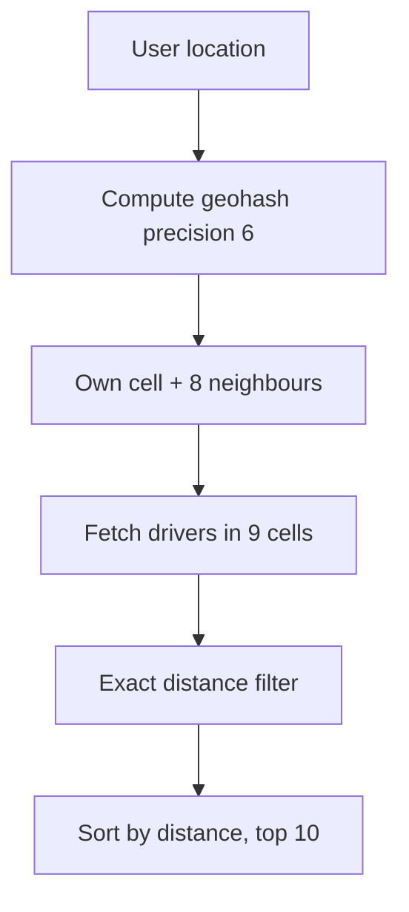

# Geospatial Indexing

**Ek line me:** "mere 2 km ke andar kaun-kaun hai" jaise sawal ko fast kaise answer karein, jab lakhs points ho aur woh hilte bhi rahein.

> **Example:** Uber app khola. 5 sec me dikhna chahiye ki aas-paas 8 cabs hain. Bangalore me 50,000 drivers online hain aur har driver har 4 sec location bhej raha hai. Har request pe saare drivers ka distance calculate karna impossible hai. Isliye geo index chahiye.

## Normal lat/lng query slow kyun hai

```sql
SELECT * FROM drivers
WHERE lat BETWEEN 12.90 AND 12.94
  AND lng BETWEEN 77.58 AND 77.62;
```

- B-tree index ek time pe **ek hi dimension** pe achha kaam karta hai. `lat` index se ek patli horizontal patti milti hai (poori duniya ke us latitude ke log), phir `lng` se filter. Bahut saare rows scan.
- Composite `(lat, lng)` bhi madad nahi karta, kyunki pehle column pe range hai.
- Solution: **2D ko 1D me map karo** (geohash) ya **space ko tree me todo** (quadtree).

## Geohash

Duniya ko baar-baar 4 (actually 32) hisson me todo. Har cell ko ek string milta hai, jaise `tdr1y`. **Common prefix = paas paas.**

| Precision (chars) | Cell size approx | Use |
|---|---|---|
| 4 | ~39 km x 20 km | City level |
| 5 | ~4.9 km x 4.9 km | Area level |
| 6 | ~1.2 km x 0.6 km | Nearby drivers/restaurants |
| 7 | ~150 m x 150 m | Street level |

- Store karo: `drivers(id, geohash6)` pe normal B-tree index. Query: `WHERE geohash6 = 'tdr1yx'` → fast.
- **Neighbours problem:** user cell ke edge pe hai to paas wala driver bagal ke cell me ho sakta hai. Isliye **apna cell + 8 neighbours** query karo, phir exact distance se filter aur sort.
- Pro: simple, kisi bhi DB/Redis me chalta hai. Con: cells fixed size ke, dense (Koramangala) aur khaali (highway) area me same.



## Quadtree

- Map ko 4 quadrants me todo. Kisi node me points > threshold (jaise 100) ho to use phir 4 me todo.
- **Dense area me chhote cells, khaali area me bade.** Load balanced rehta hai.
- Usually **in-memory** banta hai (har server pe). Static data (restaurants, places) ke liye perfect.
- Con: frequent updates pe tree rebalance mehenga. Moving drivers ke liye kam suitable.

## S2 aur H3 (naam pata hona chahiye)

- **Google S2:** sphere ko cube pe project karke hierarchical cells. Hilbert curve se 64-bit cell ID. Google Maps, Foursquare.
- **Uber H3:** hexagon cells. Hexagon ke saare 6 neighbours same distance pe hote hain, isliye surge pricing aur demand heatmap ke liye accha.

## Redis GEO aur PostGIS

**Redis GEO** (andar se geohash + sorted set):
```text
GEOADD drivers:blr 77.6101 12.9352 driver:42
GEOSEARCH drivers:blr FROMLONLAT 77.61 12.93 BYRADIUS 2 km ASC COUNT 10
```
- In-memory, bahut fast, frequent updates ke liye best.

**PostGIS** (Postgres extension):
```sql
SELECT id FROM places
WHERE ST_DWithin(geom, ST_MakePoint(77.61, 12.93)::geography, 2000)
ORDER BY geom <-> ST_MakePoint(77.61, 12.93) LIMIT 20;
```
- GiST index (R-tree jaisa). Polygons, delivery zones, complex queries. Durable, par high write rate pe heavy.

## Frequent location updates (drivers har 4 sec)

50K drivers / 4 sec = **~12.5K writes/sec** sirf ek city me. India level pe 1 lakh+/sec.
- **DB me har update mat likho.** Latest location Redis GEO me rakho (overwrite). Purani location ki zarurat nahi.
- Location history (trip route, billing) ke liye updates Kafka me bhejo, batch me cold storage me likho.
- **City/region se shard karo:** `drivers:blr`, `drivers:mum`. Ek Redis node pe poora India mat rakho.
- Stale drivers hatao: driver ka `last_seen` TTL rakho. 30 sec update nahi aaya to search se bahar.
- Client side: driver ruka hua hai to updates kam bhejo (adaptive frequency).

## Comparison

| Option | Kaise | Updates | Kab use karo |
|---|---|---|---|
| Geohash in DB | String prefix + B-tree | Theek | Simple setup, kisi bhi DB me |
| Quadtree | In-memory adaptive tree | Mehenge | Static places, uneven density |
| Redis GEO | Geohash on sorted set | Bahut fast | Moving objects: drivers, riders |
| PostGIS | GiST/R-tree | Moderate | Polygons, zones, rich queries |
| S2 / H3 | Hierarchical cells | Fast (cell ID) | Big scale, surge/heatmaps |

## Kin systems me lagta hai

- [Uber](../02-questions/t1-06-uber.md): nearby drivers, har 4 sec location update
- [Nearby Places / Yelp](../02-questions/t2-21-nearby-places.md): static places, quadtree/geohash
- [Food Delivery](../02-questions/t2-14-food-delivery.md): nearby restaurants + delivery partners, delivery zones

## Interview me bolo

> "Drivers ki latest location Redis GEO me rakhunga, city-wise shard karke. Har 4 sec ka update bas overwrite hai, DB pe nahi jaata. History Kafka se async store hogi. Search me 2 km radius, aur stale drivers TTL se bahar."

> "Restaurants static hain, unke liye geohash ya quadtree, aur zones jaise polygon ke liye PostGIS."

## Common galtiyan

- `lat BETWEEN` + `lng BETWEEN` pe normal index se kaam chala lena.
- Geohash ke neighbouring cells bhool jaana. Edge pe khade user ko paas wala driver nahi dikhega.
- Har location update ko SQL DB me likhna.
- Moving drivers ke liye quadtree lena, bina update cost soche.
- Static places aur moving drivers ko ek hi solution se handle karna.

## Checklist

- [ ] Normal lat/lng index slow kyun hai, bata sakta hoon
- [ ] Geohash precision aur neighbour cells wali problem samjha sakta hoon
- [ ] Quadtree vs geohash ka trade-off bata sakta hoon
- [ ] Redis GEO commands aur PostGIS kab, bata sakta hoon
- [ ] Driver ke har 4 sec update ka write path aur estimation bata sakta hoon
