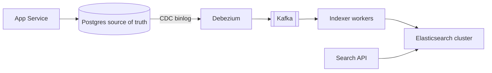
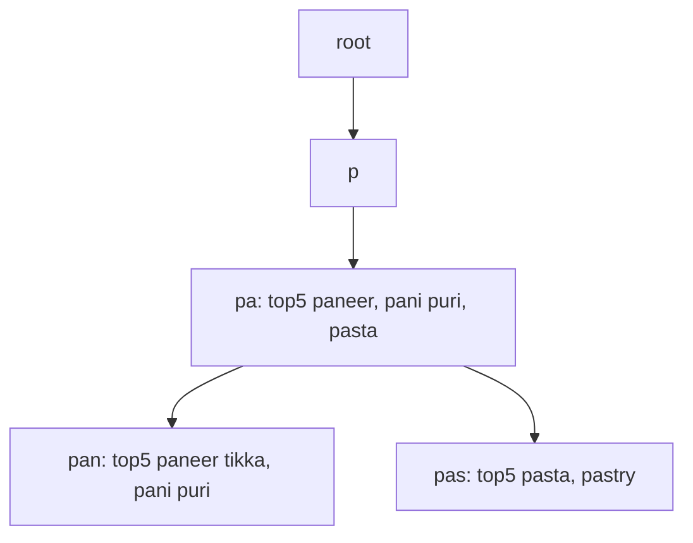

# Search & Indexing

**Ek line me:** text me se words dhoondhna fast kaise ho: word se documents ka map (inverted index) banao, aur prefix ke liye trie.

> **Example:** Swiggy pe "paneer" type kiya. Lakhs dishes me se 100ms me results chahiye, typo "panner" bhi chale, aur sabse relevant upar. `WHERE name LIKE '%paneer%'` poori table scan karega. Isliye Elasticsearch jaisa search engine use hota hai.

## Inverted index

Normal index: document → words. **Inverted:** word → list of documents (posting list).

| Term | Posting list (doc ids) |
|---|---|
| paneer | 3, 7, 19, 42 |
| tikka | 7, 11, 42 |
| butter | 3, 42 |

Query "paneer tikka" → dono lists ka intersection → `7, 42`. Lists sorted hoti hain, isliye intersection fast.

### Tokenization (index banane se pehle)

"Paneer Tikka's Masala!" → pipeline (analyzer):
1. **Tokenize:** words me todo → `Paneer`, `Tikka's`, `Masala`
2. **Lowercase:** `paneer`, `tikka's`, `masala`
3. **Stop words hatao:** `the`, `a`, `is`
4. **Stemming:** `running → run`, `tikka's → tikka`
5. Optional: synonyms (`cottage cheese → paneer`), n-grams (typo/partial match ke liye)

Query pe bhi **same analyzer** chalna chahiye, warna match nahi hoga.

## Ranking basics

- **TF-IDF:** word document me jitni baar aaye (TF) utna relevant, par jo word har document me hai (IDF kam) uski value kam.
- **BM25:** TF-IDF ka improved version, TF saturate hota hai aur document length normalize hoti hai. Elasticsearch ka default.
- Real ranking = text score + business signals (rating, distance, popularity, freshness).

## Elasticsearch

- **Index** = collection (table jaisa). Index **shards** me bata hota hai (primary shards). Har shard ek Lucene index hai.
- **Replicas:** har shard ki copy dusre node pe. Read throughput badhta hai aur node fail hone pe data safe.
- Query sabhi shards pe parallel jaati hai (scatter-gather), results merge hote hain.
- Primary shards ki count baad me badalna mushkil (reindex). Shuru me sahi socho, ~10–50 GB per shard.
- **Near real-time:** naya document ~1 sec (refresh interval) me searchable.
- **Source of truth nahi hai.** ES ko DB se rebuild karne layak rakho.

## DB → ES sync

| Approach | Kaise | Problem |
|---|---|---|
| **Dual write** | App DB me bhi likhe, ES me bhi | Ek fail hua to dono out of sync. Avoid karo |
| **Periodic batch** | Har 10 min `updated_at > last_run` | Stale data, deletes miss ho jaate hain |
| **CDC (best)** | Debezium DB ka binlog/WAL padhe → Kafka → indexer → ES | Thoda lag (seconds), par reliable aur ordered |

CDC me indexer idempotent rakho (doc id se upsert), taaki replay safe ho.

## Trie: prefix aur autocomplete

Typeahead ("pan" → "paneer tikka", "pani puri") ke liye inverted index se better **trie** hai.
- Har node ek character. Root se path = prefix.
- Naive: prefix ke node tak jao, poora subtree traverse karke top results nikalo. Bade subtree pe slow.
- **Top-K per prefix precompute:** har node pe us prefix ke top 5–10 suggestions pehle se store karo. Query = O(prefix length). Bas node tak jao aur list utha lo.

- **Update kaise:** search logs Kafka me → hourly/daily batch job (Spark) frequencies count kare → naya trie banaye → servers pe swap. Real-time update har keystroke pe mat karo.
- Trie memory me rakho, prefix ke pehle 1–2 characters se shard karo. Hot prefixes ko Redis/CDN pe cache karo.
- Simple option: Redis me `prefix → top10 list` ka key-value bhi chal jaata hai.

## Kab kya use karo

| Need | Use |
|---|---|
| Full-text, typo, filters, ranking | Elasticsearch / OpenSearch |
| Prefix autocomplete, ultra low latency | Trie with precomputed top-K (ya ES completion suggester) |
| Exact match by id/email | Normal DB index, search engine nahi |
| Chhota scale, simple search | Postgres full-text (`tsvector` + GIN index) |

## Kin systems me lagta hai

- [Typeahead](../02-questions/t1-10-typeahead.md): trie + top-K per prefix
- [BookMyShow](../02-questions/t1-05-bookmyshow.md): movie/event search, CDC se ES sync
- [Web Crawler](../02-questions/t1-12-web-crawler.md): crawled pages ka inverted index
- [Instagram](../02-questions/t2-13-instagram.md): users, hashtags search
- [Food Delivery](../02-questions/t2-14-food-delivery.md): dish/restaurant search
- [Nearby Places](../02-questions/t2-21-nearby-places.md): text + geo filter

## Interview me bolo

> "Search ke liye Elasticsearch lunga, par source of truth Postgres rahega. Sync CDC se hoga: Debezium binlog padhega, Kafka me daalega, indexer ES me upsert karega. Dual write nahi karunga kyunki partial failure me data out of sync ho jaata hai."

> "Autocomplete ke liye trie jisme har node pe top-K suggestions precomputed hain, offline batch se rebuild hota hai. Lookup O(prefix length)."

## Common galtiyan

- `LIKE '%term%'` ko search solution bolna.
- ES ko primary database bana dena.
- DB aur ES me dual write karna.
- Trie me har query pe subtree traverse karna, top-K precompute na karna.
- Har keystroke pe trie update karna.

## Checklist

- [ ] Inverted index aur posting list intersection samjha sakta hoon
- [ ] Tokenization pipeline (lowercase, stop words, stemming) bata sakta hoon
- [ ] Elasticsearch ke shards, replicas aur scatter-gather samjha sakta hoon
- [ ] DB se ES sync ke liye CDC kyun, dual write kyun nahi, bata sakta hoon
- [ ] Trie + top-K per prefix aur uska offline update flow bata sakta hoon
