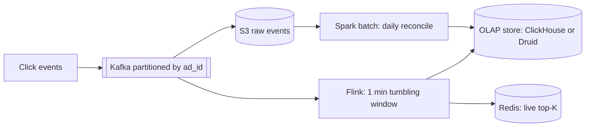

# Counting & Top-K

**Ek line me:** bahut zyada events (likes, views, clicks) ko fast count karna, aur unme se "top 10" nikalna, kabhi exact aur kabhi approx.

> **Example:** IPL final pe Hotstar dikhata hai "2.5 crore log dekh rahe hain" aur Twitter pe "Trending: #CSKvsMI". Har second lakhs events aate hain. Har event pe DB row update karoge to DB mar jayega. Isliye counting ke special tareeke chahiye.

## Exact counters

**Redis INCR:** `INCR views:video:42`. Atomic, in-memory, ~100K ops/sec per node.
- Periodically (har 10 sec) DB me flush karo. Redis source of counting, DB durable copy.

**Hot key problem:** viral video pe saare INCR ek hi key pe → ek Redis shard overload.

**Sharded counters:** ek counter ko N keys me todo.
- Write: `INCR views:42:{random 0..N-1}`
- Read: N keys ka `SUM` (ya background job sum karke cache kare)
- Writes N guna spread. Read thoda mehenga. Sirf hot keys ke liye karo.

**Write batching:** app server memory me 1 sec tak count jodo, phir ek `INCRBY 350`. Writes 100x kam.

## Leaderboard: Redis sorted set

```text
ZINCRBY leaderboard:ipl2026 50 user:rahul
ZREVRANGE leaderboard:ipl2026 0 9 WITHSCORES   # top 10
ZREVRANK leaderboard:ipl2026 user:rahul         # meri rank
```
- Skip list based. Update aur rank dono **O(log N)**. 10 crore users tak ek node me chal jaata hai (~10 GB).
- Bahut bada ho to: score range se shard karo, ya top-K ke liye sirf top users ka chhota set rakho aur baaki ki rank approx batao ("top 5%").
- Time-based boards: `leaderboard:daily:2026-10-03` alag key, TTL ke saath.

## Approximate counting (jab exact zaroori nahi)

| Structure | Kya batata hai | Memory | Error | Use |
|---|---|---|---|---|
| **HyperLogLog** | Unique count (cardinality) | ~12 KB fixed, chahe 1 arab items | ~0.81% | Unique visitors, unique viewers |
| **Count-Min Sketch** | Ek item kitni baar aaya (frequency) | Chhoti fixed 2D array | Sirf over-estimate | Heavy hitters, trending hashtags |
| **Bloom filter** | Item pehle dekha ya nahi | Bahut kam | False positive possible | Dedup, "already crawled?" |

**HyperLogLog:** har item ka hash, aur hash me leading zeros dekh ke cardinality estimate. Redis: `PFADD uv:2026-10-03 user42`, `PFCOUNT uv:2026-10-03`. Exact set me 1 crore user IDs = ~100s MB. HLL = 12 KB.

**Count-Min Sketch:** `d` hash functions, har ek ki `w` counters wali row. Add pe har row me `hash_i(x)` wala counter +1. Query pe saari rows ka **minimum** lo. Collisions ki wajah se count kabhi kam nahi aata, thoda zyada aa sakta hai.

## Top-K with heap

- **Exact, single machine:** counts ka hashmap + **min-heap of size K**. Naya count heap ke top (min) se bada ho to replace. O(N log K).
- **Distributed:** har shard apna local top-K nikale, phir aggregator merge kare. Dhyaan do: local top-K merge karne se global top-K exact nahi hota (koi item har shard pe 11th ho). Fix: **key se partition karo** taaki ek item ka poora count ek hi shard pe ho. Phir local top-K merge exact hai.
- **Streaming approx:** Count-Min Sketch se frequency + heap of K. Memory fixed, trending ke liye perfect.

## Stream processing with windows



- **Kafka** events ko durable rakhta hai aur key (`ad_id`) se partition karta hai. Same key → same partition → same Flink task.
- **Flink** window ke andar count karta hai aur window close hone pe result emit karta hai.

| Window | Kaise | Example |
|---|---|---|
| **Tumbling** | Fixed, non-overlapping | Har 1 min ke clicks |
| **Sliding / hopping** | Fixed size, overlap | Pichhle 5 min ka trending, har 1 min update |
| **Session** | Inactivity gap pe khatam | User session ki activity |

- **Event time vs processing time:** event late aa sakta hai (phone offline tha). **Watermarks** se Flink decide karta hai ki window kab close kare. Bahut late events ko side output ya batch reconcile me lo.
- Flink checkpoints + Kafka offsets se exactly-once state milti hai. Sink idempotent rakho.

## Batch vs stream (lambda / kappa)

| | Batch (Spark, Hadoop) | Stream (Flink, Kafka Streams) |
|---|---|---|
| Latency | Minutes se hours | Seconds |
| Accuracy | Exact, saara data ek saath | Late events ki wajah se thoda approx |
| Use | Billing, daily reports, reconciliation | Live dashboards, trending, fraud alerts |

- **Lambda architecture:** stream layer (fast, approx) + batch layer (slow, exact) dono. Batch result baad me stream ko correct karta hai. Con: do codebases same logic ke.
- **Kappa architecture:** sirf stream. Galti sudharni ho to Kafka se replay karo. Ek codebase, simpler. Aaj kal yahi zyada popular.
- Ad clicks jaise billing cases me bolo: "real-time ke liye stream, aur billing ke liye daily batch reconcile." Ye lambda ka practical version hai.

## Kin systems me lagta hai

- [Leaderboard](../02-questions/t2-16-leaderboard.md): Redis sorted set, rank queries
- [Ad Click Aggregator](../02-questions/t2-17-ad-click-aggregator.md): Kafka + Flink windows, reconciliation
- [Typeahead](../02-questions/t1-10-typeahead.md): query frequency, top-K per prefix
- [YouTube](../02-questions/t1-07-youtube.md): view counts, sharded counters
- [Instagram](../02-questions/t2-13-instagram.md): likes count, trending hashtags
- [News Feed](../02-questions/t1-03-news-feed.md): like/comment counters, trending

## Interview me bolo

> "Like count exact hona zaroori nahi har second, isliye Redis INCR with write batching, aur viral posts ke liye sharded counters. Har 10 sec DB me flush. Unique viewers ke liye HyperLogLog, 12 KB me crore users."

> "Ad clicks Kafka me ad_id se partition honge, Flink 1 min tumbling windows me aggregate karega. Billing ke liye raw events S3 me, aur daily Spark job reconcile karega."

## Common galtiyan

- Har like/view pe `UPDATE posts SET likes = likes + 1` DB pe. Hot row lock contention.
- Unique count ke liye bada set rakhna jab HyperLogLog chal jaata.
- Distributed top-K me local top-K merge ko exact maan lena.
- Stream processing me late events aur event time ka zikr na karna.
- Billing jaise exact case me sirf approximate structures use karna.

## Checklist

- [ ] Redis INCR, sharded counters aur write batching ka use bata sakta hoon
- [ ] Redis sorted set se leaderboard (top 10, meri rank) bana sakta hoon
- [ ] HyperLogLog vs Count-Min Sketch ka farak aur use case bata sakta hoon
- [ ] Heap se top-K aur distributed top-K ki problem samjha sakta hoon
- [ ] Kafka + Flink windows aur lambda vs kappa samjha sakta hoon
