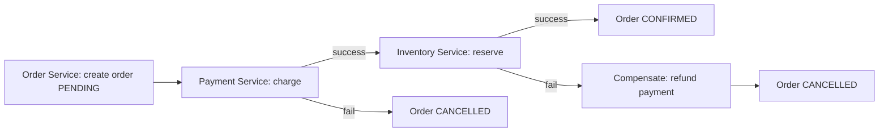
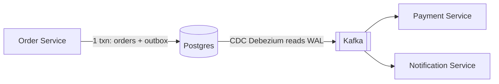

# Distributed Transactions

**Ek line me:** jab ek business action (order place karna) kai services aur kai DBs me failta hai, to ya to sab ho, ya sab undo ho. Beech ki adhuri state na bache.

> **Example:** Swiggy pe order kiya. Order Service ne order banaya, Payment Service ne ₹500 kaat liye, par Restaurant/Inventory Service ne bola "item khatam". Ab paisa kata hua hai par khana nahi aayega. Is adhure kaam ko theek karna hi distributed transaction ka problem hai.

## Problem kyun hard hai

Ek DB ke andar `BEGIN ... COMMIT` sab sambhal leta hai (ACID). Par microservices me har service ka apna DB hai. Koi ek global `COMMIT` nahi hai.
- Network beech me fail ho sakta hai. Request gayi ya nahi, pata nahi.
- Koi service slow ya down ho sakti hai.
- "Paisa kata, par order fail" jaisi partial states ban jaati hain.

## 2PC (Two-Phase Commit), aur kyun avoid karte hain

Ek **coordinator** sab participants se poochta hai:
1. **Prepare phase:** "Commit kar sakte ho?" Sab lock lekar "haan" bolte hain.
2. **Commit phase:** Sab ne haan bola to "commit", warna "abort".

| Problem | Kyun |
|---|---|
| **Blocking** | Coordinator prepare ke baad crash ho jaye to participants locks pakad ke wait karte rehte hain |
| **Slow** | Har transaction me 2 network round trips + sab services ke locks |
| **Availability kam** | Ek bhi participant down to poora transaction ruk gaya |
| **Support nahi** | Kafka, Stripe, third-party APIs 2PC me participate hi nahi karte |

> 2PC ek hi company ke andar, kam participants aur same DB vendor (jaise XA transactions) me chal jaata hai. Microservices me almost kabhi nahi.

## Saga: interview ka default jawab

Saga = chhote **local transactions ki chain**. Har step apne DB me commit karta hai. Koi step fail ho to pichle steps ke **compensating actions** chalte hain (undo nahi, ulta business action).

| Step | Action | Compensation |
|---|---|---|
| 1 | Order create (`PENDING`) | Order `CANCELLED` |
| 2 | Payment charge | Refund |
| 3 | Inventory reserve | Inventory release |
| 4 | Order `CONFIRMED` | (last step, compensation nahi) |

### Choreography vs Orchestration

| | Choreography | Orchestration |
|---|---|---|
| Kaise | Har service event publish karti hai, agli service sunke kaam karti hai | Ek central **orchestrator** har step ko bolta hai "ab tum karo" |
| Achha | Loose coupling, koi central component nahi | Flow ek jagah dikhta hai, debug aur change easy |
| Bura | 5+ steps pe flow samajhna mushkil, cyclic events | Orchestrator ek extra service hai (par stateless + durable rakh sakte ho) |
| Kab | 2–3 simple steps | Payment, order, booking jaise critical multi-step flows |

Tools: Temporal, AWS Step Functions, Camunda (orchestration). Kafka events (choreography).

**Saga ke rules:**
- Har step aur har compensation **idempotent** ho, kyunki retries hongi.
- Saga me isolation nahi hai. Beech me koi "PENDING" order dekh sakta hai. Isliye status field rakho.
- Compensation fail ho to retry karte raho. Phir bhi fail ho to alert + manual queue.

## Transactional Outbox + CDC

Problem: Order Service ko DB me order likhna hai **aur** Kafka me event bhejna hai. Dono alag systems hain. DB commit hua aur Kafka publish se pehle crash, to event kho gaya (dual write problem).

Solution: event ko **same DB transaction** me `outbox` table me likho. Ek alag relay (ya CDC jaise Debezium) outbox padh ke Kafka me daalta hai.

- DB commit hua to event zaroor jayega (at-least-once). Consumers idempotent rakho.
- CDC = Change Data Capture: DB ka WAL/binlog padh ke changes stream karna. App code ko pata bhi nahi.

## Double-entry ledger (paise wale systems)

Paisa kabhi "update" nahi hota, sirf **entries** likhi jaati hain. Har transaction me ek debit aur ek credit, aur total hamesha zero.

| txn_id | account | debit | credit |
|---|---|---|---|
| T1 | user_rahul_wallet | 500 | |
| T1 | swiggy_merchant | | 500 |

- Append-only hai, isliye audit trail free me milta hai.
- Balance = entries ka sum (ya cached balance + entries se verify).
- Galti hui to entry delete nahi karte. Ulti entry (reversal) likhte hain.

## Reconciliation

Kitna bhi achha design ho, external systems (bank, payment gateway) se mismatch hoga. Isliye:
- **Periodic job** (har 5 min / daily): apna ledger vs gateway/bank ki settlement report compare karo.
- Mismatch mile to auto-fix (missed webhook ka status pull karo) ya manual review queue.
- `PENDING` jo 30 min se atka hai, uska status gateway se poochho.

> Reconciliation "safety net" hai. Interviewer ko batao ki tum isko design ka part maante ho, afterthought nahi.

## Kab kya use karo

| Situation | Use karo |
|---|---|
| Sab data ek DB me hai | Normal ACID transaction. Distributed mat banao |
| Multi-service business flow | Saga (orchestration for critical flows) |
| DB write + event publish | Transactional outbox + CDC |
| Paisa / wallet / balance | Double-entry ledger + idempotency + reconciliation |
| Strict atomic across 2 DBs, kam traffic | 2PC chal sakta hai, par justify karo |

## Kin systems me lagta hai

- [Payment System](../02-questions/t1-11-payment-system.md): ledger, saga, reconciliation
- [Food Delivery](../02-questions/t2-14-food-delivery.md): order → payment → restaurant saga
- [Flash Sale](../02-questions/t2-15-flash-sale.md): inventory reserve + payment, fail pe release
- [BookMyShow](../02-questions/t1-05-bookmyshow.md): payment success par seat gayi, to auto refund

## Interview me bolo

> "Yahan order, payment aur inventory teen alag services hain, isliye main 2PC nahi lunga. Woh blocking hai aur payment gateway usme participate nahi karta. Main orchestrated Saga lunga. Har step ka compensating action hoga, jaise payment ke liye refund. Events transactional outbox se jayenge, taaki DB commit aur event kabhi out of sync na hon."

> "Paise ke liye double-entry ledger, idempotency key, aur daily reconciliation job gateway ke saath."

## Common galtiyan

- Microservices me 2PC propose karna bina downsides bataye.
- Saga bolna par **compensation** define na karna ("payment fail to kya undo hoga?").
- DB write ke baad seedha Kafka publish karna (dual write). Outbox bhool jaana.
- Steps ko idempotent na banana. Retry pe double refund ho jayega.
- Balance column ko seedha `UPDATE balance = balance - 500` karna, bina ledger ke.
- Reconciliation ka zikr hi na karna payment wale design me.

## Checklist

- [ ] 2PC kaise kaam karta hai aur microservices me kyun avoid karte hain, bata sakta hoon
- [ ] Order → payment → inventory saga compensations ke saath draw kar sakta hoon
- [ ] Choreography vs orchestration ka farak aur kab kaunsa, bata sakta hoon
- [ ] Dual write problem aur transactional outbox + CDC samjha sakta hoon
- [ ] Double-entry ledger aur reconciliation kyun zaroori hai, samjha sakta hoon
