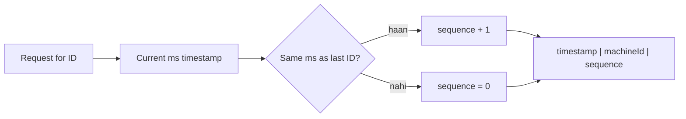

# Unique ID Generation

**Ek line me:** bahut saare servers par, bina aapas me baat kiye, aisi IDs banana jo kabhi repeat na hon, aur ho sake to time ke hisaab se sorted bhi hon.

> **Example:** Instagram pe har second hazaron photos upload hoti hain, 100+ servers par. Har photo ko ek ID chahiye. Agar sab servers ek hi DB se `AUTO_INCREMENT` maangein, to woh DB bottleneck aur single point of failure ban jaata hai.

## Auto-increment scale pe kyun toot-ta hai

- **Single DB bottleneck:** har insert ko ek hi jagah se number lena padta hai.
- **Sharding ke baad:** har shard apna 1, 2, 3 banayega. Duplicate IDs.
- **Guessable:** `/orders/1001` ke baad `/orders/1002` try karke koi doosre ka data dekh sakta hai. Competitor tumhara order volume bhi guess kar leta hai.
- **Merge mushkil:** do DBs ka data milana ho to IDs takrayengi.

## Options

| Tareeka | Size | Sorted? | Coordination | Kab use karo |
|---|---|---|---|---|
| **UUID v4** | 128 bit | Nahi (random) | Nahi | Simple, kam volume, ID index ka primary key nahi |
| **UUID v7** | 128 bit | Haan (time-first) | Nahi | Modern default jab 128 bit chal jaye |
| **Snowflake** | 64 bit | Haan (roughly) | Sirf machine ID assign | High scale, sorted, chhoti ID (tweets, messages) |
| **Ticket server / range** | 64 bit | Haan (per range) | Range lene ke liye | Short codes, sequential counters |
| **DB auto-increment** | 64 bit | Haan | Single DB | Chhota system, single DB |

### UUID v4 vs v7

- **v4:** poora random. Collision practically impossible (2^122 combinations). Par B-tree index me random inserts se **page splits** hote hain, writes slow, index fat.
- **v7:** pehle 48 bit = Unix timestamp (ms), baaki random. Time ke saath badhta hai, to index me end pe append hota hai. v4 ke saare fayde + sortable.

> 128 bit = 36 char string. Agar storage/URL me chhoti ID chahiye, to Snowflake ya Base62 better.

## Snowflake (Twitter)

64-bit integer, teen hisson me:

| Bits | Field | Matlab |
|---|---|---|
| 1 | Sign | Hamesha 0 (positive number) |
| 41 | Timestamp (ms) | Custom epoch se ms. 2^41 ms ≈ **69 saal** |
| 10 | Machine ID | 2^10 = **1024 machines** (5 datacenter + 5 worker bhi kar sakte ho) |
| 12 | Sequence | Ek ms me ek machine pe 2^12 = **4096 IDs** |

- Har machine **khud** ID banati hai. Network call nahi, isliye bahut fast.
- Capacity: 4096 × 1000 = ~4M IDs/sec per machine.
- Time ke hisaab se sorted, to "latest 20 messages" ke liye ID pe hi sort kar lo.
- **Clock skew risk:** NTP ne clock peeche kar diya to duplicate ID ban sakti hai. Fix: clock peeche jaaye to wait karo ya error do.
- Machine ID kaise milega: ZooKeeper/etcd se, ya config/pod ordinal se.

## Ticket server / range allocation

Ek central counter (DB ya ZooKeeper), par har baar ek ID nahi, **range** do.
- Server A bolta hai "mujhe 1000 IDs do". Counter use `1,000,001–1,001,000` deta hai.
- Server A memory me inko ek-ek karke use karta hai. Khatam hone par nayi range.
- Central system pe load 1000x kam. Server crash ho to bachi range waste ho jaati hai, jo theek hai.
- Flickr ne 2 ticket servers use kiye: ek odd IDs deta hai, ek even. Ek down to doosra chalta rahe.

## Base62 for short codes (URL shortener)

Characters: `0-9a-zA-Z` = 62. Number ko Base62 me convert karo.

| Length | Combinations |
|---|---|
| 6 char | 62^6 ≈ **56 billion** |
| 7 char | 62^7 ≈ **3.5 trillion** |

- Counter/range se unique number lo, phir Base62 encode. Collision zero, kyunki number hi unique hai.
- Problem: sequential codes guessable hain (`abc123` ke baad `abc124`). Fix: number ko pehle shuffle/encrypt karo (bijective mapping), phir encode.
- Alternative: random 7 char generate karo, DB me `UNIQUE` constraint ke saath insert. Collision aaye to dobara try.

## Collision handling

- **Random IDs:** DB me `UNIQUE` constraint rakho. Insert fail ho to nayi ID banake retry. 3.5 trillion space me collision bahut rare hai.
- **Hash based (MD5 of URL ke pehle 7 char):** collision ho sakta hai. Salt add karke dobara hash karo.
- **Snowflake / range:** design se collision nahi, bas machine ID unique hona chahiye aur clock peeche na jaaye.

## Sortable IDs kyun chahiye

- Feed, chat, timeline me "latest pehle" chahiye. ID pe sort = time pe sort. Alag `created_at` index ki zarurat kam.
- Cursor pagination easy: `WHERE id < last_seen_id LIMIT 20`.
- B-tree index me append-only inserts, writes fast.

## Kin systems me lagta hai

- [URL Shortener](../02-questions/t1-01-url-shortener.md): Base62 + range allocation
- [WhatsApp](../02-questions/t1-04-whatsapp-chat.md): message IDs, sorted per chat
- [Instagram](../02-questions/t2-13-instagram.md): photo IDs (Snowflake jaisa)
- [News Feed](../02-questions/t1-03-news-feed.md): post IDs se timeline sort
- [Distributed KV Store](../02-questions/t2-20-distributed-kv-store.md): version IDs
- [Payment System](../02-questions/t1-11-payment-system.md): non-guessable transaction IDs

## Interview me bolo

> "Main Snowflake-style 64-bit IDs lunga: 41 bit timestamp, 10 bit machine ID, 12 bit sequence. Har server khud ID banata hai, koi central bottleneck nahi, aur IDs time-sorted hain to cursor pagination free me mil jaata hai."

> "Short URL ke liye range allocation se unique counter lunga aur Base62 me encode karunga. 7 char se 3.5 trillion codes milte hain."

## Common galtiyan

- Sharded system me DB auto-increment bolna.
- UUID v4 ko primary key banana aur index write performance ka zikr na karna.
- Snowflake bolna par bit layout aur clock skew na bata paana.
- Random short code bolna bina collision handling (UNIQUE + retry) ke.
- Public URL me sequential ID expose karna bina sochne ke.

## Checklist

- [ ] Auto-increment scale pe kyun fail hota hai, 3 reasons bata sakta hoon
- [ ] UUID v4 vs v7 ka farak aur index pe asar samjha sakta hoon
- [ ] Snowflake ka bit layout (1 + 41 + 10 + 12) aur capacity bina dekhe bata sakta hoon
- [ ] Range allocation aur Base62 se short code banana samjha sakta hoon
- [ ] Collision handling aur sortable IDs ka fayda bata sakta hoon
