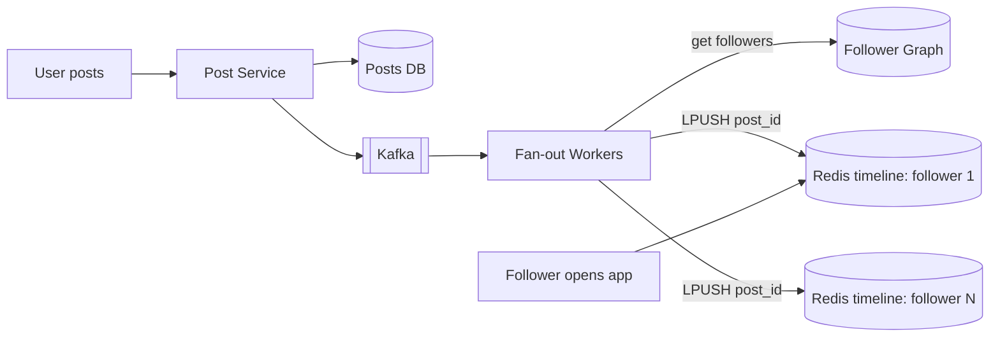
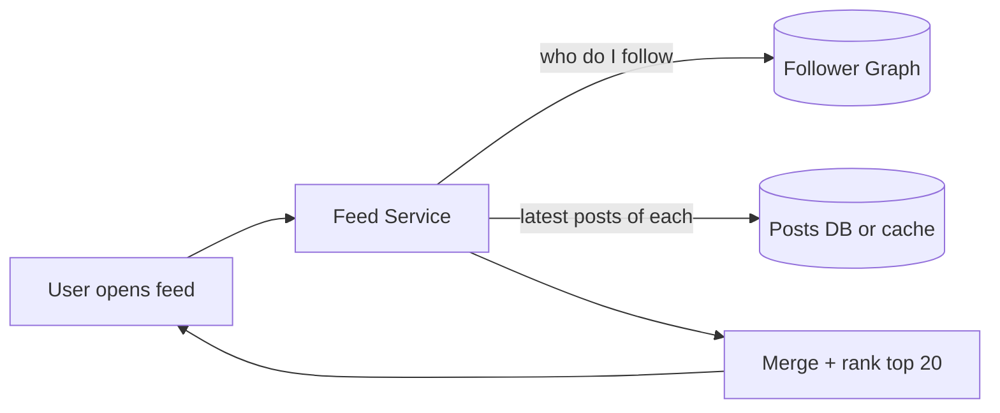

# Fan-out (Push vs Pull)

**Ek line me:** ek user ne post kiya, ab use uske saare followers ki feed me pahunchana hai. Ya to likhte waqt sabko bhej do (push), ya padhte waqt sabse jama karo (pull).

> **Example:** Tumhare 300 followers hain. Tumne Instagram pe photo daali. Push model me 300 logon ki feed me abhi entry ho jayegi. Par Virat Kohli ke 27 crore followers hain. Unki ek post ke liye 27 crore writes? Yahi fan-out ka asli problem hai.

## Fan-out on write (Push)

Post hote hi har follower ki **pre-computed timeline** (Redis list) me post ID daal do. Feed padhna bas ek Redis read hai.

- **Read fast:** O(1), feed already ready hai.
- **Write mehenga:** followers jitne, utne writes.
- Inactive users ki timeline bhi bharti hai, memory waste.

## Fan-out on read (Pull)

Kuch pre-compute nahi. User feed khole to jinhe woh follow karta hai, unki latest posts nikal ke merge karo.

- **Write sasta:** post bas ek jagah likhi.
- **Read mehenga:** 500 log follow kiye to 500 lookups + merge, har feed open pe.
- Latency badhti hai, aur read-heavy system me ye costly hai.

## Comparison

| | Push (on write) | Pull (on read) |
|---|---|---|
| Write cost | Followers count jitna | 1 |
| Read cost | 1 Redis read | Following count jitna + merge |
| Feed latency | Bahut kam | Zyada |
| Celebrity problem | Haan, crore writes | Nahi |
| Inactive users | Memory waste | Koi waste nahi |
| Best for | Normal users, read-heavy | Celebrities, kam active users |

## Hybrid: interview ka best answer

- **Normal users (< ~10K followers):** push. Unki posts followers ki timeline me pehle se daal do.
- **Celebrities (> ~10K followers):** push mat karo. Unki posts alag "celebrity posts" cache me rakho.
- **Feed read time:** user ki pre-computed timeline (push wali) + jin celebrities ko follow karta hai unki latest posts (pull) → merge → rank.
- Inactive users (30 din se login nahi) ke liye push skip karo. Woh aayein to pull se feed bana do.

Twitter aur Instagram dono roughly yahi karte hain.

## Timeline cache in Redis

- Key: `timeline:{userId}`, value: **post IDs ki list** (poora post nahi). Post content alag cache se aata hai.
- `LPUSH` + `LTRIM 0 799`: sirf latest ~800 IDs rakho. Purani feed DB se pull.
- Memory: 8 byte ID × 800 = ~6.4 KB per user. 100M active users × 6.4 KB ≈ **640 GB**. Redis cluster me shard by userId.
- Post delete hui to timeline se hatana mehenga hai. Read time pe filter kar do (post exist nahi karti to skip).

## Cost math example

Maan lo: 200M DAU, har user ~2 posts/day, average 200 followers. Ek celebrity ke 50M followers.

| | Calculation | Result |
|---|---|---|
| Posts/day | 200M × 2 | 400M ≈ 4,600 posts/sec |
| Push writes/day | 400M × 200 followers | 80B timeline writes ≈ **~1M writes/sec** |
| Ek celebrity post (push) | 50M writes | Minutes tak workers busy, baaki sab ki posts late |
| Ek celebrity post (hybrid) | 1 write | Followers read time pe pull karte hain |

> **Bolo:** "Normal fan-out ~1M Redis writes/sec hai, jo sharded Redis cluster sambhal lega. Par ek celebrity ka 50M fan-out queue ko block kar dega. Isliye celebrities ko pull pe rakhta hoon."

## Kab use karo

| Situation | Model |
|---|---|
| Read >> write, followers chhote | Push |
| Bahut bade follower counts | Pull |
| Real social network (dono type ke users) | Hybrid |
| Group chat (WhatsApp, 256 members) | Push (har member ke inbox me) |
| Notification to lakhs of users | Push via queue, batches me |

## Kin systems me lagta hai

- [News Feed](../02-questions/t1-03-news-feed.md): hybrid fan-out, timeline cache
- [Instagram](../02-questions/t2-13-instagram.md): celebrity problem
- [Notification System](../02-questions/t1-09-notification-system.md): ek event, crore users, batched push
- [WhatsApp](../02-questions/t1-04-whatsapp-chat.md): group message fan-out

## Interview me bolo

> "Main hybrid fan-out lunga. Normal users ki post Kafka ke through fan-out workers followers ki Redis timeline me push karenge. Celebrities (10K+ followers) ki posts push nahi hongi, unhe read time pe pull karke merge karunga. Isse read fast rehta hai aur celebrity post se write storm nahi aata."

## Common galtiyan

- Sirf push bolna aur celebrity problem miss karna. Interviewer pakka poochhega.
- Timeline me poora post object store karna, sirf ID nahi.
- Fan-out synchronously post API me karna. Kafka + workers se async karo.
- Timeline ka size limit (`LTRIM`) na rakhna, memory phat jayegi.
- Inactive users ke liye bhi push karte rehna.

## Checklist

- [ ] Push vs pull ka read/write cost bina dekhe bata sakta hoon
- [ ] Dono models ka diagram 2 min me bana sakta hoon
- [ ] Hybrid model aur celebrity threshold samjha sakta hoon
- [ ] Redis timeline (IDs only, LTRIM) aur uski memory estimate kar sakta hoon
- [ ] Fan-out cost math (writes/sec) calculate kar sakta hoon
