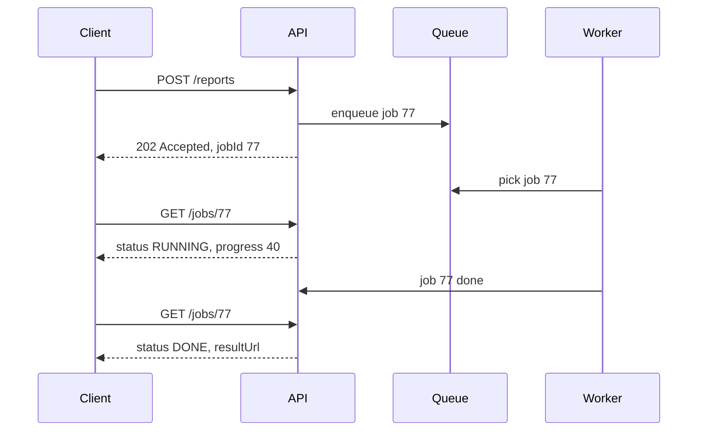

# API Design

**Ek line me:** client aur server ke beech ka contract. Clear naam, sahi HTTP method, pagination, idempotency aur versioning, taaki API scale kare aur galat use na ho.

> **Example:** Paytm app "Pay ₹500" dabata hai. Network slow tha, app ne retry kiya. Agar API idempotent nahi hai to ₹1000 kat gaye. Achha API design aisi galtiyan design level pe hi rok deta hai.

## REST vs gRPC vs GraphQL

| | REST | gRPC | GraphQL |
|---|---|---|---|
| Format | JSON over HTTP | Protobuf (binary) over HTTP/2 | JSON, ek endpoint, client query likhta hai |
| Speed | Theek | Sabse fast, chhota payload | Theek |
| Streaming | Nahi (SSE/WebSocket alag) | Haan, bi-directional | Subscriptions |
| Caching | HTTP/CDN caching easy | Mushkil | Mushkil (sab POST) |
| Best for | Public APIs, mobile/web clients | Internal service-to-service | Kai screens, alag-alag data needs (mobile + web) |
| Downside | Over-fetching, kai calls | Browser support kam, debug mushkil | N+1 queries, complex server, rate limit mushkil |

> Interview me default: **client → REST, internal services → gRPC**. GraphQL tab bolo jab clients ko flexible data chahiye.

## Resource naming

- Nouns, plural: `/users/{id}/orders`, verbs nahi (`/getOrders` galat).
- Hierarchy sirf jab real relation ho: `/shows/{showId}/seats`.
- Action jo CRUD me fit na ho: `POST /payments/{id}/refund` chal jaata hai.

```http
GET    /users/42/orders?status=paid&limit=20     → list
GET    /orders/981                               → ek order
POST   /orders                                   → naya order (201 Created)
PATCH  /orders/981   {address}                   → partial update
DELETE /orders/981                               → cancel (204)
```

## HTTP methods aur idempotency

| Method | Kaam | Idempotent? | Safe (read-only)? |
|---|---|---|---|
| GET | Padhna | Haan | Haan |
| PUT | Poora replace | Haan | Nahi |
| DELETE | Delete | Haan | Nahi |
| PATCH | Partial update | Depend karta hai | Nahi |
| POST | Create / action | **Nahi** | Nahi |

POST ko idempotent banane ke liye client `Idempotency-Key: <uuid>` header bheje. Server key + response store kare (24 hr TTL). Same key dobara aaye to purana response lauta do.

## Pagination: offset vs cursor

| | Offset | Cursor |
|---|---|---|
| Request | `?offset=1000&limit=20` | `?cursor=eyJpZCI6OTgxfQ&limit=20` |
| DB query | `LIMIT 20 OFFSET 1000` | `WHERE id < 981 ORDER BY id DESC LIMIT 20` |
| Deep pages | Slow (DB 1000 rows skip karta hai) | Hamesha fast (index seek) |
| Naya data aane pe | Duplicates / skip ho jaate hain | Stable |
| Page number pe jump | Haan | Nahi |
| Kab | Admin tables, chhota data | Feeds, chat, infinite scroll |

Response me `next_cursor` bhejo. Cursor opaque (base64) rakho, taaki baad me andar ka format badal sako.

## Versioning

- **URL me:** `/v1/orders`. Simple, sabse common. Interview me yahi bolo.
- Header me: `Accept: application/vnd.app.v2+json`. Clean, par debug mushkil.
- Rule: naya optional field add karna breaking nahi hai. Field hatana/rename karna breaking hai, to naya version.
- Purana version deprecate karo with timeline, ek din band mat karo.

## Auth (short me)

- **API key:** server-to-server / third-party developers. Header me `X-API-Key`. Simple, par user identity nahi batata.
- **JWT:** login ke baad signed token. Server bina DB call verify kar leta hai (stateless). Short expiry (15 min) + refresh token. Revoke karna mushkil, isliye expiry chhoti.
- **OAuth 2.0:** "Login with Google", ya third-party ko tumhare user ka limited access dena.
- Auth hamesha **API Gateway** pe, har service me alag-alag nahi.

## Webhooks

Server khud client ko call kare jab kuch ho (payment success, video processed). Polling se sasta.
- Receiver jaldi `200` lautaye, kaam async kare.
- **Signature** (HMAC header) se verify karo ki webhook asli hai.
- Duplicate aa sakte hain: `event_id` pe dedupe karo.
- Miss bhi ho sakte hain: sender exponential backoff se retry kare, aur receiver reconciliation se status pull kare.

## Long-running job API (202 + job id + polling)

Video transcode, report generate, LLM batch: ye kaam seconds/minutes lete hain. HTTP request itni der khula nahi rakh sakte.



- `202 Accepted` + `jobId` + `Location: /jobs/77` header.
- Client poll kare (backoff ke saath), ya webhook/SSE se notify karo.
- Job status: `QUEUED → RUNNING → DONE / FAILED`.

## Kab kya

| Situation | Choice |
|---|---|
| Public / mobile API | REST + JSON, `/v1/` |
| Microservices ke beech high QPS | gRPC |
| Infinite scroll, feed | Cursor pagination |
| Payment, order create | POST + Idempotency-Key |
| Kaam > 2-3 sec | 202 + job id + polling/webhook |
| Third-party ko events batane | Webhooks with signature + retry |

## Kin systems me lagta hai

- [URL Shortener](../02-questions/t1-01-url-shortener.md): simple REST, 301 vs 302
- [BookMyShow](../02-questions/t1-05-bookmyshow.md): hold/confirm APIs, idempotency key
- [Payment System](../02-questions/t1-11-payment-system.md): idempotency, webhooks
- [YouTube](../02-questions/t1-07-youtube.md): upload ke baad async processing (202)
- [Job Scheduler](../02-questions/t2-18-job-scheduler.md): job status API
- [LLM Chat App](../02-questions/t2-22-llm-chat-app.md): streaming response (SSE)

## Interview me bolo

> "Client ke liye REST APIs `/v1/` versioning ke saath, aur internal services ke beech gRPC. Feed ke liye cursor pagination, kyunki offset deep pages pe slow hai aur naye posts aane pe duplicates deta hai. Order create POST hai, isliye Idempotency-Key header lunga."

> "Transcoding lamba kaam hai, to upload API 202 Accepted aur jobId lautayega. Client status poll karega ya webhook milega."

## Common galtiyan

- URLs me verbs: `/createUser`, `/getAllOrders`.
- Feed ke liye offset pagination.
- POST payment API bina idempotency ke.
- Lamba kaam synchronous rakhna, timeout pe client retry karega aur kaam double hoga.
- Webhook bina signature verification aur dedupe ke.
- APIs likhne me 10 min laga dena. Interview me 3–5 main APIs kaafi hain.

## Checklist

- [ ] REST vs gRPC vs GraphQL kab kaunsa, table bina dekhe bata sakta hoon
- [ ] Kaunse HTTP methods idempotent hain aur POST ko idempotent kaise banayein, bata sakta hoon
- [ ] Offset vs cursor pagination ka farak aur SQL query likh sakta hoon
- [ ] Long-running job ka 202 + job id + polling flow draw kar sakta hoon
- [ ] Webhooks ko safe (signature, dedupe, retry) banana samjha sakta hoon
- [ ] JWT vs API key ka basic farak bata sakta hoon
