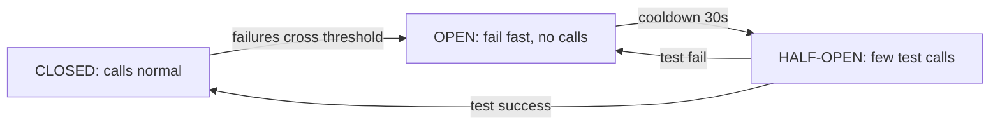

# Reliability & Observability

**Ek line me:** reliability = cheezein fail hongi, phir bhi system chalta rahe. Observability = jab kuch toote, to jaldi pata chale kya, kahan aur kyun.

> **Example:** IPL final ke din Hotstar ka recommendation service slow ho gaya. Agar video page usi ka wait karta rahe to poora app hang. Achha design kehta hai: recommendations skip karo, video chalne do. Users ko pata bhi nahi chalega.

## SPOF aur redundancy

**SPOF (Single Point of Failure):** woh ek component jo gira to sab gira. Diagram pe har box dekho aur poochho "ye mara to?"

| Component | SPOF kaise hatao |
|---|---|
| App server | Multiple stateless instances behind load balancer |
| Load balancer | Active-passive pair ya managed LB (AWS ALB) |
| DB | Primary + replicas, auto failover |
| Redis | Replica + Sentinel / Redis Cluster |
| Kafka | Replication factor 3 |
| Pura datacenter/AZ | Multi-AZ deployment |

## Bachav ke patterns

| Pattern | Kya karta hai | Example |
|---|---|---|
| **Health checks** | LB har few sec `/health` hit kare, fail to traffic band | Liveness (zinda hai?) vs readiness (traffic le sakta hai?) |
| **Timeouts** | Kisi call ka forever wait nahi | Downstream call 500ms timeout, warna threads phans jaate hain |
| **Retries + backoff + jitter** | Temporary failure pe dobara try, par dheere | 100ms, 200ms, 400ms + random. Sirf idempotent calls |
| **Circuit breaker** | Downstream baar baar fail to kuch der call hi mat karo | 50% fail in 10s → OPEN, 30s baad test request |
| **Bulkhead** | Resources alag pools me baanto | Payment ke threads alag, recommendations ke alag. Ek dube to doosra bache |
| **Graceful degradation** | Non-critical feature band, core chalu | Recommendations off, checkout on |
| **Load shedding** | Overload pe kuch requests turant reject (429/503) | Poora crash hone se achha 10% reject |

### Circuit breaker states

OPEN state me fallback do: cached data, default value, ya "abhi available nahi".

## Backups aur data safety

- **Replication backup nahi hai.** Galat `DELETE` replica pe bhi chala jaata hai.
- Daily snapshot + continuous WAL/binlog archive → **point-in-time recovery**.
- Backups doosre region me rakho. Aur restore ki practice karo, warna backup kaam ka nahi.
- **RPO** = kitna data kho sakte ho (e.g. 5 min). **RTO** = wapas aane me kitna time (e.g. 1 hr).

## Multi-AZ vs multi-region

| | Multi-AZ | Multi-region |
|---|---|---|
| Kya bachata hai | Ek datacenter fail | Poora region fail (rare) |
| Latency | AZs ke beech ~1–2 ms, sync replication chal jaata hai | 50–150 ms, usually async replication |
| Complexity | Kam, default karo | Zyada: data conflicts, routing, cost 2x |
| Kab | Har production system | Global users, 99.99%+ SLA, compliance |

Multi-region modes: **active-passive** (ek region serve, doosra standby) simple hai. **Active-active** fast hai par write conflicts handle karne padte hain.

## Observability: 3 pillars

| Pillar | Kya hai | Tool | Kis sawal ka jawab |
|---|---|---|---|
| **Metrics** | Numbers over time | Prometheus, Grafana, Datadog | "Kuch galat hai kya?" (latency spike) |
| **Logs** | Har event ka text record | ELK, Loki | "Kya hua exactly?" (error message) |
| **Traces** | Ek request ka poora safar across services | Jaeger, OpenTelemetry | "Kahan slow hua?" (kaunsi service) |

Kya monitor karo: **RED** (Rate, Errors, Duration) har service ke liye. Infra ke liye CPU, memory, disk, queue lag. Alerts symptom pe (p99 latency, error rate), cause pe nahi.

## SLI, SLO, SLA

| Term | Matlab | Example |
|---|---|---|
| **SLI** (Indicator) | Jo measure karte ho | Successful requests %, p99 latency |
| **SLO** (Objective) | Internal target | 99.9% requests < 300ms |
| **SLA** (Agreement) | Customer se contract, tootne pe penalty | 99.5% uptime warna credits |

SLA < SLO rakho, taaki buffer rahe. **Error budget:** 99.9% = mahine me ~43 min downtime allowed. Budget khatam to naye risky deploys ruko.

| Availability | Downtime / saal |
|---|---|
| 99% | ~3.65 din |
| 99.9% | ~8.8 ghante |
| 99.99% | ~52 min |
| 99.999% | ~5 min |

## "What if X fails?" ka jawab kaise do

Har baar ye 4-step formula:
1. **Kya hoga:** impact batao ("Redis down to seat holds chale jayenge").
2. **Kaise pata chalega:** health check / alert ("Sentinel detect karega, alert aayega").
3. **Turant kya hoga:** failover / fallback ("replica promote, tab tak DB constraint double booking rokega").
4. **Data loss / recovery:** ("async replication me kuch sec ke holds jaa sakte hain, acceptable hai").

## Kin systems me lagta hai

- [Payment System](../02-questions/t1-11-payment-system.md): timeouts, retries, reconciliation
- [Notification System](../02-questions/t1-09-notification-system.md): provider down to fallback provider, circuit breaker
- [Distributed KV Store](../02-questions/t2-20-distributed-kv-store.md): replication, failure detection
- [BookMyShow](../02-questions/t1-05-bookmyshow.md): Redis fail hone pe DB constraint
- [Job Scheduler](../02-questions/t2-18-job-scheduler.md): worker crash pe job retry

## Interview me bolo

> "Har service stateless hai aur multiple AZs me chalti hai. DB primary-replica with auto failover. Downstream calls pe timeout, retries with backoff aur circuit breaker. Agar recommendation service down ho to main graceful degradation karunga: feed chalti rahegi, bas personalised section hatega."

> "Observability ke liye RED metrics, centralized logs, aur OpenTelemetry tracing. SLO 99.9% with p99 < 300ms, aur alerts error rate aur latency pe."

## Common galtiyan

- Diagram me ek DB, ek LB, aur "ye fail hua to?" ka koi jawab nahi.
- Retries bina backoff/jitter ke. Ye retry storm se downstream ko maar dete hain.
- Non-idempotent call ko retry karna.
- Replication ko backup samajhna.
- Har cheez ke liye multi-region active-active bolna. Over-engineering hai, justify karo.
- SLA, SLO, SLI ko mix kar dena.

## Checklist

- [ ] Kisi bhi diagram me SPOF dhoondh ke hatane ka tareeka bata sakta hoon
- [ ] Timeout, retry+backoff, circuit breaker, bulkhead ka farak samjha sakta hoon
- [ ] Multi-AZ vs multi-region aur RPO/RTO bata sakta hoon
- [ ] Metrics, logs, traces aur SLI/SLO/SLA ka farak bata sakta hoon
- [ ] "What if X fails" ka 4-step jawab de sakta hoon
