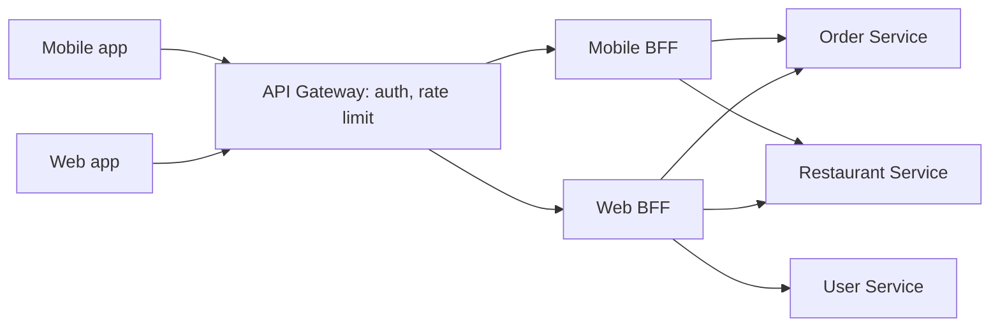
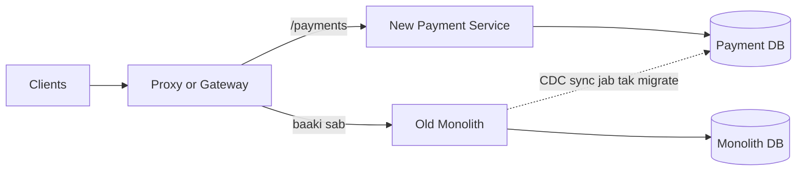

# Microservices Patterns

**Ek line me:** microservices = app ko chhoti, alag deploy hone wali services me todna, jinka apna data hota hai. Patterns (gateway, discovery, mesh, strangler) us todne ki takleef sambhalte hain.

> **Example:** Swiggy me Order, Payment, Restaurant, Delivery aur Notification alag services hain. IPL final ki raat Order Service ko 50 pods chahiye, Restaurant menu ko 5. Alag service hai to alag scale, alag deploy, alag team.

## Monolith vs Microservices

| | Monolith | Microservices |
|---|---|---|
| Deploy | Ek unit, ek pipeline | Har service alag deploy |
| Scale | Poora app scale hota hai | Sirf hot service scale |
| Data | Ek DB, ACID transactions easy | Har service ka DB, distributed transactions |
| Debug | Ek stack trace | Network calls, tracing chahiye |
| Team | Chhoti team ke liye fast | Badi org, team-per-service |

**Kab split NA karo:**
- Team chhoti hai (< 10–15 log). Ops ka bojh features se zyada ho jayega.
- Domain abhi clear nahi hai. Galat boundary = "distributed monolith" (har change me 5 services deploy).
- Har request ko strong consistency chahiye across modules.
- Start **modular monolith** se karo. Boundary pakki ho jaye, load alag ho, tab nikaalo.

## Database-per-service

- Har service apna DB own karti hai. Doosri service seedha uski table nahi padhti, sirf API ya events se.
- Fayda: schema change independent, sahi DB choose kar sakte ho (Payment me Postgres, catalog me Elasticsearch).
- Nuksaan: cross-service join nahi. Data chahiye to API call, ya events se apni local copy (read model) banao.
- Multi-service write ke liye [Saga + Outbox](../01-topics/16-distributed-transactions.md).

## API Gateway aur BFF

**API Gateway** = sab clients ke liye ek entry point. Kaam: routing, auth (JWT verify), rate limiting, TLS termination, request aggregation. Tools: Kong, AWS API Gateway, NGINX, Envoy.

**BFF (Backend for Frontend)** = har client type ke liye alag chhota backend. Mobile ko kam fields aur ek hi call chahiye. Web ko zyada data. Ek generic API dono ko khush nahi karti.

- Gateway me business logic mat daalo. Sirf cross-cutting kaam.
- BFF ki ownership frontend team ke paas ho to best.

## Service discovery

Pods aate-jaate rehte hain, IP badalte hain. Caller ko pata kaise chale ki Order Service abhi kahan hai?

| | Client-side discovery | Server-side discovery |
|---|---|---|
| Kaise | Client registry se instances list leta hai, khud load balance karta hai | Client ek LB/DNS name ko call karta hai, LB instance chunta hai |
| Example | Eureka + Ribbon, Consul client | K8s Service (DNS + kube-proxy), AWS ALB |
| Achha | Ek hop kam, smart LB | Client simple, language-agnostic |
| Bura | Har language me client library | Extra hop, LB khud scale karna |

- **Registry:** Consul, Eureka, etcd. Instances register karte hain aur heartbeat bhejte hain. Heartbeat ruka to entry hatt jaati hai.
- **Kubernetes:** `order-service.default.svc.cluster.local` DNS name. Interview me "K8s Service DNS" bolna kaafi hai.

## Service mesh & sidecar

Har pod ke saath ek **sidecar proxy** (Envoy) chalti hai. Service ka saara traffic usi se jaata hai. Control plane (Istio) sab sidecars ko config deta hai.

- **mTLS:** service-to-service encryption aur identity, bina app code badle.
- **Retries, timeouts, circuit breaking:** config se, har language me same.
- **Observability:** har call ki latency, error rate, traces automatically.
- **Traffic shifting:** canary (5% traffic naye version pe).

Cost: har hop pe thodi latency (~1 ms), aur ek aur complex system chalana. 10–20 services pe aksar library (Resilience4j) kaafi hai.

## Strangler fig migration

Monolith ko ek din me rewrite mat karo. Ek-ek feature naye service me nikaalo, aage ek routing layer rakho. Dheere-dheere monolith "sukh" jaata hai.

Steps: 1) proxy aage lagao, 2) ek module naye service me banao, 3) traffic shift karo (shadow → canary → 100%), 4) monolith ka code hata do. Repeat.

## Sync vs Async communication

| | Sync (REST / gRPC) | Async (events via Kafka / SQS) |
|---|---|---|
| Kab | Turant jawab chahiye (price check, auth) | "Ho gaya" batana hai, baaki baad me (order placed → email, analytics) |
| Coupling | Caller callee ke up hone pe depend | Loose, producer ko consumers ka pata nahi |
| Failure | Ek down, chain fail (cascading) | Queue buffer karti hai, retry baad me |
| Consistency | Read-your-write easy | Eventual consistency |

- **REST:** public APIs, simple. **gRPC:** internal, binary (protobuf), fast, streaming.
- Lambi sync chain (A → B → C → D) avoid karo. Latency add hoti hai aur availability multiply hoti hai (0.99⁴ ≈ 0.96).
- Failures se bachne ke liye timeout, retry with backoff, **circuit breaker** aur **bulkhead**: [Reliability & Observability](../01-topics/20-reliability-observability.md).

## Kab use karo / kab nahi

| Situation | Choice |
|---|---|
| Naya product, chhoti team | Modular monolith |
| Alag scale/deploy needs, 50+ engineers | Microservices |
| Kai client types (app, web, TV) | Gateway + BFF |
| Bahut services, polyglot, mTLS chahiye | Service mesh |
| Purana monolith todna hai | Strangler fig |
| Multi-service write | Saga + outbox |

## Kin systems me lagta hai

- [Payment System](../02-questions/t1-11-payment-system.md): payment, ledger, notification alag services, saga
- [Food Delivery](../02-questions/t2-14-food-delivery.md): order, restaurant, delivery services, gateway + mobile BFF
- [E-commerce Inventory](../02-questions/t2-24-ecommerce-inventory.md): inventory service ka apna DB, events se sync
- [Notification System](../02-questions/t1-09-notification-system.md): async consumer service
- [BookMyShow](../02-questions/t1-05-bookmyshow.md): booking aur payment alag, sync vs async choice

## Interview me bolo

> "Main shuru me modular monolith rakhunga. Jab order aur restaurant ka load aur teams alag hon, tab unhe database-per-service ke saath nikaalunga. Aage API Gateway hoga auth aur rate limiting ke liye, aur mobile ke liye ek BFF."

> "Order placed ke baad ka kaam (email, analytics) async events se jayega. Sirf payment authorization sync gRPC hogi, timeout aur circuit breaker ke saath."

## Common galtiyan

- Har design me seedha 20 microservices bana dena, bina "kyun split kiya" bataye.
- Do services ka ek hi shared DB. Isse coupling wapas aa jaati hai.
- API Gateway me business logic bhar dena.
- Lambi sync call chain, bina timeout/circuit breaker ke.
- Monolith ka "big bang rewrite" propose karna, strangler fig ki jagah.
- Service mesh ko free samajhna. Latency aur ops cost bhi bolo.

## Checklist

- [ ] Monolith vs microservices ka trade-off aur kab split nahi karna, bata sakta hoon
- [ ] Database-per-service ke fayde aur cross-service data ki problem samjha sakta hoon
- [ ] API Gateway aur BFF ka farak diagram ke saath bata sakta hoon
- [ ] Client-side vs server-side discovery aur service mesh/sidecar samjha sakta hoon
- [ ] Strangler fig se monolith migrate karne ke steps bata sakta hoon
- [ ] Sync (REST/gRPC) vs async (events) kab use karna hai, bata sakta hoon
