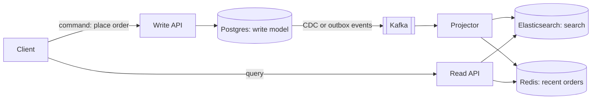
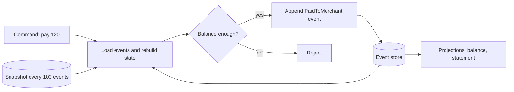

# CQRS & Event Sourcing

**Ek line me:** CQRS = likhne (command) aur padhne (query) ke liye alag models. Event Sourcing = current state ki jagah "kya-kya hua" ke events store karo, state unhe replay karke banao.

> **Example:** Paytm wallet. Balance column overwrite karne ki jagah har event likho: `MoneyAdded 500`, `PaidToMerchant 120`, `Refunded 120`. Balance = sab events ka sum. Kal koi poochhe "15 August ko balance kitna tha?", to us din tak ke events replay karo. Jawab mil gaya.

## CQRS (Command Query Responsibility Segregation)

Ek hi model se likhna aur padhna dono mushkil hai. Write side ko validation aur consistency chahiye. Read side ko fast, denormalized, alag-alag shapes chahiye (list, search, dashboard).

- **Write model:** normalized, business rules check karta hai. Jaise Postgres me `orders` table.
- **Read model(s):** query ke hisaab se bane hue. Jaise Elasticsearch me order search, Redis me "user ke last 10 orders".
- Write side ke changes **events ya CDC** (Debezium) se read side tak jaate hain. Projector un events ko padh ke read models update karta hai.

**Eventual consistency:** write ke baad read model kuch ms–seconds peeche ho sakta hai. Handle kaise karo:
- Write ke response me naya data hi wapas bhej do (UI turant dikha de).
- Critical read (jaise "mera order hua ya nahi") write DB se padho.
- Read model me `version` rakho, client ko pata chale data purana hai.

## Event Sourcing

State store mat karo. **Events** store karo, append-only. Current state = events ka replay.

| seq | stream (account) | event | data |
|---|---|---|---|
| 1 | wallet_rahul | MoneyAdded | 500 |
| 2 | wallet_rahul | PaidToMerchant | 120 |
| 3 | wallet_rahul | Refunded | 120 |

Balance = 500 − 120 + 120 = 500.

- **Replay:** naya read model chahiye (jaise monthly statement)? Pure event log ko shuru se replay karo. Naya view free me.
- **Snapshots:** 1 lakh events har baar replay karna slow hai. Har N events pe state ka snapshot save karo. Load = latest snapshot + uske baad ke events.
- **Concurrency:** append karte waqt `expected_version` check karo (optimistic lock). Do log ek saath same version pe likhein to ek fail hoga.
- **Schema evolution / upcasting:** events kabhi badalte nahi (immutable). Naya field aaya to `MoneyAdded v2` banao. Purane v1 events padhte waqt **upcaster** unhe v2 shape me convert karta hai. Purane events rewrite mat karo.
- Store: EventStoreDB, Kafka (log ke roop me, par per-entity query mushkil), ya Postgres table `(stream_id, version, type, data)` with unique `(stream_id, version)`.

## Saga aur Outbox ke saath kaise judta hai

- Event sourcing me **event store hi outbox hai**. Event append hua = publish ho sakta hai. Dual write problem nahi.
- [Saga](../01-topics/16-distributed-transactions.md) ke steps in hi events pe chalte hain: `OrderPlaced` → Payment Service sunta hai → `PaymentCaptured` ya `PaymentFailed` → compensation.
- CQRS ke read models bhi inhi events se bante hain. Ek event, teen kaam: state, saga step, read view.
- Bina event sourcing ke bhi CQRS chal sakta hai: normal DB + outbox/CDC se read models.

## Zerodha order book example

- Write side: `OrderPlaced`, `OrderModified`, `PartiallyFilled`, `Filled`, `Cancelled` events, per order stream.
- Read side: "Orders" tab (Redis/Postgres projection), trade history, P&L report, SEBI audit report. Sab alag projections.
- Dispute aaye ("mera order 9:15:02 pe kyun nahi bhara?") to events replay karke exact timeline dikha do.

## Kab use karo / kab nahi

| Use karo | Mat karo |
|---|---|
| Audit zaroori: payments ledger, wallet, trading orders | Simple CRUD (profile, settings, blog) |
| "Kab kya hua" history business feature hai (order timeline) | Chhoti team, tight deadline |
| Read aur write load bahut alag (100:1), alag shapes | Strong read-after-write har jagah chahiye |
| Naye views baad me banane hain past data se | Data delete karna padta hai (GDPR) aur plan nahi hai |

- CQRS aur event sourcing alag cheezein hain. CQRS akela kaafi common hai. Event sourcing sirf jahan history hi product ho.
- GDPR: events immutable hain, to personal data encrypt karo per-user key se, delete pe key phenk do (crypto-shredding).

## Kin systems me lagta hai

- [Payment System](../02-questions/t1-11-payment-system.md): ledger events, audit, read models for statements
- [E-commerce Inventory](../02-questions/t2-24-ecommerce-inventory.md): stock events, search read model alag
- [Food Delivery](../02-questions/t2-14-food-delivery.md): order status timeline events se
- [Ad Click Aggregator](../02-questions/t2-17-ad-click-aggregator.md): raw click events replay karke counts dobara banana

## Interview me bolo

> "Wallet ke liye main balance overwrite nahi karunga. Har change ek immutable event hoga, event store me append. Balance aur statement projections hain, aur har 100 events pe snapshot rakhunga taaki load fast ho."

> "Read aur write alag scale hote hain, isliye CQRS: writes Postgres me, outbox/CDC se Kafka, wahan se Elasticsearch aur Redis read models. Read model thoda eventual hai, isliye order confirm screen write response se dikhaunga."

## Common galtiyan

- Har CRUD app pe event sourcing laga dena. Complexity bahut badh jaati hai.
- CQRS aur event sourcing ko ek hi cheez samajhna.
- Eventual consistency ka zikr na karna ("user ne order kiya, list me dikha hi nahi").
- Snapshots bhool jaana. Lakhon events har request pe replay.
- Purane events edit karna schema change ke liye. Upcasting use karo.
- Concurrency check (`expected_version`) na rakhna, double spend ho jayega.

## Checklist

- [ ] CQRS me write model aur read model kyun alag hain, diagram ke saath bata sakta hoon
- [ ] Read models events/CDC se kaise bante hain aur eventual consistency kaise handle karein, samjha sakta hoon
- [ ] Event sourcing me replay, snapshots aur expected_version samjha sakta hoon
- [ ] Event schema evolution aur upcasting bata sakta hoon
- [ ] CQRS/event sourcing Saga aur outbox ke saath kaise judte hain, bata sakta hoon
- [ ] Kab use karna hai (ledger, order history) aur kab nahi (simple CRUD), bata sakta hoon
