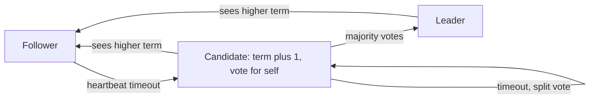
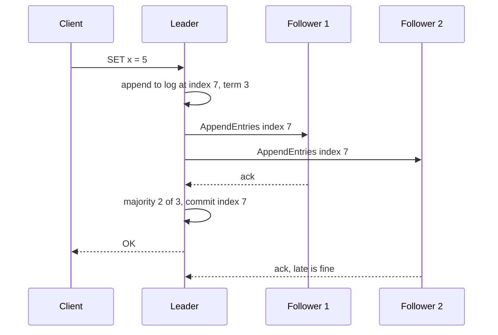

# Consensus & Leader Election

**Ek line me:** consensus = kai machines ka ek hi value (ya ek hi leader) pe agree karna, chahe kuch machines crash ho jayein ya network toot jaye.

> **Example:** Zerodha ka order matching engine 3 machines pe chalta hai. Order sirf **ek** leader process karna chahiye. Agar do machines dono khud ko leader samjhein, to ek hi order do baar execute ho sakta hai. Consensus ye ensure karta hai ki ek waqt pe ek hi leader ho aur sab ek hi order log pe agree karein.

## Consensus kyun chahiye

- **Replication:** 3 replicas ko same order me same writes chahiye (KV store, config store).
- **Leader election:** cron/job scheduler me sirf ek node job trigger kare.
- **Locks & config:** "kaunsa shard kis node pe hai", ye sabko same dikhna chahiye.

Problem: machines crash hoti hain, messages late/lost hote hain, clocks match nahi karte. "Sabse pehle jo bole woh leader" kaam nahi karta.

## Quorum aur majority (2f + 1)

- `f` failures sehne hain to **2f + 1** nodes chahiye. Har decision ke liye **majority** (f + 1) ka haan zaroori.
- Do majorities hamesha kam se kam ek node pe overlap karti hain. Isliye do alag decisions ek saath "committed" nahi ho sakte.

| Nodes | Majority | Kitne fail seh sakte |
|---|---|---|
| 3 | 2 | 1 |
| 5 | 3 | 2 |
| 4 | 3 | 1 (4 rakhne ka fayda nahi) |

- Odd number rakho. Zyada nodes = zyada safety, par har write slow (zyada acks).

## Raft (simple samjho)

Har node teen me se ek state me hota hai: **Follower**, **Candidate**, **Leader**. Time **terms** me bata hai (term 1, 2, 3...). Har term me max ek leader.



**1. Leader election**
- Leader har ~50–100 ms heartbeat bhejta hai.
- Follower ko **randomized timeout** (jaise 150–300 ms) tak heartbeat na mile, to woh candidate banta hai, term badhata hai, sabse vote maangta hai.
- Har node ek term me sirf ek vote deta hai, aur sirf us candidate ko jiska log uske jitna up-to-date ho.
- Majority mila = leader. Random timeout isliye ki sab ek saath candidate na banein (split vote kam ho).

**2. Log replication**



- Entry tab **committed** jab majority ke log me aa jaye. Phir state machine pe apply hoti hai.
- Leader crash ho jaye to naya leader wahi banega jiske paas sab committed entries hain. Committed data kabhi nahi khota.
- Followers ka log leader se mismatch ho to leader use overwrite kar deta hai.

## Paxos (ek paragraph)

Paxos Raft se pehle ka (Lamport) algorithm hai. Proposers ek numbered proposal bhejte hain, acceptors majority se promise karte hain ki purane numbers accept nahi karenge, phir value accept hoti hai. Ye ek single value pe agree karta hai, aur log ke liye **Multi-Paxos** chahiye. Correct aur proven hai, par samajhna aur implement karna mushkil. Isliye Raft "understandable consensus" ke liye bana. Google Chubby aur Spanner Paxos use karte hain. Interview me Raft explain karo, aur bolo "Paxos same guarantees deta hai".

## ZooKeeper / etcd: consensus as a service

Apna Raft mat likho. ZooKeeper (ZAB protocol) ya etcd (Raft) use karo, aur unke primitives se leader election/locks banao.

| Primitive | Kya hai | Use |
|---|---|---|
| **Ephemeral node** (ZK) | Session khatam (client mara) to node apne aap delete | Leader `/leader` ephemeral node banata hai. Mara to hat jaata hai |
| **Sequential node** (ZK) | Node ke naam me badhta number | Sabse chhota number = leader, fair queue |
| **Lease** (etcd) | TTL wala key, client ko renew karte rehna hai | Renew band = lease expire = leadership khatam |
| **Watch** | Key change pe notification | Followers `/leader` watch karte hain, hatte hi election |

## DB me lease se leader election

Chhote systems me ZK/etcd ki jagah DB row se bhi kaam chal jaata hai:

```sql
UPDATE leader_lease
SET owner = 'node-2', expires_at = now() + interval '10 seconds', token = token + 1
WHERE name = 'scheduler' AND (expires_at < now() OR owner = 'node-2');
```

- 1 row update hui = tum leader ho. Har 3 sec renew karo. Leader mara to 10 sec me lease expire, koi aur le lega.
- DB khud single point of failure hai, aur clock skew ka dhyan rakho.

## Split brain aur fencing tokens

**Split brain:** network partition me do nodes khud ko leader samajh lete hain. Ya purana leader GC pause (20 sec) se jaaga, use pata hi nahi ki lease expire ho chuki hai, aur woh likhne lagta hai.

- Quorum isse rokta hai: minority side ke paas majority nahi, to woh leader nahi ban sakta.
- Par purane leader ki "late write" ke liye **fencing token** chahiye: har naye leader/lease ke saath badhta number (Raft term, ZK zxid, upar wala `token`).
- Storage har write ke saath token check karta hai. Token 33 aa chuka hai to token 32 wali write reject.

## Gossip protocols (membership)

Har cheez ke liye consensus mehnga hai. "Kaun zinda hai" jaisi info ke liye **gossip** kaafi hai.
- Har second har node random 1–3 nodes ko apni membership list + heartbeat counters bhejta hai. Info O(log N) rounds me sab tak pahunch jaati hai.
- Cassandra gossip se membership aur failure detection (phi accrual detector) karta hai. Leader hai hi nahi (leaderless).
- Eventually consistent hai. Strong agreement (leader, commit) ke liye nahi.

## Kahan use hota hai

| System | Kya use karta hai |
|---|---|
| Kubernetes | etcd (Raft) me poori cluster state. Controllers leases se leader chunte hain |
| Kafka | Pehle ZooKeeper, ab **KRaft** (Raft) controller quorum metadata ke liye. Partition leader ISR me se chuna jaata hai |
| CockroachDB, TiDB | Har range/shard ka apna Raft group |
| Google Spanner | Har split pe Paxos group + TrueTime |
| Cassandra, DynamoDB-style | Gossip + quorum reads/writes, leaderless |

## Kin systems me lagta hai

- [Distributed KV Store](../02-questions/t2-20-distributed-kv-store.md): Raft per shard ya gossip + quorum
- [Job Scheduler](../02-questions/t2-18-job-scheduler.md): sirf ek scheduler leader, lease + fencing token
- [Distributed Logging](../02-questions/t2-26-distributed-logging.md): Kafka KRaft, partition leaders

## Interview me bolo

> "Scheduler ke 3 replicas honge, par trigger sirf leader karega. Leader election main etcd lease se karunga. Leader har few seconds lease renew karega, mara to lease expire aur doosra leader banega. Har write ke saath fencing token jayega taaki GC pause se jaaga purana leader kuch na bigaade."

> "Replication ke liye Raft: 5 nodes, majority 3, to 2 failures seh sakte hain. Write tab commit jab majority ke log me aa jaye."

## Common galtiyan

- 2 ya 4 nodes ka cluster bolna. Quorum ke liye odd (3, 5) chahiye.
- Sirf timeout/heartbeat se leader maan lena, bina quorum ke. Split brain hoga.
- Lease use karna par fencing token na rakhna.
- Har cheez (membership tak) consensus se karna. Gossip kaafi hai.
- Apna consensus algorithm likhne ki baat karna. etcd/ZooKeeper use karo.
- Ye bolna ki zyada nodes = fast writes. Ulta, zyada acks = slow.

## Checklist

- [ ] Consensus kyun chahiye aur 2f + 1 / majority quorum ka math bata sakta hoon
- [ ] Raft me terms, randomized timeout se election aur majority commit samjha sakta hoon
- [ ] Paxos ko ek line me aur Raft se farak bata sakta hoon
- [ ] ZooKeeper/etcd ke ephemeral nodes, leases, watches se leader election design kar sakta hoon
- [ ] Split brain kya hai aur fencing token se kaise bachte hain, samjha sakta hoon
- [ ] Gossip kab kaafi hai aur Kafka KRaft, etcd, CockroachDB me consensus kahan hai, bata sakta hoon
