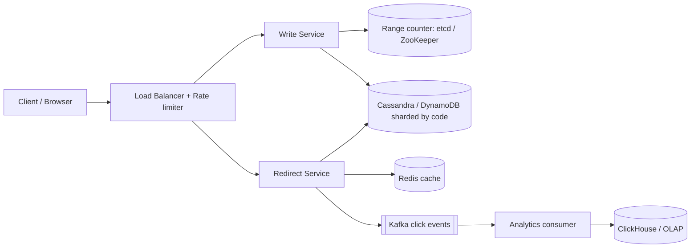
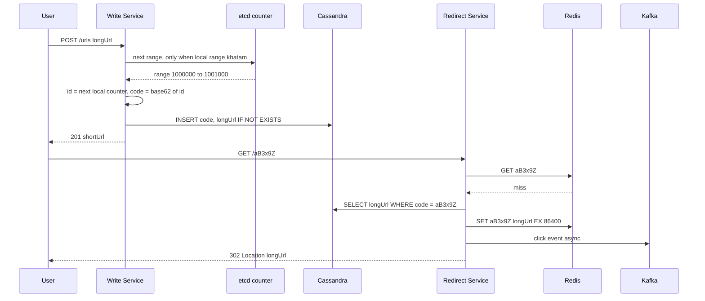

# Design URL Shortener (TinyURL / Bitly)

**Ek line me:** lamba URL → chhota code (`bit.ly/aB3x9Z`), click pe redirect. Core challenge: **unique code fast generate karna** aur **huge read traffic ko ms me redirect karna**.

**Is question me interviewer kya check karta hai:** ID generation trade-off (hash vs counter vs pre-generated keys), read-heavy caching, 301 vs 302, scale pe sharding.

---

## Step 1: Interviewer se ye confirm karo (3–5 min)

| Tum poochho | Typical jawab | Design pe asar |
|---|---|---|
| "Roz kitne naye URLs, clicks?" | 100M URLs/day, read:write ~100:1 | Read path pe cache sabse zaroori |
| "Short code kitna chhota?" | 7 characters | Base62: 3.5 trillion codes |
| "Custom alias (`bit.ly/ipl2026`)?" | Haan, optional | Uniqueness check alag, same table |
| "Links expire hote hain?" | Optional expiry, default kabhi nahi | TTL column + lazy delete |
| "Analytics: clicks, country, device?" | Haan, real-time nahi | Async pipeline |
| "Same long URL → same code?" | Zaroori nahi | Dedup skip, simple design |
| "Login, link edit/delete?" | Basic delete haan, baaki nahi | Out of scope |

> **Bolo:** "2 core flows: create aur redirect. Redirect 100x zyada hai, use fast aur highly available rakhunga. Analytics async."

## Step 2: Requirements

**Functional**
1. Long URL → short URL (optional custom alias + expiry), apna link delete
2. Short URL → original URL pe redirect
3. Basic analytics: click count, country, referrer

**Out of scope:** login UI, link edit, long URL dedup, spam ML.

**Non-functional (priority order me)**
1. **Latency:** redirect p99 < 50 ms
2. **Availability:** redirect 99.99%, create 99.9%
3. **Uniqueness:** do long URLs ko kabhi same code nahi
4. **Scale:** 100M naye URLs/day, 100:1 read/write, 10 saal retention
5. **Analytics:** eventual, ~1 min delay chalega
6. **Non-guessable:** codes sequential na dikhein (optional, poochh lo)

**CAP choice:** redirect pe AP, thoda stale cache chalega. Consistency sirf create pe (uniqueness): range allocation + conditional insert.

## Step 3: Estimation (sirf jo design badle)

- Writes: 100M/day ≈ **1,200/sec**, peak ~5K/sec. Ek DB bhi sambhal leta.
- Reads: 100x ≈ **120K/sec**, peak ~500K/sec → **cache must**.
- Storage: ~500 bytes/row × 100M × 365 × 10 saal ≈ 365B rows ≈ **~180 TB** → sharding.
- Clicks: **~10B events/day**, peak ~500K/sec → analytics pipeline ka volume.
- Code length: 62^7 ≈ 3.5T, 365B rows ke liye kaafi.

> **Bolo:** "120K read QPS aur ~180 TB → heavy caching + short code pe sharded KV store."

## Step 4: Core entities

- **URL mapping**: short_code, long_url, user_id, created_at, expires_at
- **User** (optional): id, api_key, plan
- **Click event**: short_code, timestamp, ip/country, user_agent, referrer

## Step 5: APIs

```http
POST /urls   {longUrl, customAlias?, expiresAt?}   → 201 {shortUrl, shortCode}
     Header: Authorization: Bearer <apiKey>
GET  /{shortCode}                                  → 302 Location: <longUrl>
DELETE /urls/{shortCode}                           → 204
GET  /urls/{shortCode}/stats                       → {clicks, byCountry, byDay}
```

> **Bolo:** "Redirect plain GET hai, `Location` header ke saath 302. Browser khud original URL pe jata hai."

## Step 6: High-level design

**Simple v1:** service + Postgres `urls(short_code PK, long_url)`, DB sequence → Base62, PK lookup. Teeno FRs pure, par numbers todte hain: 500K reads/sec → cache; 180 TB → sharded KV; kai write servers, bina per-write coordination → range allocation; ~10B clicks/day → async log + OLAP.



**FR mapping:** FR1 → Write Service + range counter + DB. FR2 → Redirect Service + Redis + DB. FR3 → Kafka + Analytics consumer + ClickHouse.

**Har component kyun** (alternatives Step 10 me):
- **Write aur Redirect alag:** 100:1 traffic, alag scale; redirect create bugs se isolated (99.99%).
- **Range counter:** Write Service ki allocator library har 1000 ids pe ek `next range` → peak ~5 calls/sec.
- **Redis:** 20% links = 80% traffic → 90%+ hit ratio.
- **Kafka:** 2 consumer groups (analytics loader + abuse detection), 7-day replay (aggregation bug ke baad rerun).

## Step 7: Main flow: create aur redirect



## Step 8: Data model & DB choice

```sql
urls(short_code PK, long_url, user_id, created_at, expires_at)
-- custom alias bhi isi table me, short_code = alias
```

- Ek hi access pattern: **short_code se lookup**, joins/transactions nahi → **DynamoDB/Cassandra**, partition key `short_code`.
- Conditional write (`IF NOT EXISTS` / `attribute_not_exists`) → custom alias uniqueness.

## Step 9: Deep dives (interviewer yahin pressure dalega)

### 9.1 Short code kaise generate karoge? (sabse important)

**NFR:** uniqueness + non-guessable, bina har write pe coordination.

| Option | Kaise | Problem |
|---|---|---|
| **Hash (MD5/SHA) + first 7 chars** | `base62(md5(longUrl))[0:7]` | Collision → DB check + salt retry, load pe badhte |
| **Global counter + Base62** | DB/Redis `INCR` → Base62 | Bottleneck + SPOF; sequential, guessable |
| **Range allocation (chosen)** | etcd/ZooKeeper har server ko 1000 ids; local counter | Crash pe kuch ids waste; 3.5T me chalta |
| **Pre-generated keys** | Offline random codes `unused_keys` table me | Extra table; "used" mark atomic chahiye |

- Non-guessable: Base62 se pehle **bijective shuffle** (XOR with secret / Feistel cipher). Collision phir bhi nahi.
- Redis `INCRBY` nahi: async failover pe increments kho sakte → same range do baar → duplicate codes. Per-write DB sequence = single-node bottleneck.

> **Bolo:** "Hash me collision, single counter bottleneck. Range allocation collision-free hai, coordination har 1000 writes pe ek baar."

**Trade-off:** crash pe ids waste, codes roughly time-ordered ↔ zero collision, almost zero coordination.

### 9.2 301 vs 302 redirect

**NFR:** analytics accuracy, delete/expiry turant lage.

- **301 (Permanent):** browser cache → load kam, par **analytics miss**, change/delete ka asar nahi.
- **302 (Temporary):** har click server pe → analytics accurate, expiry/delete turant.
- Chosen: **302** (Bitly bhi), analytics requirement hai.

**Trade-off:** zyada server load/cost ↔ analytics aur control.

### 9.3 Read path ko 500K QPS tak kaise le jaoge?

**NFR:** redirect p99 < 50 ms, 99.99% availability.

- **Redis cache** (LRU, TTL 24h), consistent hashing se sharded.
- Viral link (IPL final) → **in-process local cache** (Caffeine, 60 sec), ek Redis node hot na ho.
- Negative caching: missing code bhi 5 min cache, warna random codes DB hammer karein.

**Trade-off:** delete ke baad 60 sec tak purana link (local cache/CDN) ↔ DB load ~10x kam.

### 9.4 Custom alias, expiry aur analytics

**NFR:** alias uniqueness (strong), analytics eventual.

- **Custom alias:** `INSERT ... IF NOT EXISTS`, fail → 409. Generated codes se clash na ho: min length / reserved words.
- **Expiry:** `expires_at` redirect pe check, expired → 410 Gone. Cleanup: Cassandra/DynamoDB **TTL**. Cache TTL = `min(24h, expires_at - now)`.
- **Analytics:** Redirect Service → Kafka batch (async) → consumer enrich (IP → country) → ClickHouse.

**Trade-off:** counts ~1 min late, approximate (at-least-once) ↔ redirect pe zero extra latency.

## Step 10: Decision table (kya chuna, kyun, kya nahi)

| Decision | Kyun chuna | Kya nahi chuna, kyun |
|---|---|---|
| **Range allocation + Base62** (etcd/ZooKeeper) | Collision-free, ~5 calls/sec | **Hash:** retries. **Redis INCRBY:** range repeat. **Alag KGS:** overkill. Sacrifice: crash pe ids waste |
| **302 redirect** | Analytics aur expiry kaam karte | **301:** browser cache, analytics miss. Sacrifice: zyada load |
| **DynamoDB / Cassandra** | Key lookup, 180 TB, built-in sharding | **Postgres:** manual sharding. Sacrifice: ad-hoc queries, multi-row txns nahi |
| **Redis + local cache** | 120K–500K reads/sec, hot links | **Sirf DB replicas:** bahut machines, p99 zyada. Sacrifice: ~60 sec stale + Redis ops |
| **Kafka** for clicks | ~120K events/sec, 2 consumer groups, replay | **SQS:** no replay/multi-consumer, mehenga. **Sync DB counter:** hot key. Sacrifice: Kafka ops |
| **ClickHouse** for analytics | 10B rows/day pe fast aggregations | **Main DB aggregates:** redirect slow. Sacrifice: ek aur store, eventual counts |
| **Sharding by short_code** | Lookup hamesha code se, uniform | **By user_id:** redirect pe scatter-gather. Sacrifice: "user ke links" query scatter |

## Step 11: Failures & bottlenecks

| Kya fail hua | Kya hoga | Handle kaise |
|---|---|---|
| Redis down | Saara read DB pe | DB replicas + local cache; Redis cluster with replicas |
| etcd / ZooKeeper down | Naye ranges nahi | Servers pe 1–2 ranges buffer; 3–5 node quorum |
| Viral link | Ek Redis key pe lakhon hits | Local cache + CDN |
| Spam / malicious URLs | Phishing links | Rate limit per API key, async Safe Browsing |
| Kafka lag | Analytics late | Redirect pe asar nahi; consumers scale |

## Step 12: "Isko aur better kaise karein" (end me khud bolo)

- **Multi-region:** redirect + read replicas har region; writes home region ya region-prefixed ranges
- **CDN edge redirects:** top 1% links Cloudflare Workers/Lambda@Edge pe, latency < 10ms
- **Dedup option:** paid users ke liye same long URL → same code (`hash(longUrl) → code` index)
- Real-time dashboard: Kafka Streams / Flink se 1-min aggregates

## Step 13: Interviewer ke likely follow-up sawal

- "Hash me collision?" → conditional insert, fail → salt ke saath rehash; ya bloom filter pre-check
- "7 chars kyun?" → 62^7 ≈ 3.5T, 365B rows pe 10x headroom
- "Guessable kyun nahi?" → sequential codes se private links scrape; bijective shuffle
- "Delete hua par cache me hai?" → cache key bhi delete; 302 hai, browser cache nahi
- "Exact analytics?" → at-least-once + consumer event_id dedup; usually approximate chalta hai
- **Senior signal:** viral link ki cache entry expire → lakhon requests DB pe (cache stampede). Fix: per-key single-flight, local cache, TTL jitter.

## 2-minute recap (interview se pehle ye padho)

> 100:1 read-heavy; v1 (service + Postgres) ko 500K reads/sec aur 180 TB todte hain. Code: range allocation (etcd/ZooKeeper se 1000 ids ka block → Base62, 7 chars = 3.5T), collision nahi, alag KGS nahi. DynamoDB/Cassandra, key short_code. 302 taaki analytics/expiry kaam karein. Read: local cache → Redis → DB + negative caching. Alias: conditional insert; expiry: `expires_at` + DB TTL. Clicks (~120K/sec) Kafka → ClickHouse async.

## Checklist

- [ ] Clarifying sawal (scale, alias, expiry, analytics) bina dekhe pooch sakta hoon
- [ ] Code generation ke 3–4 options aur unke trade-offs bata sakta hoon
- [ ] Range allocation kaise kaam karta hai samjha sakta hoon
- [ ] 301 vs 302 ka farak aur apna choice justify kar sakta hoon
- [ ] Storage aur QPS estimation 2 min me kar sakta hoon
- [ ] Read path caching (local + Redis + negative cache) explain kar sakta hoon
- [ ] Short_code pe sharding kyun, ye bata sakta hoon
- [ ] Decision table ke 3 trade-offs bina dekhe bol sakta hoon
