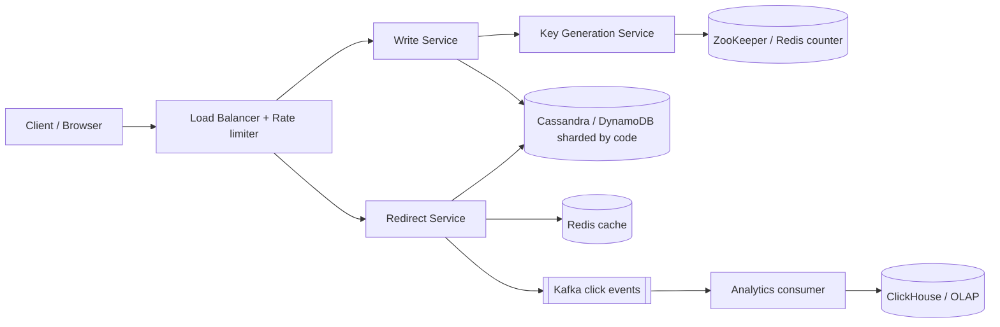
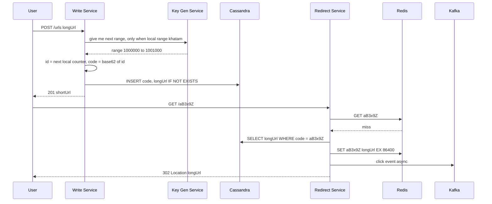

# Design URL Shortener (TinyURL / Bitly)

**Ek line me:** lamba URL do, chhota code milo (`bit.ly/aB3x9Z`). Koi us chhote link pe click kare to original URL pe redirect ho jaye. Core challenge hai **unique short code fast generate karna** aur **bahut bade read traffic ko milliseconds me redirect karna**.

**Is question me interviewer kya check karta hai:** ID generation ka trade-off (hash vs counter vs pre-generated keys), read-heavy system me caching, 301 vs 302 ka matlab, aur scale pe sharding.

---

## Step 1: Interviewer se ye confirm karo (3–5 min)

Design shuru karne se pehle ye sawal poochho:

| Tum poochho | Typical jawab | Design pe asar |
|---|---|---|
| "Scale kitna? Roz kitne naye URLs aur kitne clicks?" | 100M naye URLs/day, read:write ~100:1 | Read path pe cache sabse zaroori |
| "Short code kitna chhota chahiye?" | 7 characters theek | Base62 ke 7 chars = 3.5 trillion codes |
| "Custom alias chahiye? (`bit.ly/ipl2026`)" | Haan, optional | Uniqueness check alag se, same table |
| "Links expire hote hain?" | Haan, optional expiry, default kabhi nahi | TTL column + lazy delete |
| "Analytics chahiye? Click count, country, device?" | Haan, par real-time zaroori nahi | Kafka se async, redirect path slow nahi |
| "Same long URL do baar aaye to same code dena hai?" | Zaroori nahi | Dedup skip kar sakte hain, simple design |
| "Login/users, link edit/delete scope me?" | Basic delete haan, baaki nahi | Out of scope bol do |

> **Bolo:** "Main 2 core flows design karunga: create short URL aur redirect. Redirect path ko super fast aur highly available rakhunga, kyunki ye 100x zyada aata hai. Analytics async rahega."

## Step 2: Requirements

**Functional**
1. Long URL do, unique short URL milo
2. Short URL kholo to original URL pe redirect ho
3. Optional custom alias aur expiry time
4. Basic analytics: click count, country, referrer

**Non-functional**
- **Low latency:** redirect < 50ms (p99)
- **High availability:** redirect kabhi down nahi hona chahiye (99.99%)
- **Uniqueness:** do long URLs ko kabhi same code nahi milna chahiye
- **Non-guessable:** codes sequential nahi dikhne chahiye (optional, poochh lo)
- **Scale:** read-heavy, 100:1

## Step 3: Estimation (sirf jo design badle)

- Writes: 100M/day ≈ **1,200 writes/sec**, peak ~5K/sec.
- Reads: 100x ≈ **120K reads/sec**, peak ~500K/sec. **Iske liye cache must hai.**
- Storage: ek row ~500 bytes. 100M × 365 × 10 saal ≈ 365B rows ≈ **~180 TB**. Ek machine pe nahi aayega, sharding chahiye.
- Code length: 62^7 ≈ 3.5 trillion. 365B rows ke liye kaafi hai.
- Hot links: 20% links 80% traffic laate hain. Thoda sa cache bada hit ratio dega.

> **Bolo:** "Read 120K QPS hai aur storage 10 saal me ~180 TB. Isliye do decisions clear hain: heavy caching aur short code pe sharded key-value store."

## Step 4: Core entities

- **URL mapping**: short_code, long_url, user_id, created_at, expires_at
- **User** (optional): id, api_key, plan
- **Click event**: short_code, timestamp, ip/country, user_agent, referrer

## Step 5: APIs

```http
POST /urls   {longUrl, customAlias?, expiresAt?}   → 201 {shortUrl, shortCode}
     Header: Authorization: Bearer <apiKey>
GET  /{shortCode}                                  → 302 Location: <longUrl>
DELETE /urls/{shortCode}                           → 204
GET  /urls/{shortCode}/stats                       → {clicks, byCountry, byDay}
```

> **Bolo:** "Redirect ek plain GET hai jo `Location` header ke saath 302 return karta hai. Browser khud original URL pe chala jata hai."

## Step 6: High-level design



**Har component kyun:**
- **Load Balancer + Rate limiter:** spam bots ko roko jo lakhon URLs bana dete hain
- **Write Service:** validate URL, custom alias check, code allot karke DB me save
- **Key Generation Service (KGS):** har write server ko codes ka range deta hai, taaki collision kabhi na ho
- **Redirect Service:** stateless, read-only. Cache → DB fallback → 302
- **Redis cache:** hot links ke liye, 90%+ hit ratio
- **Kafka → Analytics:** click event fire-and-forget, redirect latency pe asar nahi
- **ClickHouse:** aggregated analytics queries (clicks per day, per country)

## Step 7: Main flow: create aur redirect



## Step 8: Data model & DB choice

```sql
urls(short_code PK, long_url, user_id, created_at, expires_at)
-- custom alias bhi isi table me, short_code = alias
```

- Access pattern sirf ek hai: **short_code se lookup**. Joins nahi, transactions nahi.
- Isliye **key-value / wide-column store (DynamoDB ya Cassandra)**. Partition key = `short_code`, data automatically shards me fail jata hai.
- Conditional write (`IF NOT EXISTS` / `attribute_not_exists`) se custom alias ki uniqueness guarantee hoti hai.
- Analytics alag OLAP store (ClickHouse) me, main DB pe aggregation queries nahi.

## Step 9: Deep dives (interviewer yahin pressure dalega)

### 9.1 Short code kaise generate karoge? (sabse important)

| Option | Kaise | Problem |
|---|---|---|
| **Hash (MD5/SHA) + first 7 chars** | `base62(md5(longUrl))[0:7]` | Collision possible. Har write pe DB check + retry with salt. Load badhne pe retries badhte hain |
| **Global counter + Base62** | DB/Redis `INCR`, id ko Base62 me convert | Single counter bottleneck aur SPOF. Codes sequential, guess ho jate hain |
| **Range allocation (chosen)** | KGS har server ko 1000 ids ka block deta hai. Server local memory me counter chalata hai | Server crash hua to range ke kuch ids waste. 3.5T me ye chalta hai |
| **Pre-generated keys** | Offline random codes banao, `unused_keys` table me rakho. Server batch me uthaye | Extra table + key ko "used" mark karna atomic hona chahiye |

- Chosen: **range allocation**. ZooKeeper ya Redis `INCRBY 1000` se range milti hai. Network call har 1000 writes me ek baar.
- Guessable na ho: id ko Base62 karne se pehle ek **bijective shuffle** (jaise XOR with secret, ya Feistel cipher) lagao. Collision phir bhi nahi hoga.

> **Bolo:** "Hash me collision handle karna padta hai, single counter bottleneck hai. Range allocation dono problems solve karta hai: collision-free, aur coordination sirf har 1000 writes pe ek baar."

### 9.2 301 vs 302 redirect

- **301 (Permanent):** browser cache kar leta hai. Next click server pe aata hi nahi. Server load kam, par **analytics miss** aur link change/delete ka asar nahi hota.
- **302 (Temporary):** har click server pe aata hai. Analytics accurate, expiry/delete turant kaam karta hai.
- Chosen: **302** (Bitly bhi aisa karta hai), kyunki analytics requirement hai. Load ko cache + CDN sambhalega.

### 9.3 Read path ko 500K QPS tak kaise le jaoge?

- **Redis cache** (LRU, TTL 24h). 20% hot links cache me = 90%+ hit ratio.
- Redis ko **consistent hashing** se cluster me shard karo.
- Viral link (IPL final ka link) ke liye **in-process local cache** (Caffeine, 60 sec) bhi lagao, taaki ek Redis node hot na ho.
- Negative caching: jo code exist nahi karta use bhi 5 min cache karo, warna attackers random codes se DB pe hammer karenge.
- Optional: CDN edge pe 302 response short TTL ke saath cache.

### 9.4 Custom alias, expiry aur analytics

- **Custom alias:** `INSERT ... IF NOT EXISTS`. Fail hua to 409 Conflict. Generated codes aur aliases ka namespace clash na ho, isliye alias me min length ya reserved words check.
- **Expiry:** `expires_at` column. Redirect pe check karo, expired ho to 410 Gone. Cleanup ke liye Cassandra/DynamoDB **TTL** feature, ya ek low-priority batch job. Cache TTL ko `min(24h, expires_at - now)` rakho.
- **Analytics:** Redirect Service click event Kafka me daalta hai (async, batch). Consumer enrich karta hai (IP → country) aur ClickHouse me likhta hai. Click counts eventually consistent hain, chalega.

## Step 10: Decision table (kya chuna, kyun, kya nahi)

| Decision | Kyun chuna | Kya nahi chuna, kyun |
|---|---|---|
| **Range allocation + Base62** for codes | Collision-free, koi DB check nahi, coordination har 1000 writes me ek baar | **Hash + collision check:** har write pe extra read, retries. **Single counter:** bottleneck + SPOF |
| **302 redirect** | Har click server pe aata hai, analytics aur expiry kaam karte hain | **301:** browser cache kar leta hai, analytics miss, link delete ka asar nahi |
| **DynamoDB / Cassandra** | Simple key lookup, 180 TB, built-in sharding by partition key | **Postgres:** itne data pe manual sharding karni padegi, aur joins/transactions chahiye hi nahi |
| **Redis cache + local cache** | 100:1 read-heavy, hot links bahut kam hain | **Sirf DB replicas:** 500K QPS pe bahut saari machines, latency bhi zyada |
| **Kafka** for click analytics | Redirect path fast rehta hai, consumer down ho to bhi events safe | **Sync DB counter update:** har click pe write, hot key pe contention |
| **Sharding by short_code** | Lookup hamesha code se hota hai, uniform distribution | **Shard by user_id:** redirect ke time user pata nahi hota, scatter-gather karna padega |

## Step 11: Failures & bottlenecks

| Kya fail hua | Kya hoga | Handle kaise |
|---|---|---|
| Redis down | Saara read DB pe | DB replicas absorb karein, local cache buffer. Redis cluster with replicas |
| KGS / ZooKeeper down | Naye ranges nahi milenge | Servers ke paas pehle se 1–2 ranges buffer me. KGS ko 3-node cluster me chalao |
| Write server crash | Uski range ke unused ids waste | Acceptable, 3.5T codes hain |
| Viral link | Ek Redis key pe lakhon hits | Local in-memory cache + CDN |
| Spam / malicious URLs | Phishing links ban jayenge | Rate limit per API key, Google Safe Browsing check async |
| Kafka lag | Analytics late | Redirect pe asar nahi, consumers scale karo |

## Step 12: "Isko aur better kaise karein" (end me khud bolo)

> "Agar aur time ho to main ye improve karunga:"
- **Multi-region:** redirect service + read replicas har region me, writes ek home region me ya region-prefixed ranges ke saath
- **CDN edge redirects:** top 1% links Cloudflare Workers/Lambda@Edge pe serve, latency < 10ms
- **Malicious URL scanning** async pipeline, flagged link pe warning page
- **Dedup option:** paid users ke liye same long URL pe same code (`hash(longUrl) → code` index)
- **Cold storage:** 2 saal se unclicked links ko sasta storage me move karna
- Real-time click dashboard ke liye Kafka Streams / Flink se 1-min aggregates

## Step 13: Interviewer ke likely follow-up sawal

- "Hash use karte to collision kaise handle karte?" → DB me conditional insert, fail ho to long URL + salt ka hash dobara. Ya bloom filter se pehle check
- "7 chars hi kyun?" → 62^7 ≈ 3.5T, 10 saal ke 365B rows ke liye 10x headroom
- "Codes guessable kyun nahi hone chahiye?" → log sequential codes se private links scrape kar lenge. Bijective shuffle lagao
- "Kisi ne link delete kiya par cache me hai?" → delete pe cache key bhi delete karo. 302 hai isliye browser cache issue nahi
- "Analytics exactly accurate chahiye?" → Kafka at-least-once + consumer side event_id dedup. Usually approximate chalta hai
- "301 kab use karoge?" → jab analytics nahi chahiye aur server load minimum chahiye

## 2-minute recap (interview se pehle ye padho)

> URL shortener 100:1 read-heavy hai. Do flows: create aur redirect. Short code ke liye range allocation: KGS (ZooKeeper/Redis) har write server ko 1000 ids ka block deta hai, server local counter ko Base62 karta hai (7 chars = 3.5T codes). Isse collision nahi hota aur coordination bahut kam. Data DynamoDB/Cassandra me, partition key short_code, kyunki sirf key lookup hai aur 10 saal me ~180 TB. Redirect 302 se, taaki analytics aur expiry kaam karein. Read path: local cache → Redis → DB, negative caching bhi. Custom alias ke liye conditional insert, expiry ke liye `expires_at` + DB TTL. Clicks Kafka se ClickHouse me async.

## Checklist

- [ ] Clarifying sawal (scale, alias, expiry, analytics) bina dekhe pooch sakta hoon
- [ ] Code generation ke 3–4 options aur unke trade-offs bata sakta hoon
- [ ] Range allocation kaise kaam karta hai samjha sakta hoon
- [ ] 301 vs 302 ka farak aur apna choice justify kar sakta hoon
- [ ] Storage aur QPS estimation 2 min me kar sakta hoon
- [ ] Read path caching (local + Redis + negative cache) explain kar sakta hoon
- [ ] Short_code pe sharding kyun, ye bata sakta hoon
- [ ] Decision table ke 3 trade-offs bina dekhe bol sakta hoon
