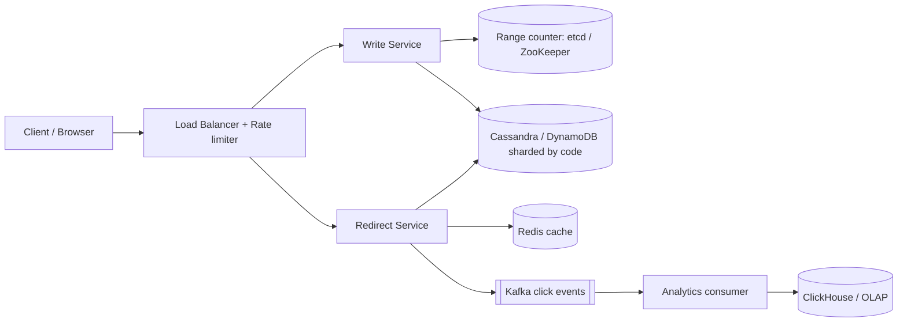
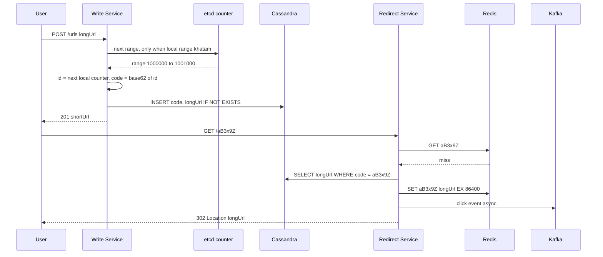

# Design URL Shortener (TinyURL / Bitly)

**Ek line me:** lamba URL do, chhota code milo (`bit.ly/aB3x9Z`). Koi us chhote link pe click kare to original URL pe redirect ho jaye. Core challenge hai **unique short code fast generate karna** aur **bahut bade read traffic ko milliseconds me redirect karna**.

**Is question me interviewer kya check karta hai:** ID generation ka trade-off (hash vs counter vs pre-generated keys), read-heavy system me caching, 301 vs 302 ka matlab, aur scale pe sharding.

---

## Step 1: Interviewer se ye confirm karo (3–5 min)

Design shuru karne se pehle ye sawal poochho:

| Tum poochho | Typical jawab | Design pe asar |
|---|---|---|
| "Scale kitna? Roz kitne naye URLs aur kitne clicks?" | 100M naye URLs/day, read:write ~100:1 | Read path pe cache sabse zaroori |
| "Short code kitna chhota chahiye?" | 7 characters theek | Base62 ke 7 chars = 3.5 trillion codes |
| "Custom alias chahiye? (`bit.ly/ipl2026`)" | Haan, optional | Uniqueness check alag se, same table |
| "Links expire hote hain?" | Haan, optional expiry, default kabhi nahi | TTL column + lazy delete |
| "Analytics chahiye? Click count, country, device?" | Haan, par real-time zaroori nahi | Async pipeline, redirect path slow nahi |
| "Same long URL do baar aaye to same code dena hai?" | Zaroori nahi | Dedup skip kar sakte hain, simple design |
| "Login/users, link edit/delete scope me?" | Basic delete haan, baaki nahi | Out of scope bol do |

> **Bolo:** "Main 2 core flows design karunga: create short URL aur redirect. Redirect path ko super fast aur highly available rakhunga, kyunki ye 100x zyada aata hai. Analytics async rahega."

## Step 2: Requirements

**Functional**
1. Users long URL de kar short URL bana sakein (optional custom alias aur expiry), aur apna link delete kar sakein
2. Users short URL kholein to original URL pe redirect ho
3. Users apne link ke basic analytics dekh sakein: click count, country, referrer

**Out of scope:** login/account UI, link edit, same long URL ka dedup, spam detection ka ML.

**Non-functional (priority order me)**
1. **Latency:** redirect p99 < 50 ms
2. **Availability:** redirect 99.99%, create 99.9%
3. **Uniqueness:** do long URLs ko kabhi same code nahi
4. **Scale:** 100M naye URLs/day, 100:1 read/write, 10 saal retention
5. **Analytics:** eventual, ~1 min delay chalega
6. **Non-guessable:** codes sequential nahi dikhne chahiye (optional, poochh lo)

**CAP choice:** redirect path pe availability (AP). Cache thoda stale ho, chalega. Consistency sirf create pe chahiye (uniqueness), jo range allocation + conditional insert se aati hai.

## Step 3: Estimation (sirf jo design badle)

- Writes: 100M/day ≈ **1,200 writes/sec**, peak ~5K/sec. Ek DB bhi sambhal leta.
- Reads: 100x ≈ **120K reads/sec**, peak ~500K/sec. **Iske liye cache must hai.**
- Storage: ek row ~500 bytes. 100M × 365 × 10 saal ≈ 365B rows ≈ **~180 TB**. Ek machine pe nahi aayega, sharding chahiye.
- Clicks: har redirect ek click event = **~10B events/day**, peak ~500K/sec. Analytics pipeline ko ye volume chahiye.
- Code length: 62^7 ≈ 3.5 trillion. 365B rows ke liye kaafi hai.

> **Bolo:** "Read 120K QPS hai aur storage 10 saal me ~180 TB. Isliye do decisions clear hain: heavy caching aur short code pe sharded key-value store."

## Step 4: Core entities

- **URL mapping**: short_code, long_url, user_id, created_at, expires_at
- **User** (optional): id, api_key, plan
- **Click event**: short_code, timestamp, ip/country, user_agent, referrer

## Step 5: APIs

```http
POST /urls   {longUrl, customAlias?, expiresAt?}   → 201 {shortUrl, shortCode}
     Header: Authorization: Bearer <apiKey>
GET  /{shortCode}                                  → 302 Location: <longUrl>
DELETE /urls/{shortCode}                           → 204
GET  /urls/{shortCode}/stats                       → {clicks, byCountry, byDay}
```

> **Bolo:** "Redirect ek plain GET hai jo `Location` header ke saath 302 return karta hai. Browser khud original URL pe chala jata hai."

## Step 6: High-level design

**Simple v1 pehle:** ek service + ek Postgres table `urls(short_code PK, long_url)`. Create pe DB sequence ko Base62 karo, redirect pe PK lookup. Ye teeno FRs pura karta hai. Ab numbers isse todte hain: 120K–500K reads/sec → cache; 180 TB → sharded KV store; kai write servers ko bina har-write coordination ke unique ids → range allocation; ~10B clicks/day → async log + OLAP.



**FR mapping:** FR1 → Write Service + range counter + DB. FR2 → Redirect Service + Redis + DB. FR3 → Kafka + Analytics consumer + ClickHouse.

**Har component kyun:**
- **Write aur Redirect alag services:** 100:1 traffic, alag scale hote hain. Redirect create ke bugs se isolated rehta hai (99.99%). Ek service v1 me theek thi.
- **Range counter (etcd/ZooKeeper):** Write Service ke andar ek allocator library har 1000 ids pe ek baar `next range` leta hai. Peak 5K writes/sec = sirf ~5 calls/sec, isliye **alag Key Generation Service nahi banayi**. Redis `INCRBY` nahi, kyunki async replica failover pe increments kho sakte hain aur same range do baar mil sakti hai (duplicate codes). Har write pe DB sequence (simpler) single-node bottleneck banta.
- **Redis cache:** 120K–500K reads/sec, 20% links 80% traffic laate hain, isliye 90%+ hit ratio. Sirf DB replicas (simpler) se itne QPS pe bahut machines aur p99 zyada.
- **Cassandra / DynamoDB:** ~180 TB, sirf key lookup. Postgres (simpler) me manual sharding karni padti.
- **Kafka:** ~120K click events/sec (peak 500K), do consumer groups (analytics loader + abuse detection), aur 7-day replay taaki aggregation bug ke baad dobara chala sakein. SQS (simpler) me replay/multiple consumer groups nahi, aur 10B msgs/day pe mehenga.
- **ClickHouse:** 10B rows/day pe "clicks per day per country" jaise aggregation. Main KV store pe ye queries nahi chal sakti.

## Step 7: Main flow: create aur redirect



## Step 8: Data model & DB choice

```sql
urls(short_code PK, long_url, user_id, created_at, expires_at)
-- custom alias bhi isi table me, short_code = alias
```

- Access pattern sirf ek: **short_code se lookup**. Joins/transactions nahi, isliye **DynamoDB ya Cassandra**, partition key = `short_code`.
- Conditional write (`IF NOT EXISTS` / `attribute_not_exists`) se custom alias ki uniqueness guarantee hoti hai.
- Analytics alag OLAP store (ClickHouse) me, main DB pe aggregation queries nahi.

## Step 9: Deep dives (interviewer yahin pressure dalega)

### 9.1 Short code kaise generate karoge? (sabse important)

**NFR:** uniqueness + non-guessable, bina har write pe coordination.

| Option | Kaise | Problem |
|---|---|---|
| **Hash (MD5/SHA) + first 7 chars** | `base62(md5(longUrl))[0:7]` | Collision possible. Har write pe DB check + retry with salt. Load badhne pe retries badhte hain |
| **Global counter + Base62** | DB/Redis `INCR`, id ko Base62 me convert | Single counter bottleneck aur SPOF. Codes sequential, guess ho jate hain |
| **Range allocation (chosen)** | Central counter (etcd/ZooKeeper) har server ko 1000 ids ka block deta hai. Server local memory me counter chalata hai | Server crash hua to range ke kuch ids waste. 3.5T me ye chalta hai |
| **Pre-generated keys** | Offline random codes banao, `unused_keys` table me rakho. Server batch me uthaye | Extra table + key ko "used" mark karna atomic hona chahiye |

- Guessable na ho: id ko Base62 karne se pehle ek **bijective shuffle** (jaise XOR with secret, ya Feistel cipher) lagao. Collision phir bhi nahi hoga.

> **Bolo:** "Hash me collision handle karna padta hai, single counter bottleneck hai. Range allocation dono problems solve karta hai: collision-free, aur coordination sirf har 1000 writes pe ek baar."

**Trade-off:** crash pe kuch ids waste aur codes roughly time-ordered, badle me zero collision aur almost zero coordination.

### 9.2 301 vs 302 redirect

**NFR:** analytics accuracy aur delete/expiry turant lage, latency budget ke andar.

- **301 (Permanent):** browser cache kar leta hai. Next click server pe aata hi nahi. Server load kam, par **analytics miss** aur link change/delete ka asar nahi hota.
- **302 (Temporary):** har click server pe aata hai. Analytics accurate, expiry/delete turant kaam karta hai.
- Chosen: **302** (Bitly bhi aisa karta hai), kyunki analytics requirement hai.

**Trade-off:** har click humare servers pe aata hai (zyada load aur cost), badle me analytics aur control.

### 9.3 Read path ko 500K QPS tak kaise le jaoge?

**NFR:** redirect p99 < 50 ms, 99.99% availability.

- **Redis cache** (LRU, TTL 24h), consistent hashing se cluster me shard.
- Viral link (IPL final ka link) ke liye **in-process local cache** (Caffeine, 60 sec), taaki ek Redis node hot na ho.
- Negative caching: jo code exist nahi karta use bhi 5 min cache karo, warna random codes se DB pe hammer.

**Trade-off:** delete ke baad local cache/CDN me 60 sec tak purana link chal sakta hai, badle me DB load ~10x kam.

### 9.4 Custom alias, expiry aur analytics

**NFR:** alias uniqueness (strong), analytics eventual.

- **Custom alias:** `INSERT ... IF NOT EXISTS`. Fail hua to 409 Conflict. Generated codes se clash na ho, isliye alias me min length ya reserved words check.
- **Expiry:** `expires_at` column. Redirect pe check, expired ho to 410 Gone. Cleanup ke liye Cassandra/DynamoDB **TTL**. Cache TTL = `min(24h, expires_at - now)`.
- **Analytics:** Redirect Service click event Kafka me batch me daalta hai (async). Consumer enrich karta hai (IP → country) aur ClickHouse me likhta hai.

**Trade-off:** click counts ~1 min late aur approximate (at-least-once), badle me redirect path pe zero extra latency.

## Step 10: Decision table (kya chuna, kyun, kya nahi)

| Decision | Kyun chuna | Kya nahi chuna, kyun |
|---|---|---|
| **Range allocation + Base62**, counter etcd/ZooKeeper me | Collision-free, coordination har 1000 writes me ek baar (~5 calls/sec) | **Hash + collision check:** har write pe extra read, retries. **Redis INCRBY:** failover pe range repeat ho sakti hai. **Alag KGS service:** itne kam load pe extra service. Sacrifice: crash pe ids waste |
| **302 redirect** | Har click server pe, analytics aur expiry kaam karte hain | **301:** browser cache, analytics miss. Sacrifice: zyada server load |
| **DynamoDB / Cassandra** | Simple key lookup, 180 TB, built-in sharding | **Postgres:** manual sharding, joins chahiye hi nahi. Sacrifice: ad-hoc queries aur multi-row transactions nahi |
| **Redis cache + local cache** | 120K–500K reads/sec, hot links kam | **Sirf DB replicas:** bahut machines, p99 zyada. Sacrifice: delete ke baad ~60 sec stale + Redis cluster ka ops cost |
| **Kafka** for clicks | ~120K events/sec, 2 consumer groups, 7-day replay | **SQS:** replay/multi-consumer nahi, 10B msgs/day pe mehenga. **Sync DB counter:** hot key contention. Sacrifice: Kafka cluster chalana |
| **ClickHouse** for analytics | 10B rows/day pe fast aggregations | **Main DB pe aggregates:** redirect path slow. Sacrifice: ek aur store, counts eventual |
| **Sharding by short_code** | Lookup hamesha code se, uniform distribution | **Shard by user_id:** redirect pe user pata nahi, scatter-gather. Sacrifice: "user ke saare links" query scatter hoti hai |

## Step 11: Failures & bottlenecks

| Kya fail hua | Kya hoga | Handle kaise |
|---|---|---|
| Redis down | Saara read DB pe | DB replicas absorb karein, local cache buffer. Redis cluster with replicas |
| etcd / ZooKeeper down | Naye ranges nahi milenge | Servers ke paas pehle se 1–2 ranges buffer me. 3–5 node quorum cluster |
| Viral link | Ek Redis key pe lakhon hits | Local in-memory cache + CDN |
| Spam / malicious URLs | Phishing links ban jayenge | Rate limit per API key, Google Safe Browsing check async |
| Kafka lag | Analytics late | Redirect pe asar nahi, consumers scale karo |

## Step 12: "Isko aur better kaise karein" (end me khud bolo)

> "Agar aur time ho to main ye improve karunga:"
- **Multi-region:** redirect service + read replicas har region me, writes ek home region me ya region-prefixed ranges ke saath
- **CDN edge redirects:** top 1% links Cloudflare Workers/Lambda@Edge pe serve, latency < 10ms
- **Dedup option:** paid users ke liye same long URL pe same code (`hash(longUrl) → code` index)
- Real-time click dashboard ke liye Kafka Streams / Flink se 1-min aggregates

## Step 13: Interviewer ke likely follow-up sawal

- "Hash use karte to collision kaise handle karte?" → DB me conditional insert, fail ho to long URL + salt ka hash dobara. Ya bloom filter se pehle check
- "7 chars hi kyun?" → 62^7 ≈ 3.5T, 10 saal ke 365B rows ke liye 10x headroom
- "Codes guessable kyun nahi hone chahiye?" → log sequential codes se private links scrape kar lenge. Bijective shuffle lagao
- "Kisi ne link delete kiya par cache me hai?" → delete pe cache key bhi delete karo. 302 hai isliye browser cache issue nahi
- "Analytics exactly accurate chahiye?" → Kafka at-least-once + consumer side event_id dedup. Usually approximate chalta hai
- **Senior signal:** khud bolo ki viral link ki cache entry expire hote hi lakhon requests ek saath DB pe girengi (cache stampede). Fix: request coalescing (single-flight) per key, local cache, aur TTL pe jitter.

## 2-minute recap (interview se pehle ye padho)

> URL shortener 100:1 read-heavy hai. Do flows: create aur redirect. Simple v1 ek service + Postgres hai, par 500K reads/sec aur 180 TB use todte hain. Short code ke liye range allocation: Write Service etcd/ZooKeeper counter se 1000 ids ka block leta hai aur local counter ko Base62 karta hai (7 chars = 3.5T codes). Collision nahi, coordination ~5 calls/sec, isliye alag KGS service nahi. Data DynamoDB/Cassandra me, partition key short_code. Redirect 302 se, taaki analytics aur expiry kaam karein. Read path: local cache → Redis → DB, negative caching bhi. Custom alias ke liye conditional insert, expiry ke liye `expires_at` + DB TTL. Clicks (~120K/sec, 2 consumers, replay) Kafka se ClickHouse me async.

## Checklist

- [ ] Clarifying sawal (scale, alias, expiry, analytics) bina dekhe pooch sakta hoon
- [ ] Code generation ke 3–4 options aur unke trade-offs bata sakta hoon
- [ ] Range allocation kaise kaam karta hai samjha sakta hoon
- [ ] 301 vs 302 ka farak aur apna choice justify kar sakta hoon
- [ ] Storage aur QPS estimation 2 min me kar sakta hoon
- [ ] Read path caching (local + Redis + negative cache) explain kar sakta hoon
- [ ] Short_code pe sharding kyun, ye bata sakta hoon
- [ ] Decision table ke 3 trade-offs bina dekhe bol sakta hoon
