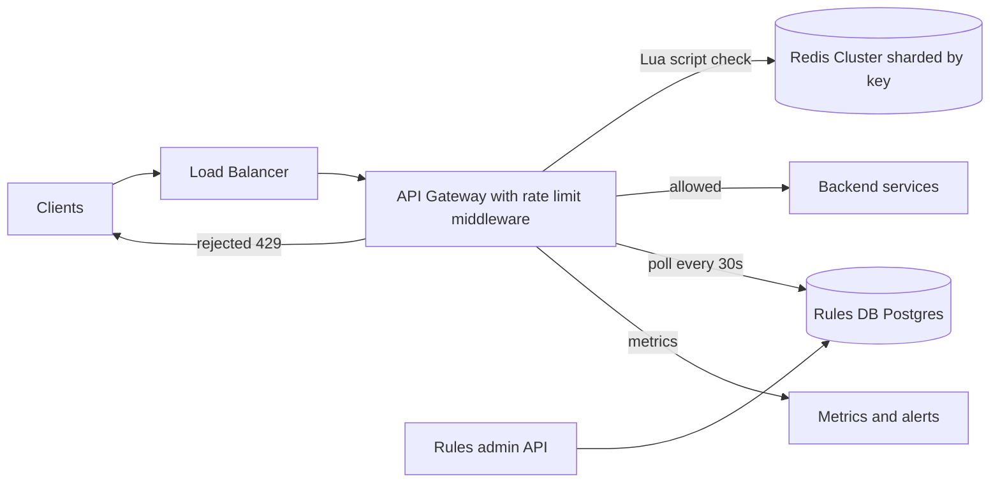
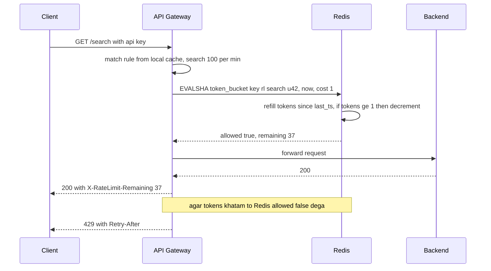

# Design a Rate Limiter

**Ek line me:** client (user, IP, API key) ek time window me kitni requests bhej sakta hai, uski limit; cross ho to `429 Too Many Requests`. Core challenge: **bahut saare servers ke beech ek counter fast aur sahi rakhna**, bina request slow kiye.

**Is question me interviewer kya check karta hai:** algorithm trade-offs, race condition (atomicity), latency budget, fail-open vs fail-closed.

---

## Step 1: Interviewer se ye confirm karo (3–5 min)

| Tum poochho | Typical jawab | Design pe asar |
|---|---|---|
| "Client ya server-side? Kahan?" | Server-side, API gateway | Gateway middleware |
| "Limit kis pe? User, IP, API key, endpoint?" | User/API key + endpoint; unauth pe IP | Key = `rule_id:client_id` |
| "Burst? (1 sec me 10, avg 100/min)" | Haan, thoda | Token bucket |
| "Kitna strict?" | Halki inaccuracy chalegi | Eventual sync / local cache possible |
| "Scale?" | 1M requests/sec, 100M users | Redis cluster sharded by key |
| "Multi-region?" | Haan, 3 regions | Per-region limits ya async sync |
| "Limiter down → roko ya jaane do?" | Usually jaane do | Fail-open default |

> **Bolo:** "Gateway pe distributed limiter: token bucket, state Redis, rules Postgres (gateway cache). Budget ~1–2ms per request."

## Step 2: Requirements

**Functional**
1. Admins per user / IP / API key / endpoint rules bana sakein ("100 req/min per user on /search"), bina deploy
2. Limit cross → `429` + `Retry-After`
3. Clients headers me remaining quota dekhein

**Out of scope:** L3/L4 DDoS (CDN/WAF), billing quotas, usage dashboard.

**Non-functional (priority order me)**
1. **Latency:** check p99 < 2 ms, warna har API slow
2. **Availability:** limiter down ho to bhi API chale (99.99%)
3. **Accuracy:** per key atomic; multi-region/hot key pe ~1–5% over-limit chalega
4. **Scale:** 1M QPS, ~300M keys, chhota state per key

**CAP choice:** AP. Redis/network partition pe allow (fail-open), exact count thoda chhodo. Exception: login/OTP pe fail-closed.

## Step 3: Estimation (sirf jo design badle)

- 1M req/sec → **1M Redis ops/sec** (ek Lua call per check). ~100K ops/sec per node → **~10–20 shards**.
- Keys: 100M users × ~3 rules = 300M; state 2 fields (~50 bytes) → **~15 GB**, Redis cluster me aaram se.
- Latency: gateway → Redis same AZ ~0.5ms → ek hi round trip me kaam.

> **Bolo:** "Ek Redis round trip → atomic Lua script. 1M QPS → ~15 shards, consistent hashing."

## Step 4: Core entities

- **Rule**: id, match (endpoint, method, client tier), key_type (user/ip/api_key), capacity, refill_rate, window
- **Bucket state** (Redis): key = `rl:{rule_id}:{client_id}`, fields `tokens`, `last_refill_ts`
- **Client identity**: user_id / api_key / IP (gateway auth se)

## Step 5: APIs

Limiter internal hai; client ko sirf headers dikhte hain.

```http
# Client ko response
HTTP/1.1 429 Too Many Requests
X-RateLimit-Limit: 100
X-RateLimit-Remaining: 0
X-RateLimit-Reset: 1760000060
Retry-After: 12

# Internal (gateway → limiter library / sidecar)
POST /check  {ruleKey, clientId, cost: 1}  → {allowed, remaining, resetAt}

# Admin
PUT  /rules/{ruleId}  {endpoint, keyType, capacity, refillPerSec}
```

> **Bolo:** "429 ke saath `Retry-After` do, taaki clients backoff karein aur retry storm na aaye."

## Step 6: High-level design

**Simple v1:** ek gateway, in-memory token buckets, rules config file me; teeno FRs pure. 1M QPS = bahut gateways → N gateways = N x limit → shared state (Redis). "Bina deploy" → rules DB me.



**FR mapping:** FR1 → Rules admin API + Postgres + gateway poll. FR2 + FR3 → gateway middleware + Redis.

**Har component kyun** (gateway, Redis: Step 10):
- **Rules DB, gateways poll:** kuch hazaar rules, rarely change; 30 sec poll + local cache → check path pe zero extra call.
- **Metrics:** kitne 429, kis rule se → galat rule turant pakdo.

## Step 7: Main flow: ek request check karna



## Step 8: Data model & DB choice

```text
Redis HASH  rl:{rule_id}:{client_id}
  tokens          = 37.5
  last_refill_ms  = 1760000048123
  EXPIRE          = 2 x window   (inactive keys khud saaf)

Rules table (Postgres)
  rules(id PK, endpoint, method, key_type, tier, capacity, refill_per_sec, enabled, updated_at)
```

- **Redis:** state chhota, hot, har request update; durability nahi chahiye (restart → kuch sec limit loose).
- **Postgres** rules ke liye: kam, rarely change, audit chahiye.

## Step 9: Deep dives (interviewer yahin pressure dalega)

### 9.1 Kaunsa algorithm? (comparison zaroor dikhao)

**NFR:** burst allow, chhota state (300M keys), ek round trip.

| Algorithm | Kaise | Plus | Minus |
|---|---|---|---|
| **Fixed window counter** | `INCR key:minute` | Simplest, 1 counter | Boundary pe 2x burst (59th + 0th sec) |
| **Sliding window log** | Timestamps sorted set me | Exact | Memory heavy |
| **Sliding window counter** | Current + previous window weighted | Kam memory, almost exact | Approximate |
| **Token bucket (chosen)** | Tokens refill, request 1 token khati | Burst, smooth avg, 2 fields | 2 params tune |
| **Leaky bucket** | Queue se fixed rate pe nikalo | Perfectly smooth output | Burst pe requests late |

> **Bolo:** "Token bucket: burst allowed, average control me, state sirf 2 numbers. Stripe aur AWS API Gateway bhi yahi use karte hain."

**Trade-off:** capacity + refill rate tune karne padte ↔ burst + smooth average 2 fields me.

### 9.2 Race condition: Redis + Lua se atomicity

**NFR:** per key accuracy, check p99 < 2 ms.

- Problem: do gateways ek saath `tokens = 1` padhein → dono allow.
- Fix: refill + check + decrement **ek Lua script** me; Redis single-threaded → atomic.
- Script logic:
  1. `tokens, last = HMGET key`
  2. `tokens = min(capacity, tokens + (now - last) * rate)`
  3. `tokens >= cost` → decrement, `allowed = 1`
  4. `HSET` + `PEXPIRE`, return `allowed, tokens`
- `now` Redis `TIME` se, gateway clocks se nahi (clock skew).
- `MULTI/WATCH` bhi chalta hai par contention pe retries; Lua better.

**Trade-off:** business logic Redis script me (deploy/versioning ka dhyan) ↔ ek round trip me atomic check.

### 9.3 Distributed consistency aur scale

**NFR:** 1M QPS aur multi-region, bina latency badhaye.

- **Sharding:** `rl:{rule}:{client}` pe consistent hashing; ek client = ek shard, no cross-shard coordination.
- **Hot key:** bada client (1 lakh req/sec) → shard hot. Fix: gateway pe **local token bucket**, central se 100 tokens ka batch. Thodi inaccuracy, Redis load 100x kam.
- **Multi-region:** har region ka Redis. Global limit baanto (US 50%, EU 30%, India 20%), ya local count + async sync har 1 sec (halka over-limit, bata do). Sync cross-region check nahi: 100ms+ per request.

**Trade-off:** ~1–5% over-limit ↔ Redis load 100x kam, no cross-region call.

### 9.4 Limiter khud fail ho to? Fail-open vs fail-closed

**NFR:** 99.99% API availability, limiter SPOF na bane.

- **Fail-open (default):** Redis timeout (> 5ms) → allow. Backend ki apni protection bhi (load shedding, circuit breaker).
- **Fail-closed:** `/login`, OTP, payment; brute force rokna zyada zaroori.
- **Strict timeout + circuit breaker**; breaker open → per-gateway approximate local limiter.

**Trade-off:** outage me abuse window ↔ poori API down nahi.

## Step 10: Decision table (kya chuna, kyun, kya nahi)

| Decision | Kyun chuna | Kya nahi chuna, kyun |
|---|---|---|
| **API Gateway middleware** | Ek jagah enforcement, bad traffic backend tak nahi | **Per-service library:** duplicate, out of sync. **Client-side:** untrusted. Sacrifice: critical path dependency |
| **Token bucket** | Burst + smooth average, 2 fields | **Fixed window:** boundary pe 2x burst. **Sliding log:** har request store. Sacrifice: 2 params tune |
| **Redis Cluster + Lua** | 1M checks/sec, sub-ms, atomic | **Postgres:** disk write per request. **Local memory:** N x limit. Sacrifice: ~10–20 shards, restart reset |
| **Rules in Postgres, poll + cache** | Bina deploy change, no extra call | **Hardcoded:** deploy per change. **Push config service:** extra service. Sacrifice: ~30 sec delay |
| **Fail-open, fail-closed for auth** | Availability; security endpoints safe | **Always fail-closed:** Redis blip = API down. Sacrifice: abuse window |
| **Per-region limits** | No cross-region latency | **Global sync counter:** 100ms+ per request. Sacrifice: global limit approximate |

## Step 11: Failures & bottlenecks

| Kya fail hua | Kya hoga | Handle kaise |
|---|---|---|
| Redis shard down | Us shard ke keys check nahi | Replica failover (Sentinel/Cluster); beech me fail-open + local limiter |
| Redis slow | Har API slow | 5ms timeout + circuit breaker |
| Hot client key | Ek shard overloaded | Local token batching, ya sub-keys me split |
| Rules DB down | Naye rule changes nahi | Last known rules memory me |
| Galat rule deploy | Genuine users ko 429 | Shadow mode pehle; 429 rate alert |
| 429 pe turant retry | Retry storm | `Retry-After` + SDK me exponential backoff with jitter |

## Step 12: "Isko aur better kaise karein" (end me khud bolo)

- **Shadow mode** for naye rules: pehle sirf log, phir enforce
- **Tiered limits:** free / pro / enterprise capacity, plan change pe turant update
- **Adaptive limiting:** backend latency badhe → limits tight (load shedding)
- **Cost-based limits:** heavy endpoint (export, search) = 10 tokens
- **Abuse detection:** baar baar 429 khane wale IPs WAF pe block

## Step 13: Interviewer ke likely follow-up sawal

- "Fixed window boundary problem?" → 0:59 pe 100 + 1:00 pe 100 = 2 sec me 200; sliding window / token bucket se fix
- "Lua ki jagah INCR + EXPIRE?" → fixed window ke liye theek; token bucket read-compute-write hai, atomic chahiye
- "Redis ki jagah local memory?" → N gateways = N x limit; sticky routing kuch had tak, scaling pe tootega
- "Clock skew?" → timestamp Redis `TIME` se
- "Distributed DoS?" → CDN/WAF pe IP reputation + L3/L4 protection bhi chahiye
- "Exact limit?" → central Redis + Lua, local batching band; latency + hot key cost accept
- **Senior signal:** limiter har request ke critical path pe: Redis slow → poori API ka p99 bigde. Isliye 5 ms timeout, circuit breaker, local fallback, Redis latency alert day one se.

## 2-minute recap (interview se pehle ye padho)

> Gateway middleware + token bucket (`tokens`, `last_refill`). Redis Cluster, key `rl:{rule}:{client}`. Refill + check + decrement ek Lua script me, time Redis `TIME` se. Rules Postgres, 30 sec poll. Reject → 429 + `Retry-After`. Redis down → fail-open + local fallback; login/OTP fail-closed. Multi-region: per-region quota. Hot clients: local token batching.

## Checklist

- [ ] Clarifying sawal (kahan lagana, kis key pe, burst, fail behavior) pooch sakta hoon
- [ ] 5 algorithms ka comparison aur token bucket ka choice justify kar sakta hoon
- [ ] Token bucket ka Lua logic step by step bata sakta hoon
- [ ] Race condition kyun hoti hai aur Lua kaise fix karta hai, samjha sakta hoon
- [ ] Fail-open vs fail-closed kab, ye bata sakta hoon
- [ ] 429, `Retry-After` aur rate limit headers explain kar sakta hoon
- [ ] Multi-region aur hot key ka approach bata sakta hoon
- [ ] Decision table ke 3 trade-offs bina dekhe bol sakta hoon
