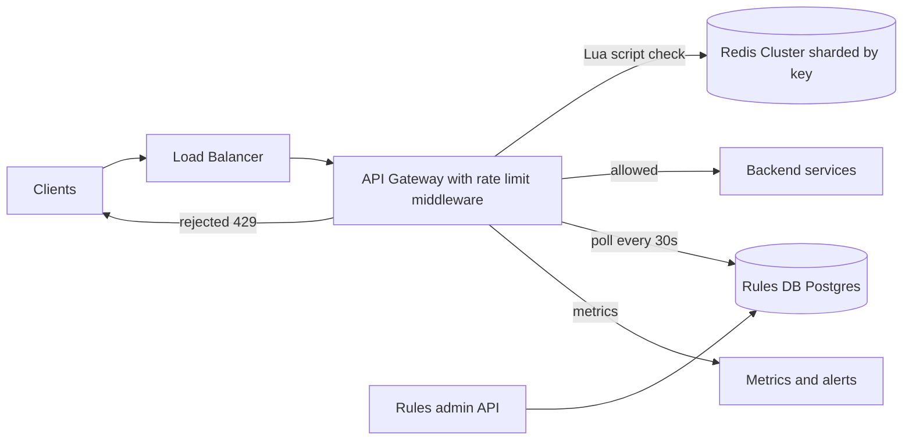
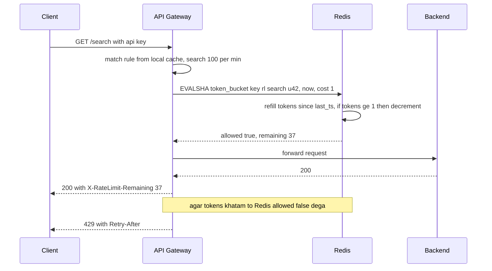

# Design a Rate Limiter

**Ek line me:** ek client (user, IP, API key) ek time window me kitni requests bhej sakta hai, ye limit lagao. Limit cross ho to `429 Too Many Requests`. Core challenge hai **bahut saare servers ke beech ek hi counter ko fast aur sahi rakhna**, bina har request ko slow kiye.

**Is question me interviewer kya check karta hai:** algorithms ka trade-off, distributed counter me race condition (atomicity), latency budget, aur jab limiter khud fail ho to kya karoge (fail-open vs fail-closed).

---

## Step 1: Interviewer se ye confirm karo (3–5 min)

Design shuru karne se pehle ye sawal poochho:

| Tum poochho | Typical jawab | Design pe asar |
|---|---|---|
| "Client-side ya server-side limiter? Kahan lagana hai?" | Server-side, API gateway pe | Gateway middleware, har service me alag code nahi |
| "Limit kis basis pe? User, IP, API key, endpoint?" | User/API key + endpoint, unauthenticated pe IP | Key = `rule_id:client_id` |
| "Burst allow karna hai? (1 sec me 10, par avg 100/min)" | Haan, thoda burst chalega | Token bucket |
| "Kitna strict? Thoda zyada pass ho jaye to chalega?" | Halki inaccuracy chalegi | Eventual sync / local cache ka option khulta hai |
| "Scale kitna?" | 1M requests/sec, 100M users | Redis cluster sharded by key |
| "Multi-region hai?" | Haan, 3 regions | Per-region limits ya async sync |
| "Limiter down ho to traffic rokna hai ya jaane dena?" | Usually jaane do | Fail-open default |

> **Bolo:** "Main ek distributed, server-side rate limiter design karunga jo API gateway pe lagega. Token bucket use karunga, state Redis me, aur rules Postgres me jinhe gateways local cache karenge. Latency budget har request pe ~1–2ms."

## Step 2: Requirements

**Functional**
1. Admins per user / IP / API key / endpoint rules bana sakein (jaise "100 req/min per user on /search"), bina deploy ke
2. Limit cross karne wale client ki request `429` + `Retry-After` se reject ho
3. Clients headers me apna remaining quota dekh sakein

**Out of scope:** L3/L4 DDoS protection (CDN/WAF ka kaam), monthly billing quotas, per-client usage dashboard.

**Non-functional (priority order me)**
1. **Latency:** limiter check p99 < 2 ms, warna har API slow hogi
2. **Availability:** limiter down ho to bhi API chalti rahe (99.99%)
3. **Accuracy:** per key atomic check; multi-region/hot key pe ~1–5% over-limit chalega
4. **Scale:** 1M QPS, ~300M keys, har key ka state chhota

**CAP choice:** availability (AP). Redis ya network partition pe request allow karna (fail-open) behtar hai, exact count thoda chhod dete hain. Exception: login/OTP pe fail-closed.

## Step 3: Estimation (sirf jo design badle)

- 1M req/sec → **1M Redis ops/sec** (har check ek Lua call). Ek Redis node ~100K ops/sec → **~10–20 shards** chahiye.
- Keys: 100M users × ~3 rules = 300M keys. Token bucket state = 2 fields (~50 bytes) → **~15 GB**. Redis cluster me aaram se.
- Latency: gateway → Redis same AZ me ~0.5ms. Isliye ek hi round trip me kaam hona chahiye.

> **Bolo:** "Har request pe Redis ka ek round trip hoga, isliye check ek atomic Lua script me karunga. 1M QPS ke liye Redis ko ~15 shards me consistent hashing se baantunga."

## Step 4: Core entities

- **Rule**: id, match (endpoint, method, client tier), key_type (user/ip/api_key), capacity, refill_rate, window
- **Bucket state** (Redis): key = `rl:{rule_id}:{client_id}`, fields `tokens`, `last_refill_ts`
- **Client identity**: user_id / api_key / IP (gateway auth se nikalta hai)

## Step 5: APIs

Limiter internal hai, client ko sirf response headers dikhte hain.

```http
# Client ko response
HTTP/1.1 429 Too Many Requests
X-RateLimit-Limit: 100
X-RateLimit-Remaining: 0
X-RateLimit-Reset: 1760000060
Retry-After: 12

# Internal (gateway → limiter library / sidecar)
POST /check  {ruleKey, clientId, cost: 1}  → {allowed, remaining, resetAt}

# Admin
PUT  /rules/{ruleId}  {endpoint, keyType, capacity, refillPerSec}
```

> **Bolo:** "429 ke saath `Retry-After` header zaroor do, taaki well-behaved clients backoff karein aur retry storm na aaye."

## Step 6: High-level design

**Simple v1 pehle:** ek gateway, uski memory me har key ka token bucket, rules ek config file me. Ek machine pe ye teeno FRs pura karta hai. Problem: 1M QPS ke liye bahut saare gateways chahiye, aur har gateway apna count rakhe to N gateways = N x limit. Isliye shared state (Redis) chahiye. "Bina deploy rules" ki wajah se rules file se DB me jaate hain.



**FR mapping:** FR1 → Rules admin API + Postgres + gateway poll. FR2 + FR3 → gateway middleware + Redis.

**Har component kyun:**
- **API Gateway middleware:** ek jagah limit, bad traffic backend tak nahi pahunchta. Simpler option (har service me library) me logic duplicate aur rules out of sync
- **Redis Cluster:** 1M checks/sec ka shared state, ~0.5 ms, Lua se atomic. Local memory (simpler) me count share nahi hota, Postgres counters har request pe disk write
- **Rules DB + admin API, gateways poll:** sirf kuch hazaar rules, rarely change. Har 30 sec poll + local cache, check path pe zero extra call. **Alag push-based config service nahi banayi**: 30 sec delay rules ke liye chalta hai
- **Metrics:** kitne 429 ja rahe hain, kis rule se. Galat rule ne genuine users ko block kiya to turant pata chale

## Step 7: Main flow: ek request check karna



## Step 8: Data model & DB choice

```text
Redis HASH  rl:{rule_id}:{client_id}
  tokens          = 37.5
  last_refill_ms  = 1760000048123
  EXPIRE          = 2 x window   (inactive keys khud saaf)

Rules table (Postgres)
  rules(id PK, endpoint, method, key_type, tier, capacity, refill_per_sec, enabled, updated_at)
```

- **Redis** kyunki state chhoti, hot, aur har request pe update hoti hai. Durability zaroori nahi. Redis restart pe counters reset ho jayein to bas kuch sec ke liye limit loose hogi.
- **Postgres** rules ke liye, kyunki rules kam hain, rarely change hote hain, aur audit chahiye.

## Step 9: Deep dives (interviewer yahin pressure dalega)

### 9.1 Kaunsa algorithm? (comparison zaroor dikhao)

**NFR:** burst allow, state chhota (300M keys), check ek round trip me.

| Algorithm | Kaise | Plus | Minus |
|---|---|---|---|
| **Fixed window counter** | `INCR key:minute`, limit se compare | Simplest, 1 counter | Window boundary pe 2x burst (59th sec + 0th sec) |
| **Sliding window log** | Har request ka timestamp sorted set me | Exact | Memory heavy, har request store |
| **Sliding window counter** | Current + previous window ka weighted count | Kam memory, almost exact | Approximate |
| **Token bucket (chosen)** | Bucket me tokens refill hote hain, request 1 token khati hai | Burst allow, smooth avg, 2 fields | Do params tune karne padte hain |
| **Leaky bucket** | Queue se fixed rate pe nikalo | Output perfectly smooth | Burst pe requests queue me late hoti hain |

> **Bolo:** "Main token bucket chununga. Isme burst allowed hai, average rate control me rehta hai, aur state sirf 2 numbers hai. Stripe aur AWS API Gateway bhi yahi use karte hain."

**Trade-off:** do params (capacity, refill rate) tune karne padte hain, badle me burst + smooth average 2 fields me.

### 9.2 Race condition: Redis + Lua se atomicity

**NFR:** per key accuracy, check p99 < 2 ms.

- Problem: do gateways ek saath `GET tokens = 1` padhein, dono allow kar dein. Limit toot gayi.
- Solution: poora "refill + check + decrement" **ek Lua script** me. Redis single-threaded hai, script atomically chalti hai.
- Script logic:
  1. `tokens, last = HMGET key`
  2. `tokens = min(capacity, tokens + (now - last) * rate)`
  3. `tokens >= cost` hai to decrement, `allowed = 1`
  4. `HSET` + `PEXPIRE`, return `allowed, tokens`
- `now` Redis ke `TIME` se lo, gateway clocks pe bharosa mat karo (clock skew).
- `MULTI/WATCH` bhi kaam karta hai par contention pe retries aate hain. Lua better.

**Trade-off:** business logic Redis script me rehta hai (deploy/versioning ka dhyan), badle me ek round trip me atomic check.

### 9.3 Distributed consistency aur scale

**NFR:** 1M QPS aur multi-region bina latency badhaye.

- **Sharding:** key `rl:{rule}:{client}` pe consistent hashing. Ek client ka saara state ek shard pe, isliye cross-shard coordination nahi.
- **Hot key:** ek bada client (1 lakh req/sec) ek shard ko hot kar dega. Fix: gateway pe **local token bucket** jo central bucket se batch me tokens leta hai (jaise 100 tokens ek saath). Thoda inaccuracy, par Redis load 100x kam.
- **Multi-region:** har region ka apna Redis. Do options:
  - Global limit ko regions me baant do (US 50%, EU 30%, India 20%). Simple, no cross-region call.
  - Ya local counting + async sync har 1 sec. Halka over-limit possible, interviewer ko bata do.
- Cross-region synchronous check mat karo, 100ms+ latency har request pe.

**Trade-off:** local batching aur per-region quota se ~1–5% over-limit possible, badle me Redis load 100x kam aur no cross-region call.

### 9.4 Limiter khud fail ho to? Fail-open vs fail-closed

**NFR:** 99.99% API availability, limiter SPOF na bane.

- **Fail-open (default):** Redis timeout (> 5ms) ho to request jaane do. Business chalta rahega. Backend ko apni capacity protection (load shedding, circuit breaker) bhi rakhni chahiye.
- **Fail-closed:** security-sensitive endpoints jaise `/login`, OTP, payment pe. Yahan brute force rokna zyada zaroori hai.
- Redis call pe **strict timeout + circuit breaker**. Redis slow ho to har request 5ms wait na kare, breaker open karke local fallback limiter (per-gateway, approximate) chala do.

**Trade-off:** fail-open me outage ke dauran abuse ka window khulta hai, badle me poori API down nahi hoti.

## Step 10: Decision table (kya chuna, kyun, kya nahi)

| Decision | Kyun chuna | Kya nahi chuna, kyun |
|---|---|---|
| **API Gateway middleware** | Ek jagah enforcement, bad traffic backend tak nahi aata | **Har service me library:** duplicate logic, rules out of sync. **Client-side:** bharosa nahi. Sacrifice: gateway critical path pe ek aur dependency |
| **Token bucket** | Burst + smooth average, 2 fields ka state | **Fixed window:** boundary pe 2x burst. **Sliding log:** har request store. Sacrifice: 2 params tune karne padte hain |
| **Redis Cluster + Lua** | 1M checks/sec, sub-ms, script atomic | **Postgres counters:** har request pe disk write. **Local memory only:** N gateways = N x limit. Sacrifice: ~10–20 shard cluster chalana, restart pe counters reset |
| **Rules in Postgres, gateways poll + cache** | Bina deploy rule change, check path pe extra call nahi | **Hardcoded rules:** har change pe deploy. **Push-based config service:** extra service. Sacrifice: rule change ~30 sec me lagta hai |
| **Fail-open default, fail-closed for auth** | Availability > strictness for normal APIs, security endpoints safe | **Hamesha fail-closed:** Redis blip = poori API down. Sacrifice: outage me abuse window |
| **Per-region limits** | No cross-region latency | **Global synchronous counter:** har request pe 100ms+. Sacrifice: global limit approximate |

## Step 11: Failures & bottlenecks

| Kya fail hua | Kya hoga | Handle kaise |
|---|---|---|
| Redis shard down | Us shard ke keys check nahi ho sakte | Replica failover (Sentinel/Cluster), beech me fail-open + local limiter |
| Redis slow | Har API slow | 5ms timeout + circuit breaker |
| Hot client key | Ek shard overloaded | Local token batching, ya key ko sub-keys me split |
| Rules DB down | Naye rule changes nahi aayenge | Gateway last known rules memory me rakhta hai |
| Galat rule deploy | Genuine users ko 429 | Shadow mode (sirf log, block nahi) pehle, phir enforce. 429 rate pe alert |
| Clients 429 pe turant retry | Retry storm | `Retry-After` header + client SDK me exponential backoff with jitter |

## Step 12: "Isko aur better kaise karein" (end me khud bolo)

> "Agar aur time ho to main ye improve karunga:"
- **Shadow mode** for naye rules: pehle sirf log karo, impact dekho, phir enforce
- **Tiered limits:** free / pro / enterprise plan ke hisaab se alag capacity, plan change pe turant update
- **Adaptive limiting:** backend latency badhe to limits automatically tight karo (load shedding)
- **Cost-based limits:** heavy endpoint (export, search) ek request me 10 tokens khaye
- **Abuse detection:** baar baar 429 khane wale IPs ko WAF level pe block

## Step 13: Interviewer ke likely follow-up sawal

- "Fixed window ka boundary problem kya hai?" → 0:59 pe 100 aur 1:00 pe 100, yaani 2 sec me 200. Sliding window ya token bucket se fix
- "Lua ki jagah INCR + EXPIRE kyun nahi?" → fixed window ke liye chalega, par token bucket me read-compute-write hai jo atomic hona chahiye
- "Redis ki jagah local memory?" → har gateway apna count rakhega, N gateways = N x limit. Sticky routing se kuch had tak chalega, par scaling pe toot jayega
- "Clock skew ka kya?" → timestamp Redis ke `TIME` se lo, gateway se nahi
- "Distributed DoS?" → rate limiter is akela kaafi nahi. CDN/WAF level pe IP reputation aur L3/L4 protection chahiye
- "Exact limit chahiye, ek bhi extra nahi?" → central Redis + Lua, local batching band. Latency aur hot key ka cost accept karo
- **Senior signal:** khud bolo ki limiter ab har request ke critical path pe hai: Redis slow hua to poori API ka p99 bigdega. Isliye strict 5 ms timeout, circuit breaker, local fallback, aur Redis latency pe alert pehle din se.

## 2-minute recap (interview se pehle ye padho)

> Rate limiter API gateway pe middleware ki tarah lagta hai. Algorithm token bucket: capacity + refill rate, burst allowed, state sirf `tokens` aur `last_refill`. State Redis Cluster me, key `rl:{rule}:{client}`, consistent hashing se shard. Refill + check + decrement ek Lua script me, taaki race condition na ho, aur time Redis `TIME` se. Rules Postgres me, gateways har 30 sec poll karke local cache karte hain (alag config service nahi). Reject pe 429 + `Retry-After` + `X-RateLimit-*` headers. Redis down ho to fail-open with local fallback, par login/OTP pe fail-closed. Multi-region me per-region quota, cross-region sync check nahi. Hot clients ke liye local token batching.

## Checklist

- [ ] Clarifying sawal (kahan lagana, kis key pe, burst, fail behavior) pooch sakta hoon
- [ ] 5 algorithms ka comparison aur token bucket ka choice justify kar sakta hoon
- [ ] Token bucket ka Lua logic step by step bata sakta hoon
- [ ] Race condition kyun hoti hai aur Lua kaise fix karta hai, samjha sakta hoon
- [ ] Fail-open vs fail-closed kab, ye bata sakta hoon
- [ ] 429, `Retry-After` aur rate limit headers explain kar sakta hoon
- [ ] Multi-region aur hot key ka approach bata sakta hoon
- [ ] Decision table ke 3 trade-offs bina dekhe bol sakta hoon
