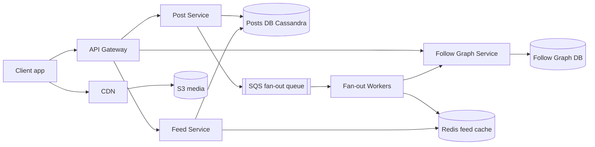
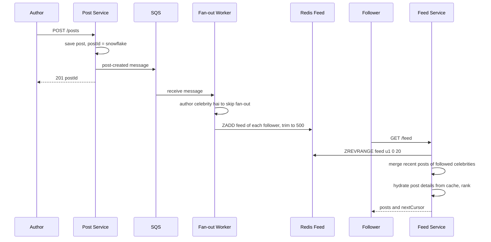
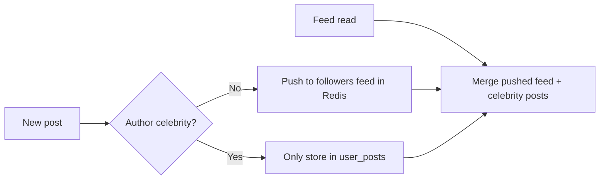

# Design News Feed (Twitter / Facebook)

**Ek line me:** user post karta hai, uske followers ki home feed me wo post dikhti hai, newest ya ranked order me. Core challenge hai **feed ko fast load karna** jab ek user 500 logon ko follow karta hai, aur **celebrity (10 crore followers) ki post ko sab tak pahunchana** bina system tode.

**Is question me interviewer kya check karta hai:** fan-out on write vs fan-out on read ka trade-off, celebrity problem ka hybrid solution, feed cache design, aur cursor pagination.

---

## Step 1: Interviewer se ye confirm karo (3–5 min)

Design shuru karne se pehle ye sawal poochho:

| Tum poochho | Typical jawab | Design pe asar |
|---|---|---|
| "Follow one-way hai (Twitter) ya friendship two-way (Facebook)?" | One-way follow | Follower graph asymmetric, celebrities possible |
| "Feed chronological ya ranked?" | Pehle chronological, ranking briefly | Ranking ko alag layer rakhenge |
| "Scale? DAU, posts/day, avg follows?" | 300M DAU, 50M posts/day, avg 200 follows | Fan-out ka load calculate karna padega |
| "Max followers? Celebrities hain?" | Haan, kuch accounts ke 100M+ followers | Hybrid fan-out zaroori |
| "Post me media? Images/videos?" | Haan | S3 + CDN, feed me sirf URL |
| "Feed kitni fresh? Post ke kitni der baad dikhe?" | Kuch seconds chalega | Async fan-out via queue theek hai |
| "Likes, comments, notifications scope me?" | Counts dikhane hain, baaki nahi | Counters alag service, out of scope |

> **Bolo:** "Main 2 core flows design karunga: create post aur get home feed. Feed read bahut zyada hai, isliye feed precompute karke Redis me rakhunga, aur celebrities ke liye hybrid model lunga."

## Step 2: Requirements

**Functional**
1. Users text + media post kar sakein
2. Users doosre users ko follow/unfollow kar sakein
3. Users home feed dekh sakein: followed users ki posts, newest first, infinite scroll

**Out of scope:** likes/comments ka write path, notifications, search, ML ranking ka detail.

**Non-functional (priority order me)**
1. **Latency:** feed load p99 < 200 ms
2. **Availability:** feed reads 99.99%, thoda stale chalega
3. **Freshness:** post p95 ~5 sec me followers ki feed me (eventual)
4. **Scale:** 300M DAU, ~35K feed reads/sec vs 600 posts/sec

**CAP choice:** availability (AP). Feed me kisi post ka 5 sec late dikhna chalega, feed ka na khulna nahi chalega.

## Step 3: Estimation (sirf jo design badle)

- Posts: 50M/day ≈ **600 posts/sec**, peak ~3K/sec.
- Feed reads: 300M DAU × 10 opens ≈ 3B/day ≈ **35K reads/sec**, peak ~150K. Feed har baar compute nahi kar sakte.
- Fan-out writes: 600 posts/sec × 200 followers avg = **120K feed inserts/sec**. Manageable.
- Queue: sirf 600 post events/sec (peak 3K). Bade authors ki fan-out 1K-follower batches me todo, tab bhi kuch hazaar msgs/sec. Ye Kafka-level throughput nahi hai.
- Celebrity: ek post × 100M followers = 100M writes. **Yahi asli problem hai.**
- Feed cache: 300M users × 500 post ids × 8 bytes ≈ **1.2 TB** Redis. Sirf active users ka rakho.

> **Bolo:** "Average fan-out manageable hai, 120K writes/sec. Problem celebrities hain, jahan ek post 10 crore writes ban jaati hai. Isliye hybrid chahiye."

## Step 4: Core entities

- **User**: id, name, follower_count, is_celebrity
- **Post**: post_id (Snowflake, time-sortable), author_id, text, media_urls, created_at
- **Follow**: follower_id, followee_id, created_at
- **Feed entry** (cache): user_id → list of post_ids sorted by time

## Step 5: APIs

```http
POST /posts                {text, mediaIds[]}          → {postId}
POST /media/upload-url     {contentType}               → {uploadUrl, mediaId}
POST /users/{id}/follow                                → 204
DELETE /users/{id}/follow                              → 204
GET  /feed?cursor=<lastPostId>&limit=20                → {posts[], nextCursor}
```

> **Bolo:** "Pagination cursor based hai, offset nahi. Offset me naye posts aane pe duplicates ya skip ho jaate hain, aur bade offset slow hote hain."

## Step 6: High-level design

**Simple v1 pehle:** ek service + Postgres (`posts`, `follows`). Feed = pull query: followed authors ki latest posts merge karo. Teeno FRs pure. Numbers isse todte hain: 35K–150K feed reads/sec × 200 authors ka merge → precomputed Redis feed; 120K feed inserts/sec → async queue + workers; 100M-follower celebrities → hybrid; 50M posts/day saalon tak → Cassandra.



**FR mapping:** FR1 → Post Service + Cassandra + S3/CDN. FR2 → Follow Graph Service. FR3 → Feed Service + Redis feed (queue + Fan-out Workers usse bharte hain).

**Har component kyun:**
- **Post Service:** post save karke queue me event daalta hai, fan-out ka wait nahi. Sync fan-out (simpler) me 10K followers wali post me seconds lagte
- **SQS + Fan-out Workers:** ~600 events/sec, kaam hai "task baanto, retry karo, fail ho to DLQ". Managed queue isme kaafi hai. **Kafka nahi**, kyunki abhi ek hi consumer hai aur replay ki zaroorat nahi
- **Follow Graph Service:** dono directions ki tables (follows + followers) consistent likhni hain, aur Feed + Fan-out dono isse padhte hain.
- **Redis feed cache:** 35K–150K reads/sec, p99 < 200 ms. Har read pe 200 authors ka DB merge (simpler) nahi chalega
- **Feed Service:** Redis se ids, celebrity posts merge, post details hydrate, rank, return
- **S3 + CDN:** images/videos seedhe client → S3 (pre-signed URL), serve CDN se. App servers se media (simpler) bandwidth kha jaata

## Step 7: Main flow: post karna aur feed padhna



## Step 8: Data model & DB choice

```sql
posts(post_id PK, author_id, text, media_urls, created_at)
  -- Cassandra, partition by post_id. Extra table user_posts(author_id, post_id DESC) for profile + celebrity pull
follows(follower_id, followee_id, created_at)   -- PK(follower_id, followee_id)
followers(followee_id, follower_id)             -- reverse index, fan-out ke liye
```

```text
Redis ZSET       feed:{user_id}  → member = post_id, score = post_id (time)  max 500
Redis HASH       post:{post_id}  → post details cache
```

- **Posts → Cassandra:** write-heavy, simple lookups, horizontal scale. `user_posts` table partition by author_id, cluster by post_id desc.
- **Follow graph → sharded MySQL/Cassandra** with dono directions ki tables. Graph DB ki zaroorat nahi, sirf 1-hop queries hain.
- **Feed → Redis**, kyunki ye derived data hai. Kho jaye to rebuild ho sakta hai.

## Step 9: Deep dives (interviewer yahin pressure dalega)

### 9.1 Fan-out on write vs fan-out on read

**NFR:** feed p99 < 200 ms bina write path ko todey.

| | Fan-out on write (push) | Fan-out on read (pull) |
|---|---|---|
| Kaise | Post hote hi har follower ki feed me daal do | Feed khulne pe followed users ki posts fetch + merge |
| Read | Super fast, ek Redis read | Slow, 200 users ki posts merge |
| Write | Heavy, celebrity pe 100M writes | Halka, sirf post save |
| Waste | Inactive users ki feed bhi banti hai | Koi waste nahi |
| Best for | Normal users | Celebrities |

**Trade-off:** push me storage aur write cost (inactive users ki feed bhi), badle me ek Redis read me feed.

### 9.2 Celebrity problem: hybrid model

**NFR:** freshness ~5 sec, celebrity post pe bhi.

- Normal users (< 10K followers): **push**. Fan-out workers followers ki feed me likhte hain.
- Celebrities (> 10K–100K followers, `is_celebrity` flag): **pull**. Unki post kisi ki feed me nahi jaati.
- Feed read pe: Redis feed (pushed posts) + user jin celebrities ko follow karta hai unki latest posts (`user_posts` se, heavy cached) → merge by time.
- Inactive users (30 din se login nahi) ko fan-out skip. Wapas aayein to feed pull se rebuild.



> **Bolo:** "Hybrid me normal users ke liye push, celebrities ke liye pull. Ek user zyada se zyada kuch dozen celebrities follow karta hai, isliye read time pe merge sasta hai."

**Trade-off:** feed read thoda complex aur slow (merge step), badle me 100M writes ka explosion nahi.

### 9.3 Feed cache aur hydration

**NFR:** latency + Redis memory (~1.2 TB) control me.

- Redis feed me sirf **post_ids** rakho, poora post nahi. Post edit/delete pe sirf ek jagah update.
- Hydration: ids ke liye `MGET post:{id}` post cache se. Miss pe Cassandra.
- Like/comment counts alag counter service se, short TTL cache.
- Feed size cap 500. Usse purani posts chahiye to pull model se DB se.
- Unfollow: async job feed se us author ki posts hata de. Ya read time pe filter (cheap).

**Trade-off:** har read pe hydration ka ek extra `MGET`, badle me 500x kam memory aur edit/delete ek jagah.

### 9.4 Pagination aur ranking

**NFR:** infinite scroll bina duplicates, latency stable.

- **Cursor:** `nextCursor = last post_id`. Next request: `post_id < cursor`. Snowflake ids time-sortable hain, isliye ye stable hai, naye posts aane se page shift nahi hota.
- **Ranking (briefly):** pehle candidates nikalo (latest ~500), phir ek ranking service score de: recency, author se interaction, likes velocity, media type. Top 20 return. ML model ka detail out of scope bol do.
- Naye posts ke liye "N new posts" banner: client har 30 sec poll ya SSE.

**Trade-off:** cursor se "page 7 pe jump" nahi hota, badle me stable aur fast pages.

## Step 10: Decision table (kya chuna, kyun, kya nahi)

| Decision | Kyun chuna | Kya nahi chuna, kyun |
|---|---|---|
| **Hybrid fan-out** | Normal users ke liye fast read, celebrities ke liye write explosion nahi | **Pure push:** celebrity post = 100M writes, minutes lag. **Pure pull:** har feed open pe 200 queries. Sacrifice: read path pe merge logic |
| **SQS async fan-out** | ~600 events/sec, retries + DLQ built-in, workers queue depth pe autoscale | **Kafka:** ek consumer, replay nahi chahiye, extra ops. **Sync fan-out:** post me seconds. Sacrifice: per-author ordering aur replay nahi |
| **Redis feed with post_ids only** | 35K+ reads/sec, chhota memory, edit/delete ek jagah | **Full post in feed:** 500x duplicate data. **DB se pull:** p99 toot jaata. Sacrifice: ~1.2 TB RAM ka cost, hydration step |
| **Cassandra for posts** | Write-heavy, time-ordered per author, horizontal scale | **Single Postgres:** 50M posts/day saalon tak, manual sharding. Sacrifice: joins/transactions nahi |
| **Cursor pagination** | Stable pages, fast `post_id < cursor` | **Offset:** naye posts pe duplicates, bade offset slow. Sacrifice: random page jump nahi |
| **S3 + CDN for media** | Bandwidth app servers pe nahi, global low latency | **Media DB me ya app servers se:** costly aur slow. Sacrifice: CDN cost, URL signing |

## Step 11: Failures & bottlenecks

| Kya fail hua | Kya hoga | Handle kaise |
|---|---|---|
| Fan-out workers lag | Posts feeds me late | Queue depth pe workers autoscale, oldest-message age pe alert |
| Redis feed shard down | Kuch users ki feed khali | Replica failover, ya pull model se feed rebuild on the fly |
| Celebrity post viral | Unki `user_posts` row pe heavy reads | Celebrity recent posts ka local/Redis cache, short TTL |
| Duplicate message (at-least-once) | Feed me same post do baar | ZSET with post_id as member, duplicate apne aap ignore |
| Post delete | Feeds me abhi bhi id hai | Hydration pe deleted post skip, async cleanup |
| Hot user ka feed key | Ek Redis node pe load | Sharding by user_id, read replicas |

## Step 12: "Isko aur better kaise karein" (end me khud bolo)

> "Agar aur time ho to main ye improve karunga:"
- **ML ranking** with feature store, aur A/B testing framework
- **Real-time "new posts" push** via SSE/WebSocket active users ke liye
- **Kafka tab:** jab moderation, search indexing, notifications bhi post-created padhein (3+ consumers, replay chahiye), tab SQS ko Kafka stream se replace karo

## Step 13: Interviewer ke likely follow-up sawal

- "Celebrity threshold kaise decide karoge?" → follower count (~10K–100K), plus kitna post karta hai. Config se tune
- "User ne naya follow kiya, uski purani posts feed me kaise aayengi?" → follow pe async job uske last 20 posts feed me merge kare
- "Feed cache poora kho gaya to?" → derived data hai. Pull model se on-demand rebuild, gradually warm
- "Ranking ke saath cursor kaise?" → ranked candidate list ko session ke liye cache karo, cursor = position/score
- "Ek post ke likes count kaise?" → alag counter service, Redis INCR + periodic DB flush
- **Senior signal:** khud bolo ki peak pe fan-out 3K posts/sec × 200 = 600K Redis writes/sec ho jaata hai. Queue lag badha to 5 sec freshness tootega: oldest-message age pe alert, inactive users skip, aur active users ki feeds pehle.

## 2-minute recap (interview se pehle ye padho)

> News feed read-heavy hai, isliye feed precompute karke Redis me rakhte hain (sirf post_ids, max 500). Post Service post Cassandra me save karke SQS me event daalta hai (sirf ~600/sec aur ek consumer, isliye Kafka nahi). Fan-out workers followers ki list Follow Graph se lekar unki Redis feeds me post_id push karte hain. Celebrities ke liye fan-out nahi: unki posts read time pe pull karke merge hoti hain (hybrid). Inactive users ko fan-out skip. Feed Service ids lekar post cache se hydrate karta hai, optionally rank karta hai, aur cursor (last post_id, Snowflake) ke saath return karta hai. Media pre-signed URL se S3 me, CDN se serve.

## Checklist

- [ ] Clarifying sawal (follow type, ranking, celebrities, media) pooch sakta hoon
- [ ] Fan-out on write vs read ka table bina dekhe bana sakta hoon
- [ ] Celebrity problem aur hybrid model samjha sakta hoon
- [ ] HLD diagram 5 min me bana sakta hoon
- [ ] Feed cache me sirf ids kyun, aur hydration kaise hota hai, bata sakta hoon
- [ ] Cursor pagination offset se better kyun hai, explain kar sakta hoon
- [ ] Ranking ka basic flow (candidates → score → top N) bata sakta hoon
- [ ] Decision table ke 3 trade-offs bina dekhe bol sakta hoon
