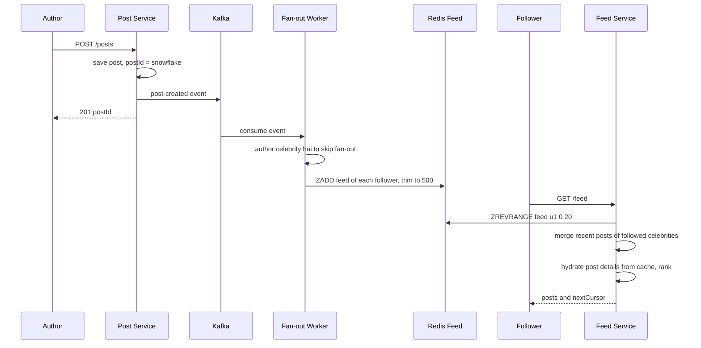
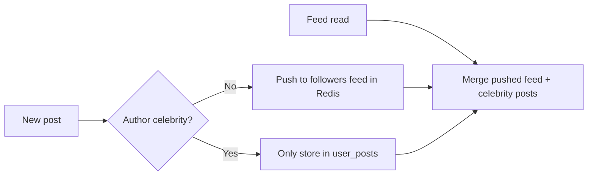

# Design News Feed (Twitter / Facebook)

**Ek line me:** user post karta hai, uske followers ki home feed me wo post dikhti hai, newest ya ranked order me. Core challenge hai **feed ko fast load karna** jab ek user 500 logon ko follow karta hai, aur **celebrity (10 crore followers) ki post ko sab tak pahunchana** bina system tode.

**Is question me interviewer kya check karta hai:** fan-out on write vs fan-out on read ka trade-off, celebrity problem ka hybrid solution, feed cache design, aur cursor pagination.

---

## Step 1: Interviewer se ye confirm karo (3–5 min)

Design shuru karne se pehle ye sawal poochho:

| Tum poochho | Typical jawab | Design pe asar |
|---|---|---|
| "Follow one-way hai (Twitter) ya friendship two-way (Facebook)?" | One-way follow | Follower graph asymmetric, celebrities possible |
| "Feed chronological ya ranked?" | Pehle chronological, ranking briefly | Ranking ko alag layer rakhenge |
| "Scale? DAU, posts/day, avg follows?" | 300M DAU, 50M posts/day, avg 200 follows | Fan-out ka load calculate karna padega |
| "Max followers? Celebrities hain?" | Haan, kuch accounts ke 100M+ followers | Hybrid fan-out zaroori |
| "Post me media? Images/videos?" | Haan | S3 + CDN, feed me sirf URL |
| "Feed kitni fresh? Post ke kitni der baad dikhe?" | Kuch seconds chalega | Async fan-out via Kafka theek hai |
| "Likes, comments, notifications scope me?" | Counts dikhane hain, baaki nahi | Counters alag service, out of scope |

> **Bolo:** "Main 2 core flows design karunga: create post aur get home feed. Feed read bahut zyada hai, isliye feed precompute karke Redis me rakhunga, aur celebrities ke liye hybrid model lunga."

## Step 2: Requirements

**Functional**
1. User text + media post kar sake
2. User doosre users ko follow/unfollow kar sake
3. Home feed: followed users ki posts, newest first (ya ranked)
4. Infinite scroll pagination

**Non-functional**
- **Low latency:** feed load < 200ms
- **High availability:** feed hamesha khule, thoda stale chalega (eventual consistency)
- **Scale:** read-heavy, feed reads >> post writes
- **Freshness:** post ~5 sec me followers ki feed me

## Step 3: Estimation (sirf jo design badle)

- Posts: 50M/day ≈ **600 posts/sec**, peak ~3K/sec.
- Feed reads: 300M DAU × 10 opens ≈ 3B/day ≈ **35K reads/sec**, peak ~150K. Feed har baar compute nahi kar sakte.
- Fan-out writes: 600 posts/sec × 200 followers avg = **120K feed inserts/sec**. Manageable.
- Celebrity: ek post × 100M followers = 100M writes. **Yahi asli problem hai.**
- Feed cache: 300M users × 500 post ids × 8 bytes ≈ **1.2 TB** Redis. Sirf active users ka rakho.

> **Bolo:** "Average fan-out manageable hai, 120K writes/sec. Problem celebrities hain, jahan ek post 10 crore writes ban jaati hai. Isliye hybrid chahiye."

## Step 4: Core entities

- **User**: id, name, follower_count, is_celebrity
- **Post**: post_id (Snowflake, time-sortable), author_id, text, media_urls, created_at
- **Follow**: follower_id, followee_id, created_at
- **Feed entry** (cache): user_id → list of post_ids sorted by time

## Step 5: APIs

```http
POST /posts                {text, mediaIds[]}          → {postId}
POST /media/upload-url     {contentType}               → {uploadUrl, mediaId}
POST /users/{id}/follow                                → 204
DELETE /users/{id}/follow                              → 204
GET  /feed?cursor=<lastPostId>&limit=20                → {posts[], nextCursor}
```

> **Bolo:** "Pagination cursor based hai, offset nahi. Offset me naye posts aane pe duplicates ya skip ho jaate hain, aur bade offset slow hote hain."

## Step 6: High-level design


**Har component kyun:**
- **Post Service:** post save karta hai, Kafka me event daalta hai. Fan-out ka wait nahi karta
- **Kafka + Fan-out Workers:** async fan-out. Followers ki list lo, har follower ki Redis feed me post_id push karo
- **Follow Graph Service:** "X ke followers kaun" aur "X kisko follow karta hai" dono fast chahiye
- **Redis feed cache:** har user ki precomputed feed (latest ~500 post_ids)
- **Feed Service:** Redis se ids, celebrity posts merge, post details hydrate, rank, return
- **S3 + CDN:** images/videos seedhe client → S3 (pre-signed URL), serve CDN se

## Step 7: Main flow: post karna aur feed padhna



## Step 8: Data model & DB choice

```sql
posts(post_id PK, author_id, text, media_urls, created_at)
  -- Cassandra, partition by post_id. Extra table user_posts(author_id, post_id DESC) for profile + celebrity pull
follows(follower_id, followee_id, created_at)   -- PK(follower_id, followee_id)
followers(followee_id, follower_id)             -- reverse index, fan-out ke liye
```

```text
Redis ZSET       feed:{user_id}  → member = post_id, score = post_id (time)  max 500
Redis HASH       post:{post_id}  → post details cache
```

- **Posts → Cassandra:** write-heavy, simple lookups, horizontal scale. `user_posts` table partition by author_id, cluster by post_id desc.
- **Follow graph → sharded MySQL/Cassandra** with dono directions ki tables. Graph DB ki zaroorat nahi, sirf 1-hop queries hain.
- **Feed → Redis**, kyunki ye derived data hai. Kho jaye to rebuild ho sakta hai.

## Step 9: Deep dives (interviewer yahin pressure dalega)

### 9.1 Fan-out on write vs fan-out on read

| | Fan-out on write (push) | Fan-out on read (pull) |
|---|---|---|
| Kaise | Post hote hi har follower ki feed me daal do | Feed khulne pe followed users ki posts fetch + merge |
| Read | Super fast, ek Redis read | Slow, 200 users ki posts merge |
| Write | Heavy, celebrity pe 100M writes | Halka, sirf post save |
| Waste | Inactive users ki feed bhi banti hai | Koi waste nahi |
| Best for | Normal users | Celebrities |

### 9.2 Celebrity problem: hybrid model

- Normal users (< 10K followers): **push**. Fan-out workers followers ki feed me likhte hain.
- Celebrities (> 10K–100K followers, `is_celebrity` flag): **pull**. Unki post kisi ki feed me nahi jaati.
- Feed read pe: Redis feed (pushed posts) + user jin celebrities ko follow karta hai unki latest posts (`user_posts` se, heavy cached) → merge by time.
- Inactive users (30 din se login nahi) ko fan-out skip. Wapas aayein to feed pull se rebuild.



> **Bolo:** "Hybrid me normal users ke liye push, celebrities ke liye pull. Ek user zyada se zyada kuch dozen celebrities follow karta hai, isliye read time pe merge sasta hai."

### 9.3 Feed cache aur hydration

- Redis feed me sirf **post_ids** rakho, poora post nahi. Post edit/delete pe sirf ek jagah update.
- Hydration: ids ke liye `MGET post:{id}` post cache se. Miss pe Cassandra.
- Like/comment counts alag counter service se, short TTL cache.
- Feed size cap 500. Usse purani posts chahiye to pull model se DB se.
- Unfollow: async job feed se us author ki posts hata de. Ya read time pe filter (cheap).

### 9.4 Pagination aur ranking

- **Cursor:** `nextCursor = last post_id`. Next request: `post_id < cursor`. Snowflake ids time-sortable hain, isliye ye stable hai, naye posts aane se page shift nahi hota.
- **Ranking (briefly):** pehle candidates nikalo (latest ~500), phir ek ranking service score de: recency, author se interaction, likes velocity, media type. Top 20 return. ML model ka detail out of scope bol do.
- Naye posts ke liye "N new posts" banner: client har 30 sec poll ya SSE.

## Step 10: Decision table (kya chuna, kyun, kya nahi)

| Decision | Kyun chuna | Kya nahi chuna, kyun |
|---|---|---|
| **Hybrid fan-out** | Normal users ke liye fast read, celebrities ke liye write explosion nahi | **Pure push:** celebrity post = 100M writes, minutes lag. **Pure pull:** har feed open pe 200 queries, slow |
| **Kafka async fan-out** | Post API fast, workers scale kar sakte, retry possible | **Sync fan-out in Post API:** post karne me seconds lagenge |
| **Redis feed with post_ids only** | Chhota memory, edit/delete ek jagah | **Full post in feed:** 500x duplicate data, edit pe sab jagah update |
| **Cassandra for posts** | Write-heavy, time-ordered per author, horizontal scale | **Single Postgres:** 50M posts/day aur saalon ka data, sharding manually karni padegi |
| **Cursor pagination** | Stable pages, fast `post_id < cursor` | **Offset:** naye posts pe duplicates, bade offset slow |
| **S3 + CDN for media** | Bandwidth app servers pe nahi, global low latency | **Media DB me ya app servers se:** costly aur slow |

## Step 11: Failures & bottlenecks

| Kya fail hua | Kya hoga | Handle kaise |
|---|---|---|
| Fan-out workers lag | Posts feeds me late | Kafka partitions + workers scale, lag pe alert |
| Redis feed shard down | Kuch users ki feed khali | Replica failover, ya pull model se feed rebuild on the fly |
| Celebrity post viral | Unki `user_posts` row pe heavy reads | Celebrity recent posts ka local/Redis cache, short TTL |
| Duplicate Kafka event | Feed me same post do baar | ZSET with post_id as member, duplicate apne aap ignore |
| Post delete | Feeds me abhi bhi id hai | Hydration pe deleted post skip, async cleanup |
| Hot user ka feed key | Ek Redis node pe load | Sharding by user_id, read replicas |

## Step 12: "Isko aur better kaise karein" (end me khud bolo)

> "Agar aur time ho to main ye improve karunga:"
- **ML ranking** with feature store, aur A/B testing framework
- **Real-time "new posts" push** via SSE/WebSocket active users ke liye
- **Inactive users** ki feed cache se evict, login pe lazy rebuild, Redis memory 50%+ bachegi
- **Multi-region:** feed cache har region me, posts async replicate
- **Content moderation** pipeline Kafka pe, spam/abuse post fan-out se pehle filter
- Celebrity threshold ko dynamic banana (followers + post frequency)

## Step 13: Interviewer ke likely follow-up sawal

- "Celebrity threshold kaise decide karoge?" → follower count (~10K–100K), plus kitna post karta hai. Config se tune
- "User ne naya follow kiya, uski purani posts feed me kaise aayengi?" → follow pe async job uske last 20 posts feed me merge kare
- "Feed cache poora kho gaya to?" → derived data hai. Pull model se on-demand rebuild, gradually warm
- "Ranking ke saath cursor kaise?" → ranked candidate list ko session ke liye cache karo, cursor = position/score
- "Facebook (two-way friends) me kya badlega?" → friend limit 5000 hai, isliye celebrity problem kam. Pages ke liye pull
- "Ek post ke likes count kaise?" → alag counter service, Redis INCR + periodic DB flush

## 2-minute recap (interview se pehle ye padho)

> News feed read-heavy hai, isliye feed precompute karke Redis me rakhte hain (sirf post_ids, max 500). Post Service post Cassandra me save karke Kafka me event daalta hai. Fan-out workers followers ki list Follow Graph se lekar unki Redis feeds me post_id push karte hain. Celebrities ke liye fan-out nahi: unki posts read time pe pull karke merge hoti hain (hybrid). Inactive users ko fan-out skip. Feed Service ids lekar post cache se hydrate karta hai, optionally rank karta hai, aur cursor (last post_id, Snowflake) ke saath return karta hai. Media pre-signed URL se S3 me, CDN se serve.

## Checklist

- [ ] Clarifying sawal (follow type, ranking, celebrities, media) pooch sakta hoon
- [ ] Fan-out on write vs read ka table bina dekhe bana sakta hoon
- [ ] Celebrity problem aur hybrid model samjha sakta hoon
- [ ] HLD diagram 5 min me bana sakta hoon
- [ ] Feed cache me sirf ids kyun, aur hydration kaise hota hai, bata sakta hoon
- [ ] Cursor pagination offset se better kyun hai, explain kar sakta hoon
- [ ] Ranking ka basic flow (candidates → score → top N) bata sakta hoon
- [ ] Decision table ke 3 trade-offs bina dekhe bol sakta hoon
