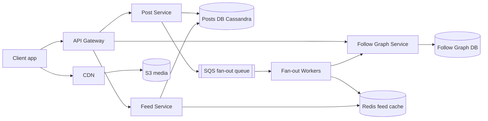
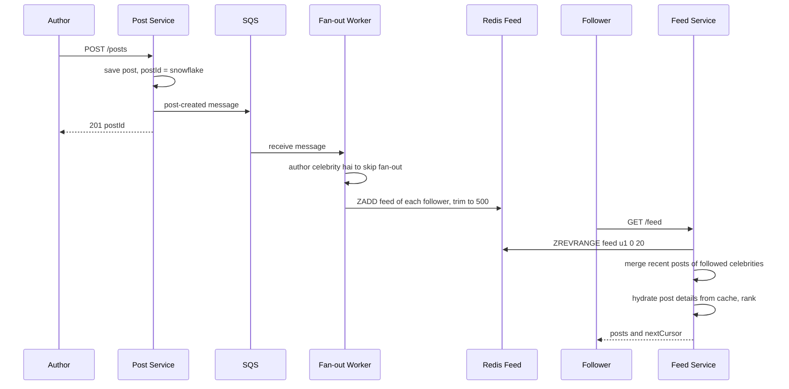
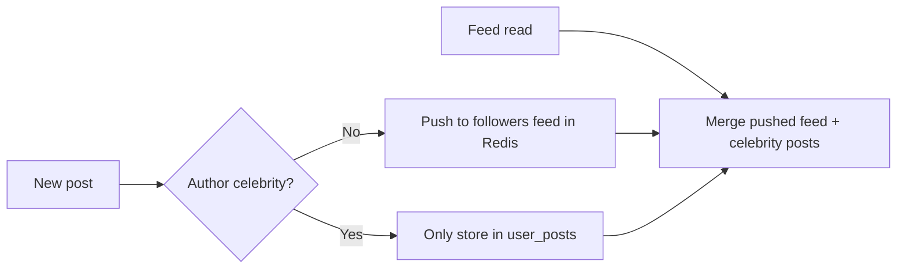

# Design News Feed (Twitter / Facebook)

**Ek line me:** user post kare → followers ki home feed me newest/ranked order me dikhe. Core challenge: **feed fast load** jab user 500 logon ko follow kare, aur **celebrity (10 crore followers) ki post sab tak** bina system tode.

**Is question me interviewer kya check karta hai:** fan-out on write vs read, celebrity problem ka hybrid, feed cache design, cursor pagination.

---

## Step 1: Interviewer se ye confirm karo (3–5 min)

| Tum poochho | Typical jawab | Design pe asar |
|---|---|---|
| "One-way (Twitter) ya two-way (Facebook)?" | One-way | Asymmetric graph, celebrities |
| "Chronological ya ranked?" | Pehle chronological, ranking briefly | Ranking alag layer |
| "DAU, posts/day, avg follows?" | 300M DAU, 50M posts/day, avg 200 follows | Fan-out load calculate karo |
| "Celebrities hain?" | Haan, kuch ke 100M+ followers | Hybrid fan-out zaroori |
| "Media?" | Haan, images/videos | S3 + CDN, feed me sirf URL |
| "Kitni fresh feed?" | Kuch seconds chalega | Async fan-out via queue |
| "Likes, comments, notifications?" | Sirf counts | Counter service, out of scope |

> **Bolo:** "2 flows: create post aur get feed. Read heavy hai, isliye feed Redis me precompute; celebrities ke liye hybrid."

## Step 2: Requirements

**Functional**
1. Users text + media post karein
2. Follow/unfollow
3. Home feed: followed users ki posts, newest first, infinite scroll

**Out of scope:** likes/comments write path, notifications, search, ML ranking detail.

**Non-functional (priority order me)**
1. **Latency:** feed load p99 < 200 ms
2. **Availability:** feed reads 99.99%, thoda stale chalega
3. **Freshness:** post p95 ~5 sec me followers ki feed me (eventual)
4. **Scale:** 300M DAU, ~35K feed reads/sec vs 600 posts/sec

**CAP choice:** AP. Post 5 sec late chalega, feed na khulna nahi.

## Step 3: Estimation (sirf jo design badle)

- Posts: 50M/day ≈ **600/sec**, peak ~3K/sec.
- Feed reads: 300M × 10 opens ≈ 3B/day ≈ **35K/sec**, peak ~150K → har baar compute nahi.
- Fan-out: 600 × 200 avg = **120K feed inserts/sec**, manageable.
- Queue: ~600 events/sec (peak 3K), bade authors 1K-follower batches → kuch hazaar msgs/sec; Kafka-level nahi.
- Celebrity: 1 post × 100M followers = 100M writes. **Asli problem.**
- Feed cache: 300M × 500 ids × 8 bytes ≈ **1.2 TB** Redis; sirf active users.

> **Bolo:** "Average fan-out 120K writes/sec, manageable. Celebrity post = 10 crore writes, isliye hybrid."

## Step 4: Core entities

- **User**: id, name, follower_count, is_celebrity
- **Post**: post_id (Snowflake, time-sortable), author_id, text, media_urls, created_at
- **Follow**: follower_id, followee_id, created_at
- **Feed entry** (cache): user_id → list of post_ids sorted by time

## Step 5: APIs

```http
POST /posts                {text, mediaIds[]}          → {postId}
POST /media/upload-url     {contentType}               → {uploadUrl, mediaId}
POST /users/{id}/follow                                → 204
DELETE /users/{id}/follow                              → 204
GET  /feed?cursor=<lastPostId>&limit=20                → {posts[], nextCursor}
```

> **Bolo:** "Cursor pagination, offset nahi: offset pe naye posts se duplicates/skip, aur bade offset slow."

## Step 6: High-level design

**Simple v1:** service + Postgres (`posts`, `follows`), feed = pull merge query. FRs pure, par: 150K reads/sec × 200 authors → precomputed Redis feed; 120K inserts/sec → queue + workers; celebrities → hybrid; 50M posts/day → Cassandra.



**FR mapping:** FR1 → Post Service + Cassandra + S3/CDN. FR2 → Follow Graph Service. FR3 → Feed Service + Redis feed (queue + Fan-out Workers bharte hain).

**Har component kyun** (alternatives Step 10 me):
- **Post Service:** save + queue event, fan-out ka wait nahi.
- **Follow Graph Service:** dono directions (follows + followers) consistent likhe; Feed + Fan-out dono padhte.
- **Feed Service:** Redis ids + celebrity posts merge → hydrate → rank.
- **S3 + CDN:** client → S3 pre-signed URL, CDN se serve.

## Step 7: Main flow: post karna aur feed padhna



## Step 8: Data model & DB choice

```sql
posts(post_id PK, author_id, text, media_urls, created_at)
  -- Cassandra, partition by post_id. Extra table user_posts(author_id, post_id DESC) for profile + celebrity pull
follows(follower_id, followee_id, created_at)   -- PK(follower_id, followee_id)
followers(followee_id, follower_id)             -- reverse index, fan-out ke liye
```

```text
Redis ZSET       feed:{user_id}  → member = post_id, score = post_id (time)  max 500
Redis HASH       post:{post_id}  → post details cache
```

- **Posts → Cassandra:** write-heavy, simple lookups. `user_posts`: partition author_id, cluster post_id desc.
- **Follow graph → sharded MySQL/Cassandra**, dono directions. Graph DB nahi: sirf 1-hop queries.
- **Feed → Redis:** derived data, kho jaye to rebuild.

## Step 9: Deep dives (interviewer yahin pressure dalega)

### 9.1 Fan-out on write vs fan-out on read

**NFR:** feed p99 < 200 ms, write path tode bina.

| | Fan-out on write (push) | Fan-out on read (pull) |
|---|---|---|
| Kaise | Post → har follower ki feed | Open pe fetch + merge |
| Read | Super fast, ek Redis read | Slow, 200 users merge |
| Write | Heavy, celebrity = 100M writes | Halka, sirf save |
| Waste | Inactive users ki feed bhi | Nahi |
| Best for | Normal users | Celebrities |

**Trade-off:** storage + write cost (inactive users bhi) ↔ ek Redis read me feed.

### 9.2 Celebrity problem: hybrid model

**NFR:** freshness ~5 sec, celebrity post pe bhi.

- Normal users (< 10K followers): **push** via fan-out workers.
- Celebrities (> 10K–100K, `is_celebrity`): **pull**, post kisi feed me nahi jaati.
- Read: Redis feed + followed celebrities ki latest posts (`user_posts`, cached) → merge by time.
- Inactive users (30 din) ko fan-out skip; wapas aayein to pull se rebuild.



> **Bolo:** "Normal users push, celebrities pull. User kuch dozen celebrities hi follow karta hai, isliye read-time merge sasta."

**Trade-off:** read pe merge step (thoda complex/slow) ↔ 100M writes ka explosion nahi.

### 9.3 Feed cache aur hydration

**NFR:** latency + Redis memory (~1.2 TB) control me.

- Feed me sirf **post_ids**; edit/delete ek jagah update.
- Hydration: `MGET post:{id}` post cache se, miss → Cassandra.
- Like/comment counts alag counter service, short TTL cache.
- Feed cap 500; purani posts DB se pull.
- Unfollow: async cleanup, ya read time filter (cheap).

**Trade-off:** har read pe extra `MGET` ↔ 500x kam memory, edit/delete ek jagah.

### 9.4 Pagination aur ranking

**NFR:** infinite scroll bina duplicates, stable latency.

- **Cursor:** `nextCursor = last post_id`, next: `post_id < cursor`. Snowflake time-sortable → naye posts se page shift nahi.
- **Ranking:** ~500 candidates → score (recency, author interaction, likes velocity, media type) → top 20. ML detail out of scope.
- "N new posts" banner: client 30 sec poll ya SSE.

**Trade-off:** "page 7 pe jump" nahi ↔ stable, fast pages.

## Step 10: Decision table (kya chuna, kyun, kya nahi)

| Decision | Kyun chuna | Kya nahi chuna, kyun |
|---|---|---|
| **Hybrid fan-out** | Fast read, no celebrity write explosion | **Pure push:** 100M writes, minutes lag. **Pure pull:** 200 queries/open. Sacrifice: merge logic |
| **SQS async fan-out** | ~600 events/sec, retries + DLQ, autoscale | **Kafka:** ek consumer, no replay, extra ops. **Sync:** 10K followers = seconds. Sacrifice: ordering, replay |
| **Redis feed, post_ids only** | 35K–150K reads/sec, kam memory | **Full post:** 500x duplicate. **DB pull:** p99 tootega. Sacrifice: ~1.2 TB RAM, hydration |
| **Cassandra for posts** | Write-heavy, time-ordered per author | **Single Postgres:** manual sharding. Sacrifice: no joins/txns |
| **Cursor pagination** | Stable pages, fast `post_id < cursor` | **Offset:** duplicates, slow. Sacrifice: random page jump nahi |
| **S3 + CDN for media** | No app server bandwidth, low latency | **DB/app servers:** costly, slow. Sacrifice: CDN cost, URL signing |

## Step 11: Failures & bottlenecks

| Kya fail hua | Kya hoga | Handle kaise |
|---|---|---|
| Fan-out workers lag | Posts late | Queue depth pe autoscale, oldest-message age alert |
| Redis feed shard down | Kuch feeds khali | Replica failover, ya pull se rebuild |
| Celebrity post viral | `user_posts` pe heavy reads | Recent posts local/Redis cache, short TTL |
| Duplicate message (at-least-once) | Same post do baar | ZSET member = post_id, duplicate ignore |
| Post delete | Feeds me id baaki | Hydration pe skip, async cleanup |
| Hot user ka feed key | Ek Redis node pe load | Shard by user_id, read replicas |

## Step 12: "Isko aur better kaise karein" (end me khud bolo)

- **ML ranking** with feature store + A/B testing
- **Real-time "new posts" push** via SSE/WebSocket, active users ke liye
- **Kafka tab:** moderation, search, notifications bhi post-created padhein (3+ consumers, replay)

## Step 13: Interviewer ke likely follow-up sawal

- "Celebrity threshold?" → follower count (~10K–100K) + posting frequency, config se tune
- "Naya follow, purani posts?" → async job uske last 20 posts feed me merge
- "Feed cache poora gaya?" → derived data; pull se on-demand rebuild, gradually warm
- "Ranking + cursor?" → ranked list session ke liye cache, cursor = position/score
- "Likes count?" → counter service, Redis INCR + periodic DB flush
- **Senior signal:** peak 3K posts/sec × 200 = 600K Redis writes/sec. Queue lag → 5 sec freshness tooti: oldest-message age alert, inactive skip, active feeds pehle.

## 2-minute recap (interview se pehle ye padho)

> Feed Redis me precompute (post_ids, max 500). Post → Cassandra + SQS event (Kafka nahi). Workers followers ki feeds me push; celebrities pull + merge (hybrid); inactive skip. Feed Service: ids → hydrate → rank → cursor (last Snowflake post_id). Media: pre-signed URL → S3 → CDN.

## Checklist

- [ ] Clarifying sawal (follow type, ranking, celebrities, media) pooch sakta hoon
- [ ] Fan-out on write vs read ka table bina dekhe bana sakta hoon
- [ ] Celebrity problem aur hybrid model samjha sakta hoon
- [ ] HLD diagram 5 min me bana sakta hoon
- [ ] Feed cache me sirf ids kyun, aur hydration kaise hota hai, bata sakta hoon
- [ ] Cursor pagination offset se better kyun hai, explain kar sakta hoon
- [ ] Ranking ka basic flow (candidates → score → top N) bata sakta hoon
- [ ] Decision table ke 3 trade-offs bina dekhe bol sakta hoon
