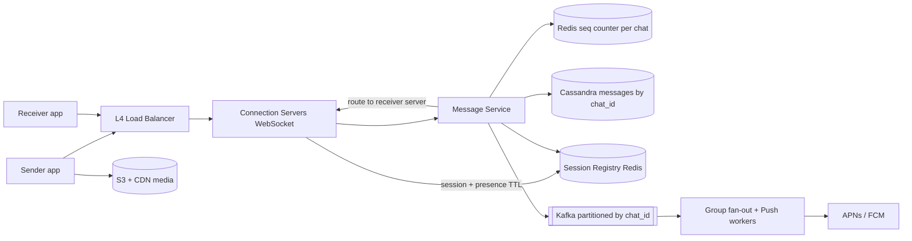
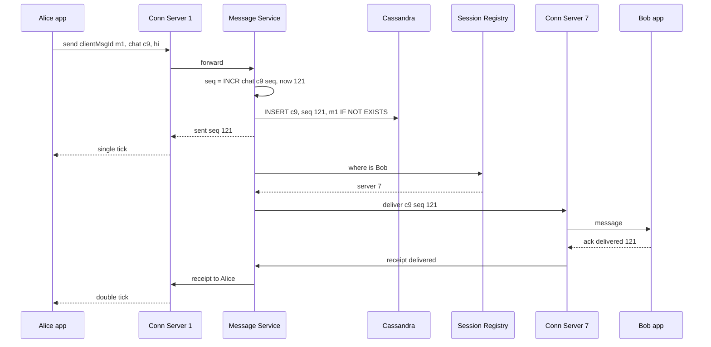

# Design WhatsApp / Messenger

**Ek line me:** users 1:1 aur group me real-time messages bhejte hain, offline ho to baad me milte hain, aur sent/delivered/read ticks dikhte hain. Core challenge hai **crores of open connections ke beech sahi user tak message pahunchana**, **order sahi rakhna**, aur **message kabhi khona nahi**.

**Is question me interviewer kya check karta hai:** WebSocket connection management, servers ke beech routing, message storage + ordering, delivery guarantees (at-least-once + dedup), offline handling, aur group fan-out.

---

## Step 1: Interviewer se ye confirm karo (3–5 min)

Design shuru karne se pehle ye sawal poochho:

| Tum poochho | Typical jawab | Design pe asar |
|---|---|---|
| "1:1 aur group dono? Group size max?" | Dono, group max 1000 | Group fan-out on write theek hai |
| "Delivery receipts aur read receipts chahiye?" | Haan, sent/delivered/read | Receipts bhi messages ki tarah flow karenge |
| "Offline user ko message kaise milega?" | Server pe store, online aate hi deliver + push notification | Persistent storage + push service |
| "Messages server pe hamesha rehte hain?" | Multi-device sync ke liye haan, ya deliver hone tak | Cassandra me retention policy |
| "Media (photo/video) bhejna?" | Haan | S3 + CDN, message me sirf URL |
| "Scale?" | 500M DAU, 50B messages/day | Lakhs connections per server, sharded storage |
| "Online/last seen presence?" | Haan | Heartbeat + Redis TTL |
| "E2E encryption design karna hai?" | Sirf mention | Server ciphertext store karta hai, Signal protocol |

> **Bolo:** "Main 1:1 aur group messaging design karunga with persistent WebSocket connections, at-least-once delivery, per-chat ordering, receipts, offline delivery aur presence. E2E encryption ko sirf mention karunga."

## Step 2: Requirements

**Functional**
1. Users 1:1 aur group (max 1000) me real-time messages bhej aur paa sakein
2. Offline users online aane pe saare pending messages paayein, aur beech me push notification
3. Users sent / delivered / read ticks aur online / last seen dekh sakein
4. Users media (image, video, document) bhej sakein

**Out of scope:** voice/video calls, status/stories, payments, E2E key exchange ka detail.

**Non-functional (priority order me)**
1. **Durability:** "sent" tick ke baad message kabhi nahi khona chahiye
2. **Ordering:** ek chat ke andar order sahi (global nahi)
3. **Latency:** online-to-online delivery p99 < 200 ms
4. **Availability:** 99.99%
5. **Scale:** 500M DAU, ~200M concurrent connections, 600K msgs/sec (peak 1.5M)

**CAP choice:** message write pe per-chat consistency (quorum write ke baad hi sent tick). Presence, last seen aur receipts AP: thoda stale chalega.

## Step 3: Estimation (sirf jo design badle)

- Messages: 50B/day ≈ **600K msgs/sec**, peak ~1.5M/sec (Diwali/New Year midnight). Write-heavy storage chahiye.
- Concurrent connections: ~200M online. Ek server ~100K–500K WebSocket connections → **~1,000 connection servers**.
- Storage: 50B × 200 bytes ≈ **10 TB/day** (media alag). Saalon ka data, horizontal scale must.
- Media: 5% messages media hain, avg 200 KB → ~500 TB/day. S3 + CDN hi option hai.
- Async kaam (offline push + group fan-out): maan lo ~har doosra message → **~300K events/sec**, peak ~750K.

> **Bolo:** "600K messages/sec aur 10 TB/day ka matlab hai write-optimized, horizontally scalable store, isliye Cassandra. Aur 200M open connections ke liye stateful connection servers chahiye jinke beech routing karni padegi."

## Step 4: Core entities

- **User**: id, phone, name, devices
- **Chat**: chat_id, type (1:1 / group), members
- **Message**: chat_id, seq_no, message_id (client generated UUID), sender_id, content/ciphertext, media_url, created_at
- **Receipt**: chat_id, user_id, last_delivered_seq, last_read_seq
- **Session**: user_id → connection server id (registry)

## Step 5: APIs

Real-time sab kuch WebSocket pe, baaki REST.

```http
WS   /connect  (auth token)                             → persistent connection

# WebSocket frames (client → server)
send     {clientMsgId, chatId, content, mediaUrl?}
ack      {chatId, seqNo, type: delivered | read}

# WebSocket frames (server → client)
message  {chatId, seqNo, messageId, senderId, content}
sent     {clientMsgId, seqNo}          # server ne persist kar liya, single tick
receipt  {chatId, userId, seqNo, type}

GET  /chats/{chatId}/messages?afterSeq=120&limit=50     → sync after reconnect
POST /media/upload-url   {contentType, size}            → {uploadUrl, mediaUrl}
```

> **Bolo:** "Client har message ke saath `clientMsgId` bhejta hai. Network retry pe same id aayega to server duplicate store nahi karega. Ye idempotency hai."

## Step 6: High-level design

**Simple v1 pehle:** ek server jo saare WebSockets pakde, Postgres `messages` table, aur memory me `user → connection` map. Chhote scale pe ye chaaron FRs pure karta hai. Numbers isse todte hain: 200M connections → ~1,000 connection servers, isliye session registry; 600K writes/sec → Cassandra; ~300K async events/sec with per-chat order → Kafka; media 500 TB/day → S3 + CDN.



**FR mapping:** FR1 → Connection Servers + Message Service + Cassandra + registry. FR2 → Kafka + Push workers + `afterSeq` sync. FR3 → receipts table + presence keys in Redis. FR4 → S3 + CDN.

**Har component kyun:**
- **L4 Load Balancer:** long-lived TCP/WebSocket connections ke liye. Least-connections routing
- **Connection Servers (alag) + Message Service (alag):** connection servers stateful hain aur deploy pe 2 lakh users disconnect hote hain, isliye unme business logic nahi. Logic stateless Message Service me, jo bina reconnect ke deploy hota hai
- **Session Registry (Redis):** `user_id → server_id`, aur presence keys bhi yahin (TTL 30s). ~200M keys, har message pe lookup. **Alag Presence Service nahi banayi**: connection server heartbeat pe key refresh kar deta hai
- **Redis seq counter:** 600K `INCR`/sec. Cassandra LWT (simpler, ek hi store) Paxos ke 4 round trips leta hai, itne rate pe nahi chalega
- **Cassandra:** 600K writes/sec, 10 TB/day, query hamesha "ek chat ke latest N". Postgres (simpler) is rate pe sharding nightmare
- **Kafka:** ~300K events/sec (peak 750K), group delivery me per-chat order chahiye (partition by chat_id), do consumer groups (group fan-out, push), aur push provider outage ke baad replay. SQS (simpler) is throughput pe ordering nahi deta
- **S3 + CDN:** media direct upload, message me sirf link

## Step 7: Main flow: 1:1 message bhejna



Bob offline ho (registry me entry nahi), to message DB me already safe hai. Message Service Kafka pe event daalta hai, Push worker FCM/APNs se notification bhejta hai. Bob online aaye to `afterSeq` se sync karta hai.

## Step 8: Data model & DB choice

```sql
-- Cassandra
messages(
  chat_id      PARTITION KEY,
  bucket       PARTITION KEY,   -- month, taaki ek partition bahut bada na ho
  seq_no       CLUSTERING DESC,
  message_id, sender_id, content, media_url, created_at
)
user_chats(user_id PARTITION KEY, last_activity CLUSTERING DESC, chat_id, unread_count)
chat_members(chat_id PARTITION KEY, user_id)
receipts(chat_id PARTITION KEY, user_id, last_delivered_seq, last_read_seq)
```

```text
Redis: session:{user_id} → {server_id, device}  TTL 60s, heartbeat se refresh
Redis: seq:{chat_id}     → INCR counter
Redis: presence:{user_id} → last_seen  TTL 30s
```

- **Cassandra** kyunki: bahut zyada writes, query hamesha "ek chat ke latest N messages" hai, jo partition + clustering key se ek sequential read hai. Joins/transactions nahi chahiye.
- **Redis** session aur presence ke liye: ephemeral, TTL based, fast.

## Step 9: Deep dives (interviewer yahin pressure dalega)

### 9.1 Message ek server se doosre server tak kaise jaata hai?

**NFR:** delivery p99 < 200 ms, aur zero message loss.

Alice server 1 pe, Bob server 7 pe. Do options:
- **Session registry + direct RPC (chosen):** Redis me `bob → server 7`. Message Service seedhe server 7 ko gRPC call karta hai. Fast, targeted.
- **Redis Pub/Sub:** har connection server apne users ke channels subscribe kare (`user:bob`). Publisher ko server pata hona zaroori nahi. Simple, par Pub/Sub fire-and-forget hai (subscriber down = message lost), isliye DB persist pehle hona chahiye.
- Server crash: uske users reconnect karenge doosre server pe, registry update hogi. Missed messages `afterSeq` sync se aa jayenge.

> **Bolo:** "Routing best-effort hai, durability DB se aati hai. Agar real-time push fail bhi ho jaye, client reconnect pe last seq ke baad ke messages pull kar leta hai. Isliye message kabhi khota nahi."

**Trade-off:** registry lookup ka ek extra hop aur stale entry ka risk, badle me message sirf sahi server pe.

### 9.2 Ordering aur exactly-once jaisa behavior

**NFR:** per-chat ordering + durability.

- Har chat ka apna **monotonic seq_no** (Redis `INCR seq:{chat_id}`, ya chat ke owner shard pe counter). Global ordering ki zaroorat nahi, sirf per chat.
- Client timestamps pe bharosa mat karo, clocks alag hote hain.
- **At-least-once delivery + dedup:** client `clientMsgId` bhejta hai, server `IF NOT EXISTS` se dedup karta hai. Receiver side `message_id` se duplicate ignore karta hai. Result: user ko exactly-once jaisa dikhta hai.
- Receiver ko seq gap dikhe (120 ke baad 122), to wo 121 fetch kar leta hai.

**Trade-off:** har message pe ek Redis `INCR` + conditional insert ka cost, badle me simple ordering aur gap detection.

### 9.3 Receipts, offline users aur push

**NFR:** offline user ka message durable, receipts cheap (AP).

- **Sent (1 tick):** server ne DB me persist kiya.
- **Delivered (2 ticks):** receiver device ne ack bheja. `receipts.last_delivered_seq` update.
- **Read (blue ticks):** receiver ne chat kholi. `last_read_seq` update. Har message pe alag row nahi, sirf "is seq tak padh liya", isliye cheap.
- **Offline:** registry me user nahi → Kafka → Push worker → FCM/APNs notification ("Alice: hi"). Online aate hi client `user_chats` se unread chats aur har chat ka `afterSeq` sync.
- **Multi-device:** registry me har device ki entry, sabko deliver. Har device apna last seq yaad rakhta hai.

**Trade-off:** per-message receipt history nahi milti, badle me receipts ka write load ~1 row per user per chat.

### 9.4 Group chat fan-out, presence, media

**NFR:** group delivery latency aur presence ka fan-out control me.

- **Group (max 1000):** message ek baar `messages` table me (chat_id = group_id) store. Phir **fan-out on write** delivery: Kafka worker (partition by chat_id, isliye group order bana rehta hai) members list lekar har online member ke server pe push, offline ko notification. Storage ek copy, delivery N.
- Bahut bade groups/channels (1 lakh+) me pull model: members khud fetch karein.
- Group read receipts: "read by 45 of 120" aggregate, har member ka last_read_seq.
- **Presence:** client har 20–30 sec heartbeat bhejta hai, connection server Redis `presence:{user}` TTL 30s set karta hai. Presence sirf unhe push karo jinki chat abhi khuli hai, poori contact list ko nahi (warna fan-out explosion).
- **Media:** client pre-signed URL se seedha S3 upload, message me sirf `mediaUrl` + thumbnail. Download CDN se.
- **E2E encryption:** Signal protocol, keys sirf devices pe. Server sirf ciphertext store aur route karta hai, content padh nahi sakta.

**Trade-off:** 1000-member group = 1000 deliveries per message, badle me storage me ek hi copy.

## Step 10: Decision table (kya chuna, kyun, kya nahi)

| Decision | Kyun chuna | Kya nahi chuna, kyun |
|---|---|---|
| **WebSocket** | Bidirectional, low latency, ek connection pe send + receive | **Long polling:** har message pe naya request. **SSE:** sirf server → client. Sacrifice: stateful servers, reconnect storms handle karne padte |
| **Session registry (Redis) + direct routing** | Targeted delivery, presence bhi yahin | **Broadcast to all servers:** 1000x waste. **Pub/Sub only:** no durability. Sacrifice: stale entry pe ek miss, push fallback |
| **Cassandra by chat_id** | 600K writes/sec, chat history ek partition me sorted | **Postgres:** is rate pe sharding mushkil. **MongoDB:** chal sakta, par wide-column pattern natural. Sacrifice: joins/transactions nahi, chat list alag table |
| **Per-chat seq_no via Redis INCR** | Simple ordering, gap detection, 600K/sec | **Client timestamps:** clock skew. **Global sequence:** bottleneck. **Cassandra LWT:** slow. Sacrifice: failover pe seq repeat ho sakta, insert pe check |
| **At-least-once + clientMsgId dedup** | Message kabhi nahi khota, duplicates hidden | **At-most-once:** messages kho sakte. **True exactly-once:** bahut mehenga. Sacrifice: client + server dono pe dedup logic |
| **Kafka (by chat_id) for group fan-out + push** | ~300K events/sec, per-chat order, 2 consumer groups, replay | **SQS:** is rate pe ordering nahi. **Sync fan-out in Message Service:** sender ka ack slow. Sacrifice: Kafka cluster ka ops |
| **S3 + CDN for media** | 500 TB/day bandwidth chat servers pe nahi | **Media WebSocket se:** connection servers choke. Sacrifice: upload ka extra step |

## Step 11: Failures & bottlenecks

| Kya fail hua | Kya hoga | Handle kaise |
|---|---|---|
| Connection server crash | Uske 2 lakh users disconnect | Client exponential backoff + jitter se reconnect, `afterSeq` sync se missed messages |
| Reconnect storm (server restart) | Saare clients ek saath aayein | Jitter, gradual drain before deploy, LB connection limits |
| Session registry stale | Message galat server pe | Server "user not here" bole to treat as offline, push notification bhejo |
| Cassandra node down | Writes us partition pe | RF=3, QUORUM writes, ek node down se fark nahi |
| Push provider slow | Notification late | Kafka retry, message to DB me safe hai |
| Hot group (1000 members, bahut active) | Fan-out workers pe load | Kafka partition by chat_id, workers scale, batch delivery |

## Step 12: "Isko aur better kaise karein" (end me khud bolo)

> "Agar aur time ho to main ye improve karunga:"
- **Multi-region:** user ka home region, connection nearest edge pe, cross-region messages async replicate
- **Message retention tiers:** delivered + 30 din purane messages cold storage me (ya E2E mode me server se delete)
- **Large channels** (1 lakh+) ke liye pull-based model aur CDN cached messages
- Connection servers ko **graceful drain** ke saath deploy, taaki reconnect storm na aaye

## Step 13: Interviewer ke likely follow-up sawal

- "Message kabhi khoyega to nahi?" → pehle DB persist, phir sent tick. Delivery fail ho to reconnect sync
- "Ordering kaise guarantee?" → per-chat seq_no server assign karta hai, client sort by seq
- "Ek user 3 devices pe hai?" → registry me teeno, sabko deliver, har device ka apna last seq
- "Redis seq counter down?" → replica failover. Ya seq ko Cassandra LWT / chat shard owner se assign
- "Read receipt har message pe store karoge?" → nahi, sirf `last_read_seq` per user per chat
- "E2E me group kaise?" → sender keys, har member ke liye encrypted key. Detail out of scope
- **Senior signal:** khud bolo ki Redis seq counter async replica pe failover ho to kuch `INCR` kho sakte hain aur same seq dobara mil sakta hai. Insert `IF NOT EXISTS` on (chat_id, seq) fail ho to naya seq lo, warna do messages ek seq pe overwrite honge.

## 2-minute recap (interview se pehle ye padho)

> Clients WebSocket se stateful connection servers se jude rehte hain (L4 LB, ~2 lakh connections per server). Session registry (Redis) batata hai kaun user kis server pe hai. Message aane pe Message Service per-chat seq_no assign karta hai, Cassandra me `chat_id` partition + `seq_no` clustering ke saath persist karta hai (clientMsgId se dedup), sender ko sent tick deta hai, phir receiver ke server pe route karta hai. Receiver ack bheje to delivered, chat khole to read (sirf last seq store). Offline user ko Kafka → push worker → FCM/APNs, aur reconnect pe `afterSeq` sync. Kafka isliye kyunki ~300K async events/sec, per-chat order (partition by chat_id) aur do consumers hain. Groups me ek copy store, delivery fan-out on write. Presence heartbeat + Redis TTL, alag service nahi. Media S3 + CDN. E2E Signal protocol, server sirf ciphertext route karta hai.

## Checklist

- [ ] Clarifying sawal (group size, receipts, offline, media, scale) pooch sakta hoon
- [ ] HLD diagram (connection servers, registry, message service, Cassandra) 5 min me bana sakta hoon
- [ ] Ek server se doosre server tak routing ke 2 options bata sakta hoon
- [ ] Per-chat seq_no se ordering aur gap detection samjha sakta hoon
- [ ] At-least-once + clientMsgId dedup explain kar sakta hoon
- [ ] Sent / delivered / read aur offline + push flow bata sakta hoon
- [ ] Cassandra ka partition/clustering key justify kar sakta hoon
- [ ] Decision table ke 3 trade-offs bina dekhe bol sakta hoon
