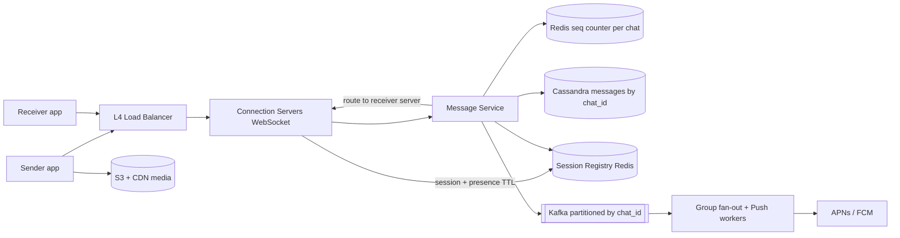
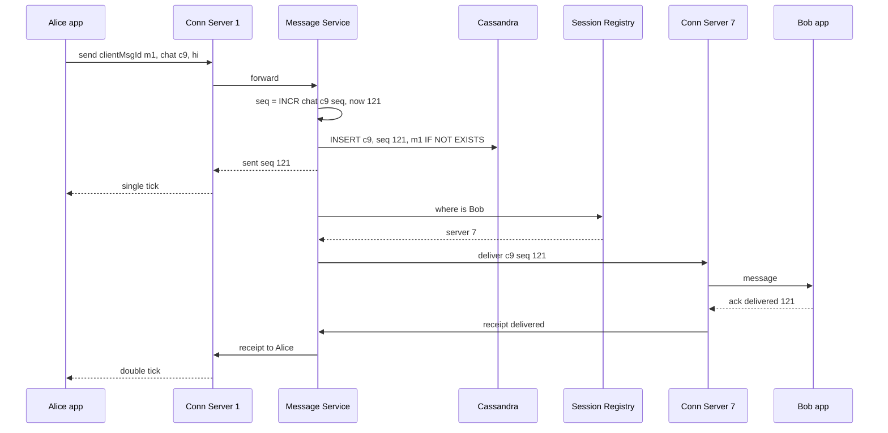

# Design WhatsApp / Messenger

**Ek line me:** 1:1 aur group real-time messages, offline ho to baad me milein, sent/delivered/read ticks. Core challenge: **crores of open connections me sahi user tak message**, **sahi order**, aur **message kabhi na khoye**.

**Is question me interviewer kya check karta hai:** WebSocket connections, server-to-server routing, ordering, at-least-once + dedup, offline, group fan-out.

---

## Step 1: Interviewer se ye confirm karo (3–5 min)

| Tum poochho | Typical jawab | Design pe asar |
|---|---|---|
| "1:1 aur group? Max group size?" | Dono, max 1000 | Group fan-out on write theek |
| "Delivery aur read receipts?" | Haan, sent/delivered/read | Receipts bhi messages ki tarah flow |
| "Offline user?" | Server store, online pe deliver + push | Storage + push service |
| "Server pe kab tak?" | Multi-device sync, ya deliver tak | Cassandra retention |
| "Media?" | Haan | S3 + CDN, message me sirf URL |
| "Scale?" | 500M DAU, 50B msgs/day | Lakhs conns/server, sharded storage |
| "Online/last seen?" | Haan | Heartbeat + Redis TTL |
| "E2E encryption?" | Sirf mention | Server ciphertext store, Signal protocol |

> **Bolo:** "1:1 + group, persistent WebSockets, at-least-once delivery, per-chat ordering, receipts, offline delivery, presence. E2E sirf mention."

## Step 2: Requirements

**Functional**
1. 1:1 aur group (max 1000) me real-time send/receive
2. Offline users ko online aane pe pending messages, beech me push notification
3. Sent / delivered / read ticks aur online / last seen
4. Media (image, video, document) bhejna

**Out of scope:** voice/video calls, status/stories, payments, E2E key exchange detail.

**Non-functional (priority order me)**
1. **Durability:** "sent" tick ke baad message kabhi nahi khoye
2. **Ordering:** ek chat ke andar sahi (global nahi)
3. **Latency:** online-to-online p99 < 200 ms
4. **Availability:** 99.99%
5. **Scale:** 500M DAU, ~200M concurrent connections, 600K msgs/sec (peak 1.5M)

**CAP choice:** message write pe per-chat consistency (quorum write ke baad hi sent tick). Presence, last seen, receipts AP.

## Step 3: Estimation (sirf jo design badle)

- Messages: 50B/day ≈ **600K/sec**, peak ~1.5M (Diwali/New Year midnight) → write-heavy store.
- Connections: ~200M online, ~100K–500K per server → **~1,000 connection servers**.
- Storage: 50B × 200 bytes ≈ **10 TB/day** (media alag) → horizontal scale must.
- Media: 5% messages × avg 200 KB → ~500 TB/day → S3 + CDN.
- Async (offline push + group fan-out): ~har doosra message → **~300K events/sec**, peak ~750K.

> **Bolo:** "600K msgs/sec + 10 TB/day → Cassandra. 200M open connections → stateful connection servers + routing."

## Step 4: Core entities

- **User**: id, phone, name, devices
- **Chat**: chat_id, type (1:1 / group), members
- **Message**: chat_id, seq_no, message_id (client generated UUID), sender_id, content/ciphertext, media_url, created_at
- **Receipt**: chat_id, user_id, last_delivered_seq, last_read_seq
- **Session**: user_id → connection server id (registry)

## Step 5: APIs

Real-time WebSocket pe, baaki REST.

```http
WS   /connect  (auth token)                             → persistent connection

# WebSocket frames (client → server)
send     {clientMsgId, chatId, content, mediaUrl?}
ack      {chatId, seqNo, type: delivered | read}

# WebSocket frames (server → client)
message  {chatId, seqNo, messageId, senderId, content}
sent     {clientMsgId, seqNo}          # server ne persist kar liya, single tick
receipt  {chatId, userId, seqNo, type}

GET  /chats/{chatId}/messages?afterSeq=120&limit=50     → sync after reconnect
POST /media/upload-url   {contentType, size}            → {uploadUrl, mediaUrl}
```

> **Bolo:** "Har message ke saath `clientMsgId`; retry pe same id → server duplicate store nahi karta (idempotency)."

## Step 6: High-level design

**Simple v1:** ek server (WebSockets + Postgres + in-memory `user → connection` map), chaaron FRs pure. Numbers todte: 200M conns → ~1,000 servers → session registry; 600K writes/sec → Cassandra; 300K async events/sec → Kafka; 500 TB/day media → S3 + CDN.



**FR mapping:** FR1 → Connection Servers + Message Service + Cassandra + registry. FR2 → Kafka + Push workers + `afterSeq` sync. FR3 → receipts table + presence keys in Redis. FR4 → S3 + CDN.

**Har component kyun** (alternatives Step 10 me):
- **L4 LB:** long-lived WebSockets, least-connections.
- **Connection Servers vs Message Service:** connection servers stateful (deploy = 2 lakh disconnects) → logic stateless Message Service me, bina reconnect deploy.
- **Session Registry (Redis):** `user_id → server_id` + presence (TTL 30s), ~200M keys. Alag Presence Service nahi: heartbeat pe key refresh.
- **Redis seq counter:** 600K `INCR`/sec; Cassandra LWT = 4 Paxos round trips.
- **Kafka:** 2 consumer groups (group fan-out, push), push outage ke baad replay.

## Step 7: Main flow: 1:1 message bhejna



Bob offline (registry me nahi) → message DB me already safe; Kafka event → Push worker → FCM/APNs. Online aane pe `afterSeq` sync.

## Step 8: Data model & DB choice

```sql
-- Cassandra
messages(
  chat_id      PARTITION KEY,
  bucket       PARTITION KEY,   -- month, taaki ek partition bahut bada na ho
  seq_no       CLUSTERING DESC,
  message_id, sender_id, content, media_url, created_at
)
user_chats(user_id PARTITION KEY, last_activity CLUSTERING DESC, chat_id, unread_count)
chat_members(chat_id PARTITION KEY, user_id)
receipts(chat_id PARTITION KEY, user_id, last_delivered_seq, last_read_seq)
```

```text
Redis: session:{user_id} → {server_id, device}  TTL 60s, heartbeat se refresh
Redis: seq:{chat_id}     → INCR counter
Redis: presence:{user_id} → last_seen  TTL 30s
```

- **Cassandra:** write-heavy; "chat ke latest N" = partition + clustering pe ek sequential read. Joins nahi.
- **Redis** session/presence: ephemeral, TTL, fast.

## Step 9: Deep dives (interviewer yahin pressure dalega)

### 9.1 Message ek server se doosre server tak kaise jaata hai?

**NFR:** delivery p99 < 200 ms, zero message loss.

Alice server 1 pe, Bob server 7 pe:
- **Registry + direct RPC (chosen):** Redis `bob → server 7` → seedha gRPC. Fast, targeted.
- **Redis Pub/Sub:** server apne users ke channels (`user:bob`) subscribe kare, publisher ko server pata nahi chahiye. Fire-and-forget (subscriber down = lost) → DB persist pehle.
- Server crash: reconnect doosre server pe, registry update, `afterSeq` sync.

> **Bolo:** "Routing best-effort hai, durability DB se. Push fail ho to client reconnect pe last seq ke baad pull kar leta hai."

**Trade-off:** registry ka extra hop + stale entry risk ↔ message sirf sahi server pe.

### 9.2 Ordering aur exactly-once jaisa behavior

**NFR:** per-chat ordering + durability.

- Har chat ka **monotonic seq_no** (Redis `INCR seq:{chat_id}`, ya chat owner shard pe counter). Global ordering nahi chahiye.
- Client timestamps pe bharosa nahi (clocks alag).
- **At-least-once + dedup:** server `clientMsgId` pe `IF NOT EXISTS`, receiver `message_id` se duplicate ignore → exactly-once jaisa dikhta hai.
- Seq gap (120 ke baad 122) → receiver 121 fetch kare.

**Trade-off:** har message pe `INCR` + conditional insert ↔ simple ordering + gap detection.

### 9.3 Receipts, offline users aur push

**NFR:** offline message durable, receipts cheap (AP).

- **Sent (1 tick):** DB me persist.
- **Delivered (2 ticks):** receiver device ack → `receipts.last_delivered_seq`.
- **Read (blue):** chat kholi → `last_read_seq`. Per-message row nahi, sirf "is seq tak", cheap.
- **Offline:** Kafka → Push worker → FCM/APNs. Online pe `user_chats` se unread chats + `afterSeq` sync.
- **Multi-device:** registry me har device, sabko deliver; har device apna last seq.

**Trade-off:** per-message receipt history nahi ↔ ~1 row per user per chat.

### 9.4 Group chat fan-out, presence, media

**NFR:** group delivery latency + presence fan-out control me.

- **Group (max 1000):** ek copy store (chat_id = group_id), **fan-out on write** delivery: Kafka worker (by chat_id → order) online members ko push, offline ko notification. 1 lakh+ channels: pull.
- Group read receipts: "read by 45 of 120", har member ka last_read_seq.
- **Presence:** heartbeat 20–30 sec → `presence:{user}` TTL 30s. Push sirf open chats ko, poori contact list ko nahi (fan-out explosion).
- **Media:** pre-signed URL → S3, message me `mediaUrl` + thumbnail, CDN download.
- **E2E:** Signal protocol, keys sirf devices pe; server sirf ciphertext store/route.

**Trade-off:** 1000-member group = 1000 deliveries ↔ storage me ek copy.

## Step 10: Decision table (kya chuna, kyun, kya nahi)

| Decision | Kyun chuna | Kya nahi chuna, kyun |
|---|---|---|
| **WebSocket** | Bidirectional, low latency, ek connection | **Long polling:** request per message. **SSE:** sirf server → client. Sacrifice: stateful servers, reconnect storms |
| **Session registry + direct routing** | Targeted delivery, presence bhi yahin | **Broadcast:** 1000x waste. **Pub/Sub only:** no durability. Sacrifice: stale entry → push fallback |
| **Cassandra by chat_id** | 600K writes/sec, history ek partition me sorted | **Postgres:** sharding mushkil. **MongoDB:** chalega, wide-column natural. Sacrifice: no joins, chat list alag table |
| **Per-chat seq_no via Redis INCR** | Ordering + gap detection, 600K/sec | **Client timestamps:** skew. **Global seq:** bottleneck. **LWT:** slow. Sacrifice: failover pe seq repeat |
| **At-least-once + clientMsgId dedup** | Kabhi nahi khota, duplicates hidden | **At-most-once:** loss. **True exactly-once:** mehenga. Sacrifice: dono side dedup logic |
| **Kafka (by chat_id) for fan-out + push** | 300K events/sec, per-chat order, replay | **SQS:** ordering nahi. **Sync fan-out:** sender ack slow. Sacrifice: Kafka ops |
| **S3 + CDN for media** | 500 TB/day chat servers pe nahi | **Media over WebSocket:** servers choke. Sacrifice: extra upload step |

## Step 11: Failures & bottlenecks

| Kya fail hua | Kya hoga | Handle kaise |
|---|---|---|
| Connection server crash | 2 lakh disconnects | Backoff + jitter reconnect, `afterSeq` sync |
| Reconnect storm | Saare clients ek saath | Jitter, gradual drain, LB conn limits |
| Session registry stale | Galat server pe message | "User not here" → offline treat, push bhejo |
| Cassandra node down | Us partition ke writes | RF=3, QUORUM writes |
| Push provider slow | Notification late | Kafka retry; message DB me safe |
| Hot group (1000, bahut active) | Fan-out workers pe load | Partition by chat_id, workers scale, batch delivery |

## Step 12: "Isko aur better kaise karein" (end me khud bolo)

- **Multi-region:** home region, nearest edge connection, async cross-region replicate
- **Retention tiers:** delivered + 30 din purane cold storage me (ya E2E mode me server se delete)
- **Large channels** (1 lakh+): pull model + CDN cached messages
- **Graceful drain** deploys, reconnect storm se bachne ke liye

## Step 13: Interviewer ke likely follow-up sawal

- "Message khoyega?" → pehle DB persist, phir sent tick; delivery fail → reconnect sync
- "Ordering?" → server per-chat seq_no, client sort by seq
- "3 devices?" → registry me teeno, sabko deliver, har device ka last seq
- "Redis seq counter down?" → replica failover, ya Cassandra LWT / chat shard owner se seq
- "Har message ka read receipt?" → nahi, sirf `last_read_seq` per user per chat
- "E2E group?" → sender keys, har member ke liye encrypted key; detail out of scope
- **Senior signal:** async replica failover pe kuch `INCR` kho sakte → same seq dobara. (chat_id, seq) pe `IF NOT EXISTS` fail → naya seq lo, warna overwrite.

## 2-minute recap (interview se pehle ye padho)

> WebSockets → stateful connection servers; Redis registry: user kis server pe. Message Service: per-chat seq_no → Cassandra (`chat_id` + `seq_no`, clientMsgId dedup) → sent tick → receiver server. Ack → delivered, open → read (last seq). Offline: Kafka → FCM/APNs, reconnect pe `afterSeq` sync. Groups: ek copy, fan-out on write. Presence: heartbeat + TTL. Media S3 + CDN. E2E: server sirf ciphertext.

## Checklist

- [ ] Clarifying sawal (group size, receipts, offline, media, scale) pooch sakta hoon
- [ ] HLD diagram (connection servers, registry, message service, Cassandra) 5 min me bana sakta hoon
- [ ] Ek server se doosre server tak routing ke 2 options bata sakta hoon
- [ ] Per-chat seq_no se ordering aur gap detection samjha sakta hoon
- [ ] At-least-once + clientMsgId dedup explain kar sakta hoon
- [ ] Sent / delivered / read aur offline + push flow bata sakta hoon
- [ ] Cassandra ka partition/clustering key justify kar sakta hoon
- [ ] Decision table ke 3 trade-offs bina dekhe bol sakta hoon
