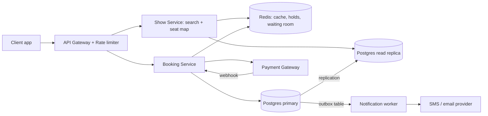
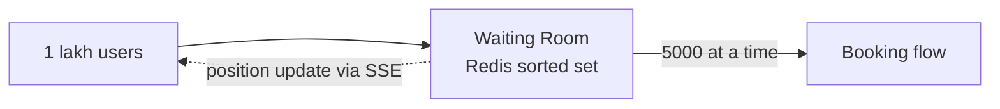

# Design BookMyShow / Ticketmaster

**Ek line me:** movie/event dhoondho, seat chuno, payment karo. Core challenge: **ek seat do logon ko na bike**, aur bade launches pe system crash na ho.

**Is question me interviewer kya check karta hai:** contention (locks), consistency vs availability, peak traffic (Avengers first-day-first-show).

---

## Step 1: Interviewer se ye confirm karo (3–5 min)

| Tum poochho | Typical jawab | Design pe asar |
|---|---|---|
| "Search, seats, booking scope? Payment third-party?" | Haan | Payment internals nahi |
| "Seat hold kitni der? 10 min?" | Haan, 10 min | Redis TTL = 10 min |
| "Double booking zero → consistency > availability?" | Haan | SQL + locks |
| "Search/browse me thoda stale chalega?" | Haan | Read replica + cache, eventual |
| "Scale? Peak?" | ~10M DAU, popular show pe 1 lakh+ ek saath | Virtual waiting queue |
| "Recommendations, reviews, food?" | Nahi | Out of scope |

> **Bolo:** "3 flows: search, seat map, book seats. Booking pe strong consistency, search pe availability + low latency."

## Step 2: Requirements

**Functional**
1. City/movie/date se shows search
2. Show ka seat map (kaunsi seat free)
3. Seats 10 min hold → payment se confirm → ticket notification

**Out of scope:** payment internals, recommendations, reviews, food, dynamic pricing.

**Non-functional (priority order me)**
1. **No double booking:** ek seat = ek booking (strong consistency)
2. **Availability:** search aur browse 99.99%
3. **Latency:** search p99 < 500 ms, hold p99 < 200 ms
4. **Scale:** 10M DAU, ~100:1 read/write, launch pe 1 lakh users/min ek show pe

**CAP choice:** booking CP: Postgres primary down → error, double booking se behtar. Search + seat map AP; final check booking pe.

## Step 3: Estimation (sirf jo design badle)

- Reads: 10M DAU × ~10 = **100M/day ≈ 1,200 QPS**, peak 10x ≈ 12K → cache zaroori.
- Bookings: ~1M/day ≈ **12/sec** → ek SQL DB kaafi.
- Launch: 1 lakh users, ek show, ek minute. **Asli problem yahi**, average nahi.
- Catalog chhota (kuch hazaar movies, ~1 lakh shows/day), structured filters → Postgres index + cache.

> **Bolo:** "Problem throughput nahi, ek seat pe contention aur sudden spike hai."

## Step 4: Core entities

- **Event/Movie**: id, name, duration, language
- **Venue**: id, city, screens
- **Show**: id, event_id, venue_id, start_time
- **Seat**: show_id, seat_id, price_tier, status
- **Booking**: id, user_id, show_id, seat_ids, status (`PENDING`, `CONFIRMED`, `CANCELLED`), payment_id, idempotency_key

## Step 5: APIs

```http
GET  /shows?city=pune&movie=123&date=2026-10-10     → list of shows
GET  /shows/{showId}/seats                          → seat map + status
POST /bookings/hold   {showId, seatIds}             → {holdId, expiresAt}
POST /bookings/confirm {holdId, paymentToken}       → {bookingId, status}
     Header: Idempotency-Key: <uuid>
```

> **Bolo:** "Hold aur confirm alag APIs: seat block aur payment do steps hain, beech me 10 min ka gap ho sakta hai."

## Step 6: High-level design

**Simple v1:** service + Postgres (indexed query, seat status column, booking ek txn), 12 bookings/sec pe FRs pure. Todta hai: 12K peak reads → Redis + read replica; 1 lakh users ek show → Redis holds + waiting room (row lock contention nahi); ticket send booking slow na kare → outbox + worker.



**FR mapping:** FR1 + FR2 → Show Service + Redis + read replica. FR3 → Booking Service + Redis holds + Postgres primary + outbox worker.

**Har component kyun** (alternatives Step 10 me):
- **API Gateway:** auth, rate limit, bots.
- **Show vs Booking Service:** read ~100x + AP, booking CP (saari consistency yahin); alag scale.
- **`pg_trgm`:** "avengr" jaisa typo sambhalta.
- **Redis:** holds + waiting room + cache.
- **Outbox + worker:** outbox row booking txn me, worker retries ke saath SMS/email; dual-write solve.

## Step 7: Main flow: seat book karna


## Step 8: Data model & DB choice

```sql
bookings(id PK, user_id, show_id, status, payment_id, idempotency_key UNIQUE, created_at)
booking_seats(booking_id, show_id, seat_id, UNIQUE(show_id, seat_id))
```

```sql
outbox(id PK, booking_id, type, payload, status, created_at)   -- same transaction me likho
```

`UNIQUE(show_id, seat_id)` sabse important line: DB khud double booking rokta hai.

## Step 9: Deep dives (interviewer yahin pressure dalega)

### 9.1 Double booking kaise rokoge?

**NFR:** no double booking (strong consistency).

Do layers:
1. **Redis hold** (`SET NX PX`): fast, temporary, 10 min me auto-expire.
2. **DB unique constraint:** final truth. Redis crash ya hold expire ke baad late payment, tab bhi do bookings nahi.

> Payment success, DB insert fail (seat kisi aur ki) → **auto refund**. Ye edge case khud bolo, strong signal.

**Trade-off:** do jagah state + rare refund path ↔ fast holds + DB pe guaranteed correctness.

### 9.2 Avengers launch: 1 lakh log, 1 minute

**NFR:** spike me bhi availability, hold p99 < 200 ms.

- **Virtual waiting queue:** token + Redis sorted set; ~5,000 ek baar me andar, baaki "line me #2,341".
- Seat map **CDN/Redis cache** se, DB pe nahi.
- Gateway pe per-user rate limit + CAPTCHA (bots).



**Trade-off:** users ka wait ↔ no crash + fair FIFO.

### 9.3 Seat map live kaise dikhe?

**NFR:** availability, thoda stale chalega (AP).

- Simple: 5 sec polling, cache se sasta.
- Better: hold pe **SSE/WebSocket** push, sirf popular shows ke liye.

**Trade-off:** 5 sec stale map ↔ simple, sasta.

### 9.4 Payment double charge na ho

**NFR:** exactly-once jaisa charge, retries ke baad bhi.

- Har confirm pe **Idempotency-Key**; key pehle aayi thi → purana result return.
- Webhook duplicate bhi aa sakta → `payment_id` unique.

**Trade-off:** idempotency keys store ↔ safe retry.

## Step 10: Decision table (kya chuna, kyun, kya nahi)

| Decision | Kyun chuna | Kya nahi chuna, kyun |
|---|---|---|
| **Postgres** for bookings | ACID + unique constraint, ~12 writes/sec | **Cassandra/DynamoDB:** multi-row txns kamzor. Sacrifice: single primary, failover pe kuch sec ruki |
| **Redis TTL** for seat hold | Hazaaron holds/sec, atomic `NX`, auto-release | **DB `held_until`:** same rows pe lock contention. Sacrifice: Redis down = holds gaye (DB safe) |
| **Pessimistic lock nahi** | 10 min DB lock nahi pakad sakte | `SELECT FOR UPDATE` → connections khatam. Sacrifice: rare refund |
| **Postgres + `pg_trgm` + cache** for search | Structured filters, chhota catalog | **Elasticsearch:** CDC + extra cluster, lag. **LIKE:** no typos. Sacrifice: basic ranking |
| **Outbox + worker** for notifications | ~12/sec, booking ke saath atomic, retries | **Kafka:** overkill, ek consumer. **Sync call:** SMS slow = booking slow. Sacrifice: polling delay |
| **Virtual queue** at peak | Load control, fair FIFO | **Sirf autoscaling:** slow, DB/locks phir bhi bottleneck. Sacrifice: users ka wait |

## Step 11: Failures & bottlenecks

| Kya fail hua | Kya hoga | Handle kaise |
|---|---|---|
| Redis down | Holds gaye | DB constraint rokega; Redis replica + sentinel |
| Payment webhook miss | Paisa kata, booking PENDING | Reconciliation job har 5 min gateway se status |
| Booking service crash | In-flight fail | Stateless replicas; idempotency key se retry |
| Hot show | Ek show pe saara load | Waiting room + cache |
| Notification worker down | Ticket SMS late | Outbox rows pending, baad me retry; booking safe |

## Step 12: "Isko aur better kaise karein" (end me khud bolo)

- Seat map **WebSocket** se fully live
- **Multi-region:** search har region me, booking ek primary region me (consistency)
- **Elasticsearch tab:** events, artists, venues pe full-text + relevance ranking chahiye

## Step 13: Interviewer ke likely follow-up sawal

- "Redis lock vs DB lock, dono kyun?" → Step 9.1
- "10 min me payment nahi?" → TTL expire, seat free, booking `CANCELLED`
- "Payment success, seat kisi aur ki?" → auto refund
- "Group 6 seats?" → ek Lua script me sab atomically hold; ek fail → sab release
- "Search stale?" → acceptable, final check booking pe
- **Senior signal:** hold TTL vs payment race: gateway slow → hold expire → seat kisi aur ko → late payment. DB constraint rokta hai, par auto refund + payment window < hold TTL zaroori.

## 2-minute recap (interview se pehle ye padho)

> Read-heavy, booking strongly consistent. Show Service (replica + Redis, `pg_trgm`, ES nahi) + Booking Service. Hold (Redis `SET NX PX 10min`) → confirm (Postgres txn, `UNIQUE(show_id, seat_id)`), Redis fail pe bhi safe. Payment: idempotency key + reconciliation. Peak: virtual queue + rate limit + cached seat map. Notifications: outbox + worker (Kafka nahi).

## Checklist

- [ ] Interviewer se clarifying sawal bina dekhe pooch sakta hoon
- [ ] Hold + confirm wala 2-step flow samjha sakta hoon
- [ ] HLD diagram 5 min me bana sakta hoon
- [ ] Double booking ke dono layers (Redis + DB constraint) samjha sakta hoon
- [ ] Peak traffic ke liye virtual queue explain kar sakta hoon
- [ ] Idempotency key aur payment reconciliation bata sakta hoon
- [ ] Decision table ke 3 trade-offs bina dekhe bol sakta hoon
