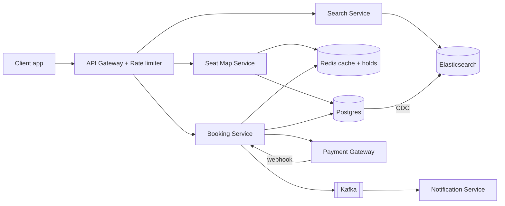
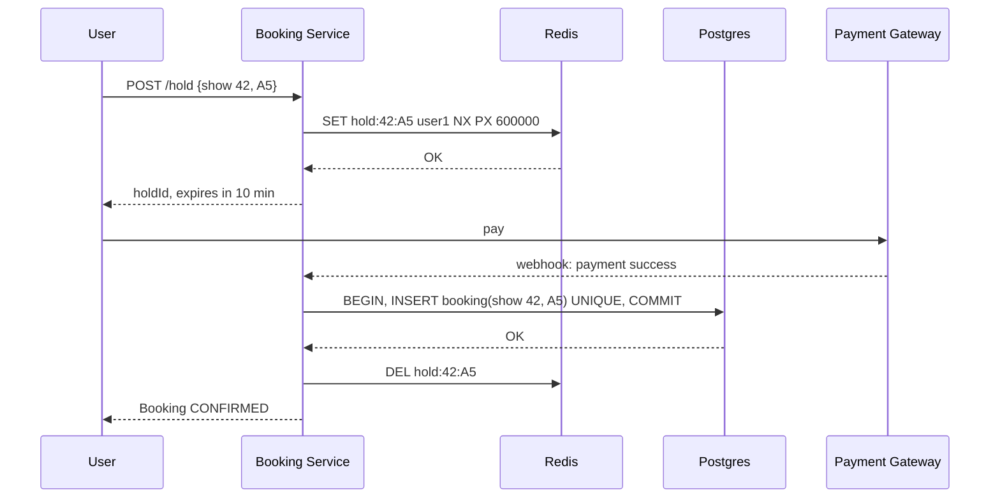
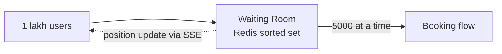

# Design BookMyShow / Ticketmaster

**Ek line me:** users movie/event dhoondhte hain, seat chunte hain, payment karte hain. Core challenge ye hai ki **ek seat do logon ko na bik jaaye**, aur bade launches pe system crash na ho.

**Is question me interviewer kya check karta hai:** contention handle karna (locks), consistency vs availability ka trade-off, aur peak traffic (Avengers ka first-day-first-show).

---

## Step 1: Interviewer se ye confirm karo (3–5 min)

Design shuru karne se pehle ye sawal poochho:

| Tum poochho | Typical jawab | Design pe asar |
|---|---|---|
| "Scope me search, seat selection aur booking hai? Payment third-party gateway maan loon?" | Haan | Payment ka internal design nahi karna |
| "Seat hold kitni der ka? 10 min?" | Haan, 10 min | Redis TTL = 10 min |
| "Double booking bilkul allowed nahi, yaani booking path pe consistency > availability?" | Haan | Booking ke liye strong consistency (SQL + locks) |
| "Search aur browse me thoda stale data chalega?" | Haan | Search ke liye cache/Elasticsearch, eventual consistency |
| "Scale kitna? Peak traffic?" | ~10M DAU, popular show pe 1 lakh+ log ek saath | Virtual waiting queue chahiye |
| "Recommendations, reviews, food ordering scope me hain?" | Nahi | Out of scope bol do |

> **Bolo:** "Toh main 3 core flows design karunga: search events, view seat map, aur book seats. Booking me strong consistency rakhunga, aur search me availability + low latency."

## Step 2: Requirements

**Functional**
1. User city/movie/date ke basis pe shows search kar sake
2. Show ka seat map dekh sake (kaunsi seat free hai)
3. Seats select karke 10 min ke liye hold kar sake
4. Payment karke booking confirm ho, aur ticket notification aaye

**Non-functional**
- **Consistency:** ek seat ek hi booking (sabse important)
- **Availability:** search aur browse hamesha chalna chahiye (99.99%)
- **Low latency:** search < 500ms
- **Scale:** read-heavy (100 log dekhte hain, 1 book karta hai), aur spiky traffic

## Step 3: Estimation (sirf jo design badle)

- 10M DAU, har user ~10 search/browse → **100M reads/day ≈ 1,200 QPS** avg, peak 10x ≈ 12K QPS. Isliye cache zaroori hai.
- Bookings: ~1M/day ≈ **12 bookings/sec** avg. Write load chhota hai, ek SQL DB sambhal lega.
- Popular launch: 1 lakh users ek hi show pe ek minute me. **Yahi asli problem hai**, average nahi.

> **Bolo:** "Average write load chhota hai, isliye problem throughput nahi hai. Problem hai ek hi seat pe contention aur sudden spike."

## Step 4: Core entities

- **Event/Movie**: id, name, duration, language
- **Venue**: id, city, screens
- **Show**: id, event_id, venue_id, start_time
- **Seat**: show_id, seat_id, price_tier, status
- **Booking**: id, user_id, show_id, seat_ids, status (`PENDING`, `CONFIRMED`, `CANCELLED`), payment_id, idempotency_key

## Step 5: APIs

```http
GET  /shows?city=pune&movie=123&date=2026-10-10     → list of shows
GET  /shows/{showId}/seats                          → seat map + status
POST /bookings/hold   {showId, seatIds}             → {holdId, expiresAt}
POST /bookings/confirm {holdId, paymentToken}       → {bookingId, status}
     Header: Idempotency-Key: <uuid>
```

> **Bolo:** "Hold aur confirm alag APIs hain, kyunki seat block karna aur payment karna do alag steps hain aur beech me 10 min ka gap ho sakta hai."

## Step 6: High-level design



**Har component kyun:**
- **API Gateway:** auth, rate limiting, bots ko rokna
- **Search Service + Elasticsearch:** text search ("avengr" typo bhi chale), filters. CDC se DB ke saath sync hota hai.
- **Seat Map Service:** read-heavy. DB se seats + Redis se holds mila ke dikhata hai.
- **Booking Service:** hold + confirm. Saari consistency ka kaam yahin hota hai.
- **Kafka → Notification:** ticket SMS/email async jayega, booking response slow nahi hoga.

## Step 7: Main flow: seat book karna



## Step 8: Data model & DB choice

```sql
bookings(id PK, user_id, show_id, status, payment_id, idempotency_key UNIQUE, created_at)
booking_seats(booking_id, show_id, seat_id, UNIQUE(show_id, seat_id))
```

`UNIQUE(show_id, seat_id)` sabse important line hai. Isse DB khud double booking rok deta hai.

## Step 9: Deep dives (interviewer yahin pressure dalega)

### 9.1 Double booking kaise rokoge?
Do layers:
1. **Redis hold** (`SET NX PX`): fast, temporary, 10 min ke baad auto-expire.
2. **DB unique constraint:** final truth. Redis crash ho jaye ya hold expire hone ke baad late payment aaye, tab bhi DB do bookings nahi hone dega.

> Agar payment success hua par DB insert fail hua (seat kisi aur ne le li), to **auto refund** trigger karo. Ye rare edge case hai, isse bata doge to strong signal jayega.

### 9.2 Avengers launch: 1 lakh log, 1 minute
- **Virtual waiting queue:** users ko token do aur Redis sorted set me line lagao. Ek baar me ~5,000 users ko andar aane do. Baaki ko "aap line me #2,341 par ho" dikhao.
- Seat map **CDN/Redis cache** se serve karo, har request DB pe na jaye.
- Gateway pe per-user rate limit + CAPTCHA, taaki bots na aayein.



### 9.3 Seat map live kaise dikhe?
- Simple: har 5 sec pe polling. Read-heavy hai, par cache se sasta padta hai.
- Better: **SSE/WebSocket** se seat status push karo jab koi hold lagaye. Popular shows ke liye hi on karo.

### 9.4 Payment double charge na ho
- Client har confirm request ke saath **Idempotency-Key** bheje. Server pehle check kare ki ye key pehle aayi thi ya nahi. Aayi thi to purana result return kare.
- Payment webhook bhi duplicate aa sakta hai. `payment_id` unique rakho.

## Step 10: Decision table (kya chuna, kyun, kya nahi)

| Decision | Kyun chuna | Kya nahi chuna, kyun |
|---|---|---|
| **Postgres** for bookings | ACID transactions + unique constraint. Write load chhota (~12/sec) | **Cassandra/DynamoDB:** multi-row transactions kamzor, aur itna write scale chahiye hi nahi |
| **Redis TTL** for seat hold | Atomic `NX`, aur TTL se auto-release | **DB me `HELD` status + cron cleanup:** cron late chal sakta hai, seats bekar blocked rehti hain, DB pe extra writes |
| **Pessimistic lock nahi** | 10 min payment window tak DB lock nahi pakad sakte | `SELECT FOR UPDATE` itni der rakha to connections khatam ho jayenge |
| **Elasticsearch** for search | Full-text, typo tolerance, filters | **Postgres LIKE:** slow aur typo nahi samajhta |
| **Kafka** for notifications | Async, retry possible, booking response fast | **Synchronous call:** SMS provider slow ho to booking bhi slow |
| **Virtual queue** at peak | Load ko control me rakhta hai, fair FIFO | **Sirf autoscaling:** itna fast scale nahi hota, aur DB/locks fir bhi bottleneck rahenge |

## Step 11: Failures & bottlenecks

| Kya fail hua | Kya hoga | Handle kaise |
|---|---|---|
| Redis down | Holds chale gaye | DB constraint double booking rokega. Redis ko replica + sentinel ke saath chalao |
| Payment webhook miss | Paisa kat gaya, booking PENDING | Reconciliation job har 5 min gateway se status poochhe |
| Booking service crash | In-flight requests fail | Stateless service + multiple instances. Idempotency key se safe retry |
| Hot show | Ek show pe saara load | Waiting room + cache |

## Step 12: "Isko aur better kaise karein" (end me khud bolo)

> "Agar aur time ho to main ye improve karunga:"
- Seat map ko **WebSocket** se fully live banana
- **Multi-region:** search har region me, booking ek primary region me (consistency ke liye)
- Hold expire hone se 2 min pehle user ko **reminder**
- Analytics ke liye bookings ka Kafka stream data warehouse me bhejna
- Fraud detection: ek user 50 seats hold kar raha hai to block karo

## Step 13: Interviewer ke likely follow-up sawal

- "Redis lock aur DB lock me kya farak hai? Dono kyun?" → Step 9.1
- "User ne 10 min me payment nahi kiya to?" → TTL expire, seat free, booking `CANCELLED`
- "Payment success hua par seat kisi aur ki ho gayi?" → auto refund
- "Ek group 6 seats ek saath le to?" → saari seats ek hi Lua script me atomically hold karo. Ek bhi fail ho to sab release
- "Search results stale ho to?" → acceptable hai. Final check booking ke time hota hai

## 2-minute recap (interview se pehle ye padho)

> BookMyShow read-heavy hai par booking pe strong consistency chahiye. Teen services: Search (Elasticsearch, CDC se sync), Seat Map (cache), Booking. Booking do step me hoti hai: hold aur confirm. Hold Redis `SET NX PX 10min` se hota hai, aur confirm Postgres transaction me `UNIQUE(show_id, seat_id)` ke saath. Isse Redis fail ho tab bhi double booking nahi hoti. Payment pe idempotency key aur webhook pe reconciliation job. Peak launch ke liye virtual waiting queue + rate limit + cached seat map. Notifications Kafka se async.

## Checklist

- [ ] Interviewer se clarifying sawal bina dekhe pooch sakta hoon
- [ ] Hold + confirm wala 2-step flow samjha sakta hoon
- [ ] HLD diagram 5 min me bana sakta hoon
- [ ] Double booking ke dono layers (Redis + DB constraint) samjha sakta hoon
- [ ] Peak traffic ke liye virtual queue explain kar sakta hoon
- [ ] Idempotency key aur payment reconciliation bata sakta hoon
- [ ] Decision table ke 3 trade-offs bina dekhe bol sakta hoon
