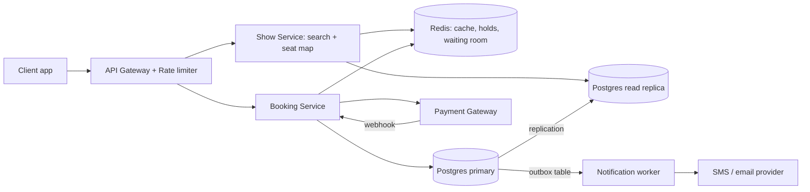
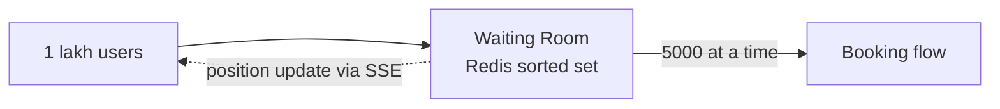

# Design BookMyShow / Ticketmaster

**Ek line me:** users movie/event dhoondhte hain, seat chunte hain, payment karte hain. Core challenge ye hai ki **ek seat do logon ko na bik jaaye**, aur bade launches pe system crash na ho.

**Is question me interviewer kya check karta hai:** contention handle karna (locks), consistency vs availability ka trade-off, aur peak traffic (Avengers ka first-day-first-show).

---

## Step 1: Interviewer se ye confirm karo (3–5 min)

Design shuru karne se pehle ye sawal poochho:

| Tum poochho | Typical jawab | Design pe asar |
|---|---|---|
| "Scope me search, seat selection aur booking hai? Payment third-party gateway maan loon?" | Haan | Payment ka internal design nahi karna |
| "Seat hold kitni der ka? 10 min?" | Haan, 10 min | Redis TTL = 10 min |
| "Double booking bilkul allowed nahi, yaani booking path pe consistency > availability?" | Haan | Booking ke liye strong consistency (SQL + locks) |
| "Search aur browse me thoda stale data chalega?" | Haan | Search read replica + cache se, eventual consistency |
| "Scale kitna? Peak traffic?" | ~10M DAU, popular show pe 1 lakh+ log ek saath | Virtual waiting queue chahiye |
| "Recommendations, reviews, food ordering scope me hain?" | Nahi | Out of scope bol do |

> **Bolo:** "Toh main 3 core flows design karunga: search events, view seat map, aur book seats. Booking me strong consistency rakhunga, aur search me availability + low latency."

## Step 2: Requirements

**Functional**
1. Users city/movie/date se shows search kar sakein
2. Users show ka seat map dekh sakein (kaunsi seat free hai)
3. Users seats 10 min ke liye hold karke payment se booking confirm kar sakein, aur ticket notification paayein

**Out of scope:** payment internals (third-party gateway), recommendations, reviews, food ordering, dynamic pricing.

**Non-functional (priority order me)**
1. **No double booking:** ek seat ek hi booking (strong consistency)
2. **Availability:** search aur browse 99.99%
3. **Latency:** search p99 < 500 ms, hold p99 < 200 ms
4. **Scale:** 10M DAU, ~100:1 read/write, launch pe 1 lakh users/min ek hi show pe

**CAP choice:** booking path CP: Postgres primary down ho to error dikhana double booking se behtar. Search aur seat map AP: thoda stale chalega, final check booking pe.

## Step 3: Estimation (sirf jo design badle)

- 10M DAU, har user ~10 search/browse → **100M reads/day ≈ 1,200 QPS** avg, peak 10x ≈ 12K QPS. Isliye cache zaroori hai.
- Bookings: ~1M/day ≈ **12 bookings/sec** avg. Write load chhota hai, ek SQL DB sambhal lega.
- Popular launch: 1 lakh users ek hi show pe ek minute me. **Yahi asli problem hai**, average nahi.
- Catalog chhota (kuch hazaar movies, ~1 lakh shows/day), filters structured. Postgres index + cache kaafi.

> **Bolo:** "Average write load chhota hai, isliye problem throughput nahi hai. Problem hai ek hi seat pe contention aur sudden spike."

## Step 4: Core entities

- **Event/Movie**: id, name, duration, language
- **Venue**: id, city, screens
- **Show**: id, event_id, venue_id, start_time
- **Seat**: show_id, seat_id, price_tier, status
- **Booking**: id, user_id, show_id, seat_ids, status (`PENDING`, `CONFIRMED`, `CANCELLED`), payment_id, idempotency_key

## Step 5: APIs

```http
GET  /shows?city=pune&movie=123&date=2026-10-10     → list of shows
GET  /shows/{showId}/seats                          → seat map + status
POST /bookings/hold   {showId, seatIds}             → {holdId, expiresAt}
POST /bookings/confirm {holdId, paymentToken}       → {bookingId, status}
     Header: Idempotency-Key: <uuid>
```

> **Bolo:** "Hold aur confirm alag APIs hain, kyunki seat block karna aur payment karna do alag steps hain aur beech me 10 min ka gap ho sakta hai."

## Step 6: High-level design

**Simple v1 pehle:** ek service + ek Postgres: indexed show query, seat status column, booking ek transaction me. 12 bookings/sec pe teeno FRs pure. Numbers isse todte hain: 12K peak reads/sec → Redis cache + read replica; ek show pe 1 lakh users → Redis holds + waiting room, taaki same rows pe DB lock contention na ho; ticket bhejna booking ko slow na kare → outbox + worker.



**FR mapping:** FR1 + FR2 → Show Service + Redis + read replica. FR3 → Booking Service + Redis holds + Postgres primary + outbox worker.

**Har component kyun:**
- **API Gateway:** auth, rate limiting, bots ko rokna
- **Show Service alag, Booking Service alag:** read path ~100x traffic aur AP, booking CP. Alag scale hote hain
- **Postgres search (index + `pg_trgm`) + cache, Elasticsearch nahi:** filters structured, catalog chhota, `pg_trgm` "avengr" jaisa typo sambhal leta hai. ES = CDC + ek aur cluster, bina zaroorat
- **Redis:** launch pe ek show pe hazaaron holds/sec. `SET NX PX` DB row locks se sasta, TTL se auto-release. Waiting room + cache bhi yahin
- **Booking Service:** hold + confirm. Saari consistency ka kaam yahin hota hai
- **Outbox + worker, Kafka nahi:** sirf ~12 bookings/sec, ek consumer. Booking ke transaction me outbox row, worker retries ke saath SMS/email bheje. Dual-write problem bhi solve

## Step 7: Main flow: seat book karna


## Step 8: Data model & DB choice

```sql
bookings(id PK, user_id, show_id, status, payment_id, idempotency_key UNIQUE, created_at)
booking_seats(booking_id, show_id, seat_id, UNIQUE(show_id, seat_id))
```

```sql
outbox(id PK, booking_id, type, payload, status, created_at)   -- same transaction me likho
```

`UNIQUE(show_id, seat_id)` sabse important line hai. Isse DB khud double booking rok deta hai.

## Step 9: Deep dives (interviewer yahin pressure dalega)

### 9.1 Double booking kaise rokoge?

**NFR:** no double booking (strong consistency).

Do layers:
1. **Redis hold** (`SET NX PX`): fast, temporary, 10 min ke baad auto-expire.
2. **DB unique constraint:** final truth. Redis crash ho jaye ya hold expire hone ke baad late payment aaye, tab bhi DB do bookings nahi hone dega.

> Agar payment success hua par DB insert fail hua (seat kisi aur ne le li), to **auto refund** trigger karo. Ye rare edge case hai, isse bata doge to strong signal jayega.

**Trade-off:** do jagah state (Redis + DB) aur rare refund path, badle me fast holds aur DB pe guaranteed correctness.

### 9.2 Avengers launch: 1 lakh log, 1 minute

**NFR:** spike me bhi availability aur hold p99 < 200 ms.

- **Virtual waiting queue:** users ko token do aur Redis sorted set me line lagao. Ek baar me ~5,000 users ko andar aane do. Baaki ko "aap line me #2,341 par ho" dikhao.
- Seat map **CDN/Redis cache** se serve karo, har request DB pe na jaye.
- Gateway pe per-user rate limit + CAPTCHA, taaki bots na aayein.



**Trade-off:** users ko line me wait karna padta hai, badle me system crash nahi hota aur order fair (FIFO) rehta hai.

### 9.3 Seat map live kaise dikhe?

**NFR:** seat map availability, thoda stale chalega (AP).

- Simple: har 5 sec pe polling. Read-heavy hai, par cache se sasta padta hai.
- Better: **SSE/WebSocket** se seat status push karo jab koi hold lagaye. Popular shows ke liye hi on karo.

**Trade-off:** polling me 5 sec stale map, badle me simple aur sasta.

### 9.4 Payment double charge na ho

**NFR:** exactly-once jaisa charge, retries ke baad bhi.

- Client har confirm request ke saath **Idempotency-Key** bheje. Server pehle check kare ki ye key pehle aayi thi ya nahi. Aayi thi to purana result return kare.
- Payment webhook bhi duplicate aa sakta hai. `payment_id` unique rakho.

**Trade-off:** idempotency keys store karni padti hain, badle me retry safe.

## Step 10: Decision table (kya chuna, kyun, kya nahi)

| Decision | Kyun chuna | Kya nahi chuna, kyun |
|---|---|---|
| **Postgres** for bookings | ACID + unique constraint, ~12 writes/sec | **Cassandra/DynamoDB:** multi-row transactions kamzor. Sacrifice: single primary, failover pe booking kuch sec ruki |
| **Redis TTL** for seat hold | Spike pe hazaaron holds/sec, atomic `NX`, TTL auto-release | **DB `held_until` column:** spike pe same rows pe lock contention. Sacrifice: Redis down = holds gaye (DB constraint safe) |
| **Pessimistic lock nahi** | 10 min payment window tak DB lock nahi pakad sakte | `SELECT FOR UPDATE` itni der rakha to connections khatam. Sacrifice: rare refund case |
| **Postgres + `pg_trgm` + cache** for search | Structured filters, chhota catalog, ek hi DB | **Elasticsearch:** CDC + ek aur cluster, sync lag. **Plain LIKE:** typo nahi samajhta. Sacrifice: relevance ranking basic |
| **Outbox + worker** for notifications | ~12/sec, booking ke saath atomic, retries | **Kafka:** is volume pe overkill. **Sync call:** SMS slow = booking slow. Sacrifice: worker polling ka thoda delay |
| **Virtual queue** at peak | Load control, fair FIFO | **Sirf autoscaling:** itna fast nahi, DB/locks fir bhi bottleneck. Sacrifice: users ka wait |

## Step 11: Failures & bottlenecks

| Kya fail hua | Kya hoga | Handle kaise |
|---|---|---|
| Redis down | Holds chale gaye | DB constraint double booking rokega. Redis ko replica + sentinel ke saath chalao |
| Payment webhook miss | Paisa kat gaya, booking PENDING | Reconciliation job har 5 min gateway se status poochhe |
| Booking service crash | In-flight requests fail | Stateless service + multiple instances. Idempotency key se safe retry |
| Hot show | Ek show pe saara load | Waiting room + cache |
| Notification worker down | Ticket SMS late | Outbox rows pending rehti hain, worker wapas aake retry. Booking pe asar nahi |

## Step 12: "Isko aur better kaise karein" (end me khud bolo)

> "Agar aur time ho to main ye improve karunga:"
- Seat map ko **WebSocket** se fully live banana
- **Multi-region:** search har region me, booking ek primary region me (consistency ke liye)
- **Elasticsearch tab:** jab events, artists, venues pe full-text + relevance ranking chahiye

## Step 13: Interviewer ke likely follow-up sawal

- "Redis lock aur DB lock me kya farak hai? Dono kyun?" → Step 9.1
- "User ne 10 min me payment nahi kiya to?" → TTL expire, seat free, booking `CANCELLED`
- "Payment success hua par seat kisi aur ki ho gayi?" → auto refund
- "Ek group 6 seats ek saath le to?" → saari seats ek hi Lua script me atomically hold karo. Ek bhi fail ho to sab release
- "Search results stale ho to?" → acceptable hai. Final check booking ke time hota hai
- **Senior signal:** khud bolo ki hold TTL aur payment ke beech race hai: gateway slow ho to hold expire, seat kisi aur ko, aur late payment aaye. DB constraint double booking rokta hai, par auto refund + payment window ko hold TTL se chhota rakhna zaroori hai.

## 2-minute recap (interview se pehle ye padho)

> BookMyShow read-heavy hai par booking pe strong consistency chahiye. Do services: Show Service (search + seat map: read replica + Redis cache, `pg_trgm`; ES nahi, catalog chhota) aur Booking Service. Booking do step me hoti hai: hold aur confirm. Hold Redis `SET NX PX 10min` se hota hai, aur confirm Postgres transaction me `UNIQUE(show_id, seat_id)` ke saath. Isse Redis fail ho tab bhi double booking nahi hoti. Payment pe idempotency key aur webhook pe reconciliation job. Peak launch ke liye virtual waiting queue + rate limit + cached seat map. Notifications outbox + worker se async (~12/sec, Kafka ki zaroorat nahi).

## Checklist

- [ ] Interviewer se clarifying sawal bina dekhe pooch sakta hoon
- [ ] Hold + confirm wala 2-step flow samjha sakta hoon
- [ ] HLD diagram 5 min me bana sakta hoon
- [ ] Double booking ke dono layers (Redis + DB constraint) samjha sakta hoon
- [ ] Peak traffic ke liye virtual queue explain kar sakta hoon
- [ ] Idempotency key aur payment reconciliation bata sakta hoon
- [ ] Decision table ke 3 trade-offs bina dekhe bol sakta hoon
