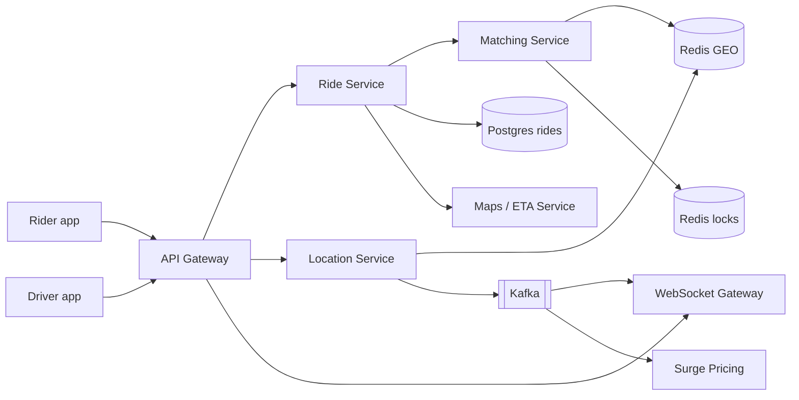
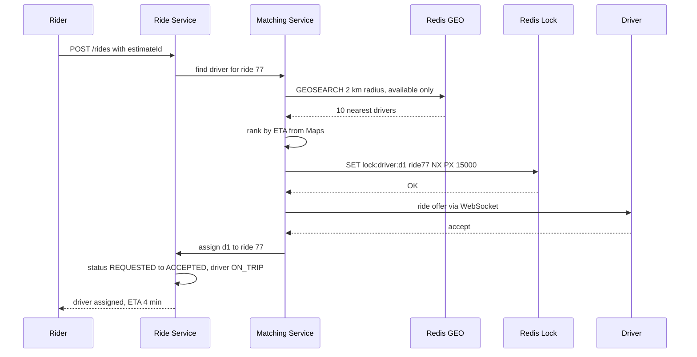
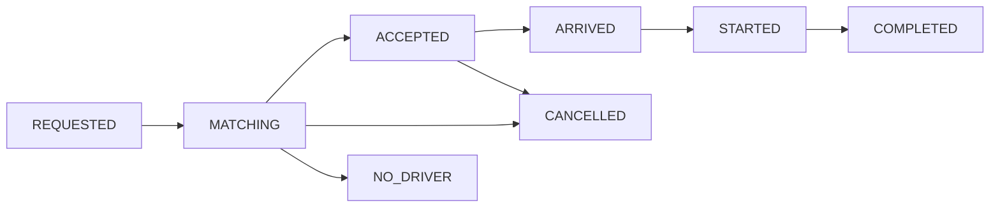

# Design Uber / Ola

**Ek line me:** rider pickup aur drop daalta hai, system paas ka free driver dhoondh ke match karta hai, aur ride ke dauraan driver ki live location rider ko dikhti hai. Core challenge ye hai ki **lakhon drivers har 4 sec location bhej rahe hain** aur **ek driver ko ek hi ride mile**.

**Is question me interviewer kya check karta hai:** write-heavy location data ko kahan rakhoge (geospatial index), nearby search kaise fast karoge, matching me contention (lock), ride ka state machine, aur real-time updates.

---

## Step 1: Interviewer se ye confirm karo (3–5 min)

Design shuru karne se pehle ye sawal poochho:

| Tum poochho | Typical jawab | Design pe asar |
|---|---|---|
| "Scope me ride request, matching, live tracking aur fare hai? Payment third-party maan loon?" | Haan | Payment ka internal design nahi |
| "Driver kitni der me location bhejta hai?" | Har ~4 sec | Bahut write-heavy, in-memory geo store chahiye |
| "Kitne active drivers aur riders?" | ~1M online drivers peak, 10M rides/day | Location writes ~250K/sec |
| "Ek driver ko ek time pe ek hi ride offer ho, ye strict hai?" | Haan | Driver pe distributed lock |
| "Pool/shared rides, scheduled rides scope me?" | Nahi | Out of scope |
| "ETA aur route ke liye Google Maps jaisa service use kar sakte hain?" | Haan | Maps ko black box maan lo |

> **Bolo:** "Main 3 core flows design karunga: driver location update, rider ka ride request + matching, aur ride ke dauraan live tracking. Location path pe latency aur throughput, aur matching pe consistency (ek driver ek ride) priority hai."

## Step 2: Requirements

**Functional**
1. Rider pickup/drop daal ke fare estimate + ETA dekh sake
2. Rider ride request kare, system paas ka driver match kare
3. Driver accept/decline kar sake, ride start aur end kar sake
4. Ride ke dauraan rider ko driver ki live location dikhe

**Non-functional**
- **Low latency:** match < 10 sec, location update rider tak ~1–2 sec me
- **Consistency:** ek driver ek time pe ek hi ride (double assign nahi)
- **Availability:** location aur matching hamesha chale (99.99%)
- **Scale:** write-heavy (location), city-wise traffic, peak hours me spike

## Step 3: Estimation (sirf jo design badle)

- 1M online drivers, har 4 sec ek update → **~250K writes/sec**. Ye Postgres pe nahi chalega. In-memory store (Redis GEO) chahiye.
- Har update ~100 bytes → 25 MB/sec. Sirf **latest location** rakhni hai, history alag async pipeline me.
- Rides: 10M/day ≈ **~120 ride requests/sec** avg, peak ~1K/sec. Ride DB ka load chhota hai.

> **Bolo:** "Asli load ride booking nahi, driver location updates hain: 250K writes/sec. Isliye location ko main DB se alag, in-memory geo index me rakhunga, aur rides ko normal SQL DB me."

## Step 4: Core entities

- **Rider**: id, name, phone, rating
- **Driver**: id, vehicle, city, status (`OFFLINE`, `AVAILABLE`, `ON_TRIP`), rating
- **DriverLocation**: driver_id, lat, lng, updated_at (sirf latest, Redis me)
- **Ride**: id, rider_id, driver_id, pickup, drop, status, fare, surge_multiplier, created_at
- **FareEstimate**: id, rider_id, pickup, drop, price, expires_at

## Step 5: APIs

```http
POST  /fare-estimate   {pickup, drop}                 → {estimateId, price, eta, expiresAt}
POST  /rides           {estimateId}                   → {rideId, status: REQUESTED}
      Header: Idempotency-Key: <uuid>
POST  /drivers/location {lat, lng}                    → 200   (har 4 sec)
POST  /rides/{rideId}/accept                          → {status: ACCEPTED}
PATCH /rides/{rideId}  {status: STARTED | COMPLETED}  → ride
WS    /rides/{rideId}/track                           → driver location stream
```

> **Bolo:** "Fare estimate alag API hai kyunki rider pehle price dekhta hai, aur ride request usi estimateId se hoti hai, taaki surge price lock rahe."

## Step 6: High-level design



**Har component kyun:**
- **Location Service + Redis GEO:** 250K writes/sec sambhalta hai. Har driver ki sirf latest location, `GEOADD` se overwrite.
- **Matching Service:** paas ke available drivers dhoondhta hai, ETA se rank karta hai, aur lock lagake ek driver ko offer bhejta hai.
- **Ride Service + Postgres:** ride ka state machine aur fare. Low write load, ACID chahiye.
- **WebSocket Gateway:** driver app aur rider app se persistent connection. Ride offer driver ko aur live location rider ko push hoti hai.
- **Kafka:** location events ka stream. Tracking, surge pricing aur analytics alag-alag consume karte hain.
- **Maps / ETA Service:** road distance aur traffic ke saath ETA. Straight-line distance galat hota hai.

## Step 7: Main flow: ride request aur matching



Driver 15 sec me accept na kare ya decline kare, to lock chhod do aur list ke agle driver pe jao.

## Step 8: Data model & DB choice

```sql
rides(id PK, rider_id, driver_id, status, pickup_lat, pickup_lng, drop_lat, drop_lng,
      fare, surge_multiplier, idempotency_key UNIQUE, created_at, updated_at)
drivers(id PK, city, vehicle_type, status, rating)
```

```text
Redis GEO:   GEOADD drivers:pune:available <lng> <lat> d1
Redis hash:  driver:d1 → {status, lastSeen, rideId}
Redis lock:  lock:driver:d1 → ride77  (TTL 15s)
```

- **Rides → Postgres:** state transitions transaction me, ~1K writes/sec easily. City ke hisaab se shard kar sakte ho.
- **Live location → Redis GEO:** in-memory, `GEOSEARCH` fast. Purani location ka koi kaam nahi, durability zaroori nahi.
- **Location history → Kafka → Cassandra/S3:** trip route, disputes aur analytics ke liye. Write-heavy, append-only.

## Step 9: Deep dives (interviewer yahin pressure dalega)

### 9.1 250K location writes/sec kahan rakhoge?
- **Postgres kyun nahi:** har update ek row update + index update. 250K/sec pe B-tree index aur WAL dam tod denge.
- **Redis GEO:** andar se geohash ko sorted set score banata hai. `GEOADD` O(log N), `GEOSEARCH` radius me fast.
- **City-wise sharding:** `drivers:pune`, `drivers:mumbai` alag keys, alag Redis nodes. Ek city ka load doosre ko nahi chhuta.
- **Client side throttle:** driver ruka hua hai to update kam bhejo (har 10–15 sec).
- **Stale driver:** 30 sec se update nahi aaya to available set se hatao (TTL wala hash ya cleanup).

### 9.2 Nearby drivers kaise dhoondhoge?
- **Geohash:** lat/lng ko string me badalta hai (`tdr1v`). Same prefix = paas paas. Search me apna cell + 8 neighbour cells dekho, kyunki boundary pe paas wala driver doosre cell me ho sakta hai.
- **Alternatives:** Quadtree (dense areas me cells chhote), Uber ka **H3** (hexagons, neighbours ki distance barabar).
- Radius me 10–20 candidates lo, phir **Maps service se road ETA** nikaal ke rank karo. Nadi ke us paar wala driver straight-line me paas hai par 20 min door.

### 9.3 Ek driver ko do rides na mile
- Matching Service multiple instances me chal raha hai. Do riders ka request same driver d1 ko pick kar sakta hai.
- **Distributed lock:** `SET lock:driver:d1 ride77 NX PX 15000`. Jisko lock mila, wahi offer bhejega. Doosra next driver pe jayega.
- TTL isliye ki driver ne jawab nahi diya ya service crash hui to lock khud chhoot jaye.
- **Final safety DB me:** assign karte waqt `UPDATE drivers SET status='ON_TRIP' WHERE id=d1 AND status='AVAILABLE'`. 0 rows update hui to assign fail.

### 9.4 Ride state machine

- Har transition `UPDATE rides SET status=? WHERE id=? AND status=<expected>` se. Galat transition (COMPLETED se STARTED) reject.
- Har transition pe Kafka event: notifications, billing, analytics.

### 9.5 Live tracking aur surge
- Ride ke dauraan driver ki location Kafka pe aati hai. WebSocket Gateway `rideId` se rider ka connection dhoondh ke push karta hai.
- Rider ka WS kis gateway node pe hai, ye Redis me `conn:rider1 → node7` rakho.
- **Surge (brief):** har geohash cell me har 1 min demand (requests) / supply (available drivers) ratio. Ratio > threshold to multiplier 1.5x. Estimate pe multiplier lock, 2 min valid.

## Step 10: Decision table (kya chuna, kyun, kya nahi)

| Decision | Kyun chuna | Kya nahi chuna, kyun |
|---|---|---|
| **Redis GEO** for live location | In-memory, 250K writes/sec, built-in radius search | **Postgres + PostGIS:** har 4 sec row update + index rebuild, itne writes nahi jhel payega |
| **Geohash / H3 cells** | Simple prefix match, sharding easy | **Har driver se distance calculate karna:** 1M drivers scan, bahut slow |
| **Redis lock with TTL** on driver | Fast, atomic `NX`, crash pe auto release | **DB row lock (`SELECT FOR UPDATE`):** 15 sec tak driver ke jawab ka wait, DB connections block |
| **Postgres** for rides | State machine + fare ke liye ACID, write load chhota | **Cassandra:** conditional state transitions aur transactions kamzor |
| **WebSocket** for offers + tracking | Server push, 1–2 sec latency | **Polling har 2 sec:** 10M clients se faltu requests, battery drain |
| **Kafka** for location stream | Ek stream, multiple consumers (tracking, surge, history) | **Location Service sabko direct call kare:** tight coupling, ek slow consumer sab slow kar dega |
| **Maps service se ETA** | Road + traffic aware | **Haversine distance:** nadi/flyover ignore, galat driver match |

## Step 11: Failures & bottlenecks

| Kya fail hua | Kya hoga | Handle kaise |
|---|---|---|
| Redis GEO node down | Us city ke drivers search me nahi dikhenge | Replica + failover. 4 sec me drivers dobara location bhej ke index rebuild kar dete hain |
| Driver ka network gaya | Stale location, galat match | `lastSeen` > 30 sec to available set se hatao |
| Matching service crash after lock | Driver locked reh gaya | Lock TTL 15 sec, khud chhoot jayega |
| WebSocket gateway down | Rider ko live location nahi dikhegi | Client reconnect karke doosre node pe, last location REST se fetch |
| Hot area (stadium ke baad match) | Ek cell pe bahut requests | Surge pricing se demand kam, aur cell ko chhote cells me todna |
| Double ride request (rider ne 2 baar tap kiya) | Do rides ban sakti thi | Idempotency-Key, `UNIQUE` constraint |

## Step 12: "Isko aur better kaise karein" (end me khud bolo)

> "Agar aur time ho to main ye improve karunga:"
- **Batch matching:** har 2 sec ke window me saare requests aur drivers ko ek saath match karna (global optimal), greedy nearest-first ki jagah
- **Driver ki next location predict karna** (speed + direction), taaki matching me stale location ka asar kam ho
- **Multi-region, city-wise cells:** har city ka pura stack apne region me, ek city ka outage doosri ko na chhue
- **Trip ke khatam hone se pehle next ride offer** (chaining), driver idle time kam
- **Fraud detection:** GPS spoofing pakadna (impossible speed jumps)
- Location history ko compress karke S3 me rakhna, disputes ke liye route replay

## Step 13: Interviewer ke likely follow-up sawal

- "Location Postgres me kyun nahi?" → 250K writes/sec, sirf latest chahiye. Redis GEO in-memory hai → Step 9.1
- "Geohash boundary pe driver miss ho to?" → apna cell + 8 neighbours search karo
- "Do matching instances ne same driver chuna to?" → Redis lock `NX` + DB conditional update → Step 9.3
- "Driver ne accept nahi kiya to?" → 15 sec timeout, lock release, next driver. 3 fail ke baad radius badhao
- "Rider ko driver ki location kaise dikhti hai?" → driver → Location Service → Kafka → WS Gateway → rider
- "Redis crash me data loss?" → acceptable, drivers 4 sec me fresh location bhej dete hain

## 2-minute recap (interview se pehle ye padho)

> Uber me asli load driver location ka hai: 1M drivers × har 4 sec = 250K writes/sec. Isliye latest location Redis GEO me (geohash based, city-wise sharded), Postgres me nahi. Rider request aata hai to Matching Service `GEOSEARCH` se paas ke 10–20 available drivers leta hai, Maps se road ETA nikaal ke rank karta hai, aur driver pe Redis lock (`SET NX PX 15s`) lagake offer WebSocket se bhejta hai. Lock + DB conditional update se ek driver ko ek hi ride milti hai. Ride Postgres me state machine (REQUESTED → ACCEPTED → STARTED → COMPLETED) ke saath. Ride ke dauraan location Kafka se WebSocket Gateway tak aur rider ko push hoti hai. Surge = cell-wise demand/supply ratio, estimate pe lock.

## Checklist

- [ ] 250K writes/sec ka estimate nikaal ke bata sakta hoon ki Postgres kyun nahi
- [ ] Redis GEO aur geohash ka nearby search (neighbour cells ke saath) samjha sakta hoon
- [ ] Driver pe distributed lock + DB conditional update se double assign rokna bata sakta hoon
- [ ] Ride state machine draw kar sakta hoon
- [ ] Live location ka path (driver → Kafka → WS → rider) explain kar sakta hoon
- [ ] Surge pricing aur ETA ka basic logic bata sakta hoon
- [ ] HLD diagram 5 min me bana sakta hoon
- [ ] Decision table ke 3 trade-offs bina dekhe bol sakta hoon
