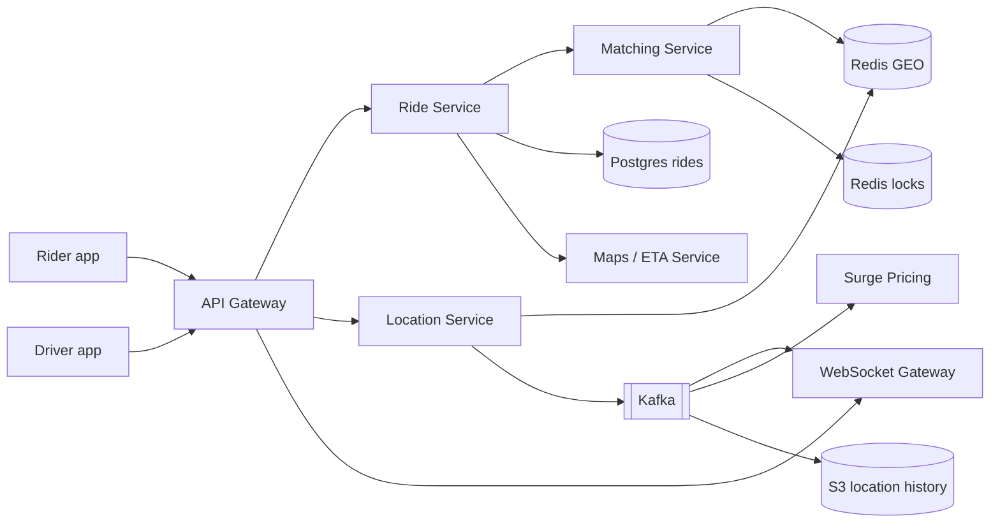
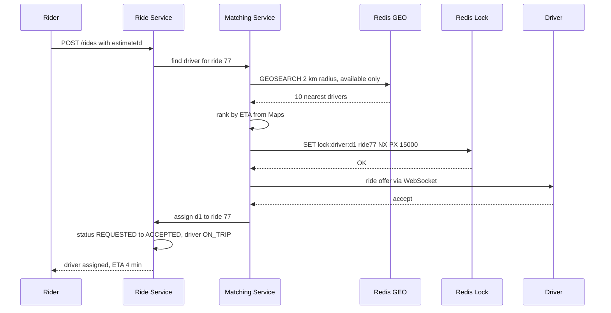
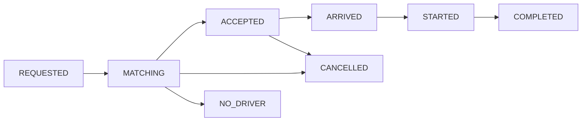

# Design Uber / Ola

**Ek line me:** rider pickup/drop daalta hai, system paas ka free driver match karta hai, ride ke dauraan driver ki live location rider ko dikhti hai. Core challenge: **lakhon drivers har 4 sec location bhejte hain** aur **ek driver ko ek hi ride mile**.

**Interviewer kya check karta hai:** geospatial index for write-heavy location, nearby search, matching lock, state machine, real-time push.

---

## Step 1: Interviewer se ye confirm karo (3–5 min)

| Tum poochho | Typical jawab | Design pe asar |
|---|---|---|
| "Scope: request, matching, tracking, fare? Payment third-party?" | Haan | Payment ka internal design nahi |
| "Driver kitni der me location bhejta hai?" | Har ~4 sec | Write-heavy, in-memory geo store |
| "Kitne active drivers aur riders?" | ~1M online drivers peak, 10M rides/day | Location writes ~250K/sec |
| "Ek driver ko ek time pe ek hi ride, strict?" | Haan | Driver pe distributed lock |
| "Pool/shared, scheduled rides scope me?" | Nahi | Out of scope |
| "ETA/route ke liye Google Maps jaisa service?" | Haan | Maps black box |

> **Bolo:** "3 flows: location update, request + matching, live tracking. Location pe throughput, matching pe consistency."

## Step 2: Requirements

**Functional**
1. Rider pickup/drop daal ke fare estimate + ETA dekhe
2. Rider ride request kare, system paas ka driver match kare
3. Driver offer accept/decline kare, ride start/end kare
4. Ride ke dauraan rider driver ki live location dekhe

**Out of scope:** payment internals, pool/shared rides, scheduled rides, ratings.

**Non-functional (priority order)**
1. **Matching consistency:** ek driver ek time pe ek ride (double assign zero)
2. **Scale:** 1M online drivers, ~250K location writes/sec, peak ~1K ride requests/sec
3. **Latency:** match p95 < 10 sec, live location < 2 sec, nearby search p99 < 100 ms
4. **Availability:** 99.99% for location + matching; location eventual (4 sec old OK)

**CAP:** assignment → consistency (lock + DB conditional update). Location/tracking → availability.

## Step 3: Estimation (sirf jo design badle)

- 1M drivers × har 4 sec → **~250K writes/sec** → in-memory (Redis GEO), Postgres nahi.
- ~100 bytes/update → 25 MB/sec. Sirf **latest** rakho; history async.
- 10M rides/day ≈ **~120/sec** avg, peak ~1K/sec → ride DB load chhota.

> **Bolo:** "Asli load location updates (250K writes/sec) hai, booking nahi. Location in-memory geo index me, rides SQL me."

## Step 4: Core entities

- **Rider**: id, name, phone, rating
- **Driver**: id, vehicle, city, status (`OFFLINE`, `AVAILABLE`, `ON_TRIP`), rating
- **DriverLocation**: driver_id, lat, lng, updated_at (sirf latest, Redis me)
- **Ride**: id, rider_id, driver_id, pickup, drop, status, fare, surge_multiplier, created_at
- **FareEstimate**: id, rider_id, pickup, drop, price, expires_at

## Step 5: APIs

```http
POST  /fare-estimate   {pickup, drop}                 → {estimateId, price, eta, expiresAt}
POST  /rides           {estimateId}                   → {rideId, status: REQUESTED}
      Header: Idempotency-Key: <uuid>
POST  /drivers/location {lat, lng}                    → 200   (har 4 sec)
POST  /rides/{rideId}/accept                          → {status: ACCEPTED}
PATCH /rides/{rideId}  {status: STARTED | COMPLETED}  → ride
WS    /rides/{rideId}/track                           → driver location stream
```

> **Bolo:** "Fare estimate alag API hai; ride usi estimateId se request hoti hai taaki surge price lock rahe."

## Step 6: High-level design

**v1:** Ride Service → Postgres (lat/lng column), 1K drivers tak. Phir:
- 250K writes/sec → Redis GEO + alag Location Service
- Matching instances ek driver pe race → lock
- Server push (offer + tracking) → WebSocket Gateway
- Ek location stream, 3 consumers → Kafka



**FR mapping:** FR1 → Ride Service + Maps + Surge, FR2 → Matching + Redis GEO + locks, FR3 → Ride Service + Postgres, FR4 → Location Service → Kafka → WS Gateway.

**Har component kyun** (alternatives Step 10 me):
- **Location Service + Redis GEO:** 250K writes/sec, `GEOADD` overwrite.
- **Matching Service:** location reads + Maps calls, alag scale; v1 me module.
- **Redis locks:** ek driver ek ride across instances.
- **Ride Service + Postgres:** state machine + fare, ACID.
- **WebSocket Gateway:** offer + location push < 2 sec.
- **Kafka:** ek stream, 3 consumers (tracking, surge, history) + replay. SQS fan-out = 3 queues, 3x writes.
- **S3 history:** route replay, disputes. Cassandra tabhi jab per-ride route high QPS pe padhna ho.
- **Maps / ETA:** road + traffic ETA.

## Step 7: Main flow: ride request aur matching



15 sec me accept nahi / decline → lock chhodo, list ka agla driver.

## Step 8: Data model & DB choice

```sql
rides(id PK, rider_id, driver_id, status, pickup_lat, pickup_lng, drop_lat, drop_lng,
      fare, surge_multiplier, idempotency_key UNIQUE, created_at, updated_at)
drivers(id PK, city, vehicle_type, status, rating)
```

```text
Redis GEO:   GEOADD drivers:pune:available <lng> <lat> d1
Redis hash:  driver:d1 → {status, lastSeen, rideId}
Redis lock:  lock:driver:d1 → ride77  (TTL 15s)
```

- **Rides → Postgres:** transitions in transaction; city-wise shard possible.
- **Live location → Redis GEO:** durability zaroori nahi.
- **History → Kafka → S3:** batch files (per ride/hour).

## Step 9: Deep dives (interviewer yahin pressure dalega)

### 9.1 250K location writes/sec kahan rakhoge?
**NFR:** 250K writes/sec, nearby search p99 < 100 ms.
- **Postgres nahi:** har update = row + B-tree index + WAL.
- **Redis GEO:** geohash = sorted set score. `GEOADD` O(log N), `GEOSEARCH` fast.
- **City-wise sharding:** `drivers:pune`, `drivers:mumbai` alag keys/nodes.
- **Throttle:** ruka driver → har 10–15 sec. **Stale:** 30 sec se update nahi → available set se hatao.
- **Trade-off:** Redis crash → last few sec lost; drivers 4 sec me resend.

### 9.2 Nearby drivers kaise dhoondhoge?
**NFR:** match p95 < 10 sec, road-wise paas driver.
- **Geohash:** lat/lng → string (`tdr1v`); same prefix = paas. Apna cell + 8 neighbours (boundary case).
- **Alternatives:** Quadtree (dense areas me chhote cells), Uber ka **H3** (hexagons, neighbours equidistant).
- 10–20 candidates → **Maps road ETA** se rank (nadi ke us paar wala 20 min door).
- **Trade-off:** Maps latency + cost, isliye sirf top 10–20.

### 9.3 Ek driver ko do rides na mile
**NFR:** double assign zero.
- **Distributed lock:** `SET lock:driver:d1 ride77 NX PX 15000`. Lock wala offer bheje, doosra next driver pe. TTL → crash/no reply pe auto release.
- **DB final guard:** `UPDATE drivers SET status='ON_TRIP' WHERE id=d1 AND status='AVAILABLE'`; 0 rows → assign fail.
- **Trade-off:** Redis lock failover pe ja sakta hai, isliye DB check.

### 9.4 Ride state machine
**NFR:** ride state hamesha correct (ACID).

- Har transition `UPDATE rides SET status=? WHERE id=? AND status=<expected>`. Galat transition (COMPLETED → STARTED) reject.
- Har transition pe event (outbox → same Kafka): notifications, billing. ~1K/sec; SQS bhi kaafi tha.
- **Trade-off:** retries pe client ko 409 handle karna.

### 9.5 Live tracking aur surge
**NFR:** live location < 2 sec.
- Location → Kafka → WS Gateway; rider ka node Redis registry se (`conn:rider1 → node7`).
- **Surge:** har geohash cell, har 1 min demand/supply ratio. > threshold → multiplier 1.5x. Estimate pe lock, 2 min valid.
- **Trade-off:** Kafka hop ~100s of ms, 2 sec budget me fit; consumers decoupled.

## Step 10: Decision table (kya chuna, kyun, kya nahi)

| Decision | Kyun chuna | Kya nahi chuna, kyun |
|---|---|---|
| **Redis GEO** for live location | In-memory, 250K writes/sec, built-in radius search | **PostGIS:** itne row + index updates nahi. **Sacrifice:** durability, RAM cost |
| **Geohash / H3 cells** | Simple prefix match, easy sharding | **Har driver se distance:** 1M scan. **Quadtree:** update pe rebalance. **Sacrifice:** 8 neighbour cells bhi dekhne |
| **Redis lock with TTL** on driver | Fast, atomic `NX`, crash pe auto release | **`SELECT FOR UPDATE`:** 15 sec DB connection block. **ZooKeeper:** safe par slow. **Sacrifice:** failover pe lock loss, DB check |
| **Postgres** for rides | ACID for state machine + fare, ~1K writes/sec | **Cassandra/DynamoDB:** conditional transitions kamzor. **Sacrifice:** bade scale pe city-wise sharding khud |
| **WebSocket** for offers + tracking | Server push, < 2 sec | **Polling:** faltu requests, battery. **Sacrifice:** stateful conns, reconnect |
| **Kafka** for location stream | 250K events/sec, 3 consumer groups, replay | **SQS/RabbitMQ:** 3 queues. **Direct calls:** coupling. **Sacrifice:** cluster ops, ~100 ms hop |
| **S3** for location history | Append-only, sasta, route replay | **Cassandra:** fast reads par ek aur cluster. **Sacrifice:** slow history query (Athena) |
| **Maps service se ETA** | Road + traffic aware | **Haversine:** nadi/flyover ignore. **Sacrifice:** external call latency + cost |

## Step 11: Failures & bottlenecks

| Kya fail hua | Kya hoga | Handle kaise |
|---|---|---|
| Redis GEO node down | City ke drivers search me nahi | Replica + failover; 4 sec me drivers index rebuild |
| Driver ka network gaya | Stale location, galat match | `lastSeen` > 30 sec → available set se hatao |
| Matching crash after lock | Driver locked | Lock TTL 15 sec, auto release |
| WebSocket gateway down | Live location nahi | Reconnect doosre node, last location REST |
| Hot area (stadium ke baad) | Ek cell pe bahut requests | Surge + cell ko chhote cells me todo |
| Rider ne 2 baar tap kiya | Do rides | Idempotency-Key, `UNIQUE` constraint |

## Step 12: "Isko aur better kaise karein" (end me khud bolo)

- **Batch matching:** 2 sec window me global optimal match, greedy nearest-first ki jagah
- **Next location predict** (speed + direction) → stale location ka asar kam
- **Multi-region, city-wise stack:** ek city ka outage doosri ko na chhue
- **Trip chaining:** trip khatam hone se pehle next offer, idle time kam
- **Fraud:** GPS spoofing (impossible speed jumps)

## Step 13: Interviewer ke likely follow-up sawal

- "Location Postgres me kyun nahi?" → 250K writes/sec, sirf latest chahiye → Redis GEO (9.1)
- "Geohash boundary pe driver miss?" → apna cell + 8 neighbours
- "Do instances ne same driver chuna?" → Redis lock `NX` + DB conditional update (9.3)
- "Driver ne accept nahi kiya?" → 15 sec timeout, lock release, next driver; 3 fail ke baad radius badhao
- "Kafka kyun, SQS kyun nahi?" → 250K events/sec, 3 independent consumers + replay
- **Senior signal:** khud bolo ki hot city (Mumbai peak) ka Redis GEO shard aur matching hotspot banega; city ko geohash cells me split karke shard karo, aur Redis failover pe lock lost hone ka risk DB conditional update se cover hai.

## 2-minute recap (interview se pehle ye padho)

> Load = driver location: 1M × har 4 sec = 250K writes/sec → Redis GEO (geohash, city shards). Matching: `GEOSEARCH` 10–20 drivers → Maps ETA rank → Redis lock (`SET NX PX 15s`) → WebSocket offer. Lock + DB conditional update = ek driver ek ride. Ride = Postgres state machine. Location → Kafka (tracking, surge, S3) → WS → rider. Surge = cell demand/supply, estimate pe lock.

## Checklist

- [ ] 250K writes/sec ka estimate nikaal ke bata sakta hoon ki Postgres kyun nahi
- [ ] Redis GEO aur geohash ka nearby search (neighbour cells ke saath) samjha sakta hoon
- [ ] Driver pe distributed lock + DB conditional update se double assign rokna bata sakta hoon
- [ ] Ride state machine draw kar sakta hoon
- [ ] Live location ka path (driver → Kafka → WS → rider) explain kar sakta hoon
- [ ] Surge pricing aur ETA ka basic logic bata sakta hoon
- [ ] HLD diagram 5 min me bana sakta hoon
- [ ] Decision table ke 3 trade-offs bina dekhe bol sakta hoon
