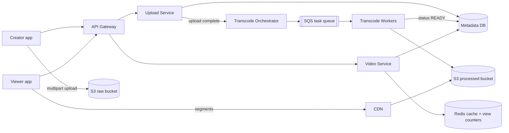
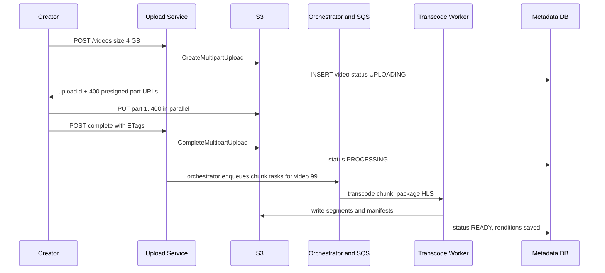
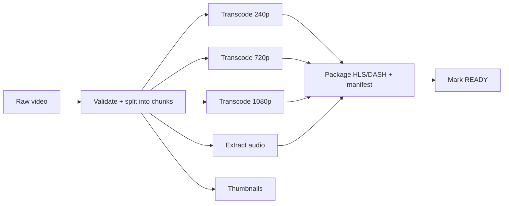

# Design YouTube / Netflix

**Ek line me:** creator upload kare, system multiple resolutions banaye, viewers bina buffering dekhein. Core challenge: **bade uploads, heavy transcoding, petabytes ki fast delivery**.

**Interviewer kya check karta hai:** blob storage + CDN, async pipeline (queue + workers), adaptive streaming (HLS/DASH), read-heavy caching.

---

## Step 1: Interviewer se ye confirm karo (3–5 min)

| Tum poochho | Typical jawab | Design pe asar |
|---|---|---|
| "Scope: upload, processing, watch? Search, comments, recs?" | Upload + watch core, baaki out | Teen flows pe focus |
| "Max video size?" | Up to 10 GB | Multipart + resumable upload |
| "Kitne uploads aur views?" | 500 hours/min upload, 1B views/day | Read-heavy, CDN must |
| "Upload ke turant baad live?" | Kuch minute delay chalega | Transcoding async |
| "Live streaming scope me?" | Nahi | Sirf VOD |
| "View count exact + real-time?" | Approx, thoda delay chalega | Async counting |

> **Bolo:** "2 flows: upload + processing, aur watch. Video bytes app servers se nahi guzrenge: upload direct S3, watch CDN se."

## Step 2: Requirements

**Functional**
1. Creator 10 GB tak video upload kare, network gaya to resume
2. Kuch minute me video multiple resolutions (240p–4K) me ready
3. Viewer dekhe, network ke hisaab se quality khud badle
4. Viewer metadata (title, thumbnail) + approx view count dekhe

**Out of scope:** search, comments, recommendations, live streaming, monetization.

**Non-functional (priority order)**
1. **Durability:** uploaded video kabhi lose na ho (S3, 11 nines)
2. **Playback latency:** start p95 < 2 sec, rebuffering < 1% watch time
3. **Availability:** 99.99% watch path; upload/processing degrade chalega
4. **Scale:** 1B views/day, 500 hours upload/min, read:write > 100:1, global

**CAP:** watch path → availability (naya video/count late chalega). Strong consistency sirf video status (`READY`) + upload record pe, ek SQL row.

## Step 3: Estimation (sirf jo design badle)

- Upload: 500 hours/min × 1–2 GB/hour → **~1 PB raw/day**. Transcoded (5–6 resolutions) ~3x → S3, purana raw cold storage.
- Watch: 1B views/day ≈ **~12K starts/sec**. ~3.5M concurrent × 5 Mbps = **~15+ Tbps** → sirf CDN.
- Metadata: ~12K QPS, viral video ki ek hot row → cache.
- Transcode: 500 hours/min ÷ 10 sec chunks × ~6 resolutions ≈ **~18K tasks/sec** → SQS + autoscaling workers.

> **Bolo:** "Bottleneck bandwidth aur storage hai, QPS nahi. Centre me blob storage + CDN; app servers sirf metadata aur URLs dete hain."

## Step 4: Core entities

- **User/Channel**: id, name, subscribers
- **Video**: id, channel_id, title, description, status (`UPLOADING`, `PROCESSING`, `READY`, `FAILED`), duration, created_at
- **VideoFile/Rendition**: video_id, resolution, codec, manifest_url, segment_prefix
- **Upload**: upload_id, video_id, parts_done, total_parts
- **ViewCount**: video_id, count (aggregated)

## Step 5: APIs

```http
POST /videos                {title, description, size}   → {videoId, uploadId, partUrls[]}
PUT  <presigned S3 part URL>                             → ETag   (client direct S3 pe)
POST /videos/{id}/complete  {uploadId, parts[{n, etag}]} → {status: PROCESSING}
GET  /videos/{id}                                        → metadata + manifestUrl
GET  <cdn>/videos/{id}/master.m3u8                       → HLS manifest
POST /videos/{id}/view      {watchedSec}                 → 202 Accepted
```

> **Bolo:** "Upload API sirf pre-signed URLs deti hai; 10 GB app server se bhejna bandwidth + memory waste hai."

## Step 6: High-level design

**v1:** API + SQL + S3, ek ffmpeg worker, viewer S3 se. Phir:
- ~15 Tbps → CDN
- 18K tasks/sec + retries → SQS + worker fleet + orchestrator
- Hot metadata row, 12K views/sec → Redis



**FR mapping:** FR1 → Upload Service + S3 raw (pre-signed multipart), FR2 → Orchestrator + SQS + Workers + S3 processed, FR3 → CDN + HLS, FR4 → Video Service + Redis + Metadata DB.

**Har component kyun** (alternatives Step 10 me):
- **Upload Service:** row + part URLs; bytes isse nahi guzarte.
- **S3:** 11 nines, PB/day pe sasta.
- **Orchestrator + SQS + Workers:** retry, visibility timeout, DLQ built-in; replay nahi chahiye → Kafka nahi.
- **Redis:** viral hot key pe replicas nahi, cache bachata hai. `INCR` ~100K ops/sec per node.
- **Upload vs Video Service:** upload rare + heavy, watch 100x + latency-sensitive. v1 me ek service.

## Step 7: Main flow: upload aur processing



Watch: `GET /videos/{id}` → manifest URL → saare segments CDN se.

## Step 8: Data model & DB choice

```sql
videos(id PK, channel_id, title, description, status, duration_sec,
       raw_s3_key, created_at)
renditions(video_id, resolution, bitrate, codec, manifest_key,
           PRIMARY KEY(video_id, resolution))
uploads(upload_id PK, video_id, total_parts, status, expires_at)
view_counts(video_id PK, count, updated_at)
```

- **Metadata → MySQL/Postgres (sharded by video_id):** relations. YouTube: Vitess (sharded MySQL).
- **Video bytes → S3**, DB me blob kabhi nahi.
- **View counts → Redis**, har 30 sec flush to `view_counts`.

## Step 9: Deep dives (interviewer yahin pressure dalega)

### 9.1 Bada upload: pre-signed URL, multipart, resumable
**NFR:** durability + 10 GB upload bina restart.
- **5–10 MB parts**, har part ka pre-signed URL, parallel. Fail → sirf wahi part retry.
- **Resume:** `GET /uploads/{id}` → S3 `ListParts` → baaki parts bhejo.
- Pre-signed URL: TTL 15–60 min, ek key pe PUT. Lifecycle rule: adhoore uploads 7 din baad abort.
- **Trade-off:** client complex (parts, ETags, resume), server bandwidth zero.

### 9.2 Transcoding pipeline: DAG of tasks
**NFR:** kuch minute me live, ~18K tasks/sec.

- **Chunks (e.g. 10 sec)** × resolution = ek task. Hazaron workers parallel → 1 ghante ki video minutes me.
- Orchestrator (Temporal/Step Functions) DAG track kare, ready tasks SQS me. Output S3 me likhne ke baad hi message delete. 3 fail → DLQ.
- **Idempotent** tasks: same input → same output key; crash pe retry overwrite safe.
- Pehle 360p/720p ready → live; 4K baad me.
- **Trade-off:** chunk boundary pe encode kam efficient + extra orchestrator, par minutes vs ghante.

### 9.3 Adaptive bitrate: HLS/DASH
**NFR:** start < 2 sec, rebuffering < 1%.
- Har resolution **2–6 sec segments** me; master manifest (`master.m3u8`) me saari qualities.
- Player har segment pe bandwidth ke hisaab se quality chune (metro 1080p, tunnel 240p).
- Segments static → CDN pe perfect cache.
- **Trade-off:** 5–6 copies, storage ~3x.

### 9.4 CDN: popular vs long-tail
**NFR:** ~15 Tbps, global low latency.
- **Top ~10–20% videos = ~80% traffic** → edges pe pre-push. Netflix: ISP ke andar boxes (Open Connect).
- **Long-tail:** pull-based; origin shield taaki saare edges seedha S3 na maarein.
- **Trade-off:** long-tail pehli request slow; CDN bill sabse bada cost.

### 9.5 View counts
**NFR:** availability > accuracy; approx, ~30 sec late chalega.
- Har view pe `views+1` DB update → hot row.
- Redis `INCR views:{videoId}` (12K/sec, chhota load); job har 30 sec DB me batch update.
- Fake-view filter: `SET seen:{user}:{video} NX EX 3600`; set hai → count nahi.
- **Kafka kab:** analytics, recs, fraud ML ko replay chahiye ho. Abhi nahi.
- **Trade-off:** Redis crash → last flush ke baad ke views lost.

## Step 10: Decision table (kya chuna, kyun, kya nahi)

| Decision | Kyun chuna | Kya nahi chuna, kyun |
|---|---|---|
| **Pre-signed URL, direct S3 upload** | App server pe bandwidth/memory nahi, S3 scale | **Via app server:** 10 GB pe choke. **Sacrifice:** client complex, validation upload ke baad |
| **Multipart + resumable** | Parallel parts, fail pe ek part retry | **Single PUT:** 5 GB limit, poora dobara. **Sacrifice:** parts + ETags tracking |
| **SQS + workers, chunk-level DAG** | ~18K tasks/sec, retry, visibility timeout, DLQ built-in | **Kafka:** replay nahi chahiye, retry khud banana. **Sync transcode:** timeout. **Sacrifice:** extra orchestrator |
| **HLS/DASH segments** | Adaptive quality, CDN-friendly static files | **Ek badi MP4:** quality switch nahi. **Sacrifice:** ~3x storage |
| **CDN for delivery** | ~15 Tbps, user ke paas edge | **Origin se:** cost + latency. **Sacrifice:** bada bill, long-tail miss |
| **SQL (sharded) for metadata** | Relations, moderate writes | **Cassandra/DynamoDB:** joins + status consistency chhodni. **Sacrifice:** Vitess sharding manage |
| **Redis cache + counters** | Hot metadata, 12K INCR/sec, DB writes ~1000x kam | **DB increment:** hot row. **Kafka + stream:** overkill. **Sacrifice:** approx, crash pe views lost |

## Step 11: Failures & bottlenecks

| Kya fail hua | Kya hoga | Handle kaise |
|---|---|---|
| Upload beech me ruka | Adhoora file | `ListParts` se resume; lifecycle cleanup |
| Transcode worker crash | Task adhoora | Visibility timeout ke baad retry, idempotent output |
| Corrupt/unsupported video | Pipeline fail | Validate pehle, `FAILED` + notify; repeat fail → DLQ |
| CDN miss storm (viral) | Origin pe load | Origin shield + pre-warm |
| Metadata hot shard | Viral video reads | Redis + CDN response cache (short TTL) |
| Region down | Video nahi | Multi-CDN + S3 cross-region replication |

## Step 12: "Isko aur better kaise karein" (end me khud bolo)

- **Per-title encoding** (Netflix): har video ki alag bitrate ladder (cartoon kam, action zyada), 20–30% bandwidth bachat
- **AV1/VP9** sirf popular videos pe: kam bytes, transcode cost zyada
- **Predictive pre-warming:** trending signals se region-wise push
- **Duplicate detection:** content hash/fingerprint → dobara transcode nahi, copyright check (Content ID)
- **Storage tiering:** 1 saal se unwatched → rare resolutions delete, on-demand transcode

## Step 13: Interviewer ke likely follow-up sawal

- "10 GB upload me network gaya?" → multipart, sirf baaki parts (9.1)
- "Transcoding fast kaise?" → chunks, parallel DAG (9.2)
- "Slow network pe buffering?" → HLS/DASH adaptive bitrate (9.3)
- "Private video CDN pe kaise protect?" → short-expiry signed CDN URLs/cookies, paid content pe DRM
- "Transcode queue Kafka kyun nahi?" → task distribution: per-task retry, visibility timeout, DLQ chahiye, replay nahi
- **Senior signal:** khud bolo ki cost CDN bandwidth aur storage me hai, compute me nahi; viral video pe CDN miss storm origin ko maar sakta hai, isliye origin shield + request collapsing. Aur poison video (har baar crash) ko DLQ me daalo warna workers loop me.

## 2-minute recap (interview se pehle ye padho)

> Bottleneck bandwidth + storage, QPS nahi. Upload: pre-signed multipart, direct S3, resumable. Complete → chunks, ~18K tasks/sec SQS (retry + DLQ) → workers DAG → HLS/DASH segments + manifest S3 me → READY. Watch: metadata (sharded SQL + Redis) + manifest URL, segments CDN se, adaptive bitrate. Popular pre-push, long-tail pull + origin shield. Views: Redis `INCR`, har 30 sec batch flush.

## Checklist

- [ ] Pre-signed URL + multipart + resumable upload ka flow bata sakta hoon
- [ ] Transcoding DAG (split, parallel transcode, package) draw kar sakta hoon
- [ ] HLS/DASH adaptive bitrate kaise kaam karta hai samjha sakta hoon
- [ ] CDN me popular vs long-tail strategy bata sakta hoon
- [ ] View count async kyun hai aur kaise aggregate hota hai bata sakta hoon
- [ ] Estimate se dikha sakta hoon ki bottleneck bandwidth hai, QPS nahi
- [ ] HLD diagram 5 min me bana sakta hoon
- [ ] Decision table ke 3 trade-offs bina dekhe bol sakta hoon
