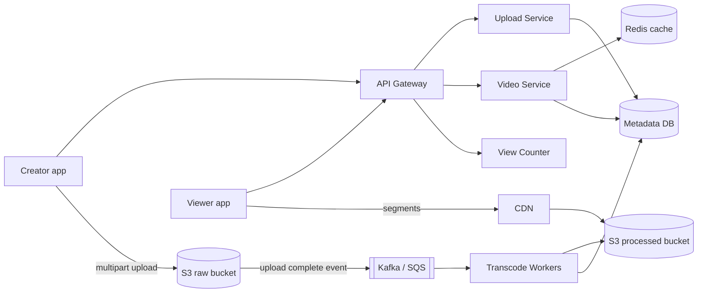
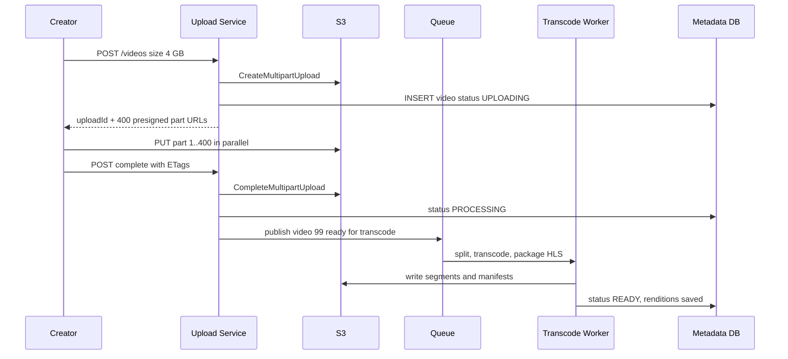
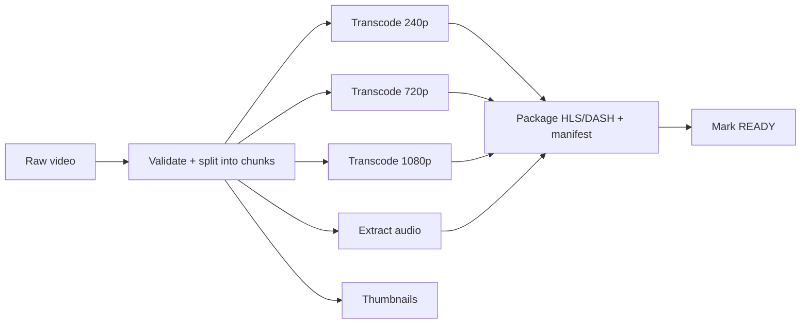

# Design YouTube / Netflix

**Ek line me:** creator video upload karta hai, system usse alag-alag resolutions me convert karta hai, aur viewers duniya bhar se bina buffering ke dekhte hain. Core challenge ye hai ki **bade files ka upload, heavy transcoding, aur petabytes ka video fast deliver** karna.

**Is question me interviewer kya check karta hai:** blob storage + CDN ka sahi use, async processing pipeline (queue + workers), adaptive streaming (HLS/DASH), aur read-heavy scale pe caching strategy.

---

## Step 1: Interviewer se ye confirm karo (3–5 min)

Design shuru karne se pehle ye sawal poochho:

| Tum poochho | Typical jawab | Design pe asar |
|---|---|---|
| "Scope me upload, processing aur watch hai? Search, comments, recommendations?" | Upload + watch core, baaki out of scope | Teen flows pe focus |
| "Max video size kitna?" | Up to 10 GB | Multipart + resumable upload |
| "Kitne uploads aur views?" | 500 hours video/min upload, 1B views/day | Bahut read-heavy, CDN must |
| "Upload ke turant baad video live hona chahiye?" | Kuch minute ka delay chalega | Transcoding async |
| "Live streaming scope me hai?" | Nahi | Sirf VOD (video on demand) |
| "View count exact aur real-time chahiye?" | Thoda delay aur approximate chalega | Async counting |

> **Bolo:** "Main 2 core flows design karunga: upload + processing, aur watch/streaming. Video bytes kabhi mere app servers se nahi guzrenge. Upload S3 pe direct, aur watch CDN se."

## Step 2: Requirements

**Functional**
1. Creator video upload kar sake (bada file, beech me network gaya to resume ho)
2. System video ko multiple resolutions me process kare (240p se 4K)
3. Viewer video dekh sake, network ke hisaab se quality khud badle
4. Video ka metadata (title, description, thumbnail) aur view count dikhe

**Non-functional**
- **Availability > consistency:** view count ya naya video thoda late dikhe to chalega
- **Low latency:** video start < 2 sec, buffering minimum
- **Durability:** upload hua video kabhi lose na ho
- **Scale:** read:write ~ 100:1 se zyada, global users

## Step 3: Estimation (sirf jo design badle)

- Upload: 500 hours/min. 1 hour raw ≈ 1–2 GB → **~1 PB raw/day**. Transcoded copies (5–6 resolutions) storage ~3x. Isliye S3 jaisa blob store, aur purane raw files cold storage me.
- Watch: 1B views/day ≈ **~12K video starts/sec**. Avg 5 Mbps × lakhon concurrent viewers = **Tbps level bandwidth**. Ye sirf CDN de sakta hai.
- Metadata reads: har view pe metadata → ~12K+ QPS. Cache se serve.

> **Bolo:** "Bottleneck bandwidth aur storage hai, QPS nahi. Isliye architecture ka centre blob storage + CDN hai, aur app servers sirf metadata aur URLs dete hain."

## Step 4: Core entities

- **User/Channel**: id, name, subscribers
- **Video**: id, channel_id, title, description, status (`UPLOADING`, `PROCESSING`, `READY`, `FAILED`), duration, created_at
- **VideoFile/Rendition**: video_id, resolution, codec, manifest_url, segment_prefix
- **Upload**: upload_id, video_id, parts_done, total_parts
- **ViewCount**: video_id, count (aggregated)

## Step 5: APIs

```http
POST /videos                {title, description, size}   → {videoId, uploadId, partUrls[]}
PUT  <presigned S3 part URL>                             → ETag   (client direct S3 pe)
POST /videos/{id}/complete  {uploadId, parts[{n, etag}]} → {status: PROCESSING}
GET  /videos/{id}                                        → metadata + manifestUrl
GET  <cdn>/videos/{id}/master.m3u8                       → HLS manifest
POST /videos/{id}/view      {watchedSec}                 → 202 Accepted
```

> **Bolo:** "Upload API sirf pre-signed URLs deti hai. 10 GB file app server se pass karne ka matlab hai servers ki bandwidth aur memory waste."

## Step 6: High-level design



**Har component kyun:**
- **Upload Service:** video row banata hai, S3 multipart start karta hai, part-wise pre-signed URLs deta hai.
- **S3 raw bucket:** original file. Durable (11 nines), sasta.
- **Queue + Transcode Workers:** heavy CPU ka kaam async. Workers autoscale hote hain queue length dekh ke.
- **S3 processed bucket + CDN:** HLS segments aur manifests. CDN edge pe cache, origin pe load kam.
- **Video Service + Redis:** metadata aur manifest URL. Hot videos ka metadata cache me.
- **View Counter:** views ka async aggregation, DB pe har view ki write nahi.

## Step 7: Main flow: upload aur processing



Watch flow simple hai: client `GET /videos/{id}` se manifest URL leta hai, phir saare segments CDN se aate hain. App server pe video bytes nahi aate.

## Step 8: Data model & DB choice

```sql
videos(id PK, channel_id, title, description, status, duration_sec,
       raw_s3_key, created_at)
renditions(video_id, resolution, bitrate, codec, manifest_key,
           PRIMARY KEY(video_id, resolution))
uploads(upload_id PK, video_id, total_parts, status, expires_at)
view_counts(video_id PK, count, updated_at)
```

- **Metadata → MySQL/Postgres (sharded by video_id):** structured, relations (channel, video, renditions). YouTube ne Vitess (sharded MySQL) use kiya.
- **Video bytes → S3:** DB me kabhi blob mat rakho.
- **View counts → Redis counters + periodic flush** to DB, ya Cassandra counters.

## Step 9: Deep dives (interviewer yahin pressure dalega)

### 9.1 Bada upload: pre-signed URL, multipart, resumable
- File ko **5–10 MB parts** me todo. Har part ka alag pre-signed URL, parallel upload. Ek part fail ho to sirf wahi retry.
- **Resumable:** network gaya to client `GET /uploads/{id}` se poochhe kaunse parts done hain (S3 `ListParts`), baaki bhejo.
- Pre-signed URL short TTL (15–60 min) ka, sirf ek key pe PUT allowed. Security bani rehti hai.
- Adhoore uploads ke liye S3 lifecycle rule: 7 din baad abort.

### 9.2 Transcoding pipeline: DAG of tasks

- Video ko **chunks (e.g. 10 sec)** me split karo. Har chunk × resolution ek alag task. Hazaron workers parallel kaam karte hain, 1 ghante ki video minutes me ready.
- Orchestrator (Temporal/Step Functions jaisa) DAG track karta hai: kaunsa task done, kaunsa retry.
- Har task **idempotent**: same input se same output key. Worker crash hua to task dobara queue me, overwrite safe.
- Pehle 360p/720p ready karke video live kar do, 4K baad me aaye.

### 9.3 Adaptive bitrate: HLS/DASH
- Har resolution ko **2–6 sec ke segments** me kaata jata hai. Master manifest (`master.m3u8`) me saari qualities ki list.
- Player bandwidth naapta hai aur har segment pe quality choose karta hai. Metro me 1080p, tunnel me 240p, bina rukawat.
- Segments static files hain, isliye CDN pe perfect cache hote hain.

### 9.4 CDN: popular vs long-tail
- **Popular videos (top ~10–20%) = ~80% traffic.** Inhe CDN edges pe pre-push karo (jaise naya Netflix show launch se pehle). Netflix ISP ke andar apne boxes (Open Connect) lagata hai.
- **Long-tail (purane, kam dekhe gaye):** CDN pe pull-based, pehli request origin se aayegi. Origin shield layer lagao taaki saare edges seedha S3 na maarein.
- Long-tail ke kam-popular resolutions cold storage me, ya on-demand transcode.

### 9.5 View counts
- Har view pe `UPDATE videos SET views=views+1` viral video pe hot row bana dega.
- View event Kafka me, stream processor 10–30 sec windows me aggregate karke DB me batch update. Redis counter se near real-time count dikhao.
- Fake views filter (same IP/user baar baar) bhi isi pipeline me.

## Step 10: Decision table (kya chuna, kyun, kya nahi)

| Decision | Kyun chuna | Kya nahi chuna, kyun |
|---|---|---|
| **Pre-signed URL, direct S3 upload** | App servers pe bandwidth/memory nahi lagti, S3 khud scale karta hai | **App server ke through upload:** 10 GB files servers ko choke kar dengi, extra hop |
| **Multipart + resumable** | Parallel parts, fail pe sirf ek part retry | **Single PUT:** 5 GB limit, network gaya to poora dobara |
| **Queue + workers, chunk-level DAG** | Async, autoscale, parallel, retry per task | **Upload request me sync transcode:** ghanton lagenge, request timeout |
| **HLS/DASH segments** | Adaptive quality, CDN-friendly static files | **Ek badi MP4 file:** quality switch nahi, slow network pe buffering |
| **CDN for delivery** | Tbps bandwidth, user ke paas edge, low latency | **Origin servers se serve:** bandwidth cost aur latency dono unacceptable |
| **SQL (sharded) for metadata** | Structured relations, moderate writes | **NoSQL only:** chalega, par joins/consistency ka faayda chhodna padega. Bytes ke liye DB bilkul nahi |
| **Async batched view counts** | Hot row se bachav, DB writes 1000x kam | **Har view pe DB increment:** viral video pe lock contention |

## Step 11: Failures & bottlenecks

| Kya fail hua | Kya hoga | Handle kaise |
|---|---|---|
| Upload beech me ruk gaya | Adhoora file | Resumable multipart, `ListParts` se resume. Lifecycle rule se cleanup |
| Transcode worker crash | Task adhoora | Queue visibility timeout ke baad task dobara, idempotent output |
| Corrupt/unsupported video | Pipeline fail | Validate step pehle, status `FAILED`, creator ko notify. Bar bar fail to DLQ |
| CDN edge miss storm (viral video) | Origin pe load | Origin shield + pre-warming popular content |
| Metadata DB hot shard | Ek viral video ki reads | Redis cache + CDN pe metadata response cache (short TTL) |
| Region down | Users ko video nahi | Multi-CDN + S3 cross-region replication |

## Step 12: "Isko aur better kaise karein" (end me khud bolo)

> "Agar aur time ho to main ye improve karunga:"
- **Per-title encoding** (Netflix style): cartoon kam bitrate me achha dikhta hai, action zyada maangta hai. Har video ke liye bitrate ladder alag, 20–30% bandwidth bachat
- **AV1/VP9 codecs** popular videos ke liye: same quality kam bytes me (transcode cost zyada, par sirf top videos pe)
- **Predictive CDN pre-warming:** trending signals dekh ke region-wise pehle se push karna
- **Duplicate upload detection:** content hash/fingerprint se same video dobara transcode na ho, aur copyright check (Content ID)
- **Storage tiering:** 1 saal se nahi dekha gaya video ki rare resolutions delete karke on-demand transcode
- Live streaming ke liye low-latency HLS ka separate pipeline

## Step 13: Interviewer ke likely follow-up sawal

- "10 GB upload me network gaya to?" → multipart, sirf baaki parts bhejo → Step 9.1
- "Transcoding fast kaise karoge?" → chunks me split karke parallel DAG → Step 9.2
- "Slow network pe buffering kaise rokoge?" → HLS/DASH adaptive bitrate → Step 9.3
- "Viral video pe CDN miss ho to?" → origin shield, request collapsing, pre-warm
- "View count consistent hai?" → nahi, eventually consistent. Batched aggregation, thoda delay acceptable
- "Video private ho to CDN pe kaise protect?" → signed CDN URLs/cookies with short expiry, DRM for paid content

## 2-minute recap (interview se pehle ye padho)

> YouTube me bottleneck bandwidth aur storage hai, QPS nahi. Upload: Upload Service video row banake S3 multipart ke pre-signed part URLs deta hai, client direct S3 pe parallel parts bhejta hai, resumable. Complete hone pe queue me event, transcode workers video ko chunks me todke DAG chalate hain (har resolution, audio, thumbnails), phir HLS/DASH segments + manifest S3 me likhte hain aur status READY. Watch: Video Service metadata (sharded SQL + Redis) aur manifest URL deta hai, saare segments CDN se aate hain aur player adaptive bitrate se quality badalta hai. Popular content CDN pe pre-push, long-tail pull + origin shield. View counts Kafka se async batched.

## Checklist

- [ ] Pre-signed URL + multipart + resumable upload ka flow bata sakta hoon
- [ ] Transcoding DAG (split, parallel transcode, package) draw kar sakta hoon
- [ ] HLS/DASH adaptive bitrate kaise kaam karta hai samjha sakta hoon
- [ ] CDN me popular vs long-tail strategy bata sakta hoon
- [ ] View count async kyun hai aur kaise aggregate hota hai bata sakta hoon
- [ ] Estimate se dikha sakta hoon ki bottleneck bandwidth hai, QPS nahi
- [ ] HLD diagram 5 min me bana sakta hoon
- [ ] Decision table ke 3 trade-offs bina dekhe bol sakta hoon
