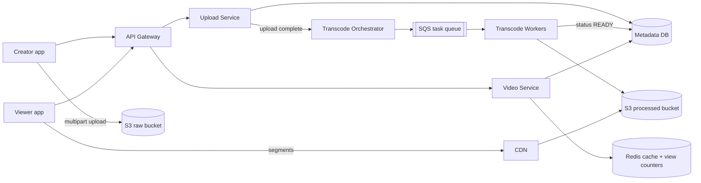
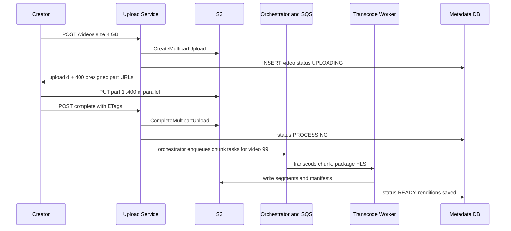
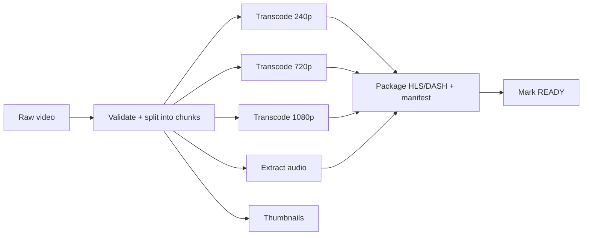

# Design YouTube / Netflix

**Ek line me:** creator video upload karta hai, system usse alag-alag resolutions me convert karta hai, aur viewers duniya bhar se bina buffering ke dekhte hain. Core challenge ye hai ki **bade files ka upload, heavy transcoding, aur petabytes ka video fast deliver** karna.

**Is question me interviewer kya check karta hai:** blob storage + CDN ka sahi use, async processing pipeline (queue + workers), adaptive streaming (HLS/DASH), aur read-heavy scale pe caching strategy.

---

## Step 1: Interviewer se ye confirm karo (3–5 min)

Design shuru karne se pehle ye sawal poochho:

| Tum poochho | Typical jawab | Design pe asar |
|---|---|---|
| "Scope me upload, processing aur watch hai? Search, comments, recommendations?" | Upload + watch core, baaki out of scope | Teen flows pe focus |
| "Max video size kitna?" | Up to 10 GB | Multipart + resumable upload |
| "Kitne uploads aur views?" | 500 hours video/min upload, 1B views/day | Bahut read-heavy, CDN must |
| "Upload ke turant baad video live hona chahiye?" | Kuch minute ka delay chalega | Transcoding async |
| "Live streaming scope me hai?" | Nahi | Sirf VOD (video on demand) |
| "View count exact aur real-time chahiye?" | Thoda delay aur approximate chalega | Async counting |

> **Bolo:** "Main 2 core flows design karunga: upload + processing, aur watch/streaming. Video bytes kabhi mere app servers se nahi guzrenge. Upload S3 pe direct, aur watch CDN se."

## Step 2: Requirements

**Functional (users ye kar sakein)**
1. Creator bada video (10 GB tak) upload kar sake, network gaya to resume ho
2. Upload ke kuch minute baad video multiple resolutions (240p–4K) me dekhne layak ho
3. Viewer video dekh sake, network ke hisaab se quality khud badle
4. Viewer metadata (title, thumbnail) aur approx view count dekh sake

**Out of scope:** search, comments, recommendations, live streaming, monetization.

**Non-functional (priority order me)**
1. **Durability:** upload hua video kabhi lose na ho (S3, 11 nines)
2. **Playback latency:** video start p95 < 2 sec, rebuffering < 1% watch time
3. **Availability:** 99.99% for watch path; upload/processing thoda degrade chalega
4. **Scale:** 1B views/day, 500 hours upload/min, read:write > 100:1, global users

**CAP choice:** watch path pe availability. Naya video ya view count kuch sec/min late dikhe to chalega (eventual). Sirf video status (`READY`) aur upload record pe strong consistency chahiye, jo ek SQL row me hai.

## Step 3: Estimation (sirf jo design badle)

- Upload: 500 hours/min. 1 hour raw ≈ 1–2 GB → **~1 PB raw/day**. Transcoded copies (5–6 resolutions) storage ~3x. Isliye S3 jaisa blob store, aur purane raw files cold storage me.
- Watch: 1B views/day ≈ **~12K video starts/sec**. 1B views × ~5 min avg ≈ ~3.5M concurrent viewers × 5 Mbps = **~15+ Tbps bandwidth**. Ye sirf CDN de sakta hai.
- Metadata reads: har view pe metadata → ~12K QPS avg, viral video pe ek hi row hot. Isliye cache.
- Transcode tasks: 500 hours/min ÷ 10 sec chunks × ~6 resolutions ≈ **~18K tasks/sec**. Ek managed queue (SQS) aur autoscaling workers ka kaam.

> **Bolo:** "Bottleneck bandwidth aur storage hai, QPS nahi. Isliye architecture ka centre blob storage + CDN hai, aur app servers sirf metadata aur URLs dete hain."

## Step 4: Core entities

- **User/Channel**: id, name, subscribers
- **Video**: id, channel_id, title, description, status (`UPLOADING`, `PROCESSING`, `READY`, `FAILED`), duration, created_at
- **VideoFile/Rendition**: video_id, resolution, codec, manifest_url, segment_prefix
- **Upload**: upload_id, video_id, parts_done, total_parts
- **ViewCount**: video_id, count (aggregated)

## Step 5: APIs

```http
POST /videos                {title, description, size}   → {videoId, uploadId, partUrls[]}
PUT  <presigned S3 part URL>                             → ETag   (client direct S3 pe)
POST /videos/{id}/complete  {uploadId, parts[{n, etag}]} → {status: PROCESSING}
GET  /videos/{id}                                        → metadata + manifestUrl
GET  <cdn>/videos/{id}/master.m3u8                       → HLS manifest
POST /videos/{id}/view      {watchedSec}                 → 202 Accepted
```

> **Bolo:** "Upload API sirf pre-signed URLs deti hai. 10 GB file app server se pass karne ka matlab hai servers ki bandwidth aur memory waste."

## Step 6: High-level design

**Simple v1 pehle:** ek API service + SQL DB (metadata) + S3 (video files). Client pre-signed URL se S3 pe upload kare, ek worker ffmpeg chalaye, viewer S3 se file le. Phir numbers isse todte hain: ~15 Tbps bandwidth → CDN. 18K transcode tasks/sec + retries → SQS + worker fleet + orchestrator. Viral video ki hot metadata row aur 12K views/sec → Redis.



**FR mapping:** FR1 → Upload Service + S3 raw (pre-signed multipart), FR2 → Orchestrator + SQS + Workers + S3 processed, FR3 → CDN + HLS, FR4 → Video Service + Redis + Metadata DB.

**Har component kyun:**
- **Upload Service:** video row + S3 multipart start + part-wise pre-signed URLs. Bytes isse nahi guzarte.
- **S3 raw / processed:** durability NFR (11 nines), PB/day pe sasta. DB me blob ya apna file server nahi.
- **Orchestrator + SQS + Workers:** ~18K chunk tasks/sec, har task ko retry, visibility timeout aur DLQ chahiye. Ye task distribution hai, isliye SQS. Kafka nahi: replay ya multiple consumer groups ki zaroorat nahi, aur per-message retry/DLQ SQS me built-in hai.
- **CDN:** ~15 Tbps bandwidth aur start < 2 sec. Simpler option (S3/origin se serve) bandwidth cost aur latency dono fail.
- **Video Service + Redis:** 12K metadata reads/sec, viral video ki hot row. Simpler option read replicas hai, par ek hot key pe cache hi bachata hai.
- **View counts (Redis `INCR` + flush):** 12K views/sec avg ek sharded Redis aaram se leta hai (~100K ops/sec per node). Har 30 sec DB me batch flush. Kafka tab jab view events ko analytics, fraud ML aur recommendations teeno ko replay ke saath chahiye.
- **Upload vs Video Service alag:** upload rare + heavy, watch 100x zyada aur latency-sensitive; alag scale. v1 me ek service chalegi.

## Step 7: Main flow: upload aur processing



Watch flow simple hai: client `GET /videos/{id}` se manifest URL leta hai, phir saare segments CDN se aate hain. App server pe video bytes nahi aate.

## Step 8: Data model & DB choice

```sql
videos(id PK, channel_id, title, description, status, duration_sec,
       raw_s3_key, created_at)
renditions(video_id, resolution, bitrate, codec, manifest_key,
           PRIMARY KEY(video_id, resolution))
uploads(upload_id PK, video_id, total_parts, status, expires_at)
view_counts(video_id PK, count, updated_at)
```

- **Metadata → MySQL/Postgres (sharded by video_id):** structured, relations (channel, video, renditions). YouTube ne Vitess (sharded MySQL) use kiya.
- **Video bytes → S3:** DB me kabhi blob mat rakho.
- **View counts → Redis counters + har 30 sec batch flush** to `view_counts`. Redis crash pe kuch sec ke views jaayenge, approx count ke liye acceptable.

## Step 9: Deep dives (interviewer yahin pressure dalega)

### 9.1 Bada upload: pre-signed URL, multipart, resumable
**NFR:** durability + 10 GB upload bina restart ke.
- File ko **5–10 MB parts** me todo. Har part ka alag pre-signed URL, parallel upload. Ek part fail ho to sirf wahi retry.
- **Resumable:** network gaya to client `GET /uploads/{id}` se poochhe kaunse parts done hain (S3 `ListParts`), baaki bhejo.
- Pre-signed URL short TTL (15–60 min) ka, sirf ek key pe PUT allowed. Security bani rehti hai.
- Adhoore uploads ke liye S3 lifecycle rule: 7 din baad abort.
- **Trade-off:** client logic complex (parts, ETags, resume), par server bandwidth zero.

### 9.2 Transcoding pipeline: DAG of tasks
**NFR:** upload ke kuch minute me video live, ~18K tasks/sec.

- Video ko **chunks (e.g. 10 sec)** me split karo. Har chunk × resolution ek alag task. Hazaron workers parallel kaam karte hain, 1 ghante ki video minutes me ready.
- Orchestrator (Temporal/Step Functions jaisa) DAG track karta hai aur ready tasks SQS me daalta hai. Worker message tabhi delete kare jab output S3 me likh de. 3 fail ke baad DLQ.
- Har task **idempotent**: same input se same output key. Worker crash hua to task dobara queue me, overwrite safe.
- Pehle 360p/720p ready karke video live kar do, 4K baad me aaye.
- **Trade-off:** chunk boundaries pe encode thoda kam efficient aur orchestrator ek extra system, par minutes vs ghanton ka fark.

### 9.3 Adaptive bitrate: HLS/DASH
**NFR:** start < 2 sec, rebuffering < 1%.
- Har resolution ko **2–6 sec ke segments** me kaata jata hai. Master manifest (`master.m3u8`) me saari qualities ki list.
- Player bandwidth naapta hai aur har segment pe quality choose karta hai. Metro me 1080p, tunnel me 240p, bina rukawat.
- Segments static files hain, isliye CDN pe perfect cache hote hain.
- **Trade-off:** har video ki 5–6 copies, storage ~3x.

### 9.4 CDN: popular vs long-tail
**NFR:** ~15 Tbps bandwidth, global low latency.
- **Popular videos (top ~10–20%) = ~80% traffic.** Inhe CDN edges pe pre-push karo (jaise naya Netflix show launch se pehle). Netflix ISP ke andar apne boxes (Open Connect) lagata hai.
- **Long-tail (purane, kam dekhe gaye):** CDN pe pull-based, pehli request origin se aayegi. Origin shield layer lagao taaki saare edges seedha S3 na maarein.
- Long-tail ke kam-popular resolutions cold storage me, ya on-demand transcode.
- **Trade-off:** long-tail ki pehli request slow (origin fetch), aur CDN bill sabse bada cost.

### 9.5 View counts
**NFR:** availability > accuracy; count approx aur ~30 sec late chalega.
- Har view pe `UPDATE videos SET views=views+1` viral video pe hot row bana dega.
- View API Redis me `INCR views:{videoId}` karti hai (12K/sec, sharded Redis ke liye chhota load). Ek job har 30 sec counters padh ke DB me batch update.
- Basic fake-view filter: `SET seen:{user}:{video} NX EX 3600`, already set hai to count mat karo.
- **Kafka kab:** jab views ko analytics, recommendations aur fraud ML alag-alag replay ke saath consume karein. Is scope me nahi.
- **Trade-off:** Redis crash pe last flush ke baad ke views ja sakte hain; approx count ke liye theek.

## Step 10: Decision table (kya chuna, kyun, kya nahi)

| Decision | Kyun chuna | Kya nahi chuna, kyun |
|---|---|---|
| **Pre-signed URL, direct S3 upload** | App servers pe bandwidth/memory nahi, S3 khud scale | **App server ke through:** 10 GB files servers choke. **Sacrifice:** client complex, server pe validation upload ke baad hi |
| **Multipart + resumable** | Parallel parts, fail pe sirf ek part retry | **Single PUT:** 5 GB limit, fail pe poora dobara. **Sacrifice:** parts + ETags ka tracking |
| **SQS + workers, chunk-level DAG** | ~18K tasks/sec, per-task retry, visibility timeout, DLQ built-in | **Kafka:** replay/multi-consumer ki zaroorat nahi, per-message retry khud banana padta. **Sync transcode:** request timeout. **Sacrifice:** orchestrator ek extra system |
| **HLS/DASH segments** | Adaptive quality, CDN-friendly static files | **Ek badi MP4:** quality switch nahi, buffering. **Sacrifice:** ~3x storage |
| **CDN for delivery** | ~15 Tbps, user ke paas edge | **Origin se serve:** bandwidth cost + latency unacceptable. **Sacrifice:** CDN sabse bada bill, long-tail pe miss |
| **SQL (sharded) for metadata** | Structured relations, moderate writes | **Cassandra/DynamoDB:** chalega, par joins aur status transitions ki consistency chhodni padegi. **Sacrifice:** sharding (Vitess) khud manage |
| **Redis cache + counters** | Hot metadata aur 12K views/sec INCR, DB writes ~1000x kam | **Har view pe DB increment:** hot row contention. **Kafka + stream processor:** 12K/sec ke liye overkill. **Sacrifice:** counts approx, crash pe kuch sec ke views lost |

## Step 11: Failures & bottlenecks

| Kya fail hua | Kya hoga | Handle kaise |
|---|---|---|
| Upload beech me ruk gaya | Adhoora file | Resumable multipart, `ListParts` se resume. Lifecycle rule se cleanup |
| Transcode worker crash | Task adhoora | Queue visibility timeout ke baad task dobara, idempotent output |
| Corrupt/unsupported video | Pipeline fail | Validate step pehle, status `FAILED`, creator ko notify. Bar bar fail to DLQ |
| CDN edge miss storm (viral video) | Origin pe load | Origin shield + pre-warming popular content |
| Metadata DB hot shard | Ek viral video ki reads | Redis cache + CDN pe metadata response cache (short TTL) |
| Region down | Users ko video nahi | Multi-CDN + S3 cross-region replication |

## Step 12: "Isko aur better kaise karein" (end me khud bolo)

> "Agar aur time ho to main ye improve karunga:"
- **Per-title encoding** (Netflix style): cartoon kam bitrate me achha dikhta hai, action zyada maangta hai. Har video ke liye bitrate ladder alag, 20–30% bandwidth bachat
- **AV1/VP9 codecs** popular videos ke liye: same quality kam bytes me (transcode cost zyada, par sirf top videos pe)
- **Predictive CDN pre-warming:** trending signals dekh ke region-wise pehle se push karna
- **Duplicate upload detection:** content hash/fingerprint se same video dobara transcode na ho, aur copyright check (Content ID)
- **Storage tiering:** 1 saal se nahi dekha gaya video ki rare resolutions delete karke on-demand transcode
- Live streaming ke liye low-latency HLS ka separate pipeline

## Step 13: Interviewer ke likely follow-up sawal

- "10 GB upload me network gaya to?" → multipart, sirf baaki parts bhejo → Step 9.1
- "Transcoding fast kaise karoge?" → chunks me split karke parallel DAG → Step 9.2
- "Slow network pe buffering kaise rokoge?" → HLS/DASH adaptive bitrate → Step 9.3
- "Viral video pe CDN miss ho to?" → origin shield, request collapsing, pre-warm
- "View count consistent hai?" → nahi, eventually consistent. Batched aggregation, thoda delay acceptable
- "Video private ho to CDN pe kaise protect?" → signed CDN URLs/cookies with short expiry, DRM for paid content
- "Transcode queue Kafka kyun nahi?" → ye task distribution hai: per-task retry, visibility timeout, DLQ chahiye, replay nahi. SQS fit hai
- **Senior signal:** khud bolo ki cost CDN bandwidth aur storage me hai, compute me nahi; viral video pe CDN miss storm origin ko maar sakta hai, isliye origin shield + request collapsing. Aur poison video (har baar crash) ko DLQ me daalo warna workers loop me.

## 2-minute recap (interview se pehle ye padho)

> YouTube me bottleneck bandwidth aur storage hai, QPS nahi. Upload: Upload Service video row banake S3 multipart ke pre-signed part URLs deta hai, client direct S3 pe parallel parts bhejta hai, resumable. Complete hone pe orchestrator video ko chunks me todke ~18K tasks/sec SQS me daalta hai (retry + DLQ, Kafka ki zaroorat nahi), workers DAG chalate hain (har resolution, audio, thumbnails), phir HLS/DASH segments + manifest S3 me likhte hain aur status READY. Watch: Video Service metadata (sharded SQL + Redis) aur manifest URL deta hai, saare segments CDN se aate hain aur player adaptive bitrate se quality badalta hai. Popular content CDN pe pre-push, long-tail pull + origin shield. View counts Redis `INCR` + har 30 sec DB me batch flush.

## Checklist

- [ ] Pre-signed URL + multipart + resumable upload ka flow bata sakta hoon
- [ ] Transcoding DAG (split, parallel transcode, package) draw kar sakta hoon
- [ ] HLS/DASH adaptive bitrate kaise kaam karta hai samjha sakta hoon
- [ ] CDN me popular vs long-tail strategy bata sakta hoon
- [ ] View count async kyun hai aur kaise aggregate hota hai bata sakta hoon
- [ ] Estimate se dikha sakta hoon ki bottleneck bandwidth hai, QPS nahi
- [ ] HLD diagram 5 min me bana sakta hoon
- [ ] Decision table ke 3 trade-offs bina dekhe bol sakta hoon
