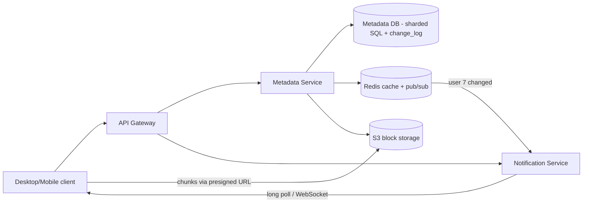
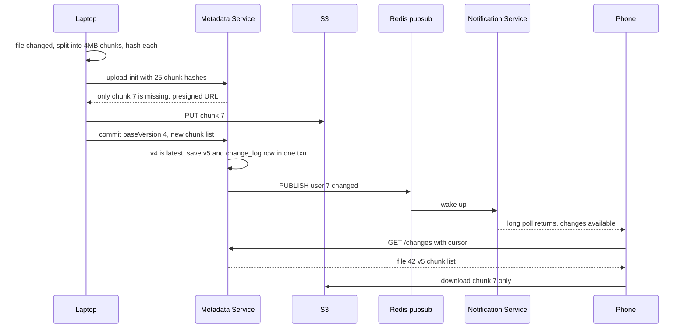
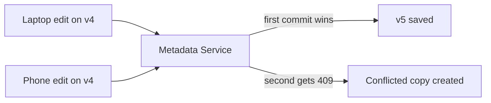

# Design Dropbox / Google Drive

**Ek line me:** files upload, saare devices pe sync, sharing. Core challenge: **badi files efficiently sync** (sirf badla hissa) aur **do devices pe ek saath edit** pe data lose na ho.

**Interviewer kya check karta hai:** metadata vs bytes alag, chunking + dedup, sync protocol (notifications), conflict handling, versioning.

---

## Step 1: Interviewer se ye confirm karo (3–5 min)

| Tum poochho | Typical jawab | Design pe asar |
|---|---|---|
| "Scope: upload, download, multi-device sync, sharing?" | Haan | 4 core flows |
| "Real-time collaborative editing (Google Docs jaisa)?" | Nahi, sirf file sync | OT/CRDT nahi, conflict copy chalega |
| "Max file size?" | 50 GB tak | Chunking must |
| "Kitne users aur data?" | 100M users, avg 10 GB/user | ~1 EB storage, dedup se bachat |
| "Sync kitni jaldi?" | Kuch seconds me | Push (long poll/WebSocket) |
| "Version history kitne din?" | 30 din | Purane chunks 30 din tak |

> **Bolo:** "Metadata aur bytes alag: metadata strongly consistent SQL me, bytes S3 me. Sync ke liye change notifications push."

## Step 2: Requirements

**Functional**
1. File (50 GB tak) upload/download, resume ke saath
2. Ek device pe change → baaki devices pe auto sync
3. File/folder share (view/edit permission)
4. Purane versions (30 din) dekh ke restore

**Out of scope:** real-time collaborative editing (OT/CRDT), full-text search, previews, billing.

**Non-functional (priority order)**
1. **Durability:** file kabhi lose na ho (11 nines, S3)
2. **Metadata consistency:** commit/rename/version strong, koi edit silently lose nahi
3. **Sync latency:** doosre device pe < 5 sec. Bandwidth: sirf badle chunks
4. **Scale + availability:** 100M users, ~1 EB, ~2.5K commits/sec, 99.99% (offline edit support)

**CAP:** metadata → consistency (primary down pe writes rukein, par conflict galat resolve na ho). Device sync eventual, cursor se recover.

## Step 3: Estimation (sirf jo design badle)

- 100M × 10 GB = **~1 EB**. Dedup (same PDF kai users ke paas) se 20–30% bachat.
- 1 EB / 4 MB = **~250B chunks** → chunk table sharded.
- 20M DAU × ~10 changes → **200M/day ≈ 2.5K/sec**, fan-out 2–3 devices.

> **Bolo:** "Storage EB level → bytes blob store me + dedup. Write QPS moderate → metadata ke liye sharded SQL theek."

## Step 4: Core entities

- **User**: id, email, quota_used
- **File**: id, owner_id, parent_folder_id, name, is_folder, latest_version, deleted
- **FileVersion**: file_id, version, chunk_hashes (ordered list), size, created_by_device, created_at
- **Chunk**: hash (SHA-256), s3_key, size, ref_count
- **Device**: id, user_id, last_cursor (kahan tak sync hua)
- **Share/ACL**: file_id, user_id, role (`VIEWER`, `EDITOR`)

## Step 5: APIs

```http
POST /files/upload-init  {path, size, chunkHashes[]}    → {fileId, missingChunks[{hash, presignedUrl}]}
PUT  <presigned S3 URL>                                 → 200   (sirf missing chunks)
POST /files/{id}/commit  {baseVersion, chunkHashes[]}   → {version} ya 409 conflict
GET  /files/{id}?version=5                              → {chunkHashes, presigned download URLs}
GET  /changes?cursor=abc123                             → {changes[], newCursor}   (long poll)
POST /files/{id}/share   {email, role}                  → 200
```

> **Bolo:** "Client hashes bhejta hai, server missing batata hai, sirf woh upload: dedup + delta sync dono."

## Step 6: High-level design

**v1:** Metadata Service → Postgres + S3 (pre-signed), devices `/changes?cursor=` poll karein. Phir:
- 100M devices ka polling → long-poll Notification Service
- ~1 EB, 250B chunk rows → sharded SQL
- Har request pe ACL parent-chain walk → Redis cache



**FR mapping:** FR1 → client chunking + pre-signed S3 + Metadata commit, FR2 → change_log + Notification Service + cursor, FR3 → `shares` ACL in Metadata DB, FR4 → `file_versions` + S3 chunks.

**Har component kyun** (alternatives Step 10 me):
- **Client (sync agent):** file watcher, chunking, hashing, local DB of last synced state.
- **Metadata + sharded SQL:** sharding sirf EB-scale rows ke liye.
- **change_log:** sync ka source of truth + outbox.
- **Redis pub/sub + Notification Service:** `PUBLISH user:7` → long poll hold karne wala node jage. Miss chalega (cursor).
- **Redis cache:** ACL parent chain (5–10 levels) + hot folder listings.

## Step 7: Main flow: file edit aur doosre device pe sync



## Step 8: Data model & DB choice

```sql
files(id PK, owner_id, parent_id, name, is_folder, latest_version, deleted_at,
      UNIQUE(parent_id, name))
file_versions(file_id, version, size, chunk_hashes JSON, device_id, created_at,
      PRIMARY KEY(file_id, version))
chunks(hash PK, s3_key, size, ref_count)
shares(file_id, user_id, role, PRIMARY KEY(file_id, user_id))
change_log(user_id, seq, file_id, version, op, PRIMARY KEY(user_id, seq))
```

- **Metadata → MySQL/Postgres, sharded by owner_id (namespace):** move/rename ek shard, ek transaction. Dropbox: Edgestore on MySQL.
- **Chunks → S3** (`chunks/<sha256>`) → automatic dedup.
- **change_log:** per user monotonic `seq`, commit ke same txn me. Device cursor = last `seq`.
- **`chunks` hash se sharded** (250B rows), metadata owner se → `ref_count` commit txn me nahi; GC re-verify kare.

## Step 9: Deep dives (interviewer yahin pressure dalega)

### 9.1 Chunking + dedup + delta sync
**NFR:** bandwidth (sirf badle chunks) + 50 GB resumable upload.
- **4 MB chunks**, har chunk ka SHA-256. Version = ordered chunk list.
- 1 GB file me ek line badli → sirf 1 chunk upload. Hash `chunks` table me hai → skip (cross-user dedup bhi).
- **Fixed-size problem:** shuru me 1 byte add → boundaries shift. Fix: **content-defined chunking** (Rabin rolling hash).
- **Security:** cross-user dedup se file existence leak; sensitive setups me per-user dedup.
- **Trade-off:** client CPU + 250B rows vs bandwidth + storage bachat.

### 9.2 Sync: devices ko kaise pata chale?
**NFR:** < 5 sec, notification miss pe bhi data na chhoote.
- **Polling 30 sec:** 100M × 30 sec = ~3M faltu req/sec.
- **Long polling:** `GET /changes?cursor=X` hold till change (max 60 sec). Dropbox yahi; firewall-friendly. **WebSocket** mobile/web pe.
- Notification sirf "kuch badla"; data cursor se `/changes`. Miss ya offline → last cursor se sab milega.
- Shared folder change → har member ko publish.
- **Trade-off:** lakhon open connections (stateful nodes), par 100x kam requests.

### 9.3 Conflict handling
**NFR:** koi edit chupchaap lose na ho.
- Commit me `baseVersion` (jis version pe edit shuru kiya) → **optimistic concurrency**.
- `UPDATE files SET latest_version=5 WHERE id=42 AND latest_version=4`. 0 rows → **409 conflict**.
- Conflict pe doosri file **"report (Vaibhav's conflicted copy).docx"**; user khud merge kare (trade-off: auto-merge nahi).
- Real-time collaborative edit (OT/CRDT) alag design: [Google Docs](../02-questions/t2-19-google-docs.md).



### 9.4 Versioning, sharing, pre-signed URLs
**NFR:** durability + 30 din history bina storage double kiye.
- **Versioning:** naya version = nayi chunk list, chunks reuse → sasta. `ref_count` 0 + 30 din → GC.
- **Sharing:** `shares` ACL; children inherit (parent chain check, cached).
- **Pre-signed URLs:** direct S3, TTL 15 min, permission check ke baad. Public link = random token.
- **Trade-off:** inherited ACL check mehenga → cache; revoke pe invalidate.

## Step 10: Decision table (kya chuna, kyun, kya nahi)

| Decision | Kyun chuna | Kya nahi chuna, kyun |
|---|---|---|
| **Metadata aur bytes alag** | Metadata transactional, bytes blob me sasta | **BLOB column:** DB bloat, slow backup. **Sacrifice:** orphan chunks, GC chahiye |
| **4 MB chunks + SHA-256** | Delta sync, dedup, parallel + resumable | **Poori file:** 1 line pe 1 GB dobara. **Sacrifice:** client CPU, badi chunk table |
| **Content hash as S3 key** | Same content ek baar, free dedup | **Random UUID:** 1000 copies. **Sacrifice:** existence leak risk |
| **Sharded SQL for metadata** | Move/rename transaction, unique names, strong consistency | **Cassandra/DynamoDB:** multi-row txn nahi. **Sacrifice:** cross-shard share/move |
| **change_log table + Redis pub/sub** for sync | ~2.5K/sec, cursor replay, sasta wake-up | **Kafka:** ek consumer, extra ops. **Sacrifice:** naye consumers (search, audit) pe Kafka |
| **Long poll + cursor** for sync | Near real-time, firewall-friendly, cursor recovery | **Polling:** ~3M req/sec. **Push data:** miss = out of sync. **Sacrifice:** open conns |
| **Optimistic concurrency + conflicted copy** | Data lose nahi, lock wait nahi | **LWW:** silent data loss. **File lock:** offline device pakde. **Sacrifice:** manual merge |
| **Pre-signed URLs** | Bytes app servers se nahi | **Proxy:** bandwidth bottleneck. **Sacrifice:** leaked URL TTL tak valid |

## Step 11: Failures & bottlenecks

| Kya fail hua | Kya hoga | Handle kaise |
|---|---|---|
| Upload beech me ruka | Commit nahi hua | Version nahi bana; resume pe missing chunks |
| Chunks upload, commit fail | Orphan chunks S3 me | GC: unreferenced + 7 din purane → delete |
| Notification miss | Device ko pata nahi | Cursor `/changes`, next long poll |
| Metadata shard down | Files read-only/unavailable | Primary-replica failover; bytes S3 me safe |
| Hot shared folder | Shard load, bada fan-out | Replicas + cache, batch notifications |
| S3 region outage | Downloads fail | Cross-region replication, multi-AZ |

## Step 12: "Isko aur better kaise karein" (end me khud bolo)

- **Content-defined chunking:** beech me insert pe sirf 1–2 chunks badlein
- **Compression** upload se pehle (text 5–10x chhota)
- **LAN sync:** same office ke laptops ek doosre se chunks lein
- **Cold tiering:** 1 saal se unopened → S3 Glacier/IA, cost 50%+ kam
- **Batch commits:** 1000 chhoti files (npm folder) ek API call me

## Step 13: Interviewer ke likely follow-up sawal

- "1 GB file me 1 byte badla?" → sirf ek 4 MB chunk (9.1)
- "Do devices ne offline same file edit ki?" → baseVersion check, doosra conflicted copy (9.3)
- "Dedup se security risk?" → existence leak; per-user dedup ya convergent encryption
- "Delete pe storage turant free?" → nahi: soft delete + 30 din history, phir ref_count GC
- "Folder rename me 1 lakh files?" → sirf folder row; children `parent_id` se linked
- "Kafka kyun nahi?" → ~2.5K/sec, ek consumer, change_log hi durable log; naye consumers aayein tab outbox → Kafka
- **Senior signal:** khud bolo ki company-wide shared folder hot shard aur fan-out problem banega (ek commit → 10K users ko wake-up), aur shard boundaries ke paar share/move cross-shard transaction maangta hai; isliye shared folder ko apna namespace do.

## 2-minute recap (interview se pehle ye padho)

> Metadata aur bytes alag. 4 MB chunks + SHA-256 → sirf missing chunks S3 pe (dedup + delta sync). Commit = naya version; `baseVersion` → 409 → conflicted copy. Metadata sharded SQL (by owner). Same txn me `change_log` row; Redis pub/sub → long poll → cursor se changes. Versions chunks reuse, ref_count GC. ACL table, short-TTL pre-signed URLs.

## Checklist

- [ ] Metadata service aur block storage alag kyun hain samjha sakta hoon
- [ ] Chunking + content hash se dedup aur delta sync explain kar sakta hoon
- [ ] Long poll + cursor based sync flow draw kar sakta hoon
- [ ] baseVersion se conflict detect karna aur conflicted copy bata sakta hoon
- [ ] Versioning aur garbage collection (ref_count) samjha sakta hoon
- [ ] Sharing permissions aur pre-signed URLs ka role bata sakta hoon
- [ ] HLD diagram 5 min me bana sakta hoon
- [ ] Decision table ke 3 trade-offs bina dekhe bol sakta hoon
