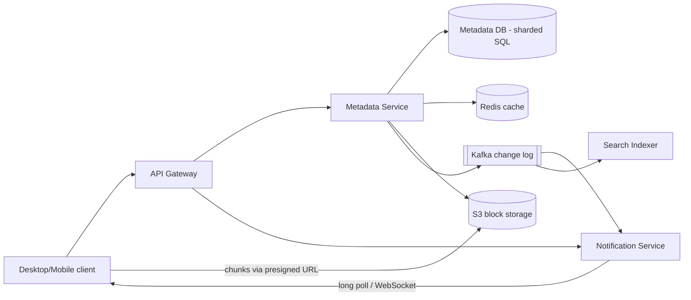
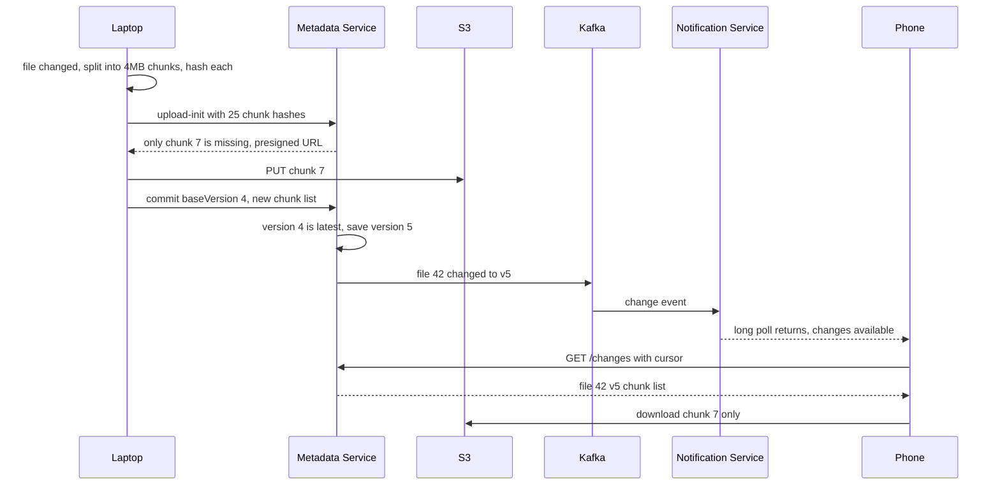
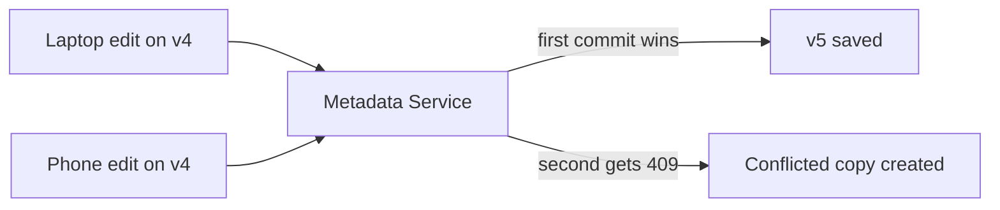

# Design Dropbox / Google Drive

**Ek line me:** user apni files upload karta hai, woh uske saare devices (laptop, phone) pe sync ho jaati hain, aur woh doosron ke saath share kar sakta hai. Core challenge ye hai ki **badi files efficiently sync hon** (sirf badla hua hissa), aur **do devices pe ek saath edit** ho to data lose na ho.

**Is question me interviewer kya check karta hai:** metadata aur file bytes ko alag rakhna, chunking + dedup, sync protocol (notifications), conflict handling, aur versioning.

---

## Step 1: Interviewer se ye confirm karo (3–5 min)

Design shuru karne se pehle ye sawal poochho:

| Tum poochho | Typical jawab | Design pe asar |
|---|---|---|
| "Scope me upload, download, multi-device sync aur sharing hai?" | Haan | 4 core flows |
| "Real-time collaborative editing (Google Docs jaisa) chahiye?" | Nahi, sirf file sync | OT/CRDT nahi chahiye, conflict copy chalega |
| "Max file size?" | 50 GB tak | Chunking must |
| "Kitne users aur data?" | 100M users, avg 10 GB/user | ~1 EB storage, dedup se bachat |
| "Sync kitni jaldi dikhna chahiye?" | Kuch seconds me | Push notification (long poll/WebSocket) |
| "Version history kitne din?" | 30 din | Purane chunks 30 din tak rakhne hain |

> **Bolo:** "Main metadata (files, folders, versions, chunks ki list) aur actual bytes (chunks) ko bilkul alag rakhunga. Metadata strongly consistent SQL me, bytes S3 me. Sync ke liye clients ko change notifications push honge."

## Step 2: Requirements

**Functional**
1. User file upload/download kar sake (bade files bhi, resume ke saath)
2. Ek device pe change ho to baaki devices pe automatic sync
3. File/folder share kar sake (view/edit permission)
4. Purane versions dekh ke restore kar sake

**Non-functional**
- **Durability:** file kabhi lose na ho (sabse important)
- **Consistency:** metadata strongly consistent, sab devices eventually same state pe
- **Efficiency:** sirf badle hue chunks transfer hon (bandwidth bachao)
- **Availability:** 99.99%, offline edit ka support

## Step 3: Estimation (sirf jo design badle)

- 100M users × 10 GB = **~1 EB**. Dedup (same file kai users ke paas, jaise same PDF) se 20–30% bachat.
- 4 MB chunk → 1 EB / 4 MB = **~250B chunks**. Chunk metadata table bahut badi, sharding chahiye.
- Daily active 20M, har ek ~10 file changes → **200M changes/day ≈ 2.5K/sec**. Notifications ka fan-out har user ke 2–3 devices tak.

> **Bolo:** "Storage EB level pe hai, isliye bytes S3 jaise blob store me aur dedup zaroori hai. Write QPS moderate hai, isliye metadata ke liye sharded SQL theek hai."

## Step 4: Core entities

- **User**: id, email, quota_used
- **File**: id, owner_id, parent_folder_id, name, is_folder, latest_version, deleted
- **FileVersion**: file_id, version, chunk_hashes (ordered list), size, created_by_device, created_at
- **Chunk**: hash (SHA-256), s3_key, size, ref_count
- **Device**: id, user_id, last_cursor (kahan tak sync hua)
- **Share/ACL**: file_id, user_id, role (`VIEWER`, `EDITOR`)

## Step 5: APIs

```http
POST /files/upload-init  {path, size, chunkHashes[]}    → {fileId, missingChunks[{hash, presignedUrl}]}
PUT  <presigned S3 URL>                                 → 200   (sirf missing chunks)
POST /files/{id}/commit  {baseVersion, chunkHashes[]}   → {version} ya 409 conflict
GET  /files/{id}?version=5                              → {chunkHashes, presigned download URLs}
GET  /changes?cursor=abc123                             → {changes[], newCursor}   (long poll)
POST /files/{id}/share   {email, role}                  → 200
```

> **Bolo:** "Client pehle chunk hashes bhejta hai. Server batata hai kaunse chunks uske paas nahi hain. Sirf woh upload hote hain. Isi se dedup aur delta sync dono milte hain."

## Step 6: High-level design



**Har component kyun:**
- **Client (sync agent):** file watcher, chunking, hashing, local DB of last synced state. Bahut kaam client pe hota hai.
- **Metadata Service:** files, folders, versions, chunk list, permissions. Saari consistency ka kaam yahin.
- **S3 block storage:** chunks content hash se store (`chunks/<sha256>`). Durable, sasta.
- **Kafka change log:** har commit ek event. Notifications, search index, audit sab isse consume karte hain.
- **Notification Service:** user ke online devices ko "kuch badla hai" batata hai.

## Step 7: Main flow: file edit aur doosre device pe sync



## Step 8: Data model & DB choice

```sql
files(id PK, owner_id, parent_id, name, is_folder, latest_version, deleted_at,
      UNIQUE(parent_id, name))
file_versions(file_id, version, size, chunk_hashes JSON, device_id, created_at,
      PRIMARY KEY(file_id, version))
chunks(hash PK, s3_key, size, ref_count)
shares(file_id, user_id, role, PRIMARY KEY(file_id, user_id))
change_log(user_id, seq, file_id, version, op, PRIMARY KEY(user_id, seq))
```

- **Metadata → MySQL/Postgres, sharded by owner_id (namespace):** ek user ki saari files ek shard pe, folder move/rename ek transaction me. Dropbox ne yahi kiya (Edgestore on MySQL).
- **Chunks → S3**, key = content hash. Same content = same key = automatic dedup.
- **change_log** per user ek monotonically badhta `seq`. Device ka cursor bas last `seq` hai.

## Step 9: Deep dives (interviewer yahin pressure dalega)

### 9.1 Chunking + dedup + delta sync
- File ko **4 MB chunks** me todo, har chunk ka SHA-256. File version = chunks ki ordered list.
- 1 GB file me ek line badli → sirf 1 chunk (4 MB) upload, 1 GB nahi.
- Dedup: upload-init me server `chunks` table me hash dekhta hai. Hai to skip. Doosre user ne same file upload ki thi to bhi skip (cross-user dedup).
- **Fixed-size chunk ki problem:** file ke shuru me 1 byte add kiya to saare boundaries shift, saare chunks naye. Fix: **content-defined chunking** (rolling hash, Rabin fingerprint) jo boundaries content se decide karta hai.
- Security note: cross-user dedup se "ye file kisi ke paas hai ya nahi" leak ho sakta hai. Sensitive setups me per-user dedup.

### 9.2 Sync: devices ko kaise pata chale?
- **Polling har 30 sec:** simple, par 100M devices × faltu requests.
- **Long polling:** client `GET /changes?cursor=X` bhejta hai, server tab tak hold karta hai jab tak change na ho (max 60 sec). Dropbox yahi use karta hai. Firewall-friendly.
- **WebSocket:** bi-directional, mobile/web pe achha.
- Notification sirf "kuch badla" batata hai. Asli data client cursor se `/changes` pe fetch karta hai. Notification miss ho gaya to bhi next poll pe sab mil jayega.
- Offline device wapas aaya → apne last cursor se saare changes le leta hai.

### 9.3 Conflict handling
- Commit me client `baseVersion` bhejta hai (jis version pe edit shuru kiya). Ye **optimistic concurrency** hai.
- `UPDATE files SET latest_version=5 WHERE id=42 AND latest_version=4`. 0 rows → **409 conflict**.
- Conflict pe data lose nahi karte: doosre wale ki file **"report (Vaibhav's conflicted copy).docx"** naam se save. User khud merge kare.
- Collaborative real-time edit chahiye to alag design (OT/CRDT), wo [Google Docs](../02-questions/t2-19-google-docs.md) me.



### 9.4 Versioning, sharing, pre-signed URLs
- **Versioning:** naya version = nayi chunk list. Purane chunks reuse hote hain, isliye versions saste hain. `ref_count` 0 hone pe aur 30 din baad garbage collector chunks delete kare.
- **Sharing:** `shares` table me ACL. Folder share hua to child files pe permission inherit (check karte waqt parent chain dekho, cache karo).
- **Pre-signed URLs:** download/upload hamesha direct S3 se, short TTL (15 min). Metadata Service permission check karke hi URL deta hai. Public link ke liye ek random token wala share link.

## Step 10: Decision table (kya chuna, kyun, kya nahi)

| Decision | Kyun chuna | Kya nahi chuna, kyun |
|---|---|---|
| **Metadata aur bytes alag** | Metadata chhota, transactional. Bytes bade, blob store me sasta | **Sab ek DB me (BLOB column):** DB bloat, backup slow, scale nahi hoga |
| **4 MB chunks + SHA-256** | Delta sync, dedup, parallel aur resumable upload | **Poori file upload:** 1 line change pe 1 GB dobara, bandwidth waste |
| **Content hash as S3 key** | Same content ek baar store, dedup free me | **Random UUID keys:** same file ki 1000 copies, storage waste |
| **Sharded SQL for metadata** | Folder move/rename transaction, unique names, strong consistency | **Cassandra:** multi-row transactions nahi, conflicting renames handle karna mushkil |
| **Long poll + cursor** for sync | Near real-time, firewall-friendly, miss hua to cursor se recover | **Fixed polling:** latency zyada aur faltu load. **Sirf push data:** miss hua to device out of sync |
| **Optimistic concurrency + conflicted copy** | Data kabhi lose nahi, lock ka wait nahi | **Last-write-wins:** ek user ka kaam chupchaap delete. **File lock:** offline device lock pakad ke baith jayega |
| **Pre-signed URLs** | Bytes app servers se nahi guzarte | **Proxy through servers:** bandwidth bottleneck, extra cost |

## Step 11: Failures & bottlenecks

| Kya fail hua | Kya hoga | Handle kaise |
|---|---|---|
| Upload beech me ruka | Kuch chunks gaye, commit nahi hua | Commit tak version nahi banta. Resume pe missing chunks hi bhejo |
| Chunk upload hua par commit fail | Orphan chunks S3 me | GC job: kisi version me referenced nahi aur 7 din purane, to delete |
| Notification miss | Device ko pata nahi chala | Cursor based `/changes`, next long poll pe sab milega |
| Metadata shard down | Us user ki files read-only/unavailable | Primary-replica, auto failover. Bytes S3 me safe |
| Hot shared folder (company-wide) | Ek shard pe load, bada fan-out | Read replicas + cache, notifications batch karo |
| S3 region outage | Downloads fail | Cross-region replication, durability ke liye multi-AZ |

## Step 12: "Isko aur better kaise karein" (end me khud bolo)

> "Agar aur time ho to main ye improve karunga:"
- **Content-defined chunking** (rolling hash) taaki file ke beech me insert pe bhi sirf 1–2 chunks badlein
- **Compression** chunks pe upload se pehle (text files 5–10x chhoti)
- **LAN sync:** same office ke do laptops chunks ek doosre se le lein, internet bandwidth bache
- **Cold storage tiering:** 1 saal se nahi khuli files S3 Glacier/IA me, cost 50%+ kam
- **Client-side encryption** option sensitive users ke liye (dedup per-user ho jayega)
- **Batch commits:** 1000 chhoti files ek saath (npm folder) ek API call me

## Step 13: Interviewer ke likely follow-up sawal

- "1 GB file me 1 byte badla to kitna upload hoga?" → sirf ek 4 MB chunk → Step 9.1
- "Do devices ne offline same file edit ki?" → baseVersion check, doosra conflicted copy → Step 9.3
- "Device ko kaise pata ki change hua?" → long poll + cursor → Step 9.2
- "Dedup se security risk?" → hash se file existence leak. Per-user dedup ya convergent encryption
- "File delete ki to storage turant free?" → nahi, soft delete + 30 din version history, phir ref_count GC
- "Folder rename me 1 lakh files?" → sirf folder row ka name badlo, children `parent_id` se linked hain, unhe chhoona nahi padta

## 2-minute recap (interview se pehle ye padho)

> Dropbox me metadata aur bytes alag hain. Client file ko 4 MB chunks me todta hai aur har chunk ka SHA-256 nikaalta hai. Upload-init me hashes bhejta hai, server batata hai kaunse missing hain, sirf woh pre-signed URL se seedha S3 jaate hain (dedup + delta sync). Commit pe nayi chunk list ek naya version banti hai, `baseVersion` check se optimistic concurrency, aur conflict pe "conflicted copy". Metadata sharded SQL (owner ke hisaab se) me, strongly consistent. Har commit Kafka change log me jaata hai, Notification Service long poll/WebSocket se baaki devices ko jagata hai, aur device apne cursor se changes fetch karta hai. Versions purane chunks reuse karte hain, GC ref_count se. Sharing ACL table se, downloads short-TTL pre-signed URLs se.

## Checklist

- [ ] Metadata service aur block storage alag kyun hain samjha sakta hoon
- [ ] Chunking + content hash se dedup aur delta sync explain kar sakta hoon
- [ ] Long poll + cursor based sync flow draw kar sakta hoon
- [ ] baseVersion se conflict detect karna aur conflicted copy bata sakta hoon
- [ ] Versioning aur garbage collection (ref_count) samjha sakta hoon
- [ ] Sharing permissions aur pre-signed URLs ka role bata sakta hoon
- [ ] HLD diagram 5 min me bana sakta hoon
- [ ] Decision table ke 3 trade-offs bina dekhe bol sakta hoon
