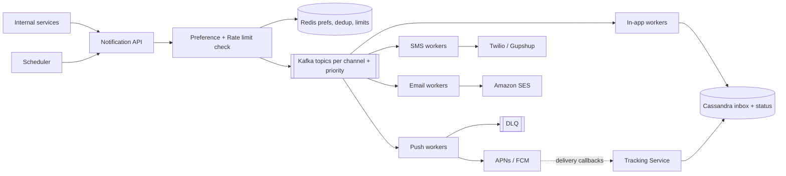
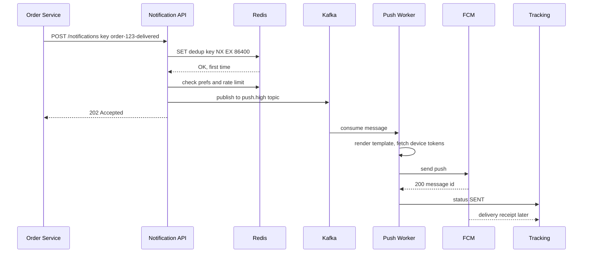
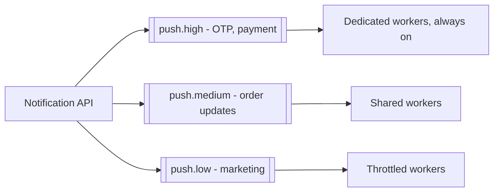

# Design a Notification System

**Ek line me:** baaki services (orders, payments, marketing) ek API call karti hain, aur system user ko push, SMS, email ya in-app notification bhejta hai, uski preferences aur limits ka dhyan rakhte hue. Core challenge ye hai ki **notification na chhute, do baar na jaaye, aur slow third-party providers poore system ko slow na karein**.

**Is question me interviewer kya check karta hai:** async queue based design, per-channel isolation, retries + DLQ, idempotency, priority (OTP vs marketing), aur third-party failures handle karna.

---

## Step 1: Interviewer se ye confirm karo (3–5 min)

Design shuru karne se pehle ye sawal poochho:

| Tum poochho | Typical jawab | Design pe asar |
|---|---|---|
| "Kaunse channels? Push, SMS, email, in-app?" | Charon | Har channel ka alag queue + worker |
| "Transactional (OTP, order update) aur marketing dono?" | Haan | Priority queues, OTP sabse pehle |
| "Scale kitna?" | ~100M notifications/day, campaign pe 10M ek saath | Kafka + horizontal workers |
| "Delivery guarantee? Duplicate chalega?" | At-least-once, par user ko duplicate nahi dikhna chahiye | Idempotency key + dedup |
| "User preferences aur opt-out?" | Haan, aur quiet hours bhi | Preference check pipeline me |
| "Scheduled notifications?" | Haan, "kal 9 baje bhejo" | Scheduler component |

> **Bolo:** "Main isse ek async pipeline ki tarah design karunga: API request validate karke Kafka me daalegi, aur har channel ke workers apne provider (APNs, FCM, Twilio, SES) ko bhejenge. Transactional aur marketing traffic alag priority pe chalega."

## Step 2: Requirements

**Functional**
1. Internal services ek API se notification bhej sakein (single user ya bulk/campaign)
2. Channels: push (iOS/Android), SMS, email, in-app
3. User preferences (opt-out, channel choice, quiet hours) aur rate limits respect hon
4. Templates, scheduling, aur delivery status tracking (sent, delivered, opened)

**Non-functional**
- **Reliability:** notification lose na ho (at-least-once)
- **No duplicates for user:** same OTP do baar nahi
- **Low latency for transactional:** OTP < 5 sec me
- **Scale:** spiky (campaigns, IPL match end), third-party failures se isolation

## Step 3: Estimation (sirf jo design badle)

- 100M/day ≈ **~1.2K/sec avg**. Campaign: 10M in 10 min ≈ **~17K/sec peak**. Isliye queue buffer chahiye.
- Providers ki limits: SMS provider ~1K/sec, APNs/FCM high. **Throughput provider decide karta hai, hum nahi.** Workers ko provider rate pe throttle karna hai.
- Status events (sent/delivered/opened) ~3x notifications → ~300M/day. Write-heavy, Cassandra jaisa store.

> **Bolo:** "Bottleneck mere servers nahi, third-party providers hain. Isliye beech me Kafka buffer, per-channel workers, aur provider-wise rate limiting rakhunga."

## Step 4: Core entities

- **Notification**: id, user_id, type, channel, priority, template_id, payload, idempotency_key, status, scheduled_at
- **Template**: id, channel, locale, subject, body (`"Hi {{name}}, order {{orderId}} delivered"`)
- **UserPreference**: user_id, channel, category (`OTP`, `ORDER`, `PROMO`), enabled, quiet_hours
- **DeviceToken**: user_id, platform (iOS/Android), token, last_active
- **DeliveryEvent**: notification_id, status (`QUEUED`, `SENT`, `DELIVERED`, `FAILED`, `OPENED`), provider, timestamp

## Step 5: APIs

```http
POST /notifications
     Header: Idempotency-Key: order-123-delivered
     {userId, type: ORDER_DELIVERED, channels: [push, sms],
      templateId, params: {orderId: 123}, priority: HIGH, sendAt?}
     → 202 {notificationId}
POST /notifications/bulk    {segmentId, templateId, sendAt}   → 202 {campaignId}
GET  /notifications/{id}                                      → status per channel
PUT  /users/{id}/preferences {category, channel, enabled}     → 200
GET  /users/{id}/inbox?cursor=...                             → in-app notifications
```

> **Bolo:** "API 202 Accepted return karti hai, kyunki actual sending async hai. Caller ko provider ke response ka wait nahi karna padta."

## Step 6: High-level design



**Har component kyun:**
- **Notification API:** validate, idempotency check, template resolve, phir Kafka me daal ke 202.
- **Preference + Rate limit check:** opt-out, quiet hours, per-user limit (max 3 promo/day). Redis me cached.
- **Kafka topics per channel:** SMS provider down ho to sirf SMS topic ruke, push chalta rahe. Priority ke liye alag topics.
- **Channel workers:** stateless, provider ka SDK call, retry logic. Provider rate ke hisaab se scale.
- **DLQ:** baar baar fail hone wale messages alag, investigate/replay ke liye.
- **Tracking Service:** provider callbacks (delivered, bounced) aur opens/clicks record karta hai.

## Step 7: Main flow: order delivered notification



## Step 8: Data model & DB choice

```sql
-- Postgres: low write, config type data
templates(id PK, channel, locale, version, subject, body)
user_preferences(user_id, category, channel, enabled, quiet_start, quiet_end,
                 PRIMARY KEY(user_id, category, channel))
device_tokens(user_id, token PK, platform, last_active)
```

```text
Cassandra (write-heavy, time-ordered):
notifications_by_user  PK user_id, CK created_at DESC → in-app inbox
delivery_events        PK notification_id, CK ts      → status history
```

- **Templates, preferences → Postgres + Redis cache:** chhota data, bahut reads.
- **Notification log, status, inbox → Cassandra:** 300M+ writes/day, user ke hisaab se partition, time se sort.
- **Dedup keys, rate limit counters → Redis** with TTL.

## Step 9: Deep dives (interviewer yahin pressure dalega)

### 9.1 Retries, backoff aur DLQ
- Provider ne 5xx/timeout diya → **exponential backoff + jitter** (1s, 2s, 4s, 8s...), max 5 tries.
- Retry ke liye alag **retry topics** (`sms.retry.1m`, `sms.retry.10m`), taaki main topic block na ho.
- 5 tries ke baad → **DLQ**. Alert + dashboard, fix ke baad replay.
- 4xx (invalid token, invalid number) pe retry nahi. Token ko inactive mark karo.
- **Circuit breaker:** Twilio lagataar fail → fallback provider (Gupshup/MSG91) pe switch. Isliye providers ke peeche ek adapter interface rakho.

### 9.2 Idempotency aur dedup
- Kafka at-least-once hai. Worker ne send kiya aur commit se pehle crash hua → message dobara aayega.
- **API level:** caller ka `Idempotency-Key` (e.g. `order-123-delivered`) Redis me `SET NX EX 24h`. Duplicate request pe same notificationId return.
- **Worker level:** send se pehle `sent:{notificationId}:{channel}` check. Send ke baad set. Chhota window bachta hai, isliye kai providers idempotency key bhi lete hain, woh pass karo.
- Exactly-once impossible hai third-party ke saath. Target: **effectively once** for the user.

### 9.3 Priority aur rate limits

- 10M marketing campaign OTP ko block na kare. Alag topics, alag consumer groups, OTP ke workers reserved.
- **Per-user rate limit:** max 3 promo/day, 1 per hour (Redis counter / sliding window). Transactional pe limit nahi.
- **Per-provider rate limit:** token bucket, SMS provider ki 1K/sec limit se zyada mat bhejo, warna wo block karega.
- **Quiet hours:** raat 10 se 8 tak promo hold, scheduled queue me daal do.

### 9.4 Templates, scheduling, bulk fan-out
- **Templates:** versioned, locale-wise (Hindi, English). Worker `{{name}}` fill karta hai. Template change bina code deploy.
- **Scheduling:** `scheduled_notifications` table me `send_at` index. Scheduler har minute due wale uthake API/Kafka me daale. Bahut scale pe time-bucketed partitions (minute ke hisaab se).
- **Bulk campaign:** segment (10M users) ko chhote batches (1K) me todo, har batch ek Kafka message. Fan-out workers batch ko individual notifications me expand karein. Ek giant job nahi.

### 9.5 Delivery tracking
- Worker: `QUEUED → SENT`. Provider callback/webhook: `DELIVERED`, `BOUNCED`. App/email pixel: `OPENED`, `CLICKED`.
- Events Kafka → Cassandra + analytics warehouse. Campaign dashboard: sent vs delivered vs opened.
- Email bounce/spam complaints pe address suppress list me, warna SES account block ho sakta hai.

## Step 10: Decision table (kya chuna, kyun, kya nahi)

| Decision | Kyun chuna | Kya nahi chuna, kyun |
|---|---|---|
| **Async API (202) + Kafka** | Caller fast, spikes buffer ho jaate hain, replay possible | **Sync provider call in API:** Twilio slow to Order Service bhi slow, spike pe sab gir jayega |
| **Topic per channel + priority** | Ek provider ka outage doosre channel ko na roke, OTP marketing ke peeche na fase | **Ek common queue:** head-of-line blocking, 10M promo ke peeche OTP 20 min late |
| **Kafka** over plain SQS/RabbitMQ | High throughput, retention + replay, multiple consumers (tracking, analytics) | **RabbitMQ:** per-message priority achha, par replay aur bahut high throughput me Kafka better. SQS bhi chalega agar AWS-only |
| **Retry topics + backoff + DLQ** | Main flow block nahi, poison messages alag | **Infinite inline retry:** consumer atak jayega, partition ka baaki traffic ruk jayega |
| **Idempotency key + Redis dedup** | At-least-once ke saath user ko duplicate nahi | **Exactly-once Kafka ke bharose:** third-party call Kafka transaction ka hissa nahi hota |
| **Cassandra** for logs/inbox | 300M+ writes/day, per-user time-ordered reads | **Postgres:** itne writes pe sharding ka bojh, aur relations ki zarurat nahi |
| **Provider adapter + fallback** | Ek vendor down/mehenga ho to switch | **Single hardcoded provider:** vendor outage = poora channel down |

## Step 11: Failures & bottlenecks

| Kya fail hua | Kya hoga | Handle kaise |
|---|---|---|
| SMS provider down | SMS fail | Circuit breaker → fallback provider. Retry topic me hold |
| Worker crash after send, before commit | Duplicate bhej sakta hai | `sent:` dedup key + provider idempotency key |
| Campaign spike (10M) | Queue lag | Kafka buffer, low priority topic throttled, OTP workers alag |
| Invalid device tokens | Bekar calls, provider warning | 4xx pe token inactive, cleanup job |
| Redis down | Dedup/rate limit check nahi | Fail-open for transactional (bhejo), fail-closed for marketing (hold) |
| Kafka broker down | Publish fail | Replication factor 3, `acks=all`. API retry with same idempotency key |

## Step 12: "Isko aur better kaise karein" (end me khud bolo)

> "Agar aur time ho to main ye improve karunga:"
- **Smart channel fallback:** push 5 min me deliver/open nahi hua to SMS bhejo (sirf important types ke liye)
- **Send-time optimization:** user jis time app kholta hai usi time promo bhejo, open rate badhega
- **Notification batching/digest:** 10 likes ki 10 notifications ki jagah "Rahul aur 9 logon ne like kiya"
- **Cost optimization:** SMS mehenga hai, jab push enabled ho to SMS skip
- **Multi-region workers** + region-wise providers (India me Indian SMS gateways, DLT compliance)
- **Observability:** per channel/provider latency, failure rate, DLQ size pe alerts aur SLO dashboard

## Step 13: Interviewer ke likely follow-up sawal

- "User ko same notification do baar na mile, kaise?" → API idempotency key + worker dedup → Step 9.2
- "Provider down ho to?" → backoff retries, retry topics, DLQ, fallback provider → Step 9.1
- "Marketing blast me OTP late kyun nahi hoga?" → alag priority topics aur dedicated workers → Step 9.3
- "User ne opt-out kiya to?" → send se pehle preference check, Redis cached. Transactional (OTP) opt-out nahi hota
- "10M users ko campaign kaise bhejoge?" → batches me fan-out, throttled low priority topic → Step 9.4
- "Order preserve hoga?" → per-user ordering chahiye to Kafka key = userId, ek partition me order

## 2-minute recap (interview se pehle ye padho)

> Notification system ek async pipeline hai. Internal services `POST /notifications` (Idempotency-Key ke saath) call karti hain, API dedup (Redis `SET NX`), preferences, quiet hours aur per-user rate limit check karke Kafka me daalti hai aur 202 return karti hai. Kafka me har channel (push, SMS, email, in-app) aur priority (high/medium/low) ke alag topics hain, taaki ek provider ka outage ya marketing blast OTP ko na roke. Stateless channel workers template render karke APNs/FCM, Twilio, SES ko call karte hain, provider ki rate limit ke andar. Fail pe exponential backoff, retry topics, phir DLQ, aur circuit breaker se fallback provider. Status events Cassandra me, provider callbacks se delivered/opened track. Scheduler due notifications ko pipeline me daalta hai, campaigns batches me fan-out hote hain.

## Checklist

- [ ] Channel-wise Kafka topics + workers wala HLD 5 min me bana sakta hoon
- [ ] Retries with backoff, retry topics aur DLQ ka flow samjha sakta hoon
- [ ] Idempotency key + dedup se duplicate rokna bata sakta hoon
- [ ] OTP vs marketing priority isolation explain kar sakta hoon
- [ ] Preferences, quiet hours aur rate limits kahan check hote hain bata sakta hoon
- [ ] Scheduling aur bulk campaign fan-out samjha sakta hoon
- [ ] Delivery tracking (sent, delivered, opened) ka flow bata sakta hoon
- [ ] Decision table ke 3 trade-offs bina dekhe bol sakta hoon
