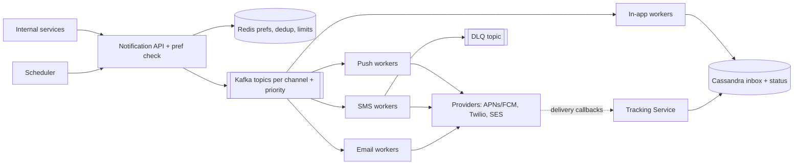
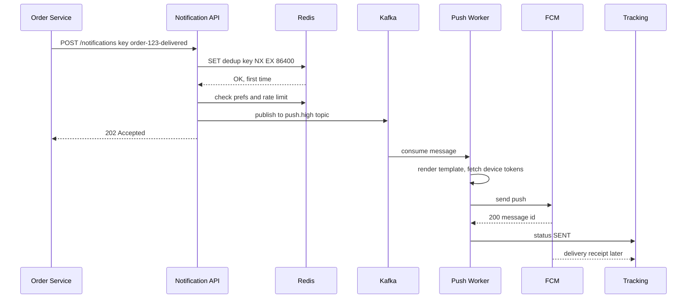
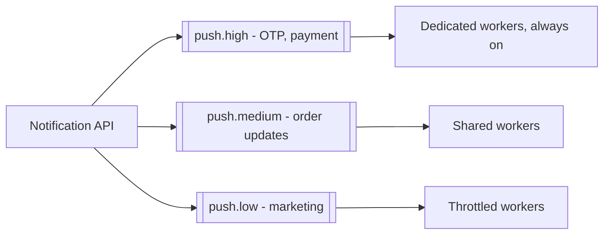

# Design a Notification System

**Ek line me:** services (orders, payments, marketing) API call karti hain → user ko push, SMS, email ya in-app, preferences + limits ke saath. Core challenge: **notification na chhute, do baar na jaaye, slow providers poora system slow na karein**.

**Interviewer kya check karta hai:** async queue, channel isolation, retries + DLQ, idempotency, OTP vs marketing priority, provider failures.

---

## Step 1: Interviewer se ye confirm karo (3–5 min)

| Tum poochho | Typical jawab | Design pe asar |
|---|---|---|
| "Channels? Push, SMS, email, in-app?" | Charon | Har channel ka alag queue + worker |
| "Transactional (OTP, order) aur marketing dono?" | Haan | Priority queues, OTP pehle |
| "Scale?" | ~100M/day, campaign pe 10M ek saath | Kafka + horizontal workers |
| "Delivery guarantee? Duplicate chalega?" | At-least-once, par user ko duplicate nahi | Idempotency key + dedup |
| "Preferences aur opt-out?" | Haan, quiet hours bhi | Pipeline me preference check |
| "Scheduled notifications?" | Haan, "kal 9 baje" | Scheduler |

> **Bolo:** "Async pipeline: API → Kafka → channel workers → providers (APNs, FCM, Twilio, SES). Transactional aur marketing alag priority."

## Step 2: Requirements

**Functional**
1. Internal services API se user ya segment (campaign) ko bhejein, abhi ya scheduled
2. User ko push (iOS/Android), SMS, email ya in-app mile
3. User preferences (opt-out, channel, quiet hours) set kare; system unhe + rate limits maane
4. Caller delivery status (sent, delivered, opened) dekhe

**Out of scope:** template editor UI, A/B testing, provider internals (APNs/Twilio black box).

**Non-functional (priority order)**
1. **Reliability:** accepted notification lose na ho (at-least-once, durable queue)
2. **Transactional latency:** OTP p99 < 5 sec end-to-end, campaign ke dauraan bhi
3. **No duplicates:** effectively once
4. **Scale + isolation:** 100M/day, campaign peak ~17K/sec; ek provider ka outage doosre channel ko na roke

**CAP:** availability: provider/Redis down pe bhi accept + queue. Prefs thodi stale chalegi; dedup best-effort + provider idempotency.

## Step 3: Estimation (sirf jo design badle)

- 100M/day ≈ **~1.2K/sec avg**. Campaign: 10M in 10 min ≈ **~17K/sec peak** → queue buffer.
- SMS provider ~1K/sec, APNs/FCM high → **throughput provider decide karta hai**, workers throttle.
- Status events ~3x → ~300M/day ≈ 3.5K/sec avg, campaign pe **~50K/sec**. Write-heavy + TTL → Cassandra.
- Peak: 17K/sec × ~2 channels + 3x status ≈ **~100K msgs/sec** + replay need → Kafka.

> **Bolo:** "Bottleneck providers hain, mere servers nahi: Kafka buffer, per-channel workers, provider-wise rate limiting."

## Step 4: Core entities

- **Notification**: id, user_id, type, channel, priority, template_id, payload, idempotency_key, status, scheduled_at
- **Template**: id, channel, locale, subject, body (`"Hi {{name}}, order {{orderId}} delivered"`)
- **UserPreference**: user_id, channel, category (`OTP`, `ORDER`, `PROMO`), enabled, quiet_hours
- **DeviceToken**: user_id, platform (iOS/Android), token, last_active
- **DeliveryEvent**: notification_id, status (`QUEUED`, `SENT`, `DELIVERED`, `FAILED`, `OPENED`), provider, timestamp

## Step 5: APIs

```http
POST /notifications
     Header: Idempotency-Key: order-123-delivered
     {userId, type: ORDER_DELIVERED, channels: [push, sms],
      templateId, params: {orderId: 123}, priority: HIGH, sendAt?}
     → 202 {notificationId}
POST /notifications/bulk    {segmentId, templateId, sendAt}   → 202 {campaignId}
GET  /notifications/{id}                                      → status per channel
PUT  /users/{id}/preferences {category, channel, enabled}     → 200
GET  /users/{id}/inbox?cursor=...                             → in-app notifications
```

> **Bolo:** "API 202 deti hai; sending async hai, caller provider ka wait nahi karta."

## Step 6: High-level design

**v1:** API → Postgres `notifications` → cron worker; ~1K/sec tak. Phir:
- 17K/sec spike, OTP isolation, SMS outage isolation → queue, topic per channel + priority, alag pools
- Dedup + rate limits → Redis
- ~50K status writes/sec → Cassandra



**FR mapping:** FR1 → API + Scheduler + Kafka, FR2 → channel workers + providers, FR3 → pref check + Redis + Postgres prefs, FR4 → Tracking Service + Cassandra.

**Har component kyun** (alternatives Step 10 me):
- **API + pref check:** validate, idempotency, opt-out, quiet hours, per-user limit → Kafka → 202. Alag preference service nahi.
- **Redis:** dedup, rate-limit counters, prefs cache; sub-ms (Postgres counters = hot rows).
- **Kafka:** 2 status consumers (Cassandra, analytics), buggy template ke baad replay. **Honest note:** ~1K/sec, no campaign → SQS simpler.
- **Channel workers:** stateless, throttled; alag pools = outage isolation.
- **Cassandra:** inbox TTL 90 din.
- **Tracking Service:** provider webhooks (delivered, bounced) + opens/clicks; alag scale.

## Step 7: Main flow: order delivered notification



## Step 8: Data model & DB choice

```sql
-- Postgres: low write, config type data
templates(id PK, channel, locale, version, subject, body)
user_preferences(user_id, category, channel, enabled, quiet_start, quiet_end,
                 PRIMARY KEY(user_id, category, channel))
device_tokens(user_id, token PK, platform, last_active)
```

```text
Cassandra (write-heavy, time-ordered):
notifications_by_user  PK user_id, CK created_at DESC → in-app inbox
delivery_events        PK notification_id, CK ts      → status history
```

- **Templates, prefs → Postgres + Redis cache:** chhota data, read-heavy.
- **Log, status, inbox → Cassandra:** 300M+ writes/day.
- **Dedup keys, counters → Redis** with TTL.

## Step 9: Deep dives (interviewer yahin pressure dalega)

### 9.1 Retries, backoff aur DLQ
**NFR:** reliability + ek provider ka outage baaki ko na roke.
- 5xx/timeout → **exponential backoff + jitter** (1s, 2s, 4s, 8s...), max 5 tries.
- **Retry topics** (`sms.retry.1m`, `sms.retry.10m`): main topic block na ho; Kafka me per-message delay nahi.
- 5 tries → **DLQ**, alert + dashboard, fix ke baad replay.
- 4xx (invalid token/number) → no retry, token inactive.
- **Circuit breaker:** Twilio fail → fallback (Gupshup/MSG91) via adapter interface.
- **Trade-off:** extra topics; retry pe ordering nahi.

### 9.2 Idempotency aur dedup
**NFR:** effectively once.
- **API level:** `Idempotency-Key` (e.g. `order-123-delivered`) Redis `SET NX EX 24h`; duplicate pe same notificationId.
- **Worker level:** send se pehle `sent:{notificationId}:{channel}` check, baad me set. Chhota window → provider idempotency key bhi pass karo.
- **Trade-off:** Redis down → dedup kamzor; transactional me duplicate ka risk lo, miss ka nahi.

### 9.3 Priority aur rate limits
**NFR:** OTP p99 < 5 sec, campaign ke dauraan bhi.

- Alag topics + consumer groups, reserved OTP workers.
- **Per-user limit:** max 3 promo/day, 1/hour (Redis counter / sliding window). Transactional pe limit nahi.
- **Per-provider limit:** token bucket, SMS ≤ 1K/sec.
- **Quiet hours:** raat 10–8 promo hold → scheduled queue.
- **Trade-off:** reserved OTP workers idle (cost) vs latency guarantee.

### 9.4 Templates, scheduling, bulk fan-out
**NFR:** 10M campaign 10 min me (~17K/sec), OTP ko chhue bina.
- **Templates:** versioned, locale-wise; worker `{{name}}` fill kare; bina deploy change.
- **Scheduling:** `send_at` index; scheduler har minute due wale uthaye. Bade scale pe minute-bucketed partitions.
- **Bulk:** 10M → 1K batches, har batch ek Kafka message → fan-out workers expand.
- **Trade-off:** minute granularity → `sendAt` pe ±1 min jitter.

### 9.5 Delivery tracking
**NFR:** status eventual (kuch sec late chalega).
- `QUEUED → SENT` (worker), `DELIVERED`/`BOUNCED` (webhook), `OPENED`/`CLICKED` (pixel/app).
- Events Kafka → Cassandra + warehouse (campaign dashboard).
- Bounce/spam complaint → suppress list, warna SES account block.
- **Trade-off:** `OPENED` approx (clients pixel block karte hain).

## Step 10: Decision table (kya chuna, kyun, kya nahi)

| Decision | Kyun chuna | Kya nahi chuna, kyun |
|---|---|---|
| **Async API (202) + queue** | Caller fast, spikes buffer | **Sync call:** slow Twilio = slow Order Service. **Sacrifice:** status poll/webhook se |
| **Topic per channel + priority** | Outage isolation, OTP marketing ke peeche nahi | **Common queue:** head-of-line blocking, OTP 20 min late. **Sacrifice:** zyada topics + pools |
| **Kafka** over SQS/RabbitMQ | ~100K msgs/sec, 2 status consumers, replay | **SQS:** built-in retry/DLQ, ~1K/sec pe better. **RabbitMQ:** replay nahi. **Sacrifice:** retry topics khud, ops |
| **Retry topics + backoff + DLQ** | Main flow block nahi, poison alag | **Inline infinite retry:** partition ruk jayega. **Sacrifice:** retry pe ordering lost |
| **Idempotency key + Redis dedup** | At-least-once pe bhi user ko duplicate nahi | **Kafka exactly-once:** third-party call txn me nahi. **Sacrifice:** Redis dependency, chhota window |
| **Cassandra** for logs/inbox | ~50K writes/sec, time-ordered, TTL | **Postgres:** sharding bojh. **Sacrifice:** ad-hoc queries nahi |
| **Provider adapter + fallback** | Vendor down/mehenga → switch | **Single provider:** outage = channel down. **Sacrifice:** 2 vendors maintain |

## Step 11: Failures & bottlenecks

| Kya fail hua | Kya hoga | Handle kaise |
|---|---|---|
| SMS provider down | SMS fail | Circuit breaker → fallback; retry topic me hold |
| Worker crash after send, before commit | Duplicate | `sent:` dedup key + provider idempotency key |
| Campaign spike (10M) | Queue lag | Kafka buffer, low topic throttled |
| Invalid device tokens | Bekar calls | 4xx pe inactive, cleanup job |
| Redis down | Dedup/rate limit nahi | Transactional fail-open (bhejo), marketing fail-closed (hold) |
| Kafka broker down | Publish fail | RF 3, `acks=all`; same idempotency key se retry |

## Step 12: "Isko aur better kaise karein" (end me khud bolo)

- **Smart fallback:** important push 5 min me deliver/open nahi → SMS
- **Send-time optimization:** app kholne ke time promo
- **Digest:** 10 likes ki jagah "Rahul aur 9 logon ne like kiya"
- **Cost:** push enabled ho to SMS skip
- **Multi-region workers** + region-wise providers (India me Indian SMS gateways, DLT compliance)

## Step 13: Interviewer ke likely follow-up sawal

- "Same notification do baar na mile?" → API idempotency key + worker dedup (9.2)
- "Provider down?" → backoff, retry topics, DLQ, fallback provider (9.1)
- "Marketing blast me OTP late kyun nahi?" → alag priority topics + dedicated workers (9.3)
- "User ne opt-out kiya?" → send se pehle cached preference check; OTP opt-out nahi hota
- "Order preserve hoga?" → per-user ordering chahiye to Kafka key = userId
- "Kafka kyun, SQS kyun nahi?" → ~100K msgs/sec peak, 2 status consumers + replay; ~1K/sec pe SQS
- **Senior signal:** khud bolo ki asli bottleneck provider rate limit hai (SMS ~1K/sec), hamare servers nahi; 10M SMS campaign 3 ghante lega. Isliye per-provider token bucket, campaign ka ETA caller ko batao, aur Redis down pe fail-open/closed policy pehle se decide karo.

## 2-minute recap (interview se pehle ye padho)

> API (Idempotency-Key): Redis dedup, prefs, quiet hours, limits → Kafka → 202. Kafka: ~100K msgs/sec peak, replay (~1K/sec pe SQS). Topics per channel × priority → OTP isolated. Workers provider rate limit me call. Fail → backoff, retry topics, DLQ, fallback provider. Status Cassandra, callbacks se delivered/opened. Scheduler + batched campaign fan-out.

## Checklist

- [ ] Channel-wise Kafka topics + workers wala HLD 5 min me bana sakta hoon
- [ ] Retries with backoff, retry topics aur DLQ ka flow samjha sakta hoon
- [ ] Idempotency key + dedup se duplicate rokna bata sakta hoon
- [ ] OTP vs marketing priority isolation explain kar sakta hoon
- [ ] Preferences, quiet hours aur rate limits kahan check hote hain bata sakta hoon
- [ ] Scheduling aur bulk campaign fan-out samjha sakta hoon
- [ ] Delivery tracking (sent, delivered, opened) ka flow bata sakta hoon
- [ ] Decision table ke 3 trade-offs bina dekhe bol sakta hoon
