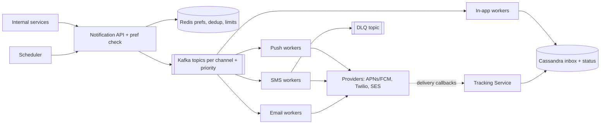
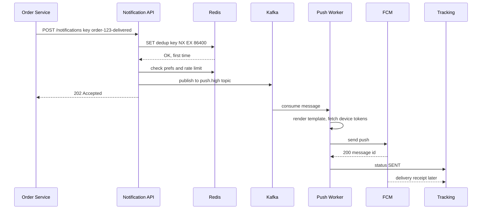
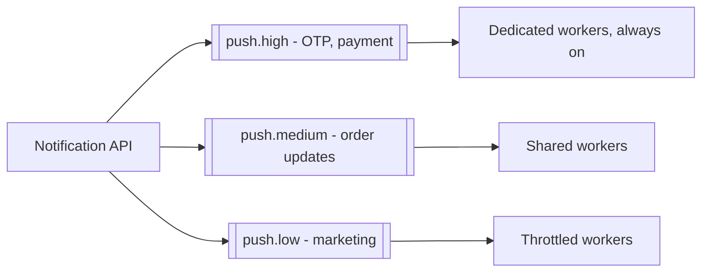

# Design a Notification System

**Ek line me:** baaki services (orders, payments, marketing) ek API call karti hain, aur system user ko push, SMS, email ya in-app notification bhejta hai, uski preferences aur limits ka dhyan rakhte hue. Core challenge ye hai ki **notification na chhute, do baar na jaaye, aur slow third-party providers poore system ko slow na karein**.

**Is question me interviewer kya check karta hai:** async queue based design, per-channel isolation, retries + DLQ, idempotency, priority (OTP vs marketing), aur third-party failures handle karna.

---

## Step 1: Interviewer se ye confirm karo (3–5 min)

Design shuru karne se pehle ye sawal poochho:

| Tum poochho | Typical jawab | Design pe asar |
|---|---|---|
| "Kaunse channels? Push, SMS, email, in-app?" | Charon | Har channel ka alag queue + worker |
| "Transactional (OTP, order update) aur marketing dono?" | Haan | Priority queues, OTP sabse pehle |
| "Scale kitna?" | ~100M notifications/day, campaign pe 10M ek saath | Kafka + horizontal workers |
| "Delivery guarantee? Duplicate chalega?" | At-least-once, par user ko duplicate nahi dikhna chahiye | Idempotency key + dedup |
| "User preferences aur opt-out?" | Haan, aur quiet hours bhi | Preference check pipeline me |
| "Scheduled notifications?" | Haan, "kal 9 baje bhejo" | Scheduler component |

> **Bolo:** "Main isse ek async pipeline ki tarah design karunga: API request validate karke Kafka me daalegi, aur har channel ke workers apne provider (APNs, FCM, Twilio, SES) ko bhejenge. Transactional aur marketing traffic alag priority pe chalega."

## Step 2: Requirements

**Functional (users ye kar sakein)**
1. Internal services ek API se kisi user ya segment (campaign) ko notification bhej sakein, abhi ya scheduled
2. User ko push (iOS/Android), SMS, email ya in-app me notification mile
3. User preferences (opt-out, channel, quiet hours) set kar sake, aur system unhe + rate limits respect kare
4. Caller delivery status (sent, delivered, opened) dekh sake

**Out of scope:** template editor UI, A/B testing, provider internals (APNs/Twilio ko black box maano).

**Non-functional (priority order me)**
1. **Reliability:** accepted notification lose na ho (at-least-once, durable queue)
2. **Latency for transactional:** OTP p99 < 5 sec end-to-end, campaign chahe chal raha ho
3. **No duplicates for user:** effectively once (same OTP do baar nahi)
4. **Scale + isolation:** 100M/day, campaign peak ~17K/sec; ek provider ka outage doosre channel ko na roke

**CAP choice:** availability. Request accept karke queue me rakho, chahe provider ya Redis down ho. Preferences thodi stale (cache) chalegi; dedup best-effort + provider idempotency.

## Step 3: Estimation (sirf jo design badle)

- 100M/day ≈ **~1.2K/sec avg**. Campaign: 10M in 10 min ≈ **~17K/sec peak**. Isliye queue buffer chahiye.
- Providers ki limits: SMS provider ~1K/sec, APNs/FCM high. **Throughput provider decide karta hai, hum nahi.** Workers ko provider rate pe throttle karna hai.
- Status events (sent/delivered/opened) ~3x notifications → ~300M/day ≈ 3.5K/sec avg, campaign pe **~50K/sec**. Write-heavy, TTL wala data → Cassandra.
- Campaign peak: 17K notifications/sec × ~2 channels + 3x status events ≈ **~100K msgs/sec** total. Ye number aur replay ki zaroorat Kafka choose karwate hain.

> **Bolo:** "Bottleneck mere servers nahi, third-party providers hain. Isliye beech me Kafka buffer, per-channel workers, aur provider-wise rate limiting rakhunga."

## Step 4: Core entities

- **Notification**: id, user_id, type, channel, priority, template_id, payload, idempotency_key, status, scheduled_at
- **Template**: id, channel, locale, subject, body (`"Hi {{name}}, order {{orderId}} delivered"`)
- **UserPreference**: user_id, channel, category (`OTP`, `ORDER`, `PROMO`), enabled, quiet_hours
- **DeviceToken**: user_id, platform (iOS/Android), token, last_active
- **DeliveryEvent**: notification_id, status (`QUEUED`, `SENT`, `DELIVERED`, `FAILED`, `OPENED`), provider, timestamp

## Step 5: APIs

```http
POST /notifications
     Header: Idempotency-Key: order-123-delivered
     {userId, type: ORDER_DELIVERED, channels: [push, sms],
      templateId, params: {orderId: 123}, priority: HIGH, sendAt?}
     → 202 {notificationId}
POST /notifications/bulk    {segmentId, templateId, sendAt}   → 202 {campaignId}
GET  /notifications/{id}                                      → status per channel
PUT  /users/{id}/preferences {category, channel, enabled}     → 200
GET  /users/{id}/inbox?cursor=...                             → in-app notifications
```

> **Bolo:** "API 202 Accepted return karti hai, kyunki actual sending async hai. Caller ko provider ke response ka wait nahi karna padta."

## Step 6: High-level design

**Simple v1 pehle:** API → `notifications` table (Postgres) → ek worker cron se pending rows uthake provider ko bheje. 1K/sec tak ye chal jata hai. Par 17K/sec campaign spike, OTP ko marketing ke peeche na fasna, aur SMS outage push ko na roke → durable queue, topic per channel + priority, alag worker pools. Dedup aur rate limits har request pe → Redis. ~50K status writes/sec → Cassandra.



**FR mapping:** FR1 → API + Scheduler + Kafka, FR2 → channel workers + providers, FR3 → pref check + Redis + Postgres prefs, FR4 → Tracking Service + Cassandra.

**Har component kyun:**
- **Notification API + pref check:** validate, idempotency, opt-out, quiet hours, per-user limit, phir Kafka me daal ke 202. Alag "preference service" nahi; ek in-process check kaafi hai.
- **Redis:** dedup `SET NX`, rate-limit counters aur prefs cache, 17K/sec pe sub-ms. Simpler option Postgres pe har request ka counter update = hot rows.
- **Kafka (topic per channel + priority):** ~100K msgs/sec campaign peak, status stream ke 2 consumer groups (Cassandra writer, analytics), aur bug wale template ke baad offset se replay. **Honest note:** agar sirf ~1K/sec aur koi campaign nahi hota, to per-channel SQS queues (built-in delay, retry, DLQ) simpler aur behtar choice hoti.
- **Channel workers:** stateless, provider SDK call, provider rate pe throttled. Alag pools = outage isolation.
- **DLQ:** baar baar fail messages alag, investigate/replay ke liye.
- **Cassandra:** ~50K status writes/sec peak, per-user inbox time-ordered, TTL 90 din. Simpler option Postgres is peak pe sharding maangta.
- **Tracking Service:** provider webhooks (delivered, bounced) aur opens/clicks; providers ka callback endpoint alag scale hota hai.

## Step 7: Main flow: order delivered notification



## Step 8: Data model & DB choice

```sql
-- Postgres: low write, config type data
templates(id PK, channel, locale, version, subject, body)
user_preferences(user_id, category, channel, enabled, quiet_start, quiet_end,
                 PRIMARY KEY(user_id, category, channel))
device_tokens(user_id, token PK, platform, last_active)
```

```text
Cassandra (write-heavy, time-ordered):
notifications_by_user  PK user_id, CK created_at DESC → in-app inbox
delivery_events        PK notification_id, CK ts      → status history
```

- **Templates, preferences → Postgres + Redis cache:** chhota data, bahut reads.
- **Notification log, status, inbox → Cassandra:** 300M+ writes/day, user ke hisaab se partition, time se sort.
- **Dedup keys, rate limit counters → Redis** with TTL.

## Step 9: Deep dives (interviewer yahin pressure dalega)

### 9.1 Retries, backoff aur DLQ
**NFR:** reliability (lose na ho) + ek provider ka outage baaki ko na roke.
- Provider ne 5xx/timeout diya → **exponential backoff + jitter** (1s, 2s, 4s, 8s...), max 5 tries.
- Retry ke liye alag **retry topics** (`sms.retry.1m`, `sms.retry.10m`), taaki main topic block na ho. Kafka me per-message delay nahi hota, isliye ye topics banane padte hain (SQS me ye built-in hai).
- 5 tries ke baad → **DLQ**. Alert + dashboard, fix ke baad replay.
- 4xx (invalid token, invalid number) pe retry nahi. Token ko inactive mark karo.
- **Circuit breaker:** Twilio lagataar fail → fallback provider (Gupshup/MSG91) pe switch. Isliye providers ke peeche ek adapter interface rakho.
- **Trade-off:** retry topics extra topics aur consumers hain; retry ke saath order guarantee nahi rehta.

### 9.2 Idempotency aur dedup
**NFR:** user ko duplicate nahi (effectively once).
- Kafka at-least-once hai. Worker ne send kiya aur commit se pehle crash hua → message dobara aayega.
- **API level:** caller ka `Idempotency-Key` (e.g. `order-123-delivered`) Redis me `SET NX EX 24h`. Duplicate request pe same notificationId return.
- **Worker level:** send se pehle `sent:{notificationId}:{channel}` check. Send ke baad set. Chhota window bachta hai, isliye kai providers idempotency key bhi lete hain, woh pass karo.
- Exactly-once impossible hai third-party ke saath. Target: **effectively once** for the user.
- **Trade-off:** Redis down ho to dedup kamzor; transactional ke liye duplicate ka risk lete hain, notification miss ka nahi.

### 9.3 Priority aur rate limits
**NFR:** OTP p99 < 5 sec, campaign ke dauraan bhi.

- 10M marketing campaign OTP ko block na kare. Alag topics, alag consumer groups, OTP ke workers reserved.
- **Per-user rate limit:** max 3 promo/day, 1 per hour (Redis counter / sliding window). Transactional pe limit nahi.
- **Per-provider rate limit:** token bucket, SMS provider ki 1K/sec limit se zyada mat bhejo, warna wo block karega.
- **Quiet hours:** raat 10 se 8 tak promo hold, scheduled queue me daal do.
- **Trade-off:** reserved OTP workers aksar idle rehte hain (cost), par latency guarantee milti hai.

### 9.4 Templates, scheduling, bulk fan-out
**NFR:** 10M campaign 10 min me (~17K/sec), bina OTP ko chhue.
- **Templates:** versioned, locale-wise (Hindi, English). Worker `{{name}}` fill karta hai. Template change bina code deploy.
- **Scheduling:** `scheduled_notifications` table me `send_at` index. Scheduler har minute due wale uthake API/Kafka me daale. Bahut scale pe time-bucketed partitions (minute ke hisaab se).
- **Bulk campaign:** segment (10M users) ko chhote batches (1K) me todo, har batch ek Kafka message. Fan-out workers batch ko individual notifications me expand karein. Ek giant job nahi.
- **Trade-off:** scheduler minute-granularity pe hai, isliye `sendAt` pe ±1 min ka jitter.

### 9.5 Delivery tracking
**NFR:** status available, par eventual (kuch sec late chalega).
- Worker: `QUEUED → SENT`. Provider callback/webhook: `DELIVERED`, `BOUNCED`. App/email pixel: `OPENED`, `CLICKED`.
- Events Kafka → Cassandra + analytics warehouse. Campaign dashboard: sent vs delivered vs opened.
- Email bounce/spam complaints pe address suppress list me, warna SES account block ho sakta hai.
- **Trade-off:** `OPENED` approx hai (email clients pixel block karte hain).

## Step 10: Decision table (kya chuna, kyun, kya nahi)

| Decision | Kyun chuna | Kya nahi chuna, kyun |
|---|---|---|
| **Async API (202) + queue** | Caller fast, spikes buffer ho jaate hain | **Sync provider call in API:** Twilio slow to Order Service bhi slow. **Sacrifice:** caller ko status alag se poll/webhook se lena padta |
| **Topic per channel + priority** | Provider outage isolation, OTP marketing ke peeche na fase | **Ek common queue:** head-of-line blocking, OTP 20 min late. **Sacrifice:** zyada topics aur worker pools manage karne |
| **Kafka** over SQS/RabbitMQ | ~100K msgs/sec campaign peak, status stream ke 2 consumers, replay | **SQS:** delay/retry/DLQ built-in, ~1K/sec pe yahi better hota. **RabbitMQ:** per-message priority achhi, par replay nahi. **Sacrifice:** retry topics khud banane, cluster ops |
| **Retry topics + backoff + DLQ** | Main flow block nahi, poison messages alag | **Infinite inline retry:** partition ka baaki traffic ruk jayega. **Sacrifice:** retry pe ordering lost |
| **Idempotency key + Redis dedup** | At-least-once ke saath user ko duplicate nahi | **Kafka exactly-once ke bharose:** third-party call transaction me nahi. **Sacrifice:** Redis pe dependency, chhota duplicate window |
| **Cassandra** for logs/inbox | ~50K writes/sec peak, per-user time-ordered reads, TTL | **Postgres:** is peak pe sharding ka bojh. **Sacrifice:** ad-hoc queries nahi, analytics warehouse alag |
| **Provider adapter + fallback** | Ek vendor down/mehenga ho to switch | **Single hardcoded provider:** vendor outage = channel down. **Sacrifice:** do vendors ke contracts aur templates maintain |

## Step 11: Failures & bottlenecks

| Kya fail hua | Kya hoga | Handle kaise |
|---|---|---|
| SMS provider down | SMS fail | Circuit breaker → fallback provider. Retry topic me hold |
| Worker crash after send, before commit | Duplicate bhej sakta hai | `sent:` dedup key + provider idempotency key |
| Campaign spike (10M) | Queue lag | Kafka buffer, low priority topic throttled, OTP workers alag |
| Invalid device tokens | Bekar calls, provider warning | 4xx pe token inactive, cleanup job |
| Redis down | Dedup/rate limit check nahi | Fail-open for transactional (bhejo), fail-closed for marketing (hold) |
| Kafka broker down | Publish fail | Replication factor 3, `acks=all`. API retry with same idempotency key |

## Step 12: "Isko aur better kaise karein" (end me khud bolo)

> "Agar aur time ho to main ye improve karunga:"
- **Smart channel fallback:** push 5 min me deliver/open nahi hua to SMS bhejo (sirf important types ke liye)
- **Send-time optimization:** user jis time app kholta hai usi time promo bhejo, open rate badhega
- **Notification batching/digest:** 10 likes ki 10 notifications ki jagah "Rahul aur 9 logon ne like kiya"
- **Cost optimization:** SMS mehenga hai, jab push enabled ho to SMS skip
- **Multi-region workers** + region-wise providers (India me Indian SMS gateways, DLT compliance)
- **Observability:** per channel/provider latency, failure rate, DLQ size pe alerts aur SLO dashboard

## Step 13: Interviewer ke likely follow-up sawal

- "User ko same notification do baar na mile, kaise?" → API idempotency key + worker dedup → Step 9.2
- "Provider down ho to?" → backoff retries, retry topics, DLQ, fallback provider → Step 9.1
- "Marketing blast me OTP late kyun nahi hoga?" → alag priority topics aur dedicated workers → Step 9.3
- "User ne opt-out kiya to?" → send se pehle preference check, Redis cached. Transactional (OTP) opt-out nahi hota
- "10M users ko campaign kaise bhejoge?" → batches me fan-out, throttled low priority topic → Step 9.4
- "Order preserve hoga?" → per-user ordering chahiye to Kafka key = userId, ek partition me order
- "Kafka kyun, SQS kyun nahi?" → campaign peak ~100K msgs/sec, status stream ke 2 consumers aur replay. Sirf ~1K/sec hota to SQS (delay + DLQ built-in) lete
- **Senior signal:** khud bolo ki asli bottleneck provider rate limit hai (SMS ~1K/sec), hamare servers nahi; 10M SMS campaign 3 ghante lega. Isliye per-provider token bucket, campaign ka ETA caller ko batao, aur Redis down pe fail-open/closed policy pehle se decide karo.

## 2-minute recap (interview se pehle ye padho)

> Notification system ek async pipeline hai. Internal services `POST /notifications` (Idempotency-Key ke saath) call karti hain, API dedup (Redis `SET NX`), preferences, quiet hours aur per-user rate limit check karke Kafka me daalti hai aur 202 return karti hai. Kafka isliye ki campaign peak ~100K msgs/sec, status stream ke 2 consumers aur replay chahiye; ~1K/sec pe SQS kaafi tha. Kafka me har channel (push, SMS, email, in-app) aur priority (high/medium/low) ke alag topics hain, taaki ek provider ka outage ya marketing blast OTP ko na roke. Stateless channel workers template render karke APNs/FCM, Twilio, SES ko call karte hain, provider ki rate limit ke andar. Fail pe exponential backoff, retry topics, phir DLQ, aur circuit breaker se fallback provider. Status events Cassandra me, provider callbacks se delivered/opened track. Scheduler due notifications ko pipeline me daalta hai, campaigns batches me fan-out hote hain.

## Checklist

- [ ] Channel-wise Kafka topics + workers wala HLD 5 min me bana sakta hoon
- [ ] Retries with backoff, retry topics aur DLQ ka flow samjha sakta hoon
- [ ] Idempotency key + dedup se duplicate rokna bata sakta hoon
- [ ] OTP vs marketing priority isolation explain kar sakta hoon
- [ ] Preferences, quiet hours aur rate limits kahan check hote hain bata sakta hoon
- [ ] Scheduling aur bulk campaign fan-out samjha sakta hoon
- [ ] Delivery tracking (sent, delivered, opened) ka flow bata sakta hoon
- [ ] Decision table ke 3 trade-offs bina dekhe bol sakta hoon
