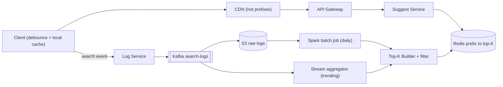
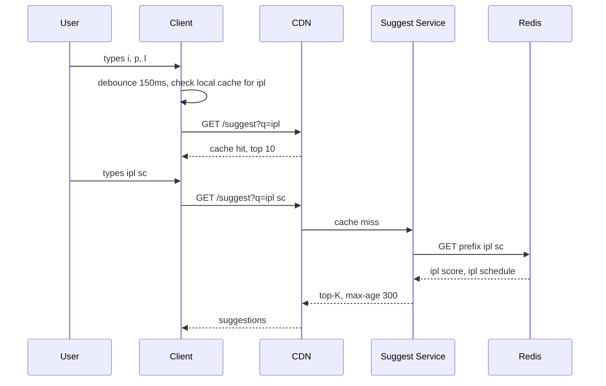

# Design Typeahead / Autocomplete

**Ek line me:** "ipl" type karo → har keystroke pe **100ms me top 5–10 suggestions** ("ipl score", "ipl 2026 schedule"). Challenge: fast read path + popularity se fresh suggestions.

**Is question me interviewer kya check karta hai:** precomputed read path, trie vs prefix → top-K, data pipeline, caching layers.

---

## Step 1: Interviewer se ye confirm karo (3–5 min)

| Tum poochho | Typical jawab | Design pe asar |
|---|---|---|
| "Suggestions sirf popularity pe?" | Haan, popularity | Ranking = frequency + recency weight |
| "Kitne suggestions?" | Top 5–10 | Har prefix pe sirf top-K store |
| "Latency target?" | < 100ms end-to-end | Sab precomputed, query time pe sorting nahi |
| "Trending query kitni jaldi dikhe?" | Normal daily, trending ~15 min | Batch pipeline + chhota stream layer |
| "Typo/spell correction bhi?" | Sirf prefix, English lowercase | Simple prefix key, fuzzy out of scope |
| "Personalization?" | Basic, optional | Global top-K + user history merge |
| "Scale?" | ~100M DAU, ~10 search/user | High read QPS → caching |

> **Bolo:** "Do hisse: fast read path jo precomputed top-K serve kare, aur offline pipeline jo logs se top-K banaye. Query time pe sorting nahi."

## Step 2: Requirements

**Functional**
1. Prefix → top 5–10 suggestions, popularity sorted
2. Trending ~15 min me dikhe (baaki daily)
3. Offensive/blocked terms kabhi suggest na hon
4. (Optional) Logged-in users ki recent searches upar

**Out of scope:** typo/spell correction, multi-language, search results page, ads.

**Non-functional (priority order)**
1. **Latency:** p99 < 100ms end-to-end, server p99 < 10ms
2. **Availability:** 99.99% reads. Fail → empty list, search chale
3. **Freshness (eventual):** trending ≤ 15 min, baaki ≤ 24 hr
4. **Scale:** 100M DAU, ~46K QPS avg / 150K peak reads, ~12K search events/sec writes (async)

**CAP choice:** AP. Stale suggestion chalega, down box nahi → replicas + caches.

## Step 3: Estimation (sirf jo design badle)

- 100M DAU × 10 searches × ~6 keystrokes (debounce ke baad ~4 requests) → **~4B requests/day ≈ 46K QPS** avg, peak ~150K → multiple cache layers.
- ~100M unique queries, ~1B prefix keys (max 20 chars). Key = top 10 × ~30 bytes = 300 bytes → **~300 GB** → **sharding**. Top prefixes (90% traffic) cache me aa jayenge.
- Logs: 1B searches/day ≈ **12K events/sec** avg (~35K peak) × 50 bytes = **50 GB/day**. Har search ~20 prefixes touch kare → live counters = 250K+ writes/sec → batch aggregation (Spark).

> **Bolo:** "Read QPS high, data GB scale → har prefix precompute karke KV me. Query = O(1) lookup."

## Step 4: Core entities

- **Query log**: query_text, user_id, timestamp, region
- **Query stats**: query_text, count, last_seen (aggregated)
- **Prefix entry**: prefix → list of (query, score), max K
- **Blocklist**: offensive terms / patterns
- **User history** (optional): user_id → recent queries

## Step 5: APIs

```http
GET /suggest?q=ipl%20sc&limit=10&lang=en     → ["ipl score", "ipl schedule", ...]
    Response header: Cache-Control: public, max-age=300

POST /log/search  {query, userId, ts}         → 202 Accepted (async, fire-and-forget)
```

> **Bolo:** "Suggest cacheable GET hai (browser + CDN); logging alag async endpoint."

## Step 6: High-level design

**Simple v1:** Postgres `query_stats(query, count)` pe `LIKE 'ipl%' ORDER BY count DESC LIMIT 10`, har search pe `count+1`. Chhote scale pe FR1–FR3 ok. Kya todta hai:
- 150K peak QPS + p99 100ms → precomputed top-K in Redis + CDN
- ~300 GB prefix data → sharding
- 12K–35K events/sec, do consumers (archive + trending) → Kafka
- FR2 15-min trending → stream aggregator



**Har component kyun:**
- **Client debounce + cache:** 150ms debounce + local cache, warna QPS ~1.5x.
- **CDN (150K peak):** short prefixes ("a", "ip", "sw") sabke liye same, 5 min cache → 50%+ traffic origin tak nahi. Server cache network hop nahi bachata.
- **Suggest Service:** stateless. Redis lookup, serve-time blocklist, personalization merge.
- **Redis (p99 100ms):** O(1), sub-ms, prefix hash se sharded. RAM mehnga → DynamoDB (~5ms).
- **Kafka (FR2):** throughput (~12K/sec) reason nahi; do consumers (S3 archiver + Flink) + 7-day replay (bug pe recount).
- **Spark batch (daily):** 50 GB/day, 7–30 din decayed counts, ~1B prefix keys.
- **Flink (trending):** 15-min sliding window. Alternative: Spark micro-batch har 15 min, zyada lag.
- **Top-K Builder:** top-K per prefix, blocklist filter, versioned bulk load.

**Mapping:** FR1 → Client, CDN, Suggest Service, Redis. FR2 → Log Service, Kafka, Spark, Flink, Builder. FR3 → Builder filter + serve-time blocklist. FR4 → Suggest Service + per-user Redis list.

## Step 7: Main flow: user "ipl" type karta hai



**Rebuild flow:** Kafka → S3 → Spark daily → Builder top 10 per prefix → versioned keys (`v42:prefix:ipl`) → pointer flip `current_version = 42`. Atomic.

## Step 8: Data model & DB choice

```text
Redis / KV:
  key   = "v42:p:ipl sc"
  value = [["ipl score", 98123], ["ipl schedule", 55120], ...]   (max 10)

query_stats (Spark output, Parquet on S3):
  query_text, count_7d_decayed, last_seen, region
```

- **Read store:** Redis cluster (RAM se bada → DynamoDB / Cassandra). Key → value, no join.
- **Raw logs:** S3 (sasta, batch).
- Value me score → personalization + trending merge.

## Step 9: Deep dives (interviewer yahin pressure dalega)

### 9.1 Trie vs precomputed prefix → top-K
**NFR:** p99 < 100ms, ~300 GB.
- **Trie, top-K per node:** O(L), compact, par distribute/update mushkil.
- **Prefix → top-K in KV:** O(1), easy shard/replicate/cache, memory zyada (prefixes repeat).

> **Bolo:** "Concept trie with top-K per node hi hai; KV me flatten karta hoon taaki sharding, replication, CDN caching free mile."

Memory bachao: prefix max 20–25 chars, rare prefixes (count < threshold) drop.

**Trade-off:** O(1) reads + free sharding vs zyada memory.

### 9.2 Data collection pipeline aur freshness
**NFR:** trending ≤ 15 min, baaki ≤ 24 hr.
- Search submit → event → Log Service → Kafka.
- **Batch (daily):** Spark, last 7–30 din, **time decay** `score = Σ count × 0.9^days_ago` → purane trend dheere neeche.
- **Stream (15 min):** Flink sliding window spike (last 15 min >> normal) → sirf un prefixes update, full rebuild nahi.
- Builder batch + trending merge kare.

**Trade-off:** do pipelines vs sasta batch + fast trending.

### 9.3 Latency < 100ms: caching layers
**NFR:** p99 < 100ms, 150K peak QPS.
1. **Client:** 150ms debounce, local LRU, "ip" ke response me "ipl" prefetch.
2. **CDN:** 1–3 char prefixes sabse hot, `max-age=300`.
3. **Service in-memory:** top 1 lakh prefixes RAM me.
4. **Redis:** baaki sab, sub-ms.

Network latency → multi-region, nearest region.

**Trade-off:** 5 min stale vs 50%+ kam origin load.

### 9.4 Sharding by prefix
**NFR:** ~300 GB + 99.99% availability.
- **Range by first char** ("a–c"): simple, par skew ("s" bada, "x" chhota).
- **Hash of full prefix** (consistent hashing): even load, request ko ek hi key chahiye. **Ye choose karo.**
- Hot prefixes ("i", "ip") → replicas + CDN/local cache.

**Trade-off:** range scan nahi, zaroorat bhi nahi.

### 9.5 Personalization aur offensive filter (brief)
**NFR:** FR3 kabhi violate na ho, personalization latency budget me.
- **Personalization:** last 50 searches Redis list me; global top-K + matching history merge. CDN cache nahi hota → sirf logged-in users, global part cached.
- **Offensive filter:** Builder pe blocklist + ML classifier (offline, cheap). Serve-time blocklist → naya term bina rebuild turant hate.

**Trade-off:** logged-in traffic origin pe zyada.

## Step 10: Decision table (kya chuna, kyun, kya nahi)

| Decision | Kyun chuna | Kya nahi chuna, kyun |
|---|---|---|
| **Prefix → top-K in Redis/KV** | O(1), shardable, CDN friendly | **Live trie:** 300 GB ek box me nahi. **DB `LIKE` + sort:** 100ms me impossible. Sacrifice: ~300 GB RAM |
| **Batch + small stream layer** | Batch accurate + sasta, stream sirf trending | **Live counter:** 250K+ writes/sec, hot keys. Sacrifice: do pipelines |
| **Kafka for search logs** | Do consumers, 7-day replay | **S3 files:** 15-min trending nahi. **SQS:** ek consumer, replay nahi. Sacrifice: Kafka ops |
| **Client debounce + CDN cache** | 60–80% requests origin tak nahi | **Har keystroke pe call:** QPS 3–4x, responses race. Sacrifice: 5 min stale |
| **Hash-based sharding** | Even load, single-key lookup | **Range by first letter:** "s" vs "x" skew. Sacrifice: range scan nahi |
| **Versioned rebuild + pointer flip** | Atomic switch, easy rollback | **In-place overwrite:** aadha purana data. Sacrifice: rebuild pe 2x storage |
| **Elasticsearch suggester nahi** | Fixed top-K ke liye KV sasta + fast | **Elasticsearch:** fuzzy ke liye accha, per keystroke costly + slow |

## Step 11: Failures & bottlenecks

| Kya fail hua | Kya hoga | Handle kaise |
|---|---|---|
| Redis shard down | Kuch prefixes ke suggestions nahi | Replica failover + CDN/local cache. Empty list, error nahi |
| Batch job fail | Suggestions stale | Purana version serve. Alert + retry |
| Bad rebuild | Galat suggestions | Version pointer rollback |
| Kafka lag | Trending late | Acceptable, consumer autoscale |
| Offensive term leak | Brand damage | Serve-time blocklist + CDN purge (9.5) |

## Step 12: "Isko aur better kaise karein" (end me khud bolo)

- **Fuzzy / typo:** "iplsc" → "ipl score". Edit-distance-1 variants offline, ya Elasticsearch fallback.
- **Region-wise top-K + multi-language:** key me region (`in:ipl`), Mumbai vs US trends alag.
- **ML ranking:** CTR, freshness, user context → offline model, score KV me.
- **Abuse:** bots fake trending → per-user dedup + logging rate limit.

## Step 13: Interviewer ke likely follow-up sawal

- "Trending term kitni der me?" → Stream se ~15 min, baaki daily batch
- "300 GB RAM me?" → Shard, rare prefixes drop, ya disk KV (RocksDB/DynamoDB) + hot cache
- "User-specific suggestions?" → Global top-K + history merge, personalized part CDN cache nahi
- **Senior signal:** khud bolo: hot short prefixes ("i", "ip") → hot shard + CDN miss pe stampede; ek bad rebuild → poore product me galat/offensive suggestions. Fix: request coalescing + replicas, rebuild sanity checks + one-step version rollback.

## 2-minute recap (interview se pehle ye padho)

> Read-heavy, 100ms → read path pe compute nahi. Har prefix ka top-K precompute karke Redis/KV (flattened trie), O(1). Prefix hash sharding, CDN + in-memory cache, client 150ms debounce. Write: logs (~12K/sec) → Kafka → S3 → Spark daily (decay) + Flink 15-min trending → Builder (blocklist) → versioned keys + pointer flip. Personalization = global top-K + history merge.

## Checklist

- [ ] Clarifying sawal (K, latency, freshness, personalization) bina dekhe pooch sakta hoon
- [ ] Trie vs prefix → top-K KV ka trade-off samjha sakta hoon
- [ ] Data pipeline (logs → Kafka → batch/stream → rebuild) ka diagram bana sakta hoon
- [ ] 100ms latency ke liye 4 caching layers bata sakta hoon
- [ ] Prefix sharding aur hot prefix handling explain kar sakta hoon
- [ ] Versioned rebuild aur atomic pointer flip samjha sakta hoon
- [ ] Personalization aur offensive filter ka approach bata sakta hoon
- [ ] Decision table ke 3 trade-offs bina dekhe bol sakta hoon
