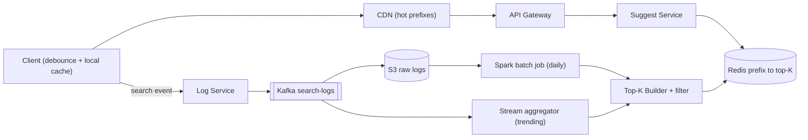
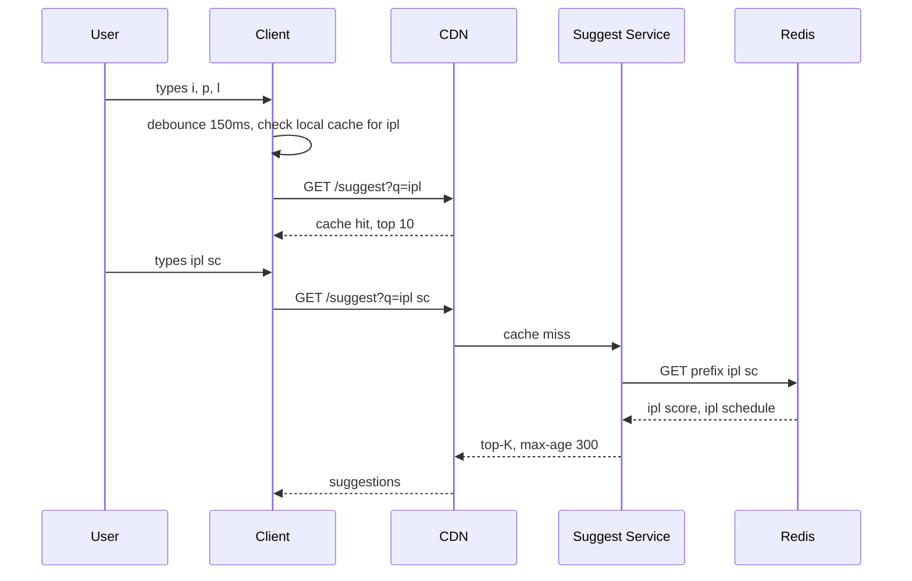

# Design Typeahead / Autocomplete

**Ek line me:** user search box me "ipl" type kare, aur har keystroke pe **100ms ke andar top 5–10 suggestions** dikhein ("ipl score", "ipl 2026 schedule"). Core challenge ye hai ki read path bahut fast ho, aur suggestions popularity ke hisaab se fresh rahein.

**Is question me interviewer kya check karta hai:** read path ko precompute karna (query time pe kuch heavy nahi karna), trie ya prefix → top-K store ka trade-off, data collection pipeline, aur caching layers (client, CDN, server).

---

## Step 1: Interviewer se ye confirm karo (3–5 min)

| Tum poochho | Typical jawab | Design pe asar |
|---|---|---|
| "Suggestions kis basis pe? Sirf popularity (search frequency)?" | Haan, popularity | Ranking = frequency, recency weight ke saath |
| "Kitne suggestions dikhane hain?" | Top 5–10 | Har prefix pe sirf top-K store karo, poori list nahi |
| "Latency target?" | < 100ms end-to-end | Query time pe sorting nahi, sab precomputed |
| "Freshness kitni chahiye? Trending query kitni jaldi dikhe?" | Normal ke liye daily chalega, trending ke liye ~15 min | Batch pipeline + chhota stream layer |
| "Sirf prefix match ya typo/spell correction bhi?" | Sirf prefix, English lowercase | Simple prefix key, fuzzy out of scope |
| "Personalization chahiye?" | Basic, optional | Global top-K + user history ka chhota merge |
| "Scale?" | ~100M DAU, har user ~10 search | Read QPS bahut high, caching zaroori |

> **Bolo:** "Main do alag hisson me design karunga: ek super-fast read path jo precomputed top-K serve kare, aur ek offline data pipeline jo search logs se top-K banaye. Query time pe koi ranking ya sorting nahi hogi."

## Step 2: Requirements

**Functional**
1. Users prefix type karke top 5–10 suggestions dekh sakein, popularity se sorted
2. Users ko trending queries ~15 min me suggestions me dikhein (baaki daily update)
3. Users ko offensive/blocked terms kabhi suggest na hon
4. (Optional) Logged-in users apni recent searches upar dekh sakein

**Out of scope:** typo/spell correction, multi-language, search results page, ads.

**Non-functional (priority order)**
1. **Latency:** p99 < 100ms end-to-end, server side p99 < 10ms
2. **Availability:** 99.99% suggest reads ke liye. Fail ho to empty list, search fir bhi chale
3. **Freshness (eventual):** trending ≤ 15 min, baaki ≤ 24 hr
4. **Scale:** 100M DAU, ~46K QPS avg / 150K peak reads, ~12K search events/sec writes (async)

**CAP choice:** AP. Thoda stale suggestion chalega, suggestion box ka down hona nahi. Isliye replicas + caches, strong consistency kahin nahi.

## Step 3: Estimation (sirf jo design badle)

- 100M DAU × 10 searches × ~6 keystrokes (debounce ke baad ~4 requests) → **~4B requests/day ≈ 46K QPS** avg, peak ~150K QPS. Isliye multiple cache layers chahiye.
- Unique queries ~100M. Prefixes (max 20 chars tak) ~1B keys. Har key pe top 10 × ~30 bytes = 300 bytes → **~300 GB**. Ek machine me nahi aayega, **sharding** chahiye. Par sirf top prefixes (jo 90% traffic laate hain) bahut chhote hain, cache me aa jayenge.
- Logs: 1B searches/day ≈ **12K events/sec** avg (~35K peak) × 50 bytes = **50 GB/day**. Har search ~20 prefixes ko touch karta hai, isliye live counters = ~250K+ writes/sec. Isliye batch aggregation (Spark), live counting nahi.

> **Bolo:** "Read QPS bahut high hai aur data GB scale ka hai, isliye har prefix ka answer pehle se compute karke KV store me rakhunga. Query ek O(1) lookup ban jayegi."

## Step 4: Core entities

- **Query log**: query_text, user_id, timestamp, region
- **Query stats**: query_text, count, last_seen (aggregated)
- **Prefix entry**: prefix → list of (query, score), max K
- **Blocklist**: offensive terms / patterns
- **User history** (optional): user_id → recent queries

## Step 5: APIs

```http
GET /suggest?q=ipl%20sc&limit=10&lang=en     → ["ipl score", "ipl schedule", ...]
    Response header: Cache-Control: public, max-age=300

POST /log/search  {query, userId, ts}         → 202 Accepted (async, fire-and-forget)
```

> **Bolo:** "Suggest API GET hai aur cacheable hai, taaki browser aur CDN dono cache kar sakein. Logging alag async endpoint hai, read path ko slow nahi karega."

## Step 6: High-level design

**Simple v1 pehle:** Client → Suggest Service → ek Postgres table `query_stats(query, count)` pe `LIKE 'ipl%' ORDER BY count DESC LIMIT 10`, aur har search pe `count+1`. Chhote scale pe FR1–FR3 isse ho jaate hain. Numbers isse todte hain: 150K peak QPS + p99 100ms → precomputed top-K in Redis + CDN. ~300 GB prefix data → sharding. 12K–35K events/sec jinhe do consumers chahiye (archive + trending) → Kafka. FR2 ka 15-min trending → stream aggregator.



**Har component kyun:**
- **Client debounce + cache (NFR latency):** 150ms debounce, "ip" ka result local cache me ho to dobara mat maango. Har keystroke pe call se QPS ~1.5x.
- **CDN (150K peak QPS):** short prefixes ("a", "ip", "sw") sab users ke liye same. 5 min cache se 50%+ traffic origin tak nahi aata. Sirf server cache se network hop nahi bachta.
- **Suggest Service:** stateless. Redis lookup, serve-time blocklist, optional personalization merge.
- **Redis prefix → top-K (p99 100ms):** O(1), sub-ms, prefix hash se sharded. DB `LIKE` + sort har keystroke pe 100ms me nahi hota. RAM mehnga lage to DynamoDB (~5ms) bhi chalega.
- **Kafka (FR2):** ~12K events/sec, throughput akela reason nahi. Reason: do independent consumers (S3 archiver + Flink trending) aur 7-day replay, taaki aggregation bug pe recount ho sake. Simpler option (Log Service seedha S3 pe batch files likhe) daily ke liye kaafi, par 15-min trending nahi deta.
- **Spark batch (FR2 daily):** 50 GB/day, 7–30 din ke decayed counts aur ~1B prefix keys generate karna.
- **Stream aggregator Flink (FR2 trending):** 15-min sliding window spike. Simpler option: Spark har 15 min micro-batch, thoda zyada lag ke saath.
- **Top-K Builder:** har prefix ka top-K, blocklist filter, versioned bulk load.

**Mapping:** FR1 → Client, CDN, Suggest Service, Redis. FR2 → Log Service, Kafka, Spark, Flink, Builder. FR3 → Builder filter + serve-time blocklist. FR4 → Suggest Service + per-user Redis list.

## Step 7: Main flow: user "ipl" type karta hai



**Rebuild flow:** Kafka → S3 → Spark daily count → Top-K Builder har prefix ka top 10 nikaalta hai → nayi Redis keys version ke saath (`v42:prefix:ipl`) likhta hai → pointer `current_version = 42` flip. Atomic switch, aadha-adhura data serve nahi hota.

## Step 8: Data model & DB choice

```text
Redis / KV:
  key   = "v42:p:ipl sc"
  value = [["ipl score", 98123], ["ipl schedule", 55120], ...]   (max 10)

query_stats (Spark output, Parquet on S3):
  query_text, count_7d_decayed, last_seen, region
```

- **Read store:** Redis cluster (ya DynamoDB / Cassandra agar data RAM se bada ho). Simple key → value, koi join nahi.
- **Raw logs:** S3 (sasta, batch ke liye perfect).
- Value me score bhi rakho, taaki personalization merge aur trending merge ho sake.

## Step 9: Deep dives (interviewer yahin pressure dalega)

### 9.1 Trie vs precomputed prefix → top-K
**NFR:** p99 < 100ms, ~300 GB data.
- **Trie with top-K per node:** har node pe us prefix ke top 10 cache. Lookup = prefix ki length tak walk = O(L). Memory me compact (shared prefixes). Par trie ek in-memory structure hai, distribute karna aur update karna mushkil.
- **Precomputed prefix → top-K in KV:** har prefix ek key. Lookup O(1). Easily sharded, replicate, cache. Memory zyada (prefixes repeat), par storage sasta hai.

> **Bolo:** "Concept me ye trie hi hai jisme har node pe top-K hai. Main usse flatten karke KV me rakhta hoon, taaki sharding, replication aur CDN caching free me mil jaye. Builder offline trie bana sakta hai, aur output KV me dump kar sakta hai."

Memory bachane ke liye: prefix length max 20–25 chars, rare prefixes (count < threshold) store mat karo.

**Trade-off:** O(1) reads aur free sharding, badle me prefixes repeat hone se zyada memory.

### 9.2 Data collection pipeline aur freshness
**NFR:** trending ≤ 15 min, baaki ≤ 24 hr.
- Client har search submit pe event bhejta hai → Log Service → Kafka.
- **Batch (daily):** Spark last 7–30 din ke logs pe count, **time decay** (`score = Σ count × 0.9^days_ago`) taaki purana trend dheere neeche jaye.
- **Stream (15 min):** Flink sliding window me sudden spike detect kare (count in last 15 min >> normal). Sirf in trending queries ke prefixes ko update karo, poora rebuild nahi.
- Builder har prefix ke liye batch top-K aur trending ko merge karta hai.

**Trade-off:** do pipelines (batch + stream) maintain karni padti hain, badle me sasta accurate batch aur fast trending.

### 9.3 Latency < 100ms: caching layers
**NFR:** p99 < 100ms, 150K peak QPS.
1. **Client:** 150ms debounce, local LRU cache, aur ek response me "ip" ke saath "ipl" ke results bhi prefetch.
2. **CDN:** 1–3 char prefixes sabse hot hain. `max-age=300` se CDN serve karega.
3. **Suggest service in-memory cache:** top 1 lakh prefixes service ke RAM me.
4. **Redis:** baaki sab, sub-ms.

Latency ka sabse bada hissa network hai, isliye multi-region deploy, nearest region se serve.

**Trade-off:** CDN/client cache se 5 min tak stale suggestions, badle me origin load 50%+ kam.

### 9.4 Sharding by prefix
**NFR:** scale (~300 GB) + 99.99% availability.
- **Range by first char** ("a–c" ek shard): simple, par skew hoga ("s" bahut bada, "x" chhota).
- **Hash of full prefix** (consistent hashing): load even. Ek request ko ek hi key chahiye, isliye range query ki zaroorat nahi. Ye choose karo.
- Hot prefixes ("i", "ip") ko replicate karo + CDN/local cache, taaki ek shard pe load na aaye.

**Trade-off:** hash sharding se range scan nahi kar sakte, par hamein sirf single-key lookup chahiye.

### 9.5 Personalization aur offensive filter (brief)
**NFR:** FR3 kabhi violate na ho, personalization latency budget ke andar.
- **Personalization:** user ki last 50 searches ek chhoti Redis list me. Suggest Service global top-K aur user history (jo prefix se match kare) ko merge karta hai. Personalized response CDN pe cache nahi hota, isliye sirf logged-in users ke liye, aur global part fir bhi cached.
- **Offensive filter:** Builder stage pe blocklist + ML classifier se filter (offline, isliye cheap). Serve time pe bhi fast blocklist check, taaki naya blocked term bina rebuild ke turant hate.

**Trade-off:** personalized responses CDN pe cache nahi hote, isliye logged-in traffic origin pe zyada.

## Step 10: Decision table (kya chuna, kyun, kya nahi)

| Decision | Kyun chuna | Kya nahi chuna, kyun |
|---|---|---|
| **Precomputed prefix → top-K in Redis/KV** | O(1) lookup, easy sharding + replication, CDN friendly | **Live trie in app memory:** 300 GB ek box me nahi aata, update mushkil. **DB `LIKE 'ipl%' ORDER BY count`:** scan + sort, 100ms me impossible. Sacrifice: ~300 GB RAM ka cost |
| **Offline batch + small stream layer** | Batch accurate aur sasta, stream sirf trending ke liye | **Har search pe live counter:** ~20 prefixes × 12K/sec = 250K+ writes/sec, hot keys, read path pe sorting. Sacrifice: do pipelines maintain karni |
| **Kafka for search logs** | Do consumers (archiver + Flink), 7-day replay | **Log Service → S3 files directly:** simpler, par 15-min trending nahi. **SQS:** ek message ek consumer, replay nahi. Sacrifice: Kafka cluster operate karna |
| **Client debounce + CDN cache** | 60–80% requests origin tak aati hi nahi | **Har keystroke pe server call:** QPS 3–4x, purane responses race me. Sacrifice: 5 min tak stale suggestions |
| **Hash-based sharding** | Even load, single-key lookup | **Range by first letter:** "s" vs "x" ka skew, hot shard. Sacrifice: range scan nahi |
| **Versioned rebuild + pointer flip** | Atomic switch, rollback easy | **In-place overwrite:** rebuild ke beech aadha purana data. Sacrifice: rebuild ke time 2x storage |
| **Elasticsearch completion suggester nahi** | Fixed top-K ke liye KV sasta aur fast | **Elasticsearch:** fuzzy chahiye ho to accha, par is scale pe har keystroke ke liye costly aur latency zyada |

## Step 11: Failures & bottlenecks

| Kya fail hua | Kya hoga | Handle kaise |
|---|---|---|
| Redis shard down | Kuch prefixes ke suggestions nahi | Replica failover. Tab tak CDN/local cache serve kare. Empty list return karo, error nahi |
| Batch job fail | Suggestions stale | Purana version serve hota rahega. Alert + retry |
| Bad rebuild (galat data) | Galat suggestions | Version pointer purane version pe rollback |
| Hot prefix ("i") | Ek shard pe load | CDN + in-memory cache + replicas |
| Kafka lag | Trending late | Acceptable. Consumer autoscale |
| Offensive term leak | Brand damage | Serve-time blocklist turant update, CDN purge |

## Step 12: "Isko aur better kaise karein" (end me khud bolo)

> "Agar aur time ho to main ye improve karunga:"
- **Fuzzy / typo tolerance:** "iplsc" → "ipl score". Edit distance 1 variants offline precompute karo, ya chhota Elasticsearch fallback.
- **Multi-language + region-wise top-K:** key me region daalo (`in:ipl`), kyunki Mumbai aur US ke trends alag hain.
- **ML ranking:** frequency ke alawa CTR, freshness, user context ko features banao. Offline model, score KV me.
- **Abuse protection:** bots fake searches karke kisi term ko trending banayein. Per-user dedup aur rate limit logging pe.

## Step 13: Interviewer ke likely follow-up sawal

- "Trie kyun nahi seedha?" → Concept trie hi hai, par KV me flatten karna distribute aur cache karna aasaan banata hai (Step 9.1)
- "Naya trending term kitni der me dikhega?" → Stream layer se ~15 min, baaki daily batch
- "300 GB data RAM me kaise?" → Shard karo, rare prefixes drop karo, ya disk-based KV (RocksDB/DynamoDB) + hot prefix cache
- "Ek user ke liye alag suggestions?" → Global top-K + user history merge, personalized part CDN cache nahi hota
- "Offensive term turant hatana ho?" → Serve-time blocklist + CDN purge, next rebuild me permanently filter
- **Senior signal:** khud bolo ki hot short prefixes ("i", "ip") ek shard aur CDN miss pe stampede banate hain, aur ek bad rebuild poore product me galat/offensive suggestions bhej sakta hai. Isliye request coalescing + replicas, aur rebuild pe sanity checks + one-step version rollback.

## 2-minute recap (interview se pehle ye padho)

> Typeahead extremely read-heavy hai aur 100ms ke andar chahiye, isliye read path pe kuch compute nahi hota. Har prefix ka top-K pehle se compute karke Redis/KV me rakhte hain (concept trie with top-K per node, par KV me flattened). Lookup O(1). Prefix hash se sharding, hot prefixes ke liye CDN + in-memory cache. Client 150ms debounce aur local cache karta hai. Write side: search logs (~12K/sec) → Kafka (do consumers + replay) → S3 → Spark daily batch (time decay) + Flink 15-min trending → Top-K Builder (blocklist filter) → versioned KV keys aur atomic pointer flip. Personalization = global top-K + user history merge. Offensive terms builder pe filter, serve time pe bhi blocklist.

## Checklist

- [ ] Clarifying sawal (K, latency, freshness, personalization) bina dekhe pooch sakta hoon
- [ ] Trie vs prefix → top-K KV ka trade-off samjha sakta hoon
- [ ] Data pipeline (logs → Kafka → batch/stream → rebuild) ka diagram bana sakta hoon
- [ ] 100ms latency ke liye 4 caching layers bata sakta hoon
- [ ] Prefix sharding aur hot prefix handling explain kar sakta hoon
- [ ] Versioned rebuild aur atomic pointer flip samjha sakta hoon
- [ ] Personalization aur offensive filter ka approach bata sakta hoon
- [ ] Decision table ke 3 trade-offs bina dekhe bol sakta hoon
