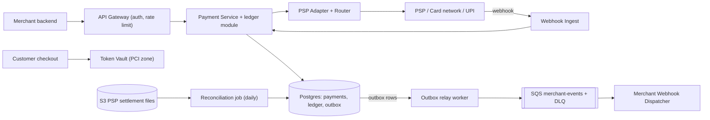
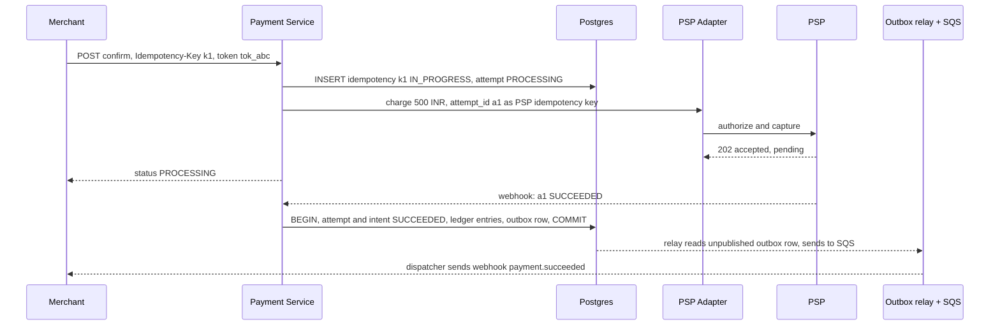
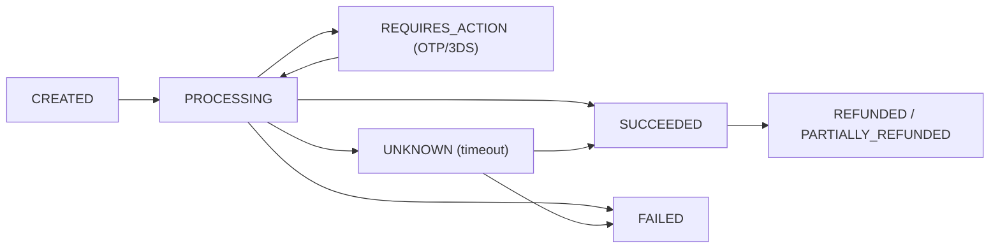
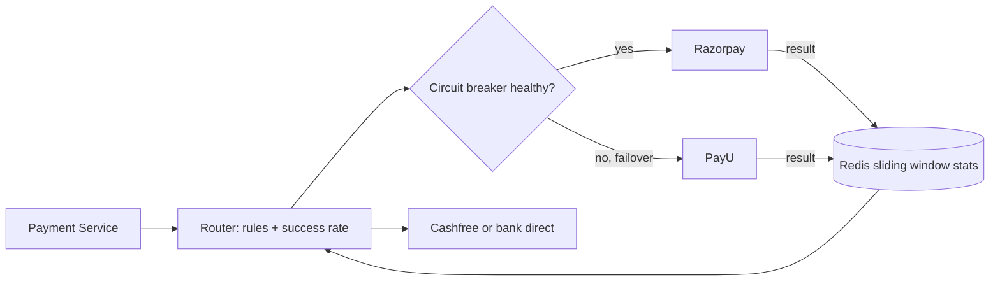

# Design a Payment System (Razorpay / Stripe)

**Ek line me:** merchant (Swiggy) apne customer se paisa le, hum card/UPI/netbanking ke through bank/PSP se paisa collect karein, ledger me record karein, aur baad me merchant ko settle karein. Core challenge ye hai ki **paisa na double kate, na kho jaye**, chahe network, retry ya crash kuch bhi ho.

**Is question me interviewer kya check karta hai:** idempotency, strong consistency, payment state machine, external PSP ke saath async (webhooks) kaam karna, ledger ka sahi design, aur reconciliation.

---

## Step 1: Interviewer se ye confirm karo (3–5 min)

| Tum poochho | Typical jawab | Design pe asar |
|---|---|---|
| "Hum payment gateway (Razorpay) bana rahe hain ya ek e-commerce ka payment module?" | Gateway jaisa: merchants ke liye pay-in | Merchant APIs, webhooks to merchant, settlement |
| "Card/UPI processing khud karenge ya PSP/acquirer bank use karenge?" | External PSP / bank | PSP adapter layer, async callbacks |
| "Card data hum store karenge?" | Nahi, tokenization | PCI scope chhota, vault alag |
| "Refunds aur payouts scope me?" | Refund haan, payouts brief | Ledger me reverse entries |
| "Consistency kitni? Paisa galat dikhe to chalega?" | Bilkul nahi | SQL + ACID, consistency > availability |
| "Scale?" | ~10M payments/day, festive sale pe 10x | Write load moderate, sharding by merchant baad me |
| "Multi-currency, fraud detection?" | Brief / out of scope | Mention karke chhod do |

> **Bolo:** "Is system me correctness sabse upar hai. Main har write ko idempotent rakhunga, payment ko ek state machine se chalaunga, paisa ek double-entry ledger me record karunga, aur PSP ke saath mismatch pakadne ke liye reconciliation rakhunga."

## Step 2: Requirements

**Functional**
1. Merchants payment intent create kar sakein aur uska status API + webhook se jaan sakein
2. Customers card/UPI/netbanking se pay kar sakein (hum PSP ke through charge karte hain)
3. Merchants full/partial refund kar sakein
4. Finance/ops har money movement ledger me dekh sakein aur PSP ke saath daily reconcile kar sakein

**Out of scope:** fraud engine, multi-currency FX, merchant payouts ka detail, apna card network/acquiring.

**Non-functional (priority order)**
1. **Correctness:** exactly-once effect (double charge kabhi nahi), ledger me debit = credit hamesha
2. **Consistency:** payment state + ledger strong. Merchant webhooks aur analytics eventual (seconds)
3. **Durability + audit:** entries immutable, history kabhi delete nahi
4. **Availability:** 99.99% create/confirm API, par doubt me fail-safe (charge mat karo)
5. **Latency + scale:** API p99 < 300 ms (PSP time chhod ke), 10M payments/day, peak ~1.2K TPS
6. **Security:** PCI DSS, card data tokenized

**CAP choice:** payment state aur ledger ke liye CP. Partition me request fail karna (merchant retry karega, idempotency key se safe) galat balance se behtar hai.

## Step 3: Estimation (sirf jo design badle)

- 10M payments/day ≈ **115 TPS** avg, sale peak 10x ≈ **1,200 TPS**. Har payment pe ~5–10 DB writes (intent, attempts, ledger, outbox) → ~10K writes/sec peak. Ek bada Postgres primary sambhal leta hai, `merchant_id` sharding baad me.
- Ledger entries: 10M × 4 = 40M rows/day, ~15B/year. Append-only, partition by month.
- PSP latency 1–5 sec, kabhi 30 sec+. Isliye **async flow + webhooks**, synchronous wait nahi.

> **Bolo:** "Throughput bahut bada nahi hai, isliye NoSQL ya Kafka ki zarurat nahi. Problem correctness hai, isliye SQL with ACID choose karunga."

## Step 4: Core entities

- **Merchant**: id, api_keys, webhook_url, settlement account
- **PaymentIntent**: id, merchant_id, amount, currency, order_id, status, idempotency_key
- **PaymentAttempt**: id, intent_id, method, psp, psp_reference, status (ek intent ke multiple attempts ho sakte hain)
- **LedgerEntry**: id, txn_id, account_id, debit/credit, amount, created_at (immutable)
- **Account** (ledger): customer_receivable, merchant_payable, psp_clearing, fees
- **Refund**: id, intent_id, amount, status
- **IdempotencyRecord**: key, merchant_id, request_hash, response, status

## Step 5: APIs

```http
POST /v1/payment_intents   {amount, currency, orderId}     → {intentId, clientSecret, status: CREATED}
     Header: Idempotency-Key: <uuid>
POST /v1/payment_intents/{id}/confirm  {paymentMethodToken} → {status: PROCESSING | REQUIRES_ACTION}
     Header: Idempotency-Key: <uuid>
GET  /v1/payment_intents/{id}                               → {status, amount, attempts}
POST /v1/refunds  {intentId, amount}                        → {refundId, status}
POST /internal/psp/webhook  (PSP → us, signed)              → 200
Outgoing: POST merchant.webhook_url {event: payment.succeeded, intentId}  (HMAC signed)
```

> **Bolo:** "Create aur confirm alag hain, kyunki customer ko 3DS/OTP ya UPI app approve karna padta hai. Har mutating API pe Idempotency-Key mandatory hai."

## Step 6: High-level design

**Simple v1 pehle:** Merchant → Payment Service → ek Postgres (intents, attempts, idempotency, ledger) → ek PSP pe synchronous call. FR1–FR3 isse chal jaate hain. Phir requirements cheezein jodti hain: PCI → Token Vault. PSP latency 1–30 sec → async + webhooks + poller. Merchant webhooks 72 hr tak retry → outbox + SQS. 99.99% (ek PSP ka outage = hamara outage) → multi-PSP router. FR4 → daily recon job. 1.2K TPS peak ke liye ek Postgres primary kaafi hai.



**Har component kyun:**
- **Token Vault (NFR security):** card number sirf yahan (alag PCI network), baaki system ko `tok_abc`. Card main DB me = poora system PCI scope me.
- **Payment Service + ledger module (FR1–FR4):** state machine, idempotency, aur ledger entries **usi DB transaction** me jisme intent SUCCEEDED hota hai. Alag Ledger Service nahi: crash pe "payment SUCCEEDED, ledger missing" ho sakta hai. Split tab karo jab ledger volume (~15B rows/yr) ya team force kare, tab outbox + `txn_id` unique se.
- **Postgres (NFR consistency, ~10K writes/sec peak):** ACID, unique constraints. Cassandra/DynamoDB ki zarurat is scale pe nahi.
- **PSP Adapter + Router (FR2, 99.99%):** har PSP ka alag API, common interface, success-rate routing aur failover (Step 9.7).
- **Webhook Ingest (FR2):** signature verify, `psp_event_id` dedup, jaldi 200. Payment Service ka endpoint bhi chalega, alag isliye ki sale peak ka webhook burst merchant API slow na kare.
- **Outbox relay + SQS (FR1 webhooks):** ~1.2K payments/sec × ~2 events = ~2–3K msgs/sec, aur ek main consumer jise per-message retry, backoff aur DLQ chahiye. SQS yahi deta hai. **Kafka nahi:** throughput chhota, replay ki zarurat nahi (outbox table hi history hai), aur Kafka per-message retry/DLQ nahi deta. Kafka tab jab 4–5 internal consumers (fraud, analytics) same stream chahein.
- **Reconciliation job (FR4):** daily batch, settlement file vs ledger. Cron job, always-on service nahi.

**Mapping:** FR1 → Payment Service, Postgres, outbox + SQS + Dispatcher. FR2 → Vault, PSP Adapter, Webhook Ingest. FR3 → Payment Service + ledger reverse entries. FR4 → ledger tables + Recon job.

## Step 7: Main flow: card payment



Agar webhook na aaye to **status poller** har 1–5 min PSP se `GET status(a1)` poochhta hai.

## Step 8: Data model & DB choice

```sql
payment_intents(id PK, merchant_id, amount BIGINT, currency, status, order_id,
                UNIQUE(merchant_id, idempotency_key), version, created_at)
payment_attempts(id PK, intent_id FK, psp, psp_ref UNIQUE, status, created_at)
idempotency_keys(merchant_id, key, request_hash, response_json, status, PRIMARY KEY(merchant_id, key))
ledger_entries(id PK, txn_id, account_id, direction DEBIT|CREDIT, amount BIGINT, created_at)
  -- rule: SUM(debit) = SUM(credit) per txn_id, rows never UPDATE ya DELETE
outbox(id PK, aggregate_id, event_type, payload, published BOOL)
```

- **Postgres** (ya MySQL): ACID, unique constraints, transactions. Paisa hamesha **BIGINT paise me** (₹500 = 50000), float kabhi nahi.
- Ledger tables same Postgres me (ek transaction, monthly partitions). Shard by `merchant_id` jab ek primary chhota pade.
- Outbox relay `published=false` rows uthata hai, SQS pe bhejta hai, phir mark karta hai. Crash pe dobara bhej sakta hai, isliye dispatcher event id se dedup karta hai.

## Step 9: Deep dives (interviewer yahin pressure dalega)

### 9.1 Idempotency: double charge kaise rokoge?
**NFR:** exactly-once effect.
1. Merchant har request pe `Idempotency-Key` bheje. Hum `(merchant_id, key)` pe unique insert karte hain.
2. Insert success → naya request, process karo, end me response save karo.
3. Unique violation → key pehle aayi thi. `IN_PROGRESS` ho to 409 "retry later", `DONE` ho to **saved response return**. Request body ka hash alag ho to 422.
4. PSP ko bhi hamara `attempt_id` idempotency key ke roop me bhejo. Hamara retry PSP pe double charge nahi karega.
5. Webhooks duplicate aate hain: `psp_event_id` unique rakho, aur state transition idempotent ho (SUCCEEDED → SUCCEEDED no-op).

> **Bolo:** "Exactly-once delivery network me possible nahi hai. Main at-least-once retries + idempotent processing se exactly-once **effect** laata hoon."

**Trade-off:** har mutating request pe ek extra write aur keys ka 24 hr–7 din storage.

### 9.2 Payment state machine
**NFR:** correctness under timeouts.

- Transitions sirf allowed edges pe. Update aise: `UPDATE ... SET status='SUCCEEDED' WHERE id=? AND status IN ('PROCESSING','UNKNOWN')`. Optimistic, race-safe.
- **UNKNOWN** sabse important state hai: PSP timeout pe hum maan nahi sakte ki fail hua. Poller/reconciliation resolve karega. Customer ko dobara charge karne mat do jab tak UNKNOWN resolve na ho.

**Trade-off:** UNKNOWN resolve hone me minutes lag sakte hain, customer "processing" dekhega.

### 9.3 Double-entry ledger
**NFR:** ledger kabhi galat na ho + audit.
- Har money movement ek **txn** hai jisme kam se kam 2 entries: ek debit, ek credit, sum equal.
- Payment success: `debit psp_clearing 500, credit merchant_payable 490, credit fees_revenue 10`.
- Refund: ulti entries, purani entry edit nahi hoti. Isse audit trail milta hai.
- Balance = entries ka sum (ya ek materialized balance table jo same transaction me update ho).
- Nightly check: har txn ka debit = credit, aur system-wide total zero. Mismatch = alert.

**Trade-off:** har payment pe 3–4 rows (~15B/yr), aur balance = sum ya alag materialized table.

### 9.4 Saga across Order and Payment
**NFR:** services ke beech consistency, bina 2PC.
Order Service (Swiggy) aur Payment alag services hain, ek DB transaction possible nahi.
- **Choreography saga:** Order `PENDING_PAYMENT` → Payment succeeded event → Order `CONFIRMED`. Payment fail → Order `CANCELLED`.
- Order confirm fail ho (restaurant band) → **compensation = refund** trigger.
- Events **outbox pattern** se nikalte hain (outbox → SQS → merchant webhook → Order Service), taaki DB commit aur event dono ya to hon ya na hon. 2PC nahi, kyunki PSP 2PC support nahi karta aur ye blocking hai.

**Trade-off:** order aur payment kuch seconds eventual, aur compensation logic likhna padta hai.

### 9.5 Reconciliation
**NFR:** paisa kabhi kho na jaye.
- PSP/bank har din settlement file deta hai (SFTP/API → S3).
- Recon job: file ki har row ko `psp_ref` se hamare attempts aur ledger se match karta hai.
- Teen buckets: **matched**, **hamare paas hai, PSP ke paas nahi** (UNKNOWN jo actually fail hua), **PSP ke paas hai, hamare paas nahi** (missed webhook → mark SUCCEEDED, ya auto refund).
- Amount mismatch → manual ops queue. Ye last safety net hai.

**Trade-off:** mismatch T+1 pe pakda jaata hai, real-time nahi.

### 9.6 PCI aur tokenization
**NFR:** PCI DSS.
- Card number checkout page se seedha **Vault** (iframe/SDK) me jaata hai, merchant server pe bhi nahi.
- Vault encrypt (HSM keys) karke `tok_abc` deta hai. Payment Service sirf token use karta hai. PCI audit sirf vault ka.
- Network tokenization (Visa/Mastercard tokens) aur RBI card-on-file rules ke liye bhi yahi layer.

**Trade-off:** vault ek extra critical hop hai, aur HSM ka cost.

### 9.7 Multiple payment gateways: routing (Juspay jaisa)
**NFR:** 99.99% availability + success rate.
Bade merchants (Swiggy, Flipkart) ek PSP pe depend nahi karte. Ek **orchestration layer** Razorpay, PayU, Cashfree aur bank direct ke beech har payment ka best route chunti hai.

- **Routing rules:** har attempt ke liye inputs: method (card/UPI/netbanking), issuer bank, card network, UPI app (PhonePe/GPay), amount. Score = **success rate** (sabse bada weight) + **cost** (MDR fee) + **health** (latency, error rate). Merchant rules bhi: "HDFC credit cards → PayU", "₹1 lakh+ → bank direct".
- **Real-time success rate:** har `(psp, bank, method)` ke liye **sliding window** (last 5–15 min) me success/total counts, Redis me time-bucketed counters (har minute ka bucket). Redis isliye ki saare router instances same stats dekhein (~1.2K updates/sec). Ye source of truth nahi: down ho to static rules pe fallback. Kam traffic wale combos pe global average, aur ~5% exploration traffic dusre PSPs pe.
- **Automatic failover (circuit breaker):** PSP ka success rate threshold se neeche gire ya timeouts badhein → circuit **OPEN**, naya traffic dusre PSP pe. Kuch der baad **HALF_OPEN**: thoda traffic bhejke check, theek ho to CLOSED.
- **Retry on another PSP sirf jab safe ho:**
  - Safe: PSP ne clear **FAILED** diya (decline, connection refused, request PSP tak pahuncha hi nahi). Naya `PaymentAttempt` banao, naya attempt_id, dusre PSP pe bhejo.
  - Unsafe: **timeout / UNKNOWN**. Pehle PSP pe charge ho chuka ho sakta hai. Yahan dusre PSP pe retry = **double debit**. Pehle status poll/resolve karo.
  - Ek intent pe sirf ek attempt `PROCESSING` ho sakta hai (DB constraint), aur intent ek hi baar SUCCEEDED hoga. Galti se do success aaye to doosre ka auto refund.
- **Apna vault zaroori:** card kisi PSP ke vault me save ho to sirf usi PSP pe chalega. Apne vault (ya network tokens) se koi bhi PSP chuna ja sakta hai.



> **Bolo:** "Router success rate, cost aur health dekh ke PSP chunta hai. Retry dusre PSP pe sirf definite failure pe hota hai, timeout pe nahi, kyunki wahan double debit ka risk hai."

**Trade-off:** kai PSP integrations, contracts aur settlement files maintain karne padte hain.

## Step 10: Decision table (kya chuna, kyun, kya nahi)

| Decision | Kyun chuna | Kya nahi chuna, kyun |
|---|---|---|
| **Postgres (SQL, ACID), ledger same DB** | Transactions, unique constraints, ledger + status ek commit me. ~10K writes/sec peak | **Cassandra/DynamoDB:** multi-row transactions aur constraints kamzor. **Alag Ledger Service:** distributed write. Sacrifice: ek primary pe write limit, baad me merchant sharding |
| **Idempotency key table** | Retry pe same result, double charge nahi | **Client pe trust:** timeouts pe retry hoga hi. Sacrifice: har request pe extra write |
| **Double-entry append-only ledger** | Har paisa traceable, audit, errors pakad me | **Sirf `balance` column update:** history nahi. Sacrifice: 3–4x rows |
| **Saga + outbox** | Services decoupled, compensation se recover | **2PC/XA:** PSP support nahi karta, blocking, coordinator SPOF. Sacrifice: seconds ki eventual consistency |
| **Outbox relay → SQS for merchant webhooks** | ~2–3K msgs/sec, per-message retry + DLQ built-in | **Kafka:** is volume pe overkill, replay ki zarurat nahi, per-message retry nahi. **Seedha HTTP call commit ke baad:** crash pe event lost. Sacrifice: relay ki wajah se ~1 sec delay |
| **Async PSP + webhooks + poller** | PSP slow ho to bhi threads block nahi | **Synchronous wait 30 sec:** threads khatam, timeout pe state unclear. Sacrifice: merchant ko PROCESSING handle karna padta |
| **Token vault** | PCI scope sirf ek chhoti service | **Card data main DB me:** poora system PCI scope me. Sacrifice: extra hop + HSM cost |
| **Explicit UNKNOWN state** | Timeout pe galat assumption nahi | **Timeout = FAILED:** retry pe double charge. Sacrifice: kuch payments minutes tak pending |
| **Multi-PSP routing (Redis window stats)** | Failover, better success rate aur cost | **Single PSP:** uska outage = hamara outage. **Per-instance in-memory stats:** instances ka view alag. Sacrifice: kai integrations maintain karna |

## Step 11: Failures & bottlenecks

| Kya fail hua | Kya hoga | Handle kaise |
|---|---|---|
| PSP timeout | Pata nahi charge hua ya nahi | UNKNOWN state, poller + recon resolve kare, PSP idempotency key se safe retry |
| Webhook miss | Paisa kata, status PROCESSING | Status poller + daily reconciliation |
| Duplicate webhook | Double ledger entry ka risk | `psp_event_id` unique, idempotent transition |
| Payment Service crash beech me | Half-done state | DB transaction + outbox, idempotency record `IN_PROGRESS` se resume |
| PSP down | Payments fail | PSP Adapter dusre PSP pe route kare (smart routing by success rate) |
| Merchant webhook endpoint down | Merchant ko update nahi | SQS se exponential backoff retries 24–72 hrs, phir DLQ, merchant GET API se poll kar sake |
| Outbox relay down | Webhooks late, paisa safe | `published=false` rows se resume, lag pe alert |
| Ledger imbalance | Paisa mismatch | Nightly invariant check, alert, ops queue |

## Step 12: "Isko aur better kaise karein" (end me khud bolo)

> "Agar aur time ho to main ye improve karunga:"
- **Fraud/risk engine:** velocity checks, device fingerprint, ML score confirm se pehle.
- **Multi-region active-passive:** ledger ek primary region me (consistency), DR region me sync replica.
- **Ledger ko dedicated immutable store** (jaise TigerBeetle ya QLDB style) jab scale bade.
- **ML-based routing:** sliding-window rules ke upar bandit model jo har payment ke liye PSP success probability predict kare.

## Step 13: Interviewer ke likely follow-up sawal

- "Client ne retry kiya, double charge kaise nahi hua?" → Idempotency key + PSP pe attempt_id key (Step 9.1)
- "PSP ne timeout diya, ab kya?" → UNKNOWN state, poll karo, blind retry nahi
- "Exactly-once kaise?" → At-least-once + idempotent consumers + unique constraints = exactly-once effect
- "Order aur payment me consistency?" → Saga with outbox, compensation = refund
- "Ledger me galti ho gayi to?" → Entry edit nahi, reversal entry daalo
- "Paise ke liye float kyun nahi?" → Rounding errors. Smallest unit BIGINT me rakho
- "Card data kahan store?" → Sirf vault me, encrypted, baaki sab tokens
- **Senior signal:** khud bolo ki sabse bada risk PSP timeout pe double debit hai (UNKNOWN, cross-PSP retry nahi), aur sale peak pe `psp_clearing` jaisa global ledger account ka materialized balance row hot ban jaata hai. Isliye append-only entries + periodic balance rollup, aur per-PSP UNKNOWN count pe alert.

## 2-minute recap (interview se pehle ye padho)

> Payment system me correctness sabse upar hai, isliye Postgres with ACID. Merchant intent create karta hai, fir confirm karta hai, dono pe Idempotency-Key jo `(merchant_id, key)` unique se enforce hoti hai. Payment ek state machine hai (CREATED → PROCESSING → SUCCEEDED/FAILED, aur timeout pe UNKNOWN). PSP ko hamara attempt_id idempotency key ke roop me jaata hai. PSP result async webhook se aata hai, dedup by event id, aur backup me poller. Har money movement double-entry append-only ledger me, status update ke same transaction me. Outbox row → relay → SQS → merchant webhooks (retry + DLQ). Kafka nahi, kyunki ~2–3K events/sec aur ek main consumer. Order ke saath saga, fail pe refund compensation. Daily reconciliation PSP settlement file vs ledger. Card data sirf token vault me (PCI).

## Checklist

- [ ] Payment intent create + confirm flow bina dekhe bata sakta hoon
- [ ] Idempotency key ka poora logic (IN_PROGRESS, DONE, hash mismatch) samjha sakta hoon
- [ ] Payment state machine aur UNKNOWN state ka role bata sakta hoon
- [ ] Double-entry ledger ka example entries ke saath likh sakta hoon
- [ ] Saga + outbox se order aur payment consistent rakhna explain kar sakta hoon
- [ ] Reconciliation ke teen mismatch buckets bata sakta hoon
- [ ] Tokenization se PCI scope kaise chhota hota hai samjha sakta hoon
- [ ] SQL kyun aur 2PC kyun nahi, ye trade-off bol sakta hoon
