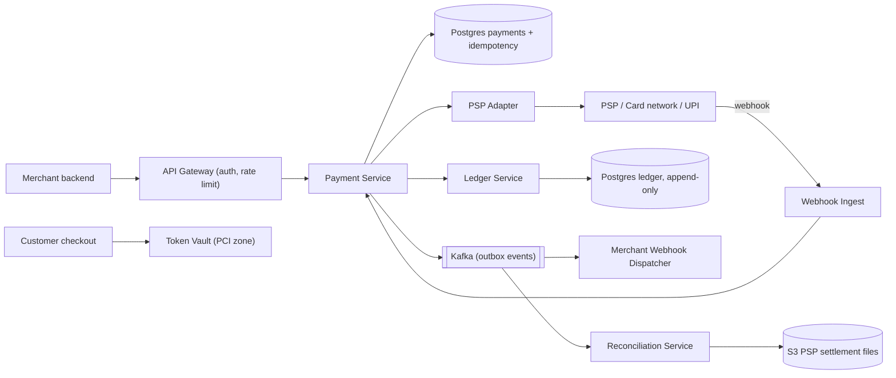
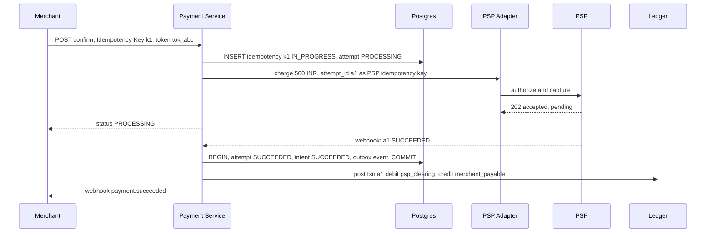
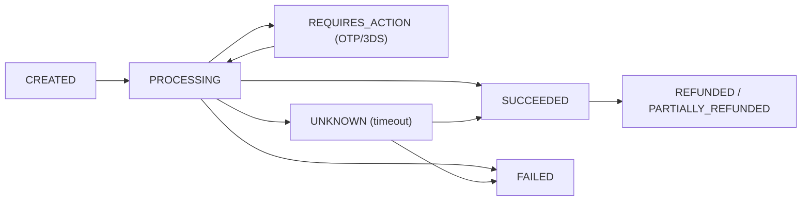
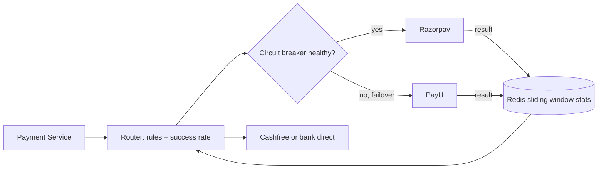

# Design a Payment System (Razorpay / Stripe)

**Ek line me:** merchant (Swiggy) apne customer se paisa le, hum card/UPI/netbanking ke through bank/PSP se paisa collect karein, ledger me record karein, aur baad me merchant ko settle karein. Core challenge ye hai ki **paisa na double kate, na kho jaye**, chahe network, retry ya crash kuch bhi ho.

**Is question me interviewer kya check karta hai:** idempotency, strong consistency, payment state machine, external PSP ke saath async (webhooks) kaam karna, ledger ka sahi design, aur reconciliation.

---

## Step 1: Interviewer se ye confirm karo (3–5 min)

| Tum poochho | Typical jawab | Design pe asar |
|---|---|---|
| "Hum payment gateway (Razorpay) bana rahe hain ya ek e-commerce ka payment module?" | Gateway jaisa: merchants ke liye pay-in | Merchant APIs, webhooks to merchant, settlement |
| "Card/UPI processing khud karenge ya PSP/acquirer bank use karenge?" | External PSP / bank | PSP adapter layer, async callbacks |
| "Card data hum store karenge?" | Nahi, tokenization | PCI scope chhota, vault alag |
| "Refunds aur payouts scope me?" | Refund haan, payouts brief | Ledger me reverse entries |
| "Consistency kitni? Paisa galat dikhe to chalega?" | Bilkul nahi | SQL + ACID, consistency > availability |
| "Scale?" | ~10M payments/day, festive sale pe 10x | Write load moderate, sharding by merchant baad me |
| "Multi-currency, fraud detection?" | Brief / out of scope | Mention karke chhod do |

> **Bolo:** "Is system me correctness sabse upar hai. Main har write ko idempotent rakhunga, payment ko ek state machine se chalaunga, paisa ek double-entry ledger me record karunga, aur PSP ke saath mismatch pakadne ke liye reconciliation rakhunga."

## Step 2: Requirements

**Functional**
1. Merchant payment create kare (amount, currency, order_id) → payment intent mile
2. Customer card/UPI se pay kare, hum PSP ke through charge karein
3. Payment status merchant ko webhook + API se mile
4. Refund (full/partial)
5. Ledger + daily settlement to merchant, aur bank/PSP ke saath reconciliation

**Non-functional**
- **Exactly-once effect:** ek payment ek hi baar charge ho
- **Strong consistency:** ledger kabhi galat na ho (debit = credit)
- **Durability + auditability:** har entry immutable, history kabhi delete nahi
- **Availability:** 99.99%, par doubt me fail-safe (charge mat karo)
- **Security:** PCI DSS, card data tokenized

## Step 3: Estimation (sirf jo design badle)

- 10M payments/day ≈ **115 TPS** avg, sale peak 10x ≈ **1,200 TPS**. Har payment pe ~5–10 DB writes (intent, attempts, ledger) → ~10K writes/sec peak. Achha tuned Postgres cluster (merchant se sharded) sambhal lega.
- Ledger entries: 10M × 4 = 40M rows/day, ~15B/year. Append-only, partition by month.
- PSP latency 1–5 sec, kabhi 30 sec+. Isliye **async flow + webhooks**, synchronous wait nahi.

> **Bolo:** "Throughput bahut bada nahi hai, isliye NoSQL ki zarurat nahi. Problem correctness hai, isliye SQL with ACID choose karunga."

## Step 4: Core entities

- **Merchant**: id, api_keys, webhook_url, settlement account
- **PaymentIntent**: id, merchant_id, amount, currency, order_id, status, idempotency_key
- **PaymentAttempt**: id, intent_id, method, psp, psp_reference, status (ek intent ke multiple attempts ho sakte hain)
- **LedgerEntry**: id, txn_id, account_id, debit/credit, amount, created_at (immutable)
- **Account** (ledger): customer_receivable, merchant_payable, psp_clearing, fees
- **Refund**: id, intent_id, amount, status
- **IdempotencyRecord**: key, merchant_id, request_hash, response, status

## Step 5: APIs

```http
POST /v1/payment_intents   {amount, currency, orderId}     → {intentId, clientSecret, status: CREATED}
     Header: Idempotency-Key: <uuid>
POST /v1/payment_intents/{id}/confirm  {paymentMethodToken} → {status: PROCESSING | REQUIRES_ACTION}
     Header: Idempotency-Key: <uuid>
GET  /v1/payment_intents/{id}                               → {status, amount, attempts}
POST /v1/refunds  {intentId, amount}                        → {refundId, status}
POST /internal/psp/webhook  (PSP → us, signed)              → 200
Outgoing: POST merchant.webhook_url {event: payment.succeeded, intentId}  (HMAC signed)
```

> **Bolo:** "Create aur confirm alag hain, kyunki customer ko 3DS/OTP ya UPI app approve karna padta hai. Har mutating API pe Idempotency-Key mandatory hai."

## Step 6: High-level design



**Har component kyun:**
- **Token Vault:** card number sirf yahan aata hai (alag PCI network). Baaki system ko sirf `tok_abc` milta hai. PCI scope chhota.
- **Payment Service:** intent + attempt ka state machine. Idempotency check yahin.
- **PSP Adapter:** har PSP (Visa via acquirer, UPI via NPCI bank, netbanking) ka alag API. Adapter unhe common interface deta hai, routing aur failover bhi karta hai.
- **Webhook Ingest:** PSP async result bhejta hai. Signature verify, dedup by psp_event_id, fir Payment Service ko.
- **Ledger Service:** double-entry, append-only. Paise ka source of truth.
- **Kafka + outbox:** DB commit aur event publish atomically (outbox table se CDC). Merchant webhooks aur analytics isse.
- **Reconciliation:** PSP/bank ki daily settlement file vs hamara ledger compare.

## Step 7: Main flow: card payment



Agar webhook na aaye to **status poller** har 1–5 min PSP se `GET status(a1)` poochhta hai.

## Step 8: Data model & DB choice

```sql
payment_intents(id PK, merchant_id, amount BIGINT, currency, status, order_id,
                UNIQUE(merchant_id, idempotency_key), version, created_at)
payment_attempts(id PK, intent_id FK, psp, psp_ref UNIQUE, status, created_at)
idempotency_keys(merchant_id, key, request_hash, response_json, status, PRIMARY KEY(merchant_id, key))
ledger_entries(id PK, txn_id, account_id, direction DEBIT|CREDIT, amount BIGINT, created_at)
  -- rule: SUM(debit) = SUM(credit) per txn_id, rows never UPDATE ya DELETE
outbox(id PK, aggregate_id, event_type, payload, published BOOL)
```

- **Postgres** (ya MySQL): ACID, unique constraints, transactions. Paisa hamesha **BIGINT paise me** (₹500 = 50000), float kabhi nahi.
- Shard by `merchant_id` jab ek cluster chhota pade. Ledger alag DB.

## Step 9: Deep dives (interviewer yahin pressure dalega)

### 9.1 Idempotency: double charge kaise rokoge?
1. Merchant har request pe `Idempotency-Key` bheje. Hum `(merchant_id, key)` pe unique insert karte hain.
2. Insert success → naya request, process karo, end me response save karo.
3. Unique violation → key pehle aayi thi. `IN_PROGRESS` ho to 409 "retry later", `DONE` ho to **saved response return**. Request body ka hash alag ho to 422.
4. PSP ko bhi hamara `attempt_id` idempotency key ke roop me bhejo. Hamara retry PSP pe double charge nahi karega.
5. Webhooks duplicate aate hain: `psp_event_id` unique rakho, aur state transition idempotent ho (SUCCEEDED → SUCCEEDED no-op).

> **Bolo:** "Exactly-once delivery network me possible nahi hai. Main at-least-once retries + idempotent processing se exactly-once **effect** laata hoon."

### 9.2 Payment state machine

- Transitions sirf allowed edges pe. Update aise: `UPDATE ... SET status='SUCCEEDED' WHERE id=? AND status IN ('PROCESSING','UNKNOWN')`. Optimistic, race-safe.
- **UNKNOWN** sabse important state hai: PSP timeout pe hum maan nahi sakte ki fail hua. Poller/reconciliation resolve karega. Customer ko dobara charge karne mat do jab tak UNKNOWN resolve na ho.

### 9.3 Double-entry ledger
- Har money movement ek **txn** hai jisme kam se kam 2 entries: ek debit, ek credit, sum equal.
- Payment success: `debit psp_clearing 500, credit merchant_payable 490, credit fees_revenue 10`.
- Refund: ulti entries, purani entry edit nahi hoti. Isse audit trail milta hai.
- Balance = entries ka sum (ya ek materialized balance table jo same transaction me update ho).
- Nightly check: har txn ka debit = credit, aur system-wide total zero. Mismatch = alert.

### 9.4 Saga across Order and Payment
Order Service (Swiggy) aur Payment alag services hain, ek DB transaction possible nahi.
- **Choreography saga:** Order `PENDING_PAYMENT` → Payment succeeded event → Order `CONFIRMED`. Payment fail → Order `CANCELLED`.
- Order confirm fail ho (restaurant band) → **compensation = refund** trigger.
- Events **outbox pattern** se publish hote hain, taaki DB commit aur event dono ya to hon ya na hon. 2PC nahi, kyunki PSP 2PC support nahi karta aur ye blocking hai.

### 9.5 Reconciliation
- PSP/bank har din settlement file deta hai (SFTP/API → S3).
- Recon job: file ki har row ko `psp_ref` se hamare attempts aur ledger se match karta hai.
- Teen buckets: **matched**, **hamare paas hai, PSP ke paas nahi** (UNKNOWN jo actually fail hua), **PSP ke paas hai, hamare paas nahi** (missed webhook → mark SUCCEEDED, ya auto refund).
- Amount mismatch → manual ops queue. Ye last safety net hai.

### 9.6 PCI aur tokenization
- Card number checkout page se seedha **Vault** (iframe/SDK) me jaata hai, merchant server pe bhi nahi.
- Vault encrypt (HSM keys) karke `tok_abc` deta hai. Payment Service sirf token use karta hai. PCI audit sirf vault ka.
- Network tokenization (Visa/Mastercard tokens) aur RBI card-on-file rules ke liye bhi yahi layer.

### 9.7 Multiple payment gateways: routing (Juspay jaisa)
Bade merchants (Swiggy, Flipkart) ek PSP pe depend nahi karte. Unke upar ek **payment orchestration layer** hoti hai jo Razorpay, PayU, Cashfree aur bank direct integrations ke beech har payment ke liye best route chunti hai.

- **Routing rules:** har attempt ke liye inputs: method (card/UPI/netbanking), issuer bank, card network, UPI app (PhonePe/GPay), amount. Score = **success rate** (sabse bada weight) + **cost** (MDR fee) + **health** (latency, error rate). Merchant rules bhi: "HDFC credit cards → PayU", "₹1 lakh+ → bank direct".
- **Real-time success rate:** har `(psp, bank, method)` ke liye **sliding window** (last 5–15 min) me success/total counts, Redis me time-bucketed counters (har minute ka bucket). Bahut kam traffic wale combos pe global average fallback. Thoda traffic (~5%) exploration ke liye dusre PSPs pe bhi bhejo, taaki unka data fresh rahe.
- **Automatic failover (circuit breaker):** PSP ka success rate threshold se neeche gire ya timeouts badhein → circuit **OPEN**, naya traffic dusre PSP pe. Kuch der baad **HALF_OPEN**: thoda traffic bhejke check, theek ho to CLOSED.
- **Retry on another PSP sirf jab safe ho:**
  - Safe: PSP ne clear **FAILED** diya (decline, connection refused, request PSP tak pahuncha hi nahi). Naya `PaymentAttempt` banao, naya attempt_id, dusre PSP pe bhejo.
  - Unsafe: **timeout / UNKNOWN**. Pehle PSP pe charge ho chuka ho sakta hai. Yahan dusre PSP pe retry = **double debit**. Pehle status poll/resolve karo.
  - Ek intent pe sirf ek attempt `PROCESSING` ho sakta hai (DB constraint), aur intent ek hi baar SUCCEEDED hoga. Galti se do success aaye to doosre ka auto refund.
- **Tokenization vault:** card PSP ke vault me save hua to sirf usi PSP pe chalega. Isliye card **apne vault** me (ya network tokens Visa/Mastercard ke), aur routing ke time chosen PSP ko token/card bhejo. Isse card saved rehte hue bhi koi bhi PSP chuna ja sakta hai.



> **Bolo:** "Router success rate, cost aur health dekh ke PSP chunta hai. Retry dusre PSP pe sirf definite failure pe hota hai, timeout pe nahi, kyunki wahan double debit ka risk hai."

## Step 10: Decision table (kya chuna, kyun, kya nahi)

| Decision | Kyun chuna | Kya nahi chuna, kyun |
|---|---|---|
| **Postgres (SQL, ACID)** | Transactions, unique constraints, strong consistency. Write load moderate | **Cassandra/DynamoDB:** multi-row transactions aur constraints kamzor, eventual consistency paise ke liye risky |
| **Idempotency key table** | Retry pe same result, double charge nahi | **Client pe trust ki retry nahi karega:** network timeouts me retry hoga hi |
| **Double-entry append-only ledger** | Har paisa traceable, audit, errors pakad me aate hain | **Sirf `balance` column update:** history nahi, bug ho to pata nahi chalta kya galat hua |
| **Saga + outbox** | Services decoupled, compensation se recover | **2PC/XA:** PSP support nahi karta, blocking, coordinator SPOF |
| **Async PSP + webhooks + poller** | PSP slow ho to bhi threads block nahi | **Synchronous wait 30 sec:** threads aur connections khatam, timeouts pe state unclear |
| **Token vault** | PCI scope sirf ek chhoti service | **Card data main DB me:** poora system PCI scope me, breach ka bada risk |
| **Explicit UNKNOWN state** | Timeout pe galat assumption nahi | **Timeout = FAILED maan lena:** customer retry kare aur double charge ho jaye |
| **Multi-PSP orchestration + success-rate routing** | Ek PSP down/degrade ho to failover, success rate aur cost dono better | **Single PSP:** uska outage = hamara outage, aur kisi bank pe kharab success rate pe koi option nahi |

## Step 11: Failures & bottlenecks

| Kya fail hua | Kya hoga | Handle kaise |
|---|---|---|
| PSP timeout | Pata nahi charge hua ya nahi | UNKNOWN state, poller + recon resolve kare, PSP idempotency key se safe retry |
| Webhook miss | Paisa kata, status PROCESSING | Status poller + daily reconciliation |
| Duplicate webhook | Double ledger entry ka risk | `psp_event_id` unique, idempotent transition |
| Payment Service crash beech me | Half-done state | DB transaction + outbox, idempotency record `IN_PROGRESS` se resume |
| PSP down | Payments fail | PSP Adapter dusre PSP pe route kare (smart routing by success rate) |
| Merchant webhook endpoint down | Merchant ko update nahi | Exponential backoff retries 24–72 hrs, DLQ, merchant GET API se poll kar sake |
| Ledger imbalance | Paisa mismatch | Nightly invariant check, alert, ops queue |

## Step 12: "Isko aur better kaise karein" (end me khud bolo)

> "Agar aur time ho to main ye improve karunga:"
- **Smart PSP routing:** har PSP/bank ka live success rate track karke best route choose karna (Razorpay jaisa). Success rate 2–3% badhta hai.
- **Fraud/risk engine:** velocity checks, device fingerprint, ML score confirm se pehle.
- **Multi-region active-passive:** ledger ek primary region me (consistency), DR region me sync replica.
- **Settlement + payouts service:** T+1 merchant payouts, batch bank transfers, apni reconciliation ke saath.
- **Ledger ko dedicated immutable store** (jaise TigerBeetle ya QLDB style) jab scale bade.
- **Observability:** per-PSP success rate, UNKNOWN count, recon mismatch count dashboards + alerts.
- **ML-based routing:** sliding-window rules ke upar bandit/ML model jo har payment ke liye PSP ka success probability predict kare, aur per-merchant cost vs success trade-off tune kare.

## Step 13: Interviewer ke likely follow-up sawal

- "Client ne retry kiya, double charge kaise nahi hua?" → Idempotency key + PSP pe attempt_id key (Step 9.1)
- "PSP ne timeout diya, ab kya?" → UNKNOWN state, poll karo, blind retry nahi
- "Exactly-once kaise?" → At-least-once + idempotent consumers + unique constraints = exactly-once effect
- "Order aur payment me consistency?" → Saga with outbox, compensation = refund
- "Ledger me galti ho gayi to?" → Entry edit nahi, reversal entry daalo
- "Paise ke liye float kyun nahi?" → Rounding errors. Smallest unit BIGINT me rakho
- "Card data kahan store?" → Sirf vault me, encrypted, baaki sab tokens

## 2-minute recap (interview se pehle ye padho)

> Payment system me correctness sabse upar hai, isliye Postgres with ACID. Merchant intent create karta hai, fir confirm karta hai, dono pe Idempotency-Key jo `(merchant_id, key)` unique se enforce hoti hai. Payment ek state machine hai (CREATED → PROCESSING → SUCCEEDED/FAILED, aur timeout pe UNKNOWN). PSP ko hamara attempt_id idempotency key ke roop me jaata hai. PSP result async webhook se aata hai, dedup by event id, aur backup me poller. Har money movement double-entry append-only ledger me. DB commit aur events outbox se Kafka, wahan se merchant webhooks. Order ke saath saga, fail pe refund compensation. Daily reconciliation PSP settlement file vs ledger. Card data sirf token vault me (PCI).

## Checklist

- [ ] Payment intent create + confirm flow bina dekhe bata sakta hoon
- [ ] Idempotency key ka poora logic (IN_PROGRESS, DONE, hash mismatch) samjha sakta hoon
- [ ] Payment state machine aur UNKNOWN state ka role bata sakta hoon
- [ ] Double-entry ledger ka example entries ke saath likh sakta hoon
- [ ] Saga + outbox se order aur payment consistent rakhna explain kar sakta hoon
- [ ] Reconciliation ke teen mismatch buckets bata sakta hoon
- [ ] Tokenization se PCI scope kaise chhota hota hai samjha sakta hoon
- [ ] SQL kyun aur 2PC kyun nahi, ye trade-off bol sakta hoon
