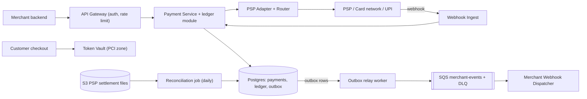
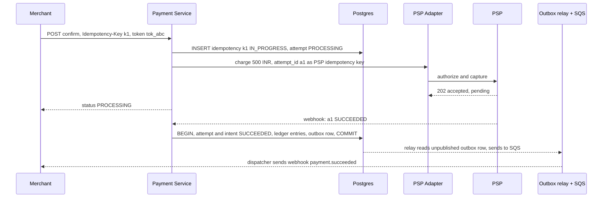
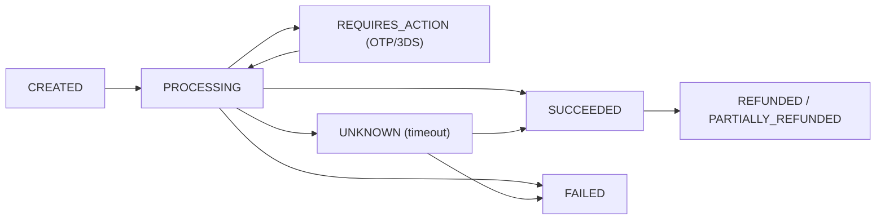
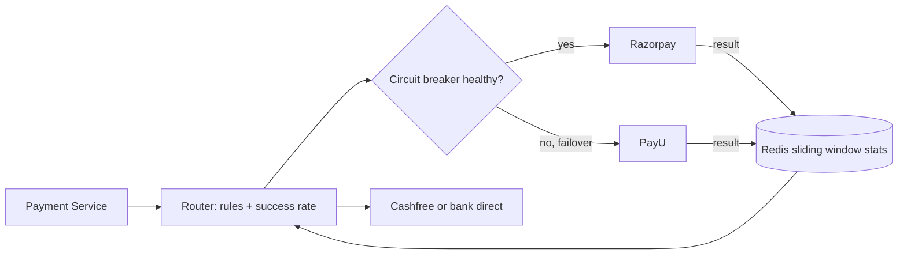

# Design a Payment System (Razorpay / Stripe)

**Ek line me:** merchant (Swiggy) ka customer card/UPI/netbanking se pay kare → PSP se collect → ledger → merchant settle. Challenge: **paisa na double kate, na kho jaye**, crash/retry ke baad bhi.

**Is question me interviewer kya check karta hai:** idempotency, strong consistency, state machine, async PSP (webhooks), ledger, reconciliation.

---

## Step 1: Interviewer se ye confirm karo (3–5 min)

| Tum poochho | Typical jawab | Design pe asar |
|---|---|---|
| "Gateway ya e-commerce payment module?" | Gateway: merchant pay-in | Merchant APIs, webhooks, settlement |
| "Card/UPI khud process ya PSP/acquirer?" | External PSP / bank | PSP adapter, async callbacks |
| "Card data store karenge?" | Nahi, tokenization | PCI scope chhota, vault alag |
| "Refunds, payouts scope me?" | Refund haan, payouts brief | Ledger me reverse entries |
| "Paisa galat dikhe to chalega?" | Bilkul nahi | SQL + ACID, consistency > availability |
| "Scale?" | ~10M payments/day, sale pe 10x | Moderate writes, merchant sharding baad me |
| "Multi-currency, fraud?" | Brief / out of scope | Mention karke chhod do |

> **Bolo:** "Correctness #1: idempotent writes, payment state machine, double-entry ledger, aur PSP mismatch ke liye reconciliation."

## Step 2: Requirements

**Functional**
1. Merchant payment intent create kare, status API + webhook se
2. Customer card/UPI/netbanking se pay kare (PSP ke through)
3. Merchant full/partial refund kare
4. Finance/ops ledger me har money movement dekhe, PSP se daily reconcile

**Out of scope:** fraud engine, FX, payouts detail, apna acquiring.

**Non-functional (priority order)**
1. **Correctness:** exactly-once effect (no double charge), ledger debit = credit
2. **Consistency:** state + ledger strong; webhooks, analytics eventual (seconds)
3. **Durability + audit:** entries immutable, kabhi delete nahi
4. **Availability:** 99.99% create/confirm, doubt me fail-safe (charge mat karo)
5. **Latency + scale:** API p99 < 300 ms (PSP time chhod ke), 10M payments/day, peak ~1.2K TPS
6. **Security:** PCI DSS, card data tokenized

**CAP choice:** state + ledger CP. Partition me fail karna (idempotent retry safe) > galat balance.

## Step 3: Estimation (sirf jo design badle)

- 10M payments/day ≈ **115 TPS** avg, sale peak 10x ≈ **1,200 TPS**. ~5–10 DB writes/payment (intent, attempts, ledger, outbox) → ~10K writes/sec peak → ek bada Postgres primary kaafi, `merchant_id` sharding baad me.
- Ledger: 10M × 4 = 40M rows/day, ~15B/year. Append-only, monthly partitions.
- PSP latency 1–5 sec, kabhi 30 sec+ → **async flow + webhooks**, sync wait nahi.

> **Bolo:** "Throughput chhota, NoSQL/Kafka nahi chahiye. Problem correctness hai → SQL with ACID."

## Step 4: Core entities

- **Merchant**: id, api_keys, webhook_url, settlement account
- **PaymentIntent**: id, merchant_id, amount, currency, order_id, status, idempotency_key
- **PaymentAttempt**: id, intent_id, method, psp, psp_reference, status (ek intent ke multiple attempts)
- **LedgerEntry**: id, txn_id, account_id, debit/credit, amount, created_at (immutable)
- **Account** (ledger): customer_receivable, merchant_payable, psp_clearing, fees
- **Refund**: id, intent_id, amount, status
- **IdempotencyRecord**: key, merchant_id, request_hash, response, status

## Step 5: APIs

```http
POST /v1/payment_intents   {amount, currency, orderId}     → {intentId, clientSecret, status: CREATED}
     Header: Idempotency-Key: <uuid>
POST /v1/payment_intents/{id}/confirm  {paymentMethodToken} → {status: PROCESSING | REQUIRES_ACTION}
     Header: Idempotency-Key: <uuid>
GET  /v1/payment_intents/{id}                               → {status, amount, attempts}
POST /v1/refunds  {intentId, amount}                        → {refundId, status}
POST /internal/psp/webhook  (PSP → us, signed)              → 200
Outgoing: POST merchant.webhook_url {event: payment.succeeded, intentId}  (HMAC signed)
```

> **Bolo:** "Create aur confirm alag (3DS/OTP ya UPI approve beech me). Har mutating API pe Idempotency-Key mandatory."

## Step 6: High-level design

**Simple v1:** Payment Service → ek Postgres → ek PSP pe sync call; FR1–FR3 ok. Phir: PCI → Vault. PSP 1–30 sec → async + webhooks + poller. Webhook retry 72 hr → outbox + SQS. 99.99% → multi-PSP router. FR4 → recon job. 1.2K TPS → ek primary kaafi.



**Har component kyun:**
- **Token Vault (security):** card number sirf yahan (alag PCI network), baaki system ko `tok_abc`.
- **Payment Service + ledger module:** state machine, idempotency, ledger entries **usi transaction** me jisme intent SUCCEEDED (alag service → crash pe "SUCCEEDED, ledger missing"). Split jab volume (~15B rows/yr) force kare, outbox + unique `txn_id` se.
- **Postgres (~10K writes/sec peak):** ACID + unique constraints.
- **PSP Adapter + Router (FR2, 99.99%):** common interface, success-rate routing + failover (9.7).
- **Webhook Ingest:** signature verify, `psp_event_id` dedup, jaldi 200. Alag → sale peak burst merchant API slow na kare.
- **Outbox relay + SQS:** ~2–3K msgs/sec, ek consumer, per-message retry + DLQ. Kafka tab jab 4–5 consumers (fraud, analytics) chahein.
- **Reconciliation job (FR4):** daily cron, settlement file vs ledger.

**Mapping:** FR1 → Payment Service, Postgres, outbox/SQS/Dispatcher. FR2 → Vault, PSP Adapter, Webhook Ingest. FR3 → ledger reverse entries. FR4 → ledger + Recon.

## Step 7: Main flow: card payment



Webhook miss → **status poller** har 1–5 min `GET status(a1)`.

## Step 8: Data model & DB choice

```sql
payment_intents(id PK, merchant_id, amount BIGINT, currency, status, order_id,
                UNIQUE(merchant_id, idempotency_key), version, created_at)
payment_attempts(id PK, intent_id FK, psp, psp_ref UNIQUE, status, created_at)
idempotency_keys(merchant_id, key, request_hash, response_json, status, PRIMARY KEY(merchant_id, key))
ledger_entries(id PK, txn_id, account_id, direction DEBIT|CREDIT, amount BIGINT, created_at)
  -- rule: SUM(debit) = SUM(credit) per txn_id, rows never UPDATE ya DELETE
outbox(id PK, aggregate_id, event_type, payload, published BOOL)
```

- **Postgres** (ya MySQL). Paisa **BIGINT paise me** (₹500 = 50000), float kabhi nahi.
- Ledger same DB (ek transaction, monthly partitions). Primary chhota → shard by `merchant_id`.
- Relay: `published=false` → SQS → mark. Crash pe resend → dispatcher event id dedup.

## Step 9: Deep dives (interviewer yahin pressure dalega)

### 9.1 Idempotency: double charge kaise rokoge?
**NFR:** exactly-once effect.
1. `Idempotency-Key` → `(merchant_id, key)` pe unique insert. Success → process, end me response save.
2. Unique violation → `IN_PROGRESS` = 409 "retry later", `DONE` = **saved response**, body hash alag = 422.
3. PSP ko `attempt_id` idempotency key → retry pe PSP double charge nahi.
4. Duplicate webhooks: `psp_event_id` unique, transition idempotent (SUCCEEDED → SUCCEEDED no-op).

> **Bolo:** "Exactly-once delivery possible nahi. At-least-once retries + idempotent processing = exactly-once **effect**."

**Trade-off:** extra write per request, keys 24 hr–7 din store.

### 9.2 Payment state machine
**NFR:** timeouts me bhi correctness.

- Sirf allowed edges: `UPDATE ... SET status='SUCCEEDED' WHERE id=? AND status IN ('PROCESSING','UNKNOWN')`. Optimistic, race-safe.
- **UNKNOWN** sabse important: timeout ≠ fail. Poller/recon resolve kare, tab tak dobara charge nahi.

**Trade-off:** UNKNOWN resolve me minutes, customer "processing" dekhega.

### 9.3 Double-entry ledger
**NFR:** ledger kabhi galat nahi + audit.
- Har money movement = **txn**, ≥2 entries, debit sum = credit sum.
- Success: `debit psp_clearing 500, credit merchant_payable 490, credit fees_revenue 10`.
- Refund: ulti entries, purani edit nahi → audit trail.
- Balance = entries ka sum (ya materialized table, same transaction).
- Nightly check: txn debit = credit, system total zero, warna alert.

### 9.4 Saga across Order and Payment
**NFR:** services ke beech consistency, bina 2PC.
Order (Swiggy) aur Payment alag services, ek DB transaction nahi.
- **Choreography:** Order `PENDING_PAYMENT` → payment succeeded → `CONFIRMED`. Fail → `CANCELLED`.
- Order confirm fail (restaurant band) → **compensation = refund**.
- Events **outbox** se (→ SQS → webhook → Order Service): commit + event dono ya koi nahi. 2PC nahi (PSP support nahi, blocking).

**Trade-off:** compensation logic likhna padta hai.

### 9.5 Reconciliation
**NFR:** paisa kabhi kho na jaye.
- Daily PSP settlement file (SFTP/API → S3), har row `psp_ref` se attempts + ledger se match.
- Buckets: **matched**; **hamare paas, PSP pe nahi** (UNKNOWN jo fail hua); **PSP pe, hamare paas nahi** (missed webhook → SUCCEEDED ya auto refund).
- Amount mismatch → manual ops queue (last safety net).

**Trade-off:** mismatch T+1 pe, real-time nahi.

### 9.6 PCI aur tokenization
**NFR:** PCI DSS.
- Card number checkout → seedha **Vault** (iframe/SDK), merchant server pe bhi nahi.
- HSM encrypt → `tok_abc`. Baaki sab token use kare, PCI audit sirf vault.
- Network tokenization (Visa/Mastercard) + RBI card-on-file rules bhi yahin.

### 9.7 Multiple payment gateways: routing (Juspay jaisa)
**NFR:** 99.99% availability + success rate.
Bade merchants (Swiggy, Flipkart): **orchestration layer** har payment ke liye Razorpay / PayU / Cashfree / bank direct me se best route.

- **Inputs:** method, issuer bank, card network, UPI app (PhonePe/GPay), amount. Score = **success rate** (top weight) + **cost** (MDR) + **health**. Merchant rules: "HDFC credit → PayU", "₹1 lakh+ → bank direct".
- **Success rate:** `(psp, bank, method)` ka **sliding window** (5–15 min), Redis per-minute counters → saare routers same stats (~1.2K updates/sec). Redis down → static rules. Low traffic → global average; ~5% exploration.
- **Circuit breaker:** success rate gire / timeouts → **OPEN** (dusra PSP) → **HALF_OPEN** (thoda traffic) → CLOSED.
- **Dusre PSP pe retry sirf jab safe:**
  - Safe: clear **FAILED** (decline, connection refused, PSP tak nahi pahuncha) → naya `PaymentAttempt` + attempt_id.
  - Unsafe: **timeout / UNKNOWN** → retry = **double debit** risk. Pehle resolve.
  - Ek intent = max ek `PROCESSING` attempt (DB constraint), ek SUCCEEDED. Do success → doosre ka auto refund.
- **Apna vault zaroori:** PSP vault ka card sirf usi PSP pe; apna vault / network tokens → koi bhi PSP.



> **Bolo:** "Router success rate, cost, health se PSP chunta hai; dusre PSP pe retry sirf definite failure pe, timeout pe nahi."

**Trade-off:** har PSP ka contract + settlement file bhi.

## Step 10: Decision table (kya chuna, kyun, kya nahi)

| Decision | Kyun chuna | Kya nahi chuna, kyun |
|---|---|---|
| **Postgres (ACID), ledger same DB** | Ledger + status ek commit, ~10K writes/sec | **Cassandra/DynamoDB:** weak transactions. **Alag Ledger Service:** distributed write. Sacrifice: primary write limit |
| **Idempotency key table** | Retry pe same result | **Client pe trust:** timeout pe retry hoga hi. Sacrifice: extra write |
| **Double-entry append-only ledger** | Har paisa traceable, audit | **Sirf `balance` column:** history nahi. Sacrifice: 3–4x rows |
| **Saga + outbox** | Decoupled, compensation se recover | **2PC/XA:** PSP support nahi, blocking, coordinator SPOF. Sacrifice: seconds eventual |
| **Outbox relay → SQS** | ~2–3K msgs/sec, retry + DLQ built-in | **Kafka:** overkill, no per-message retry. **HTTP after commit:** crash pe event lost. Sacrifice: ~1 sec delay |
| **Async PSP + webhooks + poller** | Slow PSP pe threads block nahi | **Sync wait 30 sec:** threads khatam. Sacrifice: merchant PROCESSING handle kare |
| **Token vault** | PCI scope ek chhoti service | **Card data main DB me:** poora system PCI scope. Sacrifice: extra hop + HSM |
| **Explicit UNKNOWN state** | Timeout pe galat assumption nahi | **Timeout = FAILED:** retry pe double charge. Sacrifice: minutes tak pending |
| **Multi-PSP routing (Redis stats)** | Failover, success rate + cost | **Single PSP:** uska outage = hamara. **Per-instance stats:** alag view. Sacrifice: kai integrations |

## Step 11: Failures & bottlenecks

| Kya fail hua | Kya hoga | Handle kaise |
|---|---|---|
| PSP timeout | Charge hua ya nahi, pata nahi | UNKNOWN, poller + recon (9.2) |
| Webhook miss | Paisa kata, status PROCESSING | Status poller + daily recon |
| Payment Service crash | Half-done state | Transaction + outbox, `IN_PROGRESS` se resume |
| Merchant endpoint down | Update nahi pahuncha | SQS backoff 24–72 hrs → DLQ, merchant GET poll |
| Outbox relay down | Webhooks late, paisa safe | `published=false` se resume, lag alert |
| Ledger imbalance | Paisa mismatch | Nightly invariant check, alert, ops queue |

## Step 12: "Isko aur better kaise karein" (end me khud bolo)

- **Fraud engine:** velocity, device fingerprint, ML score confirm se pehle.
- **Multi-region active-passive:** ledger ek primary region, DR me sync replica.
- **Dedicated immutable ledger store** (TigerBeetle / QLDB style) jab scale bade.
- **ML routing:** bandit model, per-payment PSP success probability.

## Step 13: Interviewer ke likely follow-up sawal

- "Exactly-once kaise?" → At-least-once + idempotent consumers + unique constraints = exactly-once effect
- "Ledger me galti?" → Edit nahi, reversal entry
- "Paise ke liye float kyun nahi?" → Rounding errors; smallest unit BIGINT
- **Senior signal:** khud bolo: sabse bada risk PSP timeout pe double debit (UNKNOWN, cross-PSP retry nahi); sale peak pe `psp_clearing` jaise global account ka balance row hot. Fix: append-only entries + periodic rollup, per-PSP UNKNOWN count alert.

## 2-minute recap (interview se pehle ye padho)

> Postgres ACID. Create + confirm pe Idempotency-Key (`(merchant_id, key)` unique). State machine, timeout → UNKNOWN. PSP ko attempt_id key; result webhook (dedup) + poller. Double-entry ledger, status ke same transaction me. Outbox → SQS → merchant webhooks. Order saga, fail → refund. Daily recon. Card sirf vault me.

## Checklist

- [ ] Payment intent create + confirm flow bina dekhe bata sakta hoon
- [ ] Idempotency key ka poora logic (IN_PROGRESS, DONE, hash mismatch) samjha sakta hoon
- [ ] Payment state machine aur UNKNOWN state ka role bata sakta hoon
- [ ] Double-entry ledger ka example entries ke saath likh sakta hoon
- [ ] Saga + outbox se order aur payment consistent rakhna explain kar sakta hoon
- [ ] Reconciliation ke teen mismatch buckets bata sakta hoon
- [ ] Tokenization se PCI scope kaise chhota hota hai samjha sakta hoon
- [ ] SQL kyun aur 2PC kyun nahi, ye trade-off bol sakta hoon
