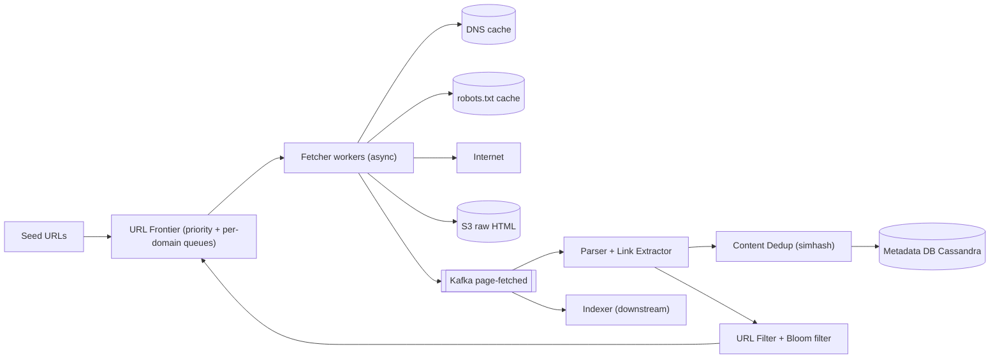
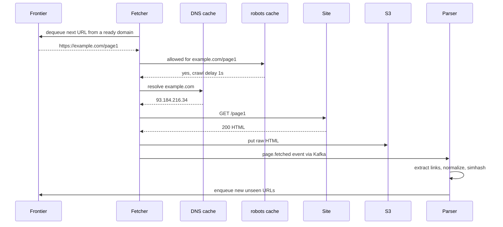
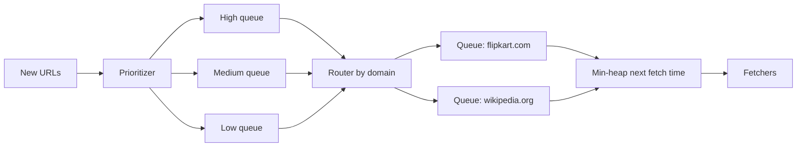

# Design a Web Crawler

**Ek line me:** seed URLs → pages download → links → aage crawl; search engine (Google) ke liye **1B pages**. Challenge: **fast, polite, bina duplicate**.

**Is question me interviewer kya check karta hai:** frontier (priority + politeness), dedup, estimation, traps / failures.

---

## Step 1: Interviewer se ye confirm karo (3–5 min)

| Tum poochho | Typical jawab | Design pe asar |
|---|---|---|
| "Purpose? Search indexing ya specific data?" | Search engine indexing | Sirf HTML, poora page store |
| "Kitne pages, kitne time me?" | 1B pages, ~1 mahina | ≈ 400 pages/sec, distributed fetchers |
| "Sirf HTML ya images/PDF bhi?" | Sirf HTML | Content-type filter |
| "robots.txt, politeness?" | Haan, zaroori | Per-domain queue + delay |
| "Recrawl / freshness?" | Haan, popular pages jaldi | Priority + recrawl scheduler |
| "JS-rendered pages?" | Out of scope / brief | Headless browser mention |
| "Duplicate content?" | Haan | Hash/simhash dedup |

> **Bolo:** "Pipeline: frontier → fetch → parse → dedup → store, links wapas frontier. Key: politeness aur dedup."

## Step 2: Requirements

**Functional** (user = search/indexing team)
1. Seed URLs → fetch, links nikaalo, aage crawl
2. Indexer raw HTML + metadata padh sake
3. robots.txt aur crawl-delay hamesha follow
4. Pages change rate ke hisaab se recrawl

**Out of scope:** JS rendering, images/PDF, login pages, indexing/ranking.

**Non-functional (priority order)**
1. **Politeness (hard rule):** ek domain pe max ~1 req/sec ya robots crawl-delay
2. **Throughput:** 1B / 30 din ≈ 400 pages/sec avg, ~1K peak, horizontally scalable
3. **Efficiency:** duplicate URL fetch < ~1%, duplicate content store/index nahi
4. **Robustness:** bad HTML/traps/crash se crawl na ruke, URL lost nahi (lease)
5. **Freshness:** news ~15 min, baaki ~1 mahina

**CAP choice:** AP. Duplicate/late crawl chalega, rukna nahi. Politeness strong, par domain-sharding se node-local.

## Step 3: Estimation (sirf jo design badle)

- 1B / 30 din ≈ 33M/day ≈ **~400 pages/sec**, peak ~1,000/sec.
- Page 100 KB → **100 TB** raw HTML (~25 TB compressed) → S3.
- Fetch ~500ms–2s (network bound). Machine ~500 async connections → ~300 pages/sec → **~5–10 fetcher machines**, safety ke liye 20.
- URL dedup: ~10B seen links × 50 bytes = 500 GB exact. **Bloom filter** (1% FP, ~10 bits/URL) ≈ ~12 GB → RAM me.
- Bandwidth: 400 × 100 KB = **40 MB/s ≈ 320 Mbps**.
- Metadata: ~10B URLs × ~100 bytes ≈ **1 TB**, ~2–5K writes/sec, sirf key lookups.

> **Bolo:** "Bottleneck network + politeness hai, CPU nahi → async fetchers; exact set bada → Bloom."

## Step 4: Core entities

- **URL record**: url, url_hash, domain, priority, last_crawled_at, next_crawl_at, status, depth
- **Page**: url_hash, s3_path, content_hash, simhash, http_status, fetched_at
- **Domain**: domain, robots_rules, crawl_delay, last_fetch_at, ip
- **Frontier item**: url, priority, domain (queue me)

## Step 5: APIs

Internal system, public API nahi:

```http
POST /seeds            {urls: [...]}                  → 202 (frontier me add)
GET  /crawl/status     ?url=https://example.com/a      → {lastCrawled, status, s3Path}
POST /crawl/priority   {domain, boost}                 → 200 (news sites boost)

Event: page.fetched  {urlHash, s3Path, contentHash}    → Kafka topic for indexer
```

> **Bolo:** "Focus contracts pe: frontier enqueue/dequeue aur page.fetched event."

## Step 6: High-level design

**Simple v1:** ek machine, in-memory queue, `seen` set, fetch → parse loop, disk files; 1M pages tak ok. Phir: 400–1K pages/sec → async fetchers. Multi-machine politeness → domain-sharded frontier. 10B seen URLs → Bloom. 100 TB → S3, 1 TB metadata → KV. Parser + indexer + re-parse → Kafka.



**Har component kyun:**
- **URL Frontier (FR1, FR3, FR4):** kya + kab crawl. Priority + politeness, domain-sharded, disk-backed (RocksDB).
- **Fetchers:** async HTTP, ~500 conns/machine, timeout, max 5 MB, redirect limit.
- **DNS + robots.txt cache:** DNS 10–200ms, robots ~24 hr cache. Warna fetcher idle.
- **Kafka `page-fetched` (FR2):** throughput (~1K/sec) reason nahi; do consumer groups + 7-day replay (parser bug ke baad bina re-fetch re-parse). SNS → SQS me replay nahi.
- **Parser:** links → absolute + normalize.
- **URL Filter + Bloom:** seen/blocked/trap URLs hataye. Bloom frontier nodes ke saath domain-sharded (~12 GB / N nodes), alag Redis nahi.
- **Content Dedup:** near-same content dobara store nahi (9.3).

**Mapping:** FR1 → Frontier, Fetchers, Parser, URL Filter. FR2 → S3, Kafka, Metadata DB. FR3 → robots cache + per-domain queues. FR4 → `next_crawl_at` + Frontier priority.

## Step 7: Main flow: ek URL crawl karna



## Step 8: Data model & DB choice

```text
url_records (Cassandra, partition key = url_hash):
  url_hash, url, domain, priority, depth, status, last_crawled_at, next_crawl_at, content_hash

domains (Cassandra, next_allowed_fetch_at frontier node ki memory me):
  domain, robots_txt, crawl_delay_ms, next_allowed_fetch_at

S3 layout:
  s3://crawl/2026/10/03/<url_hash>.html.gz
```

- **Cassandra:** billions of rows, write-heavy, key lookup.
- **S3:** bade WARC files me batch (chhoti files S3 pe mehngi).
- **Bloom filter:** har frontier node pe in-memory (apne domains), hourly S3 snapshot.

## Step 9: Deep dives (interviewer yahin pressure dalega)

### 9.1 URL Frontier: priority + politeness
**NFR:** politeness (hard rule) + throughput.
Do level ki queues (Mercator design):
1. **Front queues (priority):** score (PageRank, domain importance, freshness need) → high/medium/low. Selector high se zyada uthata hai.
2. **Back queues (politeness):** per-domain FIFO + **min-heap** `(next_allowed_time, domain)`. Fetcher ready domain uthaye, ek URL fetch kare, `next_allowed_time = now + crawl_delay`.



- **Domain hash se shard:** ek domain hamesha ek node pe → politeness local, distributed lock nahi.
- Billions URLs → disk-backed queues (RocksDB), sirf head memory me. Kafka fit nahi: lakhon per-domain queues chahiye.

### 9.2 URL dedup: Bloom filter
**NFR:** duplicate fetch < ~1%.
- **Normalize:** lowercase host, default port, fragment (`#...`) hatao, query params sort, `utm_*` hatao.
- `bloom.mightContain(url)`: nahi → pakka naya, enqueue. Hai → shayad seen, skip.
- False positive → ~1% naye URLs miss (acceptable). False negative kabhi nahi.
- Exact check chahiye → Bloom positive pe Cassandra lookup.

### 9.3 Content dedup: hash aur simhash
**NFR:** duplicate content store/index nahi.
- **Exact:** SHA-256 / MD5. Hash mila → store nahi, canonical se link. ~30% web pages duplicate/mirror.
- **Near-dup** (alag ads/timestamp): **SimHash** 64-bit, Hamming distance ≤ 3 → duplicate.
- `<link rel="canonical">` respect karo.

### 9.4 Crawler traps aur bad sites
**NFR:** robustness.
- **Infinite URLs** (calendar `/2026/10/04`..., session IDs, `?page=1..∞`): **max depth**, **max URL length** (~2,000 chars), **max pages per domain** per cycle, repeating segments (`/a/b/a/b/a/b`) detect.
- **Slow servers:** timeout 10s, max response size, high error rate → domain back-off.
- Spam/malicious domains → blocklist.

**Trade-off:** kuch genuine deep pages chhoot jaate hain.

### 9.5 Recrawl aur freshness
**NFR:** news ~15 min, baaki ~1 mahina.
- Har URL ka `next_crawl_at` (news homepage 15 min, blog mahina).
- **Adaptive:** content_hash same → interval double, badla → aadha.
- **Conditional GET** (`If-Modified-Since`, `ETag`) → 304, bandwidth bachi.
- Due URLs priority ke saath frontier me; `sitemap.xml` `lastmod` bhi signal.

**Trade-off:** recrawl vs naye pages ka bandwidth budget split.

## Step 10: Decision table (kya chuna, kyun, kya nahi)

| Decision | Kyun chuna | Kya nahi chuna, kyun |
|---|---|---|
| **Two-level frontier** | Important pehle, politeness guaranteed | **Single FIFO:** ek domain ke hazaron URLs, hammering. Sacrifice: complex logic |
| **Frontier shard by domain hash** | Politeness ek node pe, lock nahi | **URL hash:** distributed lock/rate limit. Sacrifice: uneven load |
| **Bloom filter for URL seen** | 10B URLs ~12 GB, O(1) | **Exact set:** ~500 GB. **DB lookup per link:** billions of reads. Sacrifice: ~1% miss |
| **SimHash for near-dup** | Alag ads/timestamps pe bhi pakde | **Exact hash only:** near-dups miss. Sacrifice: false duplicate |
| **S3 for raw HTML** | 100 TB sasta, durable, batch read | **DB blob:** costly, bloat. Sacrifice: WARC batching chahiye |
| **Cassandra for URL metadata** | ~1 TB, 2–5K writes/sec, built-in sharding | **Sharded Postgres:** 10B rows manual sharding, transactions nahi chahiye. Sacrifice: no joins |
| **Kafka between fetch and parse** | Do consumer groups, 7-day replay | **Fetcher me parse:** parser crash = fetch ruka. **SQS:** replay nahi. Sacrifice: ~1K/sec ke liye cluster |

## Step 11: Failures & bottlenecks

| Kya fail hua | Kya hoga | Handle kaise |
|---|---|---|
| Fetcher crash | In-flight URLs lost | Frontier lease/visibility timeout, ack nahi → wapas queue |
| DNS slow / down | Fetch rukte hain | Local cache, multiple resolvers, enqueue pe DNS prefetch |
| Site 5xx / timeout | Retries se site aur dabe | Per-domain backoff, max 3 retries, phir low priority |
| Frontier node down | Uske domains crawl nahi | Disk-backed queues + replica, consistent hashing se reassign |
| Bloom filter lost | Duplicate crawl | S3 snapshot se reload |
| Hot domain (wikipedia) | Queue bahut lambi | Allowed ho to multiple IPs/connections |

## Step 12: "Isko aur better kaise karein" (end me khud bolo)

- **JS rendering:** headless Chrome pool, sirf jahan HTML khaali (mehnga).
- **Geo-distributed fetchers:** site ke region ke paas → latency + bandwidth kam.
- **Smarter priority:** PageRank + click data + change rate → ML crawl scheduling.
- **WARC + compaction:** chhote pages bade files me → S3 cost kam.

## Step 13: Interviewer ke likely follow-up sawal

- "Mirror sites ka duplicate?" → SHA exact, SimHash near-dup
- "Infinite calendar pages?" → Max depth, max pages/domain, URL length limit
- "Page update hua?" → Adaptive recrawl + conditional GET
- **Senior signal:** khud bolo: bottleneck CPU nahi, politeness + DNS hai; bada domain apne frontier node pe hot, node crash pe uske domains ruk jaate hain. Fix: leased dequeue (ack nahi → URL wapas), disk-backed queues + consistent hashing reassignment, per-domain error rate pe auto back-off.

## 2-minute recap (interview se pehle ye padho)

> Seeds → frontier → fetchers → S3 → Kafka → parser → dedup → frontier. ~400 pages/sec, 100 TB, bottleneck network + politeness. Two-level frontier (priority + per-domain min-heap), domain-sharded. URL dedup = normalize + Bloom; content = SHA + SimHash. Traps → limits. Cassandra metadata. Adaptive recrawl + conditional GET.

## Checklist

- [ ] 1B pages ka throughput, storage aur machines ka estimate bina dekhe kar sakta hoon
- [ ] Two-level URL frontier (priority + politeness) ka diagram bana sakta hoon
- [ ] Frontier ko domain se shard karne ka reason bata sakta hoon
- [ ] URL normalization aur Bloom filter dedup samjha sakta hoon
- [ ] Exact hash vs SimHash content dedup ka farak bata sakta hoon
- [ ] Crawler traps ke 3 defenses bol sakta hoon
- [ ] Recrawl freshness (adaptive interval, conditional GET) explain kar sakta hoon
- [ ] Decision table ke 3 trade-offs bina dekhe bol sakta hoon
