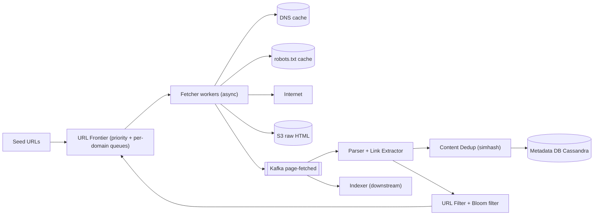
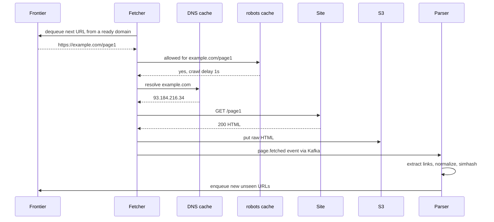
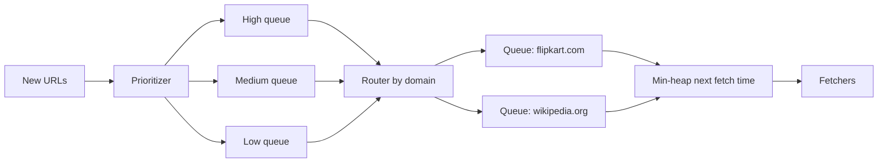

# Design a Web Crawler

**Ek line me:** kuch seed URLs se shuru karke internet ke pages download karo, unke links nikaalo, aur aage crawl karte raho, taaki search engine (Google) ya data pipeline ke liye **1B pages** store ho sakein. Core challenge ye hai ki itna bada crawl **fast, polite aur bina duplicate** ke ho.

**Is question me interviewer kya check karta hai:** URL frontier design (priority + politeness), dedup (URL aur content), scale estimation, aur crawler traps / failures handle karna.

---

## Step 1: Interviewer se ye confirm karo (3–5 min)

| Tum poochho | Typical jawab | Design pe asar |
|---|---|---|
| "Purpose kya hai? Search indexing ya kisi specific data ke liye?" | Search engine indexing | Sirf HTML, poora page store karna hai |
| "Kitne pages aur kitne time me?" | 1B pages, ~1 mahine me | Throughput ≈ 400 pages/sec, distributed fetchers |
| "Sirf HTML ya images/PDF bhi?" | Sirf HTML | Content-type filter |
| "robots.txt follow karna hai? Politeness?" | Haan, zaroori | Per-domain queue + delay |
| "Recrawl karna hai? Freshness?" | Haan, popular pages jaldi | Priority + recrawl scheduler |
| "JavaScript-rendered pages?" | Out of scope / brief | Headless browser ka mention |
| "Duplicate content handle karna hai?" | Haan | Hash/simhash dedup |

> **Bolo:** "Main crawler ko ek pipeline ki tarah design karunga: frontier → fetch → parse → dedup → store, aur links wapas frontier me. Do cheezein sabse important hain: politeness (kisi site ko overload na karein) aur dedup (same cheez dobara na karein)."

## Step 2: Requirements

**Functional**
1. Seed URLs se start karke pages fetch karna
2. HTML parse karke naye links nikaalna aur frontier me daalna
3. Raw HTML + metadata store karna (indexer ke liye)
4. robots.txt aur crawl-delay follow karna
5. Pages ko periodically recrawl karna

**Non-functional**
- **Scale:** 1B pages, horizontally scalable
- **Politeness:** ek domain pe max ~1 request/sec (ya robots.txt ka crawl-delay)
- **Robustness:** bad HTML, timeouts, traps, server errors se crash nahi
- **Efficiency:** duplicate URLs aur duplicate content skip
- **Extensibility:** naye content types / processors plug ho sakein

## Step 3: Estimation (sirf jo design badle)

- 1B pages / 30 din ≈ 33M/day ≈ **~400 pages/sec** avg, peak ~1,000/sec.
- Avg page 100 KB → **100 TB** raw HTML. Compress karke ~25 TB. Isliye S3 jaisa blob storage.
- Ek fetch ~500ms–2s (network bound). Ek machine ~500 concurrent async connections → ~300 pages/sec. **~5–10 fetcher machines** kaafi, safety ke liye 20.
- URL dedup: 1B+ URLs (aur seen links ~10B). Exact set me 10B × 50 bytes = 500 GB. **Bloom filter** (1% false positive) ≈ 10 bits/URL → ~12 GB. RAM me aa jayega.
- Bandwidth: 400 × 100 KB = **40 MB/s ≈ 320 Mbps**.

> **Bolo:** "Bottleneck CPU nahi, network aur politeness hai. Isliye async I/O fetchers, aur URL dedup ke liye Bloom filter kyunki exact set bahut bada hai."

## Step 4: Core entities

- **URL record**: url, url_hash, domain, priority, last_crawled_at, next_crawl_at, status, depth
- **Page**: url_hash, s3_path, content_hash, simhash, http_status, fetched_at
- **Domain**: domain, robots_rules, crawl_delay, last_fetch_at, ip
- **Frontier item**: url, priority, domain (queue me)

## Step 5: APIs

Crawler internal system hai, public API nahi. Internal interfaces:

```http
POST /seeds            {urls: [...]}                  → 202 (frontier me add)
GET  /crawl/status     ?url=https://example.com/a      → {lastCrawled, status, s3Path}
POST /crawl/priority   {domain, boost}                 → 200 (news sites boost)

Event: page.fetched  {urlHash, s3Path, contentHash}    → Kafka topic for indexer
```

> **Bolo:** "Bahar ka koi user nahi hai, isliye main components ke beech ke contracts pe focus karunga: frontier ka enqueue/dequeue aur page.fetched event."

## Step 6: High-level design



**Har component kyun:**
- **URL Frontier:** kya crawl karna hai aur kab. Priority (important pages pehle) + politeness (ek domain pe ek waqt me ek hi fetch).
- **Fetcher workers:** async HTTP (hazaron connections ek machine pe). Timeout, max size (e.g. 5 MB), redirects limit.
- **DNS cache:** DNS lookup 10–200ms le sakta hai aur bottleneck ban jata hai. Local cache with TTL.
- **robots.txt cache:** har domain ka robots.txt ek baar fetch karke ~24 hr cache.
- **S3:** 100 TB raw HTML ke liye sasta, durable.
- **Kafka:** fetch aur parse ko decouple karta hai. Parser slow ho to fetcher nahi rukta.
- **Parser:** HTML se links nikaalta hai, relative URLs ko absolute banata hai, normalize karta hai.
- **URL Filter + Bloom:** already seen, blocked, ya trap-like URLs ko hatata hai.
- **Content Dedup:** same/near-same content dobara store/index na ho.
- **Metadata DB (Cassandra):** billions of URL records, write-heavy, simple key lookups.

## Step 7: Main flow: ek URL crawl karna



## Step 8: Data model & DB choice

```text
url_records (Cassandra, partition key = url_hash):
  url_hash, url, domain, priority, depth, status, last_crawled_at, next_crawl_at, content_hash

domains (Cassandra / Redis):
  domain, robots_txt, crawl_delay_ms, next_allowed_fetch_at

S3 layout:
  s3://crawl/2026/10/03/<url_hash>.html.gz
```

- **Cassandra:** billions of rows, write-heavy (har crawl pe update), lookup by key. Joins nahi chahiye.
- **S3:** raw content. Bade WARC files me batch karke likho (chhoti files S3 pe mehngi padti hain).
- **Bloom filter:** Redis (RedisBloom) ya har frontier node pe in-memory, periodically checkpoint.

## Step 9: Deep dives (interviewer yahin pressure dalega)

### 9.1 URL Frontier: priority + politeness
Do level ki queues (Mercator design):
1. **Front queues (priority):** URL ka priority score (PageRank, domain importance, freshness need) dekh ke high/medium/low queues me daalo. Selector zyada baar high queue se uthata hai.
2. **Back queues (politeness):** har domain ki apni FIFO queue. Ek **min-heap** `(next_allowed_time, domain)` rakhta hai. Fetcher heap se woh domain uthata hai jiska time aa gaya, ek URL fetch karta hai, aur `next_allowed_time = now + crawl_delay` set karta hai.



- Distribute: frontier ko **domain ke hash** se shard karo. Ek domain hamesha ek node pe, isliye politeness locally enforce hoti hai, distributed lock nahi chahiye.
- Frontier bahut bada hota hai (billions URLs), isliye queues disk-backed (RocksDB/Kafka), sirf head memory me.

### 9.2 URL dedup: Bloom filter
- Pehle **normalize**: lowercase host, default port hatao, fragment (`#...`) hatao, query params sort karo, tracking params (`utm_*`) hatao.
- Fir `bloom.mightContain(url)`. Nahi hai → pakka naya, enqueue. Hai → shayad seen, skip.
- False positive ka matlab hai kuch naye URLs miss honge (~1%). Crawler ke liye acceptable. False negative kabhi nahi hota.
- Exact check chahiye ho to Bloom positive pe Cassandra me lookup (do-step).

### 9.3 Content dedup: hash aur simhash
- **Exact duplicate:** body ka SHA-256 / MD5. Same hash already hai → store mat karo, sirf URL ko canonical se link karo. Web pe ~30% pages duplicate/mirror hote hain.
- **Near duplicate:** same article, alag ads/timestamp. **SimHash** (64-bit fingerprint): similar docs ke fingerprint me kuch hi bits alag. Hamming distance ≤ 3 → duplicate maano.
- `<link rel="canonical">` bhi respect karo.

### 9.4 Crawler traps aur bad sites
- **Infinite URLs:** calendar (`/2026/10/04`, `/2026/10/05`...), session IDs, `?page=1..∞`. Rokne ke liye: **max depth** per domain, **max URL length** (~2,000 chars), **max pages per domain** per crawl cycle, repeating path segments (`/a/b/a/b/a/b`) detect karo.
- **Spider traps / slow servers:** strict timeout (10s), max response size, per-domain error rate zyada ho to domain ko back-off.
- Spam/malicious domains ke liye blocklist.

### 9.5 Recrawl aur freshness
- Har URL ka `next_crawl_at`. News homepage har 15 min, blog post har mahine.
- **Adaptive:** recrawl pe content_hash same mila → interval double. Badla → interval aadha.
- **Conditional GET** (`If-Modified-Since`, `ETag`) → 304 Not Modified, bandwidth bachti hai.
- Scheduler due URLs ko priority ke saath frontier me wapas daalta hai. Sitemaps (`sitemap.xml` ka `lastmod`) bhi signal dete hain.

## Step 10: Decision table (kya chuna, kyun, kya nahi)

| Decision | Kyun chuna | Kya nahi chuna, kyun |
|---|---|---|
| **Two-level frontier (priority + per-domain queues)** | Important pages pehle, aur politeness guaranteed | **Single FIFO queue:** ek domain ke hazaron URLs line me aa jaate hain, site pe hammering, aur priority nahi |
| **Shard frontier by domain hash** | Domain ki politeness ek node pe, lock nahi | **Shard by URL hash:** ek domain ke URLs sab nodes pe, politeness ke liye distributed lock/rate limit chahiye |
| **Bloom filter for URL seen** | 10B URLs ~12 GB me, O(1) | **Exact hash set:** ~500 GB RAM. **DB lookup har link pe:** billions of reads, slow |
| **SimHash for near-dup** | Ads/timestamps alag ho to bhi duplicate pakad leta hai | **Sirf exact hash:** near duplicates miss, storage aur index waste |
| **S3 for raw HTML** | 100 TB sasta, durable, indexer batch me padh sake | **Database me HTML blob:** costly, DB bloat, scan slow |
| **Cassandra for URL metadata** | Write-heavy, billions rows, key lookups | **Postgres:** is scale pe sharding manual aur write throughput limited. Transactions ki zarurat nahi |
| **Kafka between fetch and parse** | Decoupling, backpressure, replay | **Fetcher me hi parse:** parser slow ya crash ho to fetching ruk jayegi |

## Step 11: Failures & bottlenecks

| Kya fail hua | Kya hoga | Handle kaise |
|---|---|---|
| Fetcher machine crash | In-flight URLs lost | Frontier me lease/visibility timeout. Ack nahi aaya to URL wapas queue me |
| DNS slow / down | Fetch ruk jaate hain | Local DNS cache, multiple resolvers, prefetch DNS jab URL enqueue ho |
| Site 5xx / timeout | Retries se site aur dabegi | Exponential backoff per domain, max 3 retries, phir low priority |
| Crawler trap | Frontier ek domain se bhar gaya | Max depth, max pages per domain, URL pattern detection |
| Frontier node down | Uske domains crawl nahi | Disk-backed queues + replica, consistent hashing se domains reassign |
| Bloom filter lost | Duplicate crawl | Periodic snapshot to S3, restart pe reload |
| Hot domain (wikipedia) | Ek queue bahut lambi | Politeness ke andar hi rehna, par allowed ho to multiple IPs/connections |

## Step 12: "Isko aur better kaise karein" (end me khud bolo)

> "Agar aur time ho to main ye improve karunga:"
- **JS rendering:** SPA sites ke liye headless Chrome pool, sirf un domains ke liye jahan HTML khaali aata hai (mehnga hai).
- **Geo-distributed fetchers:** site ke region ke paas se fetch, latency aur bandwidth kam.
- **Smarter priority:** PageRank + click data + change rate se ML-based crawl scheduling.
- **WARC format + compaction:** chhote pages ko bade files me pack karke S3 cost kam.
- **Observability:** pages/sec, per-domain error rate, frontier size, dedup ratio dashboards.
- **Ethics/legal:** sitemap-first crawling, opt-out handling, PII ke liye filters.

## Step 13: Interviewer ke likely follow-up sawal

- "Ek site ko overload kaise nahi karoge?" → Per-domain back queue + min-heap next_allowed_time + robots crawl-delay (Step 9.1)
- "Same URL dobara crawl na ho?" → Normalize + Bloom filter (Step 9.2)
- "Bloom filter ka false positive problem nahi hai?" → ~1% naye URLs miss honge, crawler ke liye acceptable, aur false negative kabhi nahi
- "Mirror sites ka duplicate content?" → SHA hash exact ke liye, SimHash near-dup ke liye
- "Infinite calendar pages?" → Max depth, max pages per domain, URL length limit
- "Kitni machines chahiye?" → ~400 pages/sec, ek async fetcher ~300/sec, isliye 5–10 + headroom
- "Page update hua to?" → Adaptive recrawl + conditional GET

## 2-minute recap (interview se pehle ye padho)

> Crawler ek pipeline hai: seed URLs → frontier → fetchers → S3 → Kafka → parser → dedup → wapas frontier. 1B pages/mahina ≈ 400 pages/sec, 100 TB HTML, bottleneck network aur politeness hai. Frontier do level ka hai: priority queues (important pehle) aur per-domain back queues with min-heap (ek domain pe crawl-delay). Frontier domain hash se sharded, taaki politeness local rahe. DNS aur robots.txt cached. URL dedup normalize + Bloom filter (~12 GB), content dedup SHA hash + SimHash. Traps ke liye max depth, max URL length, max pages per domain. Metadata Cassandra me, raw HTML S3 me. Recrawl adaptive interval + conditional GET se.

## Checklist

- [ ] 1B pages ka throughput, storage aur machines ka estimate bina dekhe kar sakta hoon
- [ ] Two-level URL frontier (priority + politeness) ka diagram bana sakta hoon
- [ ] Frontier ko domain se shard karne ka reason bata sakta hoon
- [ ] URL normalization aur Bloom filter dedup samjha sakta hoon
- [ ] Exact hash vs SimHash content dedup ka farak bata sakta hoon
- [ ] Crawler traps ke 3 defenses bol sakta hoon
- [ ] Recrawl freshness (adaptive interval, conditional GET) explain kar sakta hoon
- [ ] Decision table ke 3 trade-offs bina dekhe bol sakta hoon
