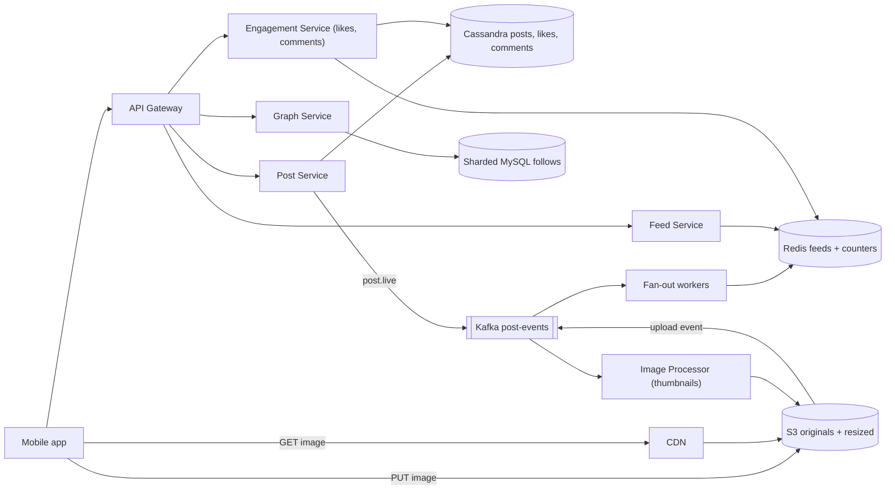
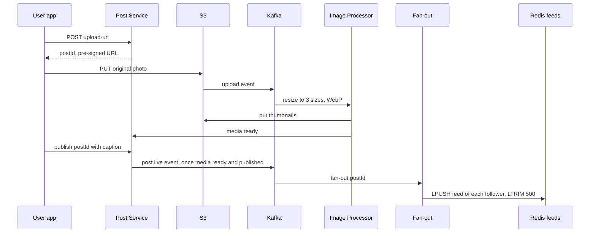

# Design Instagram

**Ek line me:** photo upload, follow, feed, likes, comments, 24 hr stories. Challenge: **heavy media fast upload + serve**, **feed jaldi**, celebrity ke 50 crore followers ho tab bhi.

**Is question me interviewer kya check karta hai:** blob + CDN, upload off app servers, async processing, fan-out, hot counters.

---

## Step 1: Interviewer se ye confirm karo (3–5 min)

| Tum poochho | Typical jawab | Design pe asar |
|---|---|---|
| "Upload, follow, feed, likes? Stories?" | Haan, stories bhi | TTL storage |
| "Videos/reels bhi?" | Photos focus, video brief | Transcoding out of scope ([YouTube](../02-questions/t1-07-youtube.md)) |
| "Feed chronological ya ranked?" | Simple ranking, mostly recent | Precomputed feed + light rerank |
| "Scale?" | 500M DAU, 100M uploads/day | Bada storage + CDN |
| "Post turant feed me dikhe?" | Kuch second delay chalega | Async fan-out |
| "Like count exact?" | Approx, eventually exact | Counter sharding / batched updates |
| "Search, DMs, explore?" | Out of scope | Mention karke chhod do |

> **Bolo:** "Teen hisse: media pipeline, social graph + feed, engagement. Read heavy → feed + media aggressively cached."

## Step 2: Requirements

**Functional**
1. Photo + caption post, aur story jo 24 ghante baad gayab
2. Follow/unfollow
3. Home feed me followed users ki recent posts
4. Like, comment, counts dekhna

**Out of scope:** video/reels, DMs, search, explore, ads.

**Non-functional (priority order)**
1. **Latency:** feed p99 < 300ms (metadata), images CDN se < 100ms first byte
2. **Availability:** 99.99% feed + image reads
3. **Durability:** uploaded photo kabhi lost nahi
4. **Consistency:** eventual: followers ~5–10 sec, apni post turant (read-your-own-writes)
5. **Scale:** 500M DAU, 100M uploads/day, ~100:1 read:write, celebrities ke followers crores me

**CAP choice:** feed/likes/counts AP (stale ok, down nahi). Media durability-first (S3).

## Step 3: Estimation (sirf jo design badle)

- 100M uploads/day ≈ **1,200 uploads/sec**. ~2 MB original + 3 sizes ~500 KB → **~250 TB/day** → S3 + lifecycle tiers.
- Feed: 500M DAU × 10 opens ≈ 5B/day ≈ **60K QPS**, peak ~150K → precomputed feed + cache.
- Images: ~20 per feed open → **~1M+ req/sec** → sirf CDN.
- Fan-out: 200 followers × 1,200 posts/sec ≈ **240K feed writes/sec**; celebrity (25–50 cr followers) ka ek post = crores writes → hybrid fan-out.
- Likes: 500M × ~10 ≈ 5B/day ≈ **~60K writes/sec**. Post metadata ~1 KB × 100M/day ≈ 100 GB/day (~36 TB/yr) → Cassandra.

> **Bolo:** "Media bytes app servers se nahi: S3 direct upload, CDN read. App servers sirf metadata."

## Step 4: Core entities

- **User**: id, username, profile_pic_url, follower_count, is_celebrity
- **Post**: id, user_id, caption, media_keys, status (`UPLOADING`, `PROCESSING`, `LIVE`), created_at
- **Follow**: follower_id, followee_id, created_at
- **Like**: post_id, user_id, created_at
- **Comment**: id, post_id, user_id, text, created_at
- **Story**: id, user_id, media_key, created_at, expires_at
- **FeedItem**: user_id → list of post_ids (precomputed)

## Step 5: APIs

```http
POST /posts/upload-url  {contentType, size}          → {postId, uploadUrl (pre-signed S3, 15 min)}
PUT  <uploadUrl>        (client → S3 direct, bytes)  → 200
POST /posts/{postId}/publish  {caption}              → {status: PROCESSING}
GET  /feed?cursor=abc&limit=20                       → {posts: [...], nextCursor}
POST /users/{id}/follow                              → 200
POST /posts/{postId}/like                            → 200 (idempotent)
POST /posts/{postId}/comments  {text}                → {commentId}
POST /stories/upload-url, GET /stories/feed          → stories tray
```

> **Bolo:** "Upload: pre-signed URL → client S3 pe PUT. Feed cursor-based (nayi posts aati rehti hain)."

## Step 6: High-level design

**Simple v1:** app service + Postgres + S3 + CDN; feed = `ORDER BY created_at LIMIT 20` on followees. Phir: 150K feed QPS + celebrities → Redis + hybrid fan-out. 1,200 uploads/sec → async resize. 60K likes/sec + 36 TB/yr → Cassandra. 1M image req/sec → CDN. Services alag: load alag (feed 150K, likes 60K, uploads 1.2K /sec).



**Har component kyun:**
- **Pre-signed URL + S3 + CDN:** bytes app servers bypass; image ek baar likhi, karodon baar padhi.
- **Image Processor:** 3 sizes, WebP/AVIF, EXIF strip; async, upload block nahi.
- **Kafka post-events:** throughput (~1.2K/sec) reason nahi; 2+ consumers (processor, fan-out, notifications), replay (Redis lost → fan-out dobara), author_id ordering (`post.live` phir `post.deleted`).
- **Cassandra / sharded MySQL:** likes volume Cassandra decide karta hai; follows sirf do-direction lookups.
- **Fan-out + Redis feeds:** per active user post_id list (~500M × 500 × 8 B ≈ 2 TB). Pull is QPS pe slow.
- **Feed Service:** precomputed feed + celebrity posts merge, hydrate, rank.

**Mapping:** FR1 → Post Service, S3, Kafka, Image Processor (stories: TTL). FR2 → Graph + MySQL. FR3 → Fan-out, Redis, Feed Service, CDN. FR4 → Engagement, Cassandra, Redis counters.

## Step 7: Main flow: photo upload se feed tak



**Feed read:** `feed:{userId}` 20 post_ids + celebrity posts → merge + rank → metadata + CDN URLs.

## Step 8: Data model & DB choice

```text
posts (Cassandra, partition = user_id, clustering = post_id DESC):
  user_id, post_id (Snowflake, time-sortable), caption, media_keys, status, created_at

follows (sharded MySQL, shard key = user_id):
  followers_by_user(user_id, follower_id)   -- fan-out ke liye
  following_by_user(user_id, followee_id)   -- feed read pe celebrities ke liye

likes (Cassandra, partition = post_id):  post_id, user_id        -- "maine like kiya?" check
post_counters (Redis + Cassandra counter): post_id, like_count, comment_count
comments (Cassandra, partition = post_id, clustering = created_at)
stories (Cassandra with TTL 86400 / Redis sorted set by time)
feed cache (Redis list): feed:{userId} → [post_id, ...] max 500
```

- **Snowflake post IDs:** time-sortable → feed merge sort easy.
- **Graph:** dono direction tables: fan-out ko followers, feed read ko following.

## Step 9: Deep dives (interviewer yahin pressure dalega)

### 9.1 Upload path aur image processing
**NFR:** durability + fast upload response.
1. `upload-url`: check (size < 20 MB, image), post `UPLOADING`, 15 min **pre-signed PUT URL**.
2. Client seedha S3 pe (multipart, resumable).
3. S3 event → Kafka → **Image Processor** (autoscaling): 3 sizes, WebP, EXIF/GPS strip (privacy), moderation (nudity/violence ML).
4. Media ready + publish → `LIVE` → `post.live` → fan-out. Fail → 3 retries → DLQ + user ko error.

> **Bolo:** "Upload S3 ki scale pe, app bandwidth bachi. Processing async → user ko turant 'posted'."

**Trade-off:** followers ko processing ke kuch second baad dikhti hai.

### 9.2 Feed generation: hybrid fan-out
**NFR:** feed p99 < 300ms at 150K peak QPS.
Detail: [News Feed](../02-questions/t1-03-news-feed.md).
- **Normal (< ~10K followers): fan-out on write** → har follower ki Redis list me post_id.
- **Celebrities (Virat Kohli, 25 cr followers): fan-out on read** → read pe followed celebrities (usually kam) ki latest posts merge.
- **Inactive** (30 din) → skip, wapas aayein to on-the-fly feed.
- List me sirf post_ids (8 bytes), hydration cache se.

**Trade-off:** celebrity merge se read latency thodi zyada.

### 9.3 Likes aur comments counters
**NFR:** hot posts pe availability + ~60K like writes/sec.
- Virat ki post: 1 lakh likes/min → `count + 1` = hot row.
- **Like record:** `likes(post_id, user_id)` insert, idempotent (dobara like = no-op).
- **Count:** Redis `INCR post:123:likes`, background job har few sec Cassandra me flush. Bahut hot → **sharded counter** (10 keys, read pe sum).
- UI "1.2M likes" → exact real-time nahi chahiye.
- Comments: post_id partition, time-ordered, cursor pagination.

**Trade-off:** count kuch sec stale; Redis crash pe last flush ke baad ke increments AOF pe depend.

### 9.4 Stories with TTL
**NFR:** 24 hr expiry bina cleanup jobs.
- Same pre-signed upload. Metadata Cassandra **TTL 24 hr**, ya Redis sorted set `stories:{userId}` (score = timestamp) + `ZREMRANGEBYSCORE`.
- **Tray:** fan-out on write → `tray:{userId}` (TTL); celebrities read time check.
- Media: S3 lifecycle 24 hr baad delete/archive ("highlights" alag).

**Trade-off:** S3 lifecycle daily chalta hai → media thoda zyada rahe; read path `expires_at` se filter.

## Step 10: Decision table (kya chuna, kyun, kya nahi)

| Decision | Kyun chuna | Kya nahi chuna, kyun |
|---|---|---|
| **Pre-signed URL, client → S3** | Zero app bandwidth, S3 scale | **Upload proxy:** 250 TB/day app servers se. Sacrifice: validation processor me |
| **Async processing via Kafka** | Fast upload; 2+ consumers, replay, per-author order | **Resize in request:** spike pe down. **SQS:** replay nahi. Sacrifice: Kafka ops |
| **CDN for images** | 1M+ req/sec edge se | **S3 direct:** latency + egress. Sacrifice: delete/privacy pe CDN purge |
| **Hybrid fan-out + Redis lists** | Fast reads, celebrity write storm nahi | **Pure push:** 25 cr writes/post. **Pure pull:** 200+ merge per open. Sacrifice: ~2 TB RAM, do paths |
| **Cassandra for posts/likes/comments** | ~60K writes/sec, 36 TB/yr | **Sharded Postgres:** likes volume pe manual sharding. Sacrifice: no joins/transactions |
| **Sharded MySQL for follows** | Do-direction lookups, low writes | **Neo4j:** multi-hop chahiye hi nahi. Sacrifice: "mutual friends" mehnga |
| **Redis counters + flush** | Hot post pe fast, DB load kam | **`count+1` per like:** hot row contention. Sacrifice: seconds stale |
| **TTL for stories** | Auto expiry, no cleanup job | **Cron delete:** late chale to 24 hr ke baad bhi dikhe. Sacrifice: lazy delete, read filter |

## Step 11: Failures & bottlenecks

| Kya fail hua | Kya hoga | Handle kaise |
|---|---|---|
| Upload toota | Adhuri file | Multipart resumable; 1 hr purane `UPLOADING` posts cleanup |
| Processor backlog | Posts `PROCESSING` me atke | Kafka lag pe autoscale, low-res preview |
| Redis feed cache lost | Feeds khaali | Pull model rebuild, cache warm |
| CDN miss storm (viral) | S3 pe load | Origin shield, popular images pre-warm |
| Counter flush fail | DB count purana | Redis AOF + replica, flush idempotent (absolute value, delta nahi) |
| Follows shard hot | Celebrity follower list slow | Paginate; celebrity ka fan-out hota hi nahi |

## Step 12: "Isko aur better kaise karein" (end me khud bolo)

- **ML-ranked feed:** engagement model (likes, dwell time), candidates + online ranking.
- **Adaptive images:** device/network se size/format + blur placeholder.
- **Storage tiering:** 1 saal purani photos S3 IA / Glacier, cost 50%+ kam.
- **Multi-region:** caches per region, writes home region, async replication.

## Step 13: Interviewer ke likely follow-up sawal

- "Celebrity post sabki feed me?" → Fan-out on read, read time merge (9.2)
- "Unfollow pe feed se posts?" → Read time filter (following set), background cleanup
- "Feed pagination?" → Cursor = last post_id (Snowflake time-sortable)
- **Senior signal:** khud bolo: viral celebrity post teen jagah hot: Cassandra partition (`post_id` ke likes/comments), Redis counter key, CDN miss storm. Fix: sharded counters, comments `(post_id, bucket)` partition, origin shield; Redis feed cluster loss pe rebuild storm rate-limit.

## 2-minute recap (interview se pehle ye padho)

> Pre-signed URL → S3 → Kafka → Image Processor → LIVE → fan-out. CDN images. Cassandra posts/likes/comments, Snowflake IDs; follows sharded MySQL. Hybrid fan-out (celebrities read pe merge). Likes Redis INCR + flush, sharded counter. Stories TTL + S3 lifecycle.

## Checklist

- [ ] Pre-signed URL upload flow step-by-step bata sakta hoon
- [ ] Async image processing pipeline (S3 event → Kafka → workers) samjha sakta hoon
- [ ] Storage aur CDN ke numbers estimate kar sakta hoon
- [ ] Hybrid fan-out aur celebrity problem explain kar sakta hoon
- [ ] Hot like counter ka solution (Redis + flush + sharded counter) bata sakta hoon
- [ ] Stories ka TTL design bata sakta hoon
- [ ] HLD diagram 5 min me bana sakta hoon
- [ ] Decision table ke 3 trade-offs bina dekhe bol sakta hoon
