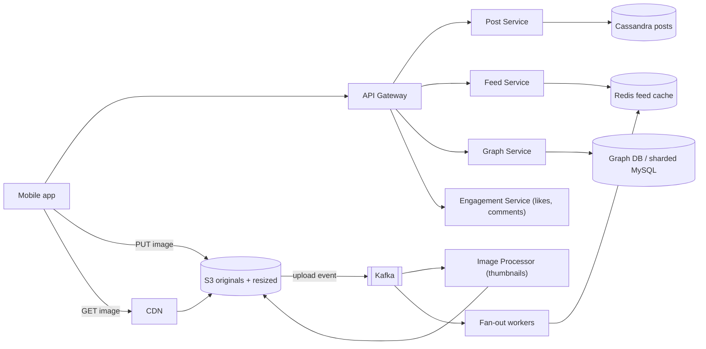
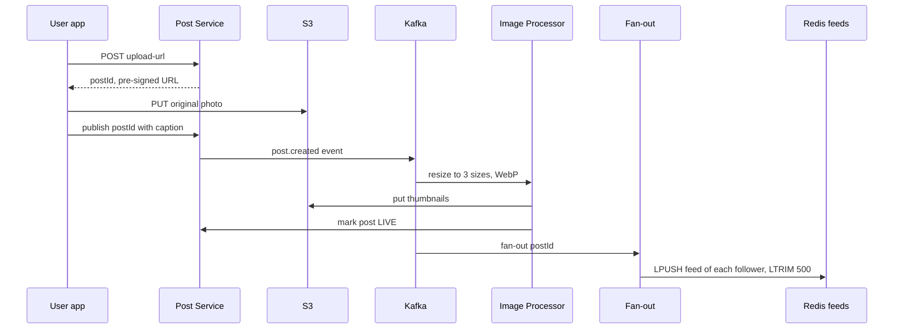

# Design Instagram

**Ek line me:** users photos upload karte hain, dusron ko follow karte hain, aur apni feed me followed logon ki posts dekhte hain, saath me likes, comments aur 24 ghante wali stories. Core challenge ye hai ki **heavy media fast upload aur serve ho**, aur **feed jaldi bane**, chahe kisi celebrity ke 50 crore followers hon.

**Is question me interviewer kya check karta hai:** blob storage + CDN ka sahi use, upload path ko app servers se hatana, async image processing, feed ka fan-out trade-off, aur hot counters (likes).

---

## Step 1: Interviewer se ye confirm karo (3–5 min)

| Tum poochho | Typical jawab | Design pe asar |
|---|---|---|
| "Core features: upload, follow, feed, like/comment? Stories bhi?" | Haan, stories bhi | Stories ke liye TTL storage |
| "Sirf photos ya videos/reels bhi?" | Photos focus, video brief | Video transcoding out of scope ([YouTube](../02-questions/t1-07-youtube.md) jaisa) |
| "Feed chronological ya ranked?" | Simple ranking, mostly recent | Feed precompute + light rerank |
| "Scale?" | 500M DAU, 100M uploads/day | Storage aur CDN bahut bade |
| "Upload ke turant baad feed me dikhna chahiye?" | Kuch second ka delay chalega | Async fan-out |
| "Like count exact chahiye?" | Approx chalega, eventually exact | Counter sharding / batched updates |
| "Search, DMs, explore?" | Out of scope | Mention karke chhod do |

> **Bolo:** "Main is system ko teen hisson me todunga: media pipeline (upload, process, CDN), social graph + feed, aur engagement (likes, comments, stories). Read heavy hai, isliye feed aur media dono aggressively cache honge."

## Step 2: Requirements

**Functional**
1. User photo + caption upload kare
2. User dusre users ko follow/unfollow kare
3. Home feed: followed users ki recent posts
4. Like aur comment, counts dikhein
5. Stories: 24 ghante baad apne aap gayab

**Non-functional**
- **Low latency:** feed load < 300ms, images CDN se fast
- **High availability:** feed hamesha chale (eventual consistency OK)
- **Durability:** upload hui photo kabhi lost na ho
- **Scale:** read-heavy (~100:1 read vs write), celebrities ke followers crores me

## Step 3: Estimation (sirf jo design badle)

- 100M uploads/day ≈ **1,200 uploads/sec**. Photo ~2 MB original + 3 resized versions ~500 KB → **~250 TB/day**. Isliye S3 + lifecycle tiers, DB me nahi.
- Feed reads: 500M DAU × 10 opens ≈ 5B/day ≈ **60K QPS**, peak ~150K. Precomputed feed + cache chahiye.
- Image reads: har feed open pe ~20 images → **~1M+ image req/sec**. Sirf CDN sambhal sakta hai.
- Fan-out: avg 200 followers × 1,200 posts/sec ≈ **240K feed writes/sec**. Par celebrity (50 cr followers) ka ek post = 50 cr writes. Isliye hybrid fan-out.

> **Bolo:** "Media bytes kabhi mere app servers se nahi guzrenge. Client seedha S3 pe upload karega aur CDN se padhega. App servers sirf metadata handle karenge."

## Step 4: Core entities

- **User**: id, username, profile_pic_url, follower_count, is_celebrity
- **Post**: id, user_id, caption, media_keys, status (`UPLOADING`, `PROCESSING`, `LIVE`), created_at
- **Follow**: follower_id, followee_id, created_at
- **Like**: post_id, user_id, created_at
- **Comment**: id, post_id, user_id, text, created_at
- **Story**: id, user_id, media_key, created_at, expires_at
- **FeedItem**: user_id → list of post_ids (precomputed)

## Step 5: APIs

```http
POST /posts/upload-url  {contentType, size}          → {postId, uploadUrl (pre-signed S3, 15 min)}
PUT  <uploadUrl>        (client → S3 direct, bytes)  → 200
POST /posts/{postId}/publish  {caption}              → {status: PROCESSING}
GET  /feed?cursor=abc&limit=20                       → {posts: [...], nextCursor}
POST /users/{id}/follow                              → 200
POST /posts/{postId}/like                            → 200 (idempotent)
POST /posts/{postId}/comments  {text}                → {commentId}
POST /stories/upload-url, GET /stories/feed          → stories tray
```

> **Bolo:** "Upload do step me hai: pehle pre-signed URL lo, phir client seedha S3 pe PUT kare. Feed cursor-based paginated hai, offset nahi, kyunki nayi posts aati rehti hain."

## Step 6: High-level design



**Har component kyun:**
- **Pre-signed URL + S3:** heavy bytes app servers ko bypass karte hain. S3 durable (11 nines) aur infinitely scale.
- **CDN:** images ek baar likhi, karodon baar padhi. Edge cache se latency aur S3 cost dono kam.
- **Image Processor (async):** thumbnails (150px, 640px, 1080px), WebP/AVIF conversion, EXIF strip. Upload response ko block nahi karta.
- **Post Service + Cassandra:** posts metadata, write-heavy, user_id se partition, time se sort.
- **Graph Service:** follow/unfollow, follower list. Fan-out isi se followers padhta hai.
- **Fan-out workers + Redis feed cache:** har user ki precomputed feed (post_ids list).
- **Feed Service:** precomputed feed + celebrities ki posts merge, hydrate, rank.
- **Engagement Service:** likes/comments + counters.

## Step 7: Main flow: photo upload se feed tak



**Feed read:** Feed Service `feed:{userId}` Redis se 20 post_ids leta hai, followed celebrities ki recent posts alag se laata hai, merge + rank karta hai, aur post metadata (cache se) + CDN image URLs ke saath return karta hai.

## Step 8: Data model & DB choice

```text
posts (Cassandra, partition = user_id, clustering = post_id DESC):
  user_id, post_id (Snowflake, time-sortable), caption, media_keys, status, created_at

follows (sharded MySQL / Cassandra):
  followers_by_user(user_id, follower_id)   -- fan-out ke liye
  following_by_user(user_id, followee_id)   -- feed read pe celebrities ke liye

likes (Cassandra, partition = post_id):  post_id, user_id        -- "maine like kiya?" check
post_counters (Redis + Cassandra counter): post_id, like_count, comment_count
comments (Cassandra, partition = post_id, clustering = created_at)
stories (Cassandra with TTL 86400 / Redis sorted set by time)
feed cache (Redis list): feed:{userId} → [post_id, ...] max 500
```

- **Cassandra** for posts/likes/comments: huge write volume, simple access patterns (user ki posts, post ke likes), linear scale.
- **Post IDs Snowflake se:** time-sortable, isliye feed merge me sort easy.
- **Graph:** dono direction ki tables, kyunki fan-out ko followers chahiye aur feed read ko following.

## Step 9: Deep dives (interviewer yahin pressure dalega)

### 9.1 Upload path aur image processing
1. Client `upload-url` maangta hai. Server check karta hai (size < 20 MB, type image), post row `UPLOADING` me banata hai, aur 15 min ka **pre-signed PUT URL** deta hai.
2. Client seedha S3 pe upload karta hai (bade files ke liye multipart, resumable).
3. S3 event → Kafka → **Image Processor** (autoscaling workers): 3 sizes, WebP, EXIF/GPS strip (privacy), content moderation (nudity/violence ML).
4. Sab ho gaya to post `LIVE`, fir fan-out. Processing fail → retry, 3 baar ke baad DLQ + user ko error.

> **Bolo:** "Isse app servers ka bandwidth bachta hai aur upload S3 ki scale pe chalta hai. Processing async hai, toh user ko upload ke turant baad 'posted' dikh jaata hai."

### 9.2 Feed generation: hybrid fan-out
Detail ke liye [News Feed](../02-questions/t1-03-news-feed.md) dekho. Short me:
- **Normal users (< ~10K followers): fan-out on write.** Post aate hi har follower ki Redis feed list me post_id push. Read super fast.
- **Celebrities (Virat Kohli, 25 cr followers): fan-out on read.** Unki posts kisi ki feed me push nahi hoti. Feed read pe user ke followed celebrities (usually kam) ki latest posts fetch karke merge.
- **Inactive users** (30 din se nahi aaye) ko fan-out skip. Wapas aayein to feed on-the-fly bana do.
- Feed list sirf post_ids rakhti hai (8 bytes), poora post nahi. Hydration alag cache se.

### 9.3 Likes aur comments counters
- Virat ki post pe 1 lakh likes/min. Ek row ka `UPDATE count = count + 1` hot row ban jaata hai.
- **Like record:** `likes(post_id, user_id)` me insert, idempotent (same user dobara like = no-op).
- **Count:** Redis `INCR post:123:likes` (fast), aur ek background job har few seconds Redis se Cassandra me flush. Bahut hot posts ke liye **sharded counter** (10 keys me baant ke, read pe sum).
- UI me "1.2M likes" dikhana hai, isliye exact real-time count zaroori nahi.
- Comments: post_id partition, time-ordered, cursor pagination. Top comments ek alag ranked list.

### 9.4 Stories with TTL
- Story upload same pre-signed path se. Metadata Cassandra me **TTL 24 hr** (row apne aap delete), ya Redis sorted set `stories:{userId}` score = timestamp, aur `ZREMRANGEBYSCORE` se purani hatao.
- **Stories tray:** user jinhe follow karta hai unme se kis-kis ki active story hai. Fan-out on write se `tray:{userId}` me user_id push, TTL ke saath. Celebrities ke liye read time pe check.
- Media S3 lifecycle rule se 24 hr baad delete/archive (archive feature ke liye user ka "highlights" alag rakho).
- Seen/unseen state per viewer ek chhota Redis set.

## Step 10: Decision table (kya chuna, kyun, kya nahi)

| Decision | Kyun chuna | Kya nahi chuna, kyun |
|---|---|---|
| **Pre-signed URL, client → S3 direct** | App servers pe bandwidth zero, S3 ki scale | **App server se upload proxy:** 250 TB/day app servers se guzrega, mehnga aur slow |
| **Async image processing via Kafka** | Upload response fast, workers alag scale | **Upload request me hi resize:** latency badhegi, spike pe servers down |
| **CDN for images** | 1M+ req/sec edge se, low latency | **Seedha S3 se serve:** latency zyada, egress cost bahut |
| **Hybrid fan-out** | Normal users ke liye fast read, celebrities ke liye write storm nahi | **Pure push:** ek celebrity post = 25 cr writes. **Pure pull:** har feed open pe 500 users ki posts merge, slow |
| **Cassandra for posts/likes/comments** | Write-heavy, partition by user/post, linear scale | **Single Postgres:** is write volume pe sharding manual aur joins ki zarurat hi nahi |
| **Redis counters + periodic flush** | Hot post pe bhi fast, DB pe load kam | **DB row `count+1` har like pe:** hot row contention, lock waits |
| **TTL for stories** | Auto expiry, cleanup job nahi | **Cron se delete:** late chale to stories 24 hr ke baad bhi dikhein, extra DB load |

## Step 11: Failures & bottlenecks

| Kya fail hua | Kya hoga | Handle kaise |
|---|---|---|
| Upload beech me toota | Adhuri file | Multipart resumable upload. `UPLOADING` posts jo 1 hr me publish nahi hue, cleanup job hata de |
| Image Processor backlog | Posts `PROCESSING` me atke | Autoscale workers on Kafka lag. Tab tak original ka low-res preview |
| Redis feed cache lost | Feeds khaali | Fallback pull model se feed rebuild (following se fetch + merge), phir cache warm |
| Celebrity post | Fan-out storm | Hybrid: celebrities fan-out on read |
| CDN miss storm (viral post) | S3 pe load | CDN origin shield, popular images pre-warm |
| Counter flush fail | Count DB me purana | Redis AOF + replica, flush idempotent (absolute value set karo, delta nahi) |
| Graph DB shard hot | Celebrity ke followers list slow | Follower list paginate, celebrity ke liye fan-out hota hi nahi |

## Step 12: "Isko aur better kaise karein" (end me khud bolo)

> "Agar aur time ho to main ye improve karunga:"
- **ML-ranked feed:** engagement prediction model (likes, dwell time) se candidates rerank. Precomputed candidates + online ranking.
- **Adaptive image delivery:** device aur network ke hisaab se size/format (AVIF on fast, low-res on 2G). Progressive loading with blur placeholder.
- **Storage tiering:** 1 saal purani photos S3 Infrequent Access / Glacier me, cost 50%+ kam.
- **Multi-region:** media aur feed caches har region me, writes home region me, async replication.
- **Explore page:** popular posts ka top-K per interest, alag pipeline.
- **Abuse:** spam likes/follows ke liye rate limit + bot detection.

## Step 13: Interviewer ke likely follow-up sawal

- "Upload app server se kyun nahi?" → Bandwidth aur scale. Pre-signed URL se S3 direct (Step 9.1)
- "Celebrity ki post sabki feed me kaise?" → Fan-out on read for celebrities, merge at read time (Step 9.2)
- "Unfollow kiya to feed se posts hatengi?" → Read time pe filter (following set check), background me cleanup
- "Like count consistent kyun nahi?" → Approx acceptable, Redis INCR + periodic flush
- "Stories 24 hr baad kaise gayab?" → Cassandra TTL / Redis sorted set + S3 lifecycle
- "Ek user ne same photo 2 baar like kiya?" → `likes(post_id, user_id)` unique, idempotent
- "Feed pagination kaise?" → Cursor = last post_id (Snowflake time-sortable)

## 2-minute recap (interview se pehle ye padho)

> Instagram read-heavy aur media-heavy hai. Upload: client pre-signed URL leta hai aur seedha S3 pe PUT karta hai, app servers bytes nahi chhoote. S3 event Kafka me, Image Processor async thumbnails/WebP banata hai, phir post LIVE. Images CDN se serve. Posts, likes, comments Cassandra me (partition by user/post), IDs Snowflake se. Follow graph dono direction me stored. Feed hybrid fan-out: normal users ke posts fan-out on write se Redis feed lists me, celebrities ke posts read time pe merge. Like counts Redis INCR + periodic flush, hot posts pe sharded counter. Stories TTL 24 hr ke saath Cassandra/Redis me aur S3 lifecycle se media delete.

## Checklist

- [ ] Pre-signed URL upload flow step-by-step bata sakta hoon
- [ ] Async image processing pipeline (S3 event → Kafka → workers) samjha sakta hoon
- [ ] Storage aur CDN ke numbers estimate kar sakta hoon
- [ ] Hybrid fan-out aur celebrity problem explain kar sakta hoon
- [ ] Hot like counter ka solution (Redis + flush + sharded counter) bata sakta hoon
- [ ] Stories ka TTL design bata sakta hoon
- [ ] HLD diagram 5 min me bana sakta hoon
- [ ] Decision table ke 3 trade-offs bina dekhe bol sakta hoon
