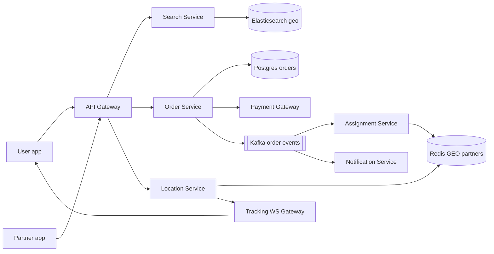
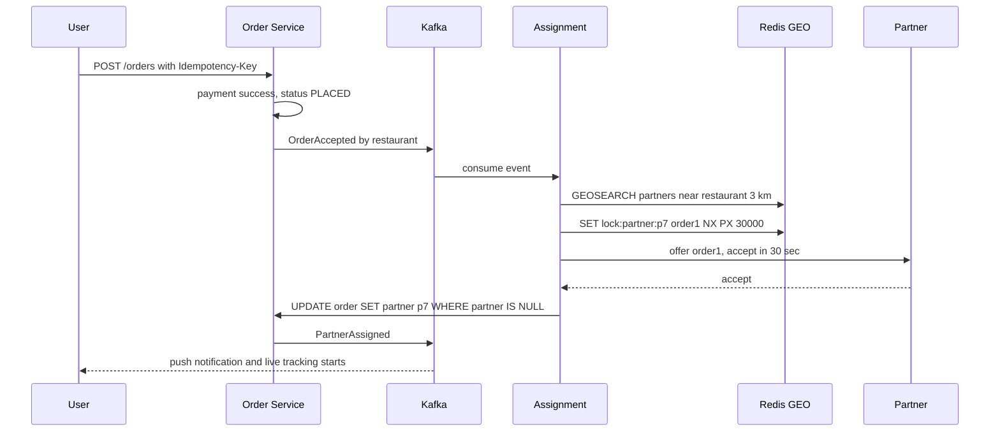
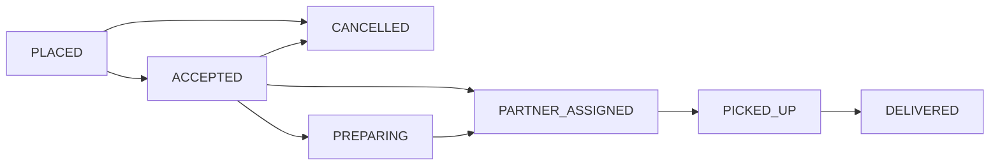

# Design Swiggy / Zomato (Food Delivery)

**Ek line me:** user apne paas ke restaurants dhoondhta hai, menu se cart banata hai, pay karta hai, aur ek delivery partner khana pickup karke live tracking ke saath deliver karta hai.

**Is question me interviewer kya check karta hai:** geo search (nearby restaurants), order ka clean state machine, delivery partner ko **ek hi order do baar assign na ho** (lock), live location tracking ka scale, aur services ke beech async events.

---

## Step 1: Interviewer se ye confirm karo (3–5 min)

| Tum poochho | Typical jawab | Design pe asar |
|---|---|---|
| "Scope: search, menu, cart, order, partner assignment, tracking? Payment third-party gateway?" | Haan | Payment gateway black box, webhook se result |
| "Delivery radius kitna? 5–7 km?" | Haan, ~7 km | Geohash precision 5–6 cells, nearby cells query |
| "Partner location kitni baar aati hai?" | Har 5 sec | Location writes bahut zyada, DB nahi, Redis geo |
| "Ek partner ek time pe ek order? Ya batching?" | Pehle ek, batching bonus | Assignment me partner pe lock |
| "Scale?" | ~20M orders/day peak city-wise lunch/dinner, 5 lakh active partners | Search read-heavy, location write-heavy |
| "Ratings, offers engine, grocery scope me?" | Nahi | Out of scope |

> **Bolo:** "Main 4 core flows design karunga: nearby restaurant search, order place karna, partner assign karna, aur live tracking. Order aur assignment pe consistency rakhunga, search aur tracking pe low latency aur availability."

## Step 2: Requirements

**Functional**
1. User location ke basis pe nearby open restaurants search kare (cuisine, rating filters)
2. Menu dekhe, cart banaye, order place kare aur pay kare
3. Restaurant order accept kare, system nearest free partner assign kare
4. User partner ko live map pe dekhe, ETA ke saath
5. Har status change pe notification (push/SMS)

**Non-functional**
- **Consistency:** ek order ek hi partner ko, ek partner ek time pe ek order. Payment double charge nahi.
- **Low latency:** search < 300ms, location update user tak < 2 sec
- **Availability:** search aur menu 99.99%, lunch/dinner peak pe bhi
- **Scale:** search read-heavy, location updates write-heavy

## Step 3: Estimation (sirf jo design badle)

- 20M orders/day, peak 3x → ~**700 orders/sec** peak. SQL sharded by city sambhal lega.
- Search: har order pe ~10 searches → 200M/day ≈ **7K QPS peak**. Cache + Elasticsearch chahiye.
- Location: 5 lakh partners / 5 sec → **1 lakh writes/sec**. Ye Postgres pe nahi jaayega, Redis GEO me in-memory.

> **Bolo:** "Order write load manageable hai. Asli load partner location updates ka hai, 1 lakh/sec, isliye location ko Redis me rakhunga aur DB me sirf sampled history."

## Step 4: Core entities

- **Restaurant**: id, name, lat, lng, geohash, cuisines, is_open, rating
- **MenuItem**: id, restaurant_id, name, price, in_stock
- **Cart**: user_id, restaurant_id, items (Redis me, temporary)
- **Order**: id, user_id, restaurant_id, partner_id, items, amount, status, idempotency_key
- **DeliveryPartner**: id, status (`OFFLINE`, `AVAILABLE`, `BUSY`), current_lat, current_lng

## Step 5: APIs

```http
GET  /restaurants?lat=18.52&lng=73.85&cuisine=biryani   → nearby list
GET  /restaurants/{id}/menu                             → menu items
PUT  /cart  {restaurantId, items}                       → cart
POST /orders {cartId, addressId, paymentToken}          → {orderId, status}
     Header: Idempotency-Key: <uuid>
POST /partners/location {lat, lng}                      → 204 (har 5 sec)
WS   /orders/{orderId}/track                            → live location + ETA push
```

## Step 6: High-level design



**Har component kyun:**
- **Search Service + Elasticsearch:** `geo_distance` query + filters (cuisine, rating, is_open). Restaurant data CDC se sync.
- **Order Service:** cart → order, payment, state machine. Postgres me ACID.
- **Kafka:** har status change ek event. Assignment, notification, analytics alag alag consume karte hain.
- **Assignment Service:** nearest free partner dhoondh ke lock karta hai.
- **Location Service + Redis GEO:** 1 lakh writes/sec in-memory. `GEOSEARCH` se nearby partners.
- **Tracking WS Gateway:** user ke phone pe partner location push.

## Step 7: Main flow: order se delivery tak



## Step 8: Data model & DB choice

```sql
orders(id PK, user_id, restaurant_id, partner_id NULL, status, amount,
       idempotency_key UNIQUE, created_at, updated_at)   -- shard by city_id
order_events(order_id, from_status, to_status, at)       -- audit trail
restaurants(id PK, name, lat, lng, geohash, is_open, cuisines)
```

- **Postgres** orders ke liye (transactions, conditional update). City ke basis pe shard, kyunki order kabhi city cross nahi karta.
- **Redis GEO** partner live location ke liye. **Cassandra** location history ke liye (time-series, write-heavy).
- **Elasticsearch** restaurant search ke liye.

## Step 9: Deep dives (interviewer yahin pressure dalega)

### 9.1 Nearby restaurants kaise dhoondhoge?
- Restaurant ka **geohash** (precision 6 ≈ 1.2 km cell) store karo. User ka cell + 8 neighbours query karo, phir exact distance se filter.
- Practical: Elasticsearch `geo_point` + `geo_distance` filter + `is_open` + cuisine. Ek hi query me sab.
- Result ko `geohash6 + filters` key se Redis me 1–2 min cache karo. Ek area ke sab users ko same list milti hai.
- Delivery radius restaurant-wise alag ho sakta hai, isliye "serviceable polygon" check bhi lagao.

### 9.2 Order state machine

- Transition sirf conditional update se: `UPDATE orders SET status='PICKED_UP' WHERE id=? AND status='PARTNER_ASSIGNED'`. 0 rows updated matlab invalid ya duplicate transition.
- Har transition `order_events` me likho aur Kafka pe publish karo (outbox pattern, taaki DB aur Kafka out of sync na hon).

### 9.3 Partner assignment: ek partner do orders pe na jaaye
- `GEOSEARCH` se 3 km me `AVAILABLE` partners, distance + rating + current load se score karo.
- Top partner pe **Redis lock** `SET lock:partner:p7 order1 NX PX 30000`. Lock mila to hi offer bhejo. 30 sec me accept nahi kiya to lock expire, agla partner.
- Final truth DB: `UPDATE orders SET partner_id=p7 WHERE id=order1 AND partner_id IS NULL`. Do assigners race karein to bhi ek hi jeetega.
- Partner ko `BUSY` mark karo taaki agle search me na aaye.

### 9.4 Live tracking aur ETA
- Partner app har 5 sec `lat,lng` bheje → Location Service → Redis `GEOADD` + Redis pub/sub channel `order:{id}`.
- Tracking WS Gateway us channel ko subscribe karta hai jahan user connected hai, aur push karta hai. User ke paas WebSocket, polling nahi.
- **ETA** = restaurant prep time (history se) + partner → restaurant + restaurant → user travel time (maps API / road graph, traffic ke saath). Har location update pe recalculate, user ko smooth karke dikhao.

## Step 10: Decision table (kya chuna, kyun, kya nahi)

| Decision | Kyun chuna | Kya nahi chuna, kyun |
|---|---|---|
| **Elasticsearch geo** for restaurant search | Geo + text + filters ek query me, horizontal scale | **Postgres + PostGIS:** geo theek hai par full-text, typo aur high read QPS ke liye ES better |
| **Redis GEO** for partner location | 1 lakh writes/sec in-memory, `GEOSEARCH` fast | **Postgres:** itne writes pe index thrash hoga. **Quadtree custom service:** banana aur maintain karna mehnga |
| **Redis lock + DB conditional update** for assignment | Lock fast offer control, DB final guarantee | **Sirf DB `SELECT FOR UPDATE`:** 30 sec offer window tak lock nahi pakad sakte |
| **Kafka** for order events | Assignment, notification, analytics decoupled, replay possible | **Sync REST chain:** ek service slow to poora order flow slow |
| **WebSocket** for tracking | Server push, 5 sec updates sasta | **Polling:** lakhs users ka har 5 sec poll = bekaar load. **SSE:** chalega, par WS gateway pehle se partner app ke liye bhi hai |
| **Postgres sharded by city** | ACID, order city ke andar hi rehta hai | **Single DB:** peak pe write aur storage limit. **Cassandra:** state machine ke conditional updates kamzor |
| **Outbox pattern** | DB write aur event publish atomic | **Dual write:** DB commit ho jaaye aur Kafka publish fail to event kho jaata hai |

## Step 11: Failures & bottlenecks

| Kya fail hua | Kya hoga | Handle kaise |
|---|---|---|
| Koi partner accept nahi kar raha | Order atka | Radius badhao, incentive badhao, 10 min baad user ko notify / auto cancel + refund |
| Redis GEO node down | Partner location gayab | Replica failover. Partner app 5 sec me fir bhej dega, data khud recover |
| Payment webhook miss | Paisa kata, order PENDING | Reconciliation job gateway se status poochhe |
| Partner app offline | Tracking ruk gaya | Last known location + "updating" dikhao, partner ko call option |
| Lunch peak ek city me | Search aur order service pe load | City-wise autoscale, search cache, restaurant ko "busy" mark karke throttle |

## Step 12: "Isko aur better kaise karein" (end me khud bolo)

> "Agar aur time ho to main ye improve karunga:"
- **Order batching:** ek partner ko same direction ke 2 orders, cost kam
- **Pre-assignment:** restaurant ka prep time khatam hone se pehle hi partner bhejna, taaki partner wait na kare
- ETA ke liye **ML model** (historical prep time, weather, traffic)
- **Surge pricing / dynamic delivery fee** jab partners kam hon
- Restaurant ke paas **H3 hexagon** grid se demand-supply heatmap, partners ko wahan reposition karna

## Step 13: Interviewer ke likely follow-up sawal

- "Do assignment workers same partner ko pakad lein to?" → Redis `NX` lock + DB `WHERE partner_id IS NULL` (Step 9.3)
- "Restaurant ne item out of stock kar diya order ke baad?" → restaurant reject kare, order `CANCELLED`, auto refund
- "User ne cancel kiya pickup ke baad?" → state machine allow nahi karega ya cancellation fee policy
- "Location history kyun aur kahan?" → disputes, ETA training. Cassandra me, sampled, TTL 30 din
- "Geohash edge problem?" → user cell boundary pe ho to neighbour cells bhi query karo

## 2-minute recap (interview se pehle ye padho)

> Swiggy me 4 flows hain: search, order, assignment, tracking. Search Elasticsearch geo_distance + filters se, result geohash key pe cached. Order Postgres me, city se sharded, aur ek strict state machine jo conditional `UPDATE ... WHERE status=?` se chalti hai. Har transition outbox se Kafka pe jaata hai. Assignment service Redis GEO se nearby free partners leti hai, top partner pe `SET NX PX 30s` lock, aur final `UPDATE WHERE partner_id IS NULL` se guarantee. Partner location 1 lakh writes/sec, Redis me, aur Redis pub/sub + WebSocket gateway se user tak live. ETA = prep time + travel time, har update pe recalculate. Payment pe idempotency key + reconciliation, notifications Kafka se async.

## Checklist

- [ ] Clarifying sawal aur scale numbers bina dekhe bata sakta hoon
- [ ] Geohash / ES geo se nearby restaurant search samjha sakta hoon
- [ ] Order state machine draw kar sakta hoon aur conditional update bata sakta hoon
- [ ] Partner assignment me double assignment kaise rokte hain bata sakta hoon
- [ ] Live tracking ka flow (Redis GEO, pub/sub, WebSocket) explain kar sakta hoon
- [ ] ETA ke components bata sakta hoon
- [ ] Decision table ke 3 trade-offs bina dekhe bol sakta hoon
