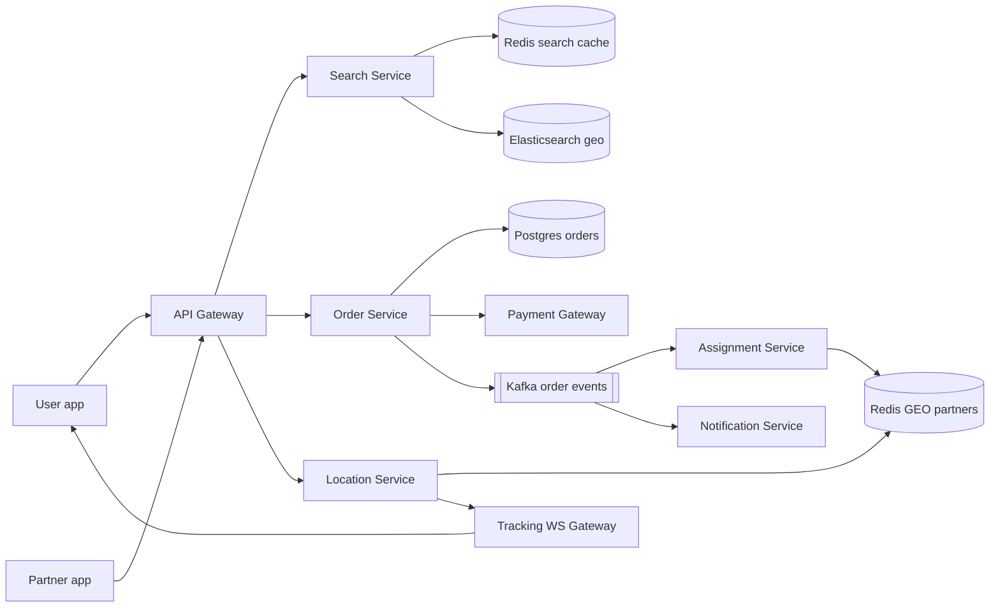
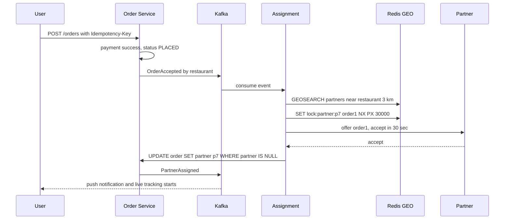
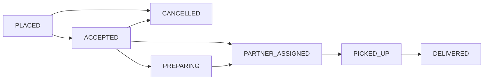

# Design Swiggy / Zomato (Food Delivery)

**Ek line me:** nearby restaurant → cart → pay → partner pickup karke live tracking ke saath deliver kare.

**Interviewer kya check karta hai:** geo search, order state machine, **no double assignment** (lock), live location scale, async events.

---

## Step 1: Interviewer se ye confirm karo (3–5 min)

| Tum poochho | Typical jawab | Design pe asar |
|---|---|---|
| "Search, cart, order, assignment, tracking? Payment third-party?" | Haan | Gateway black box, webhook result |
| "Delivery radius? 5–7 km?" | ~7 km | Geohash precision 5–6, neighbour cells query |
| "Partner location kitni baar?" | Har 5 sec | Heavy writes → Redis geo, DB nahi |
| "Ek partner ek order? Batching?" | Pehle ek, batching bonus | Assignment me partner pe lock |
| "Scale?" | 20M orders/day, 5 lakh partners | Search read-heavy, location write-heavy |

> **Bolo:** "4 flows: search, order, assignment, tracking. Order/assignment pe consistency, search/tracking pe latency + availability."

## Step 2: Requirements

**Functional**
1. Users should be able to nearby open restaurants search karein (cuisine, dish, rating)
2. Users should be able to menu se cart banayein, order karein, pay karein
3. Users should be able to restaurant accept pe nearby free partner paayein
4. Users should be able to partner live map pe ETA ke saath dekhein + status push

**Out of scope:** ratings/reviews, offers engine, grocery, partner payouts, order batching.

**Non-functional (priority order me)**
1. **Correctness:** ek order ek partner, ek partner ek order, no double charge
2. **Latency:** search p99 < 300 ms, location user tak < 2 sec
3. **Availability:** search aur menu 99.99%, peak pe bhi
4. **Scale:** 20M orders/day, 5 lakh partners, ~10 searches/order

**CAP choice:** order, payment, assignment → consistency (galat assignment = paisa + trust gaya). Search, menu, tracking → availability (1–2 min list, 5 sec location stale chalega).

## Step 3: Estimation (sirf jo design badle)

- 20M orders/day, peak 3x → ~**700 orders/sec**. City-sharded SQL kaafi.
- ~6 status changes/order → peak ~**4K events/sec**, 3 consumers (assignment, notification, analytics).
- Search: 200M/day ≈ 2.3K/sec avg, peak ≈ **7K QPS**, zyada tar geohash cache hits.
- Location: 5 lakh / 5 sec → **1 lakh writes/sec** → Redis GEO, Postgres nahi.

> **Bolo:** "Asli load location ka hai, 1 lakh/sec: Redis me, sampled history S3 me."

## Step 4: Core entities

- **Restaurant**: id, name, lat, lng, geohash, cuisines, is_open, rating
- **MenuItem**: id, restaurant_id, name, price, in_stock
- **Cart**: user_id, restaurant_id, items (Redis me, temporary)
- **Order**: id, user_id, restaurant_id, partner_id, items, amount, status, idempotency_key
- **DeliveryPartner**: id, status (`OFFLINE`, `AVAILABLE`, `BUSY`), current_lat, current_lng

## Step 5: APIs

```http
GET  /restaurants?lat=18.52&lng=73.85&cuisine=biryani   → nearby list
GET  /restaurants/{id}/menu                             → menu items
PUT  /cart  {restaurantId, items}                       → cart
POST /orders {cartId, addressId, paymentToken}          → {orderId, status}
     Header: Idempotency-Key: <uuid>
POST /partners/location {lat, lng}                      → 204 (har 5 sec)
WS   /orders/{orderId}/track                            → live location + ETA push
```

## Step 6: High-level design

**Simple v1:** apps → ek service → Postgres + PostGIS, tracking polling se. Numbers isko todte hain → neeche ke components.



**Har component kyun:** (FR1 → Search + ES, FR2 → Order + Postgres + Payment, FR3 → Assignment + Redis GEO, FR4 → Location + Tracking WS + Notification)
- **Elasticsearch:** 7K QPS dish text (typo) + geo + filters. Sirf geo → PostGIS + replicas kaafi. CDC sync.
- **Redis search cache:** key `geohash6 + filters`, 1–2 min TTL → ES load kam.
- **Postgres:** state machine + payment ko ACID.
- **Kafka:** 3 consumers + replay. Ek consumer → outbox + SQS kaafi.
- **Assignment Service:** 30 sec offers/retries order path block na karein.
- **Location Service + WS Gateway:** 1 lakh writes/sec (100x order flow); lakhs users ka 5 sec poll → push.

## Step 7: Main flow: order se delivery tak



## Step 8: Data model & DB choice

```sql
orders(id PK, user_id, restaurant_id, partner_id NULL, status, amount,
       idempotency_key UNIQUE, created_at, updated_at)   -- shard by city_id
order_events(order_id, from_status, to_status, at)       -- audit trail
restaurants(id PK, name, lat, lng, geohash, is_open, cuisines)
```

- **Postgres** orders, city se shard (order city cross nahi karta).
- **Location history:** har 30 sec point Redis list me, `DELIVERED` pe route S3 me (`order_id` key). Sirf per order padhi jaati hai → Cassandra nahi.
- **ES** sirf read copy; source of truth Postgres.

## Step 9: Deep dives (interviewer yahin pressure dalega)

### 9.1 Nearby restaurants kaise dhoondhoge?
**NFR:** search p99 < 300 ms, 7K QPS peak, 99.99% available.
- **Geohash** precision 6 ≈ 1.2 km. User cell + 8 neighbours, phir exact distance filter.
- Practical: ES `geo_point` + `geo_distance` + `is_open` + cuisine, ek query; Redis me 1–2 min cache.
- Radius restaurant-wise alag → "serviceable polygon" check.
- **Trade-off:** `is_open`/menu 1–2 min stale; order pe Postgres final check.

### 9.2 Order state machine
**NFR:** koi invalid ya duplicate transition nahi.

- Sirf conditional update: `UPDATE orders SET status='PICKED_UP' WHERE id=? AND status='PARTNER_ASSIGNED'`. 0 rows → invalid/duplicate.
- Har transition `order_events` + Kafka, outbox se.
- **Trade-off:** events thode late, at-least-once → consumers `order_id + status` pe dedup.

### 9.3 Partner assignment: ek partner do orders pe na jaaye
**NFR:** no double assignment.
- `GEOSEARCH` 3 km `AVAILABLE` partners → score (distance, rating, load).
- Top pe `SET lock:partner:p7 order1 NX PX 30000` → lock mila to offer. 30 sec me no accept → expire, agla.
- Final truth DB: `UPDATE orders SET partner_id=p7 WHERE id=order1 AND partner_id IS NULL`. Race me ek hi jeetega.
- Partner `BUSY` → agle search se bahar.
- **Trade-off:** ek-ek offer = har decline pe 30 sec. Top-2 parallel tez, par complex.

### 9.4 Live tracking aur ETA
**NFR:** location user tak < 2 sec, 1 lakh writes/sec.
- Partner app har 5 sec → Location Service → Redis `GEOADD` + pub/sub channel `order:{id}`.
- User ka WS Gateway channel subscribe karke push kare.
- **ETA** = prep time (history) + partner → restaurant + restaurant → user (maps API, traffic). Har update pe recalculate, smooth dikhao.
- **Trade-off:** pub/sub update miss kar sakta hai; agla 5 sec me aata hai.

## Step 10: Decision table (kya chuna, kyun, kya nahi)

| Decision | Kyun chuna | Kya nahi chuna, kyun |
|---|---|---|
| **Elasticsearch geo** for search | Text + geo + filters, 7K QPS | **PostGIS:** geo ok, text kamzor. Sacrifice: extra cluster, 1–2 min CDC lag |
| **Redis GEO** for location | 1 lakh writes/sec, fast `GEOSEARCH` | **Postgres:** index thrash. **Quadtree:** mehnga. Sacrifice: crash → last 5 sec gayab |
| **Redis lock + DB conditional update** | Lock = offer, DB = guarantee | **`SELECT FOR UPDATE`:** 30 sec row lock nahi. Sacrifice: logic do jagah |
| **Kafka** for order events | 3 consumers + replay | **Outbox + SQS:** 1 consumer ke liye. **Sync REST:** ek slow, sab slow. Sacrifice: Kafka ops cost |
| **WebSocket** for tracking | Push, < 2 sec | **Polling:** bekaar load. **SSE:** chalega. Sacrifice: stateful, reconnects |
| **Postgres by city** | ACID, order city ke andar | **Single DB:** peak limit. **Cassandra:** conditional update kamzor. Sacrifice: cross-city reports alag |
| **Outbox pattern** | DB write + event atomic | **Dual write:** publish fail → event gayab. Sacrifice: relay + thoda lag |

## Step 11: Failures & bottlenecks

| Kya fail hua | Kya hoga | Handle kaise |
|---|---|---|
| Koi partner accept nahi karta | Order atka | Radius/incentive badhao; 10 min baad auto cancel + refund |
| Redis GEO node down | Locations gayab | Replica failover; app 5 sec me fir bhejegi |
| Payment webhook miss | Paisa kata, order PENDING | Reconciliation job gateway se status poochhe |
| Partner app offline | Tracking ruka | Last location + "updating", call option |
| Ek city me lunch peak | Search/order pe load | City-wise autoscale, cache, restaurant "busy" throttle |

## Step 12: "Isko aur better kaise karein" (end me khud bolo)

- **Order batching:** same direction ke 2 orders ek partner ko
- **Pre-assignment:** prep khatam hone se pehle partner bhejo, wait na ho
- **ML ETA:** prep history, weather, traffic
- **H3 heatmap:** demand-supply dekh ke partners reposition

## Step 13: Interviewer ke likely follow-up sawal

- "Do workers same partner pakdein?" → 9.3: `NX` lock + `WHERE partner_id IS NULL`
- "Order ke baad item out of stock?" → restaurant reject, `CANCELLED`, auto refund
- "Pickup ke baad cancel?" → state machine allow nahi, ya cancellation fee
- "Location history?" → disputes, ETA training; 30 sec sampled, S3 per order, 90 din TTL
- "Geohash edge problem?" → boundary pe neighbour cells bhi query
- **Senior signal:** peak pe partners kam → backlog, sequential 30 sec offers delay multiply. Assignment lag metric, radius/incentive auto-adjust, Redis GEO city-wise shard.

## 2-minute recap (interview se pehle ye padho)

> 4 flows, v1 (PostGIS) se evolve. Search = ES + geohash Redis cache. Orders: city-sharded Postgres, conditional `UPDATE ... WHERE status=?`, outbox → Kafka. Assignment: Redis GEO, `SET NX PX 30s`, final `UPDATE WHERE partner_id IS NULL`. Location 1 lakh/sec Redis → pub/sub → WebSocket. ETA = prep + travel. Payment: idempotency key + reconciliation.

## Checklist

- [ ] Clarifying sawal aur scale numbers bina dekhe bata sakta hoon
- [ ] Geohash / ES geo se nearby restaurant search samjha sakta hoon
- [ ] Order state machine draw kar sakta hoon aur conditional update bata sakta hoon
- [ ] Partner assignment me double assignment kaise rokte hain bata sakta hoon
- [ ] Live tracking ka flow (Redis GEO, pub/sub, WebSocket) explain kar sakta hoon
- [ ] ETA ke components bata sakta hoon
- [ ] Decision table ke 3 trade-offs bina dekhe bol sakta hoon
