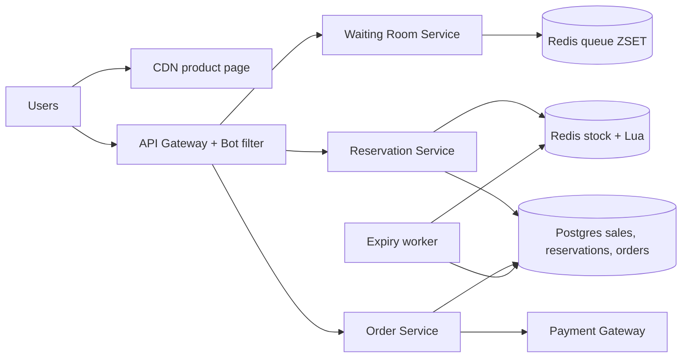
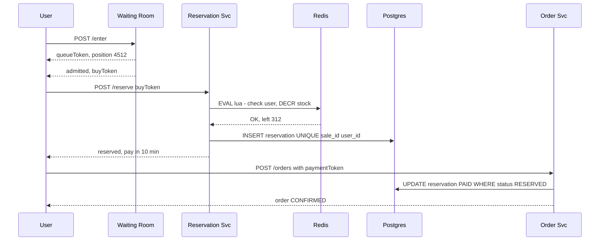

# Design Flash Sale (Big Billion Day / Lightning Deal)

**Ek line me:** 12 baje 1,000 iPhones ₹49,999 me, aur 10 lakh log ek saath "Buy" dabate hain. System ko **ek bhi extra unit nahi bechni (no oversell)**, crash nahi hona, aur bots ko rokna hai.

**Is question me interviewer kya check karta hai:** extreme contention ek hi row/key pe, atomic inventory decrement, load ko shape karna (waiting room, queue), payment timeout pe stock wapas, aur bot protection.

---

## Step 1: Interviewer se ye confirm karo (3–5 min)

| Tum poochho | Typical jawab | Design pe asar |
|---|---|---|
| "Stock kitna aur kitne log?" | 1,000 units, 10 lakh users ek minute me | 1000x more demand than supply. Zyada requests ko jaldi reject karna hai |
| "Oversell bilkul allowed nahi?" | Haan, zero oversell | Atomic decrement + DB constraint |
| "Per user limit?" | 1 unit per user | User-level dedup key |
| "Payment kitni der me karna hai?" | 10 min | Reservation TTL, timeout pe stock release |
| "Undersell chalega? Thodi units last me bach jaayein?" | Thoda chalega, baad me release ho jaayengi | Fairness thodi loose rakh sakte hain |
| "Normal catalog, search, recommendations?" | Out of scope | Sirf sale path design karna hai |

> **Bolo:** "Yahan problem throughput nahi, contention hai. 10 lakh log 1,000 units ke liye. Main design aisa karunga ki 99.9% requests DB tak pahunche hi nahi, aur jo 1,000 jeetein unhe hi order path me jaane doon."

## Step 2: Requirements

**Functional**
1. Users should be able to sale se pehle product page countdown ke saath dekh sakein
2. Users should be able to sale start pe "Buy" karke unit reserve kar sakein (max 1 per user)
3. Users should be able to 10 min me pay karke order confirm kar sakein, warna unit wapas pool me
4. Users should be able to sold out hote hi turant "Sold out" dekh sakein

**Out of scope:** catalog, search, recommendations, multi-item cart, returns.

**Non-functional (priority order me)**
1. **Correctness:** zero oversell, per user 1 unit (sabse important)
2. **Availability:** site 99.99% up, sale path throttle ho sakta hai par crash nahi
3. **Latency:** user ko p99 < 2 sec me jawab (mila / waiting / sold out)
4. **Fairness:** roughly FIFO, bots ko advantage nahi
5. **Scale:** 10 lakh users ek minute me, ~5 lakh page QPS, ~2 lakh buy QPS, sirf 1,000 units

**CAP choice:** inventory pe consistency: stock Redis primary down ho to sale pause karo, oversell risk mat lo. Product page aur queue position pe availability: stale countdown ya position chalega.

## Step 3: Estimation (sirf jo design badle)

- 10 lakh users × kai refresh → page pe **~5 lakh QPS** sale start pe. Ye sirf CDN sambhal sakta hai.
- "Buy" clicks: ~2 lakh QPS pehle 10 sec me. Ek Redis key ~1 lakh ops/sec. Isliye pehle waiting room / rate limit se filter.
- Actual reservations/orders: sirf **1,000** . Postgres ke liye kuch nahi, isliye winners ko **seedha sync insert**, beech me queue ki zarurat nahi.

> **Bolo:** "Funnel aisa hoga: 5 lakh QPS CDN pe, 2 lakh buy clicks gateway pe, waiting room se kuch hazaar Redis tak, aur sirf 1,000 DB tak. Har layer pe load 10–100x kam."

## Step 4: Core entities

- **Sale**: id, product_id, start_at, end_at, total_stock, per_user_limit
- **Inventory** (Redis): `stock:{saleId}` counter
- **Reservation**: id, sale_id, user_id, status (`RESERVED`, `PAID`, `EXPIRED`), expires_at
- **Order**: id, user_id, sale_id, reservation_id, payment_id, status

## Step 5: APIs

```http
GET  /sales/{saleId}                     → product + countdown (CDN cached)
POST /sales/{saleId}/enter               → {queueToken, position}
GET  /sales/{saleId}/queue/{token}       → {position} ya {admitted, buyToken}
POST /sales/{saleId}/reserve {buyToken}  → {reservationId, expiresAt} ya SOLD_OUT
POST /orders {reservationId, paymentToken}
     Header: Idempotency-Key: <uuid>     → {orderId, status}
```

## Step 6: High-level design

**Simple v1 pehle:** app server + Postgres: `UPDATE sales SET sold = sold + 1 WHERE id=? AND sold < total_stock` + reservation insert. Normal sale ke liye kaafi. Numbers isko todte hain: 5 lakh page QPS (→ CDN), ek row pe 2 lakh buy QPS (→ Redis Lua), fairness + single-key ~1 lakh ops/sec limit (→ waiting room). 1,000 winners ka DB write v1 jaisa hi rehta hai.



**Har component kyun:** (FR1 → CDN, FR2 → Waiting Room + Reservation + Redis Lua, FR3 → Order Service + Payment + Expiry worker, FR4 → sold-out flag at gateway/CDN)
- **CDN:** 5 lakh page QPS origin tak na aaye; app servers 30 sec me 100x autoscale nahi hote.
- **API Gateway + Bot filter:** per-user / per-IP rate limit, CAPTCHA, device fingerprint (fairness).
- **Waiting Room (Redis ZSET):** 2 lakh buy QPS > ek Redis key ka ~1 lakh ops/sec, aur FIFO fairness. Sirf rate limit random hai, fair nahi.
- **Reservation Service + Redis Lua:** atomic "stock check + decrement + user dedup"; DB row pe 2 lakh QPS lock contention hota.
- **Postgres (sync insert):** winner ka reservation seedha DB me. Kul ~1,000 rows, isliye **Kafka nahi**: spike DB tak pahunchta hi nahi, queue sirf lag aur ops laati.
- **Expiry worker (cron, har 30 sec):** unpaid reservation expire, stock wapas. 1,000 rows ke liye DB scan kaafi.

## Step 7: Main flow: buy click se order tak



## Step 8: Data model & DB choice

```sql
sales(id PK, product_id, start_at, end_at, total_stock, sold INT,
      CHECK (sold <= total_stock))
reservations(id PK, sale_id, user_id, status, expires_at,
             UNIQUE(sale_id, user_id))
orders(id PK, reservation_id UNIQUE, payment_id UNIQUE, status)
```

- **Redis** = fast gatekeeper. **Postgres** = final truth. Reservation insert + `sold = sold + 1` ek transaction me; fail ho to Redis `INCR` se unit wapas.
- `CHECK (sold <= total_stock)` aur `UNIQUE(sale_id, user_id)` DB level pe oversell aur double purchase rokte hain, chahe Redis me kuch gadbad ho.

## Step 9: Deep dives (interviewer yahin pressure dalega)

### 9.1 Inventory atomic kaise ghatayenge?
**NFR:** zero oversell, 2 lakh buy QPS pe bhi.
DB row `UPDATE ... SET stock = stock - 1` pe 2 lakh QPS = row lock contention, DB mar jaayega. Isliye Redis me ek **Lua script** (single-threaded, atomic):
```lua
if redis.call('SISMEMBER', KEYS[2], ARGV[1]) == 1 then return -2 end  -- already bought
local s = tonumber(redis.call('GET', KEYS[1]))
if s <= 0 then return -1 end                                           -- sold out
redis.call('DECR', KEYS[1]); redis.call('SADD', KEYS[2], ARGV[1])
return s - 1
```
- Sirf `DECR` bhi chalta hai (negative aaye to `INCR` wapas), par Lua me user dedup bhi saath ho jaata hai.
- Stock 0 hote hi ek flag `soldout:{saleId}` set karo. Gateway/CDN wo flag padh ke turant "Sold out" dikhaye, Redis tak bhi na aaye.
- Ek key bahut hot ho to **stock split**: 1,000 units ko 10 keys me 100-100 baanto, user hash se key chuno. Ek key khatam to dusri try.
- **Trade-off:** Redis fast hai par failover me last writes kho sakta hai; isliye DB constraint safety net, aur kuch undersell accept.

### 9.2 Virtual waiting room aur queue admission
**NFR:** fairness + site crash na ho (fixed load).
- `/enter` pe user ko token do, `ZADD queue:{saleId} <timestamp> <userId>`.
- Admission worker har second N users (jaise 2,000) ko `buyToken` (signed, 2 min valid) deta hai.
- Client position poll kare (ya SSE). Stock 0 ho gaya to queue me sabko turant "Sold out".
- Fayda: Reservation service pe load fixed rate pe aata hai, spike nahi.
- **Trade-off:** user ko kuch second wait aur ek extra service; badle me predictable load aur fairness.

### 9.3 Payment timeout aur stock release
**NFR:** correctness (paid unit kabhi double na bike) + undersell kam.
- Reservation 10 min TTL. Expiry worker har 30 sec: `status=RESERVED AND expires_at < now()` → `EXPIRED`, aur Redis me `INCR stock`, user ko set se hatao.
- Release wali units queue me waiting users ko mil jaati hain.
- Race: payment aur expiry ek saath? `UPDATE reservations SET status='PAID' WHERE id=? AND status='RESERVED'`. Jo pehle jeete wahi. Expiry jeeti aur payment late aaya to **auto refund**.
- **Trade-off:** 10 min TTL me unit block rehti hai; chhota TTL = kam undersell par genuine slow payers fail.

### 9.4 Bot protection
**NFR:** fairness, asli users ko maal mile.
- Sale se pehle login + verified phone zaroori. Naye accounts ko block ya low priority.
- Gateway pe per-user, per-IP, per-device rate limit. CAPTCHA `/enter` pe.
- `buyToken` signed aur user-bound, share ya replay nahi ho sakta.
- Same address / payment card pe multiple accounts → post-sale fraud check, order cancel.
- **Trade-off:** har check friction badhata hai, kuch genuine users bhi rukte hain.

## Step 10: Decision table (kya chuna, kyun, kya nahi)

| Decision | Kyun chuna | Kya nahi chuna, kyun |
|---|---|---|
| **Redis Lua** for stock decrement | Atomic, ~1 lakh ops/sec, user dedup saath | **DB row update:** lakhs lock waits. **Optimistic locking:** retry storm. Sacrifice: failover pe kuch writes kho sakte hain |
| **DB CHECK + UNIQUE constraint** | Safety net, Redis fail ho tab bhi oversell nahi | **Sirf Redis:** failover me oversell. Sacrifice: kabhi Redis "haan", DB "na" = user ko error |
| **Virtual waiting room** | Fixed-rate load, fair FIFO | **Sirf rate limit + autoscaling:** unfair, single key bottleneck. Sacrifice: extra service, user wait |
| **Sync DB insert** for winners | ~1,000 inserts, DB turant truth | **Kafka/SQS:** spike DB tak aata hi nahi, queue bekaar lag + ops. Sacrifice: DB down = sale pause |
| **CDN** for product page | 5 lakh QPS edge pe | **App servers:** origin down. Sacrifice: countdown/badge thoda stale |
| **TTL reservation + cron expiry** | Unpaid units wapas | **Payment ke baad decrement:** 1,000+ log pay karenge, refunds. **Delay queue:** overkill. Sacrifice: ~30 sec release delay |

## Step 11: Failures & bottlenecks

| Kya fail hua | Kya hoga | Handle kaise |
|---|---|---|
| Redis primary crash | Kuch decrements kho sakte hain | DB constraint oversell rokega. AOF `everysec` + replica. Sale ke liye dedicated Redis |
| Postgres slow/down | Lua jeeta par insert fail | Redis `INCR` se unit wapas, user ko "retry"; DB down ho to sale pause (correctness > availability) |
| Payment gateway slow | Reservations expire ho rahi | Sale ke liye TTL thoda badhao, gateway se dedicated capacity lo |
| Hot key | Ek Redis shard 100% CPU | Stock split across keys, sold-out flag edge pe |
| Bots | Asli users ko kuch nahi milta | CAPTCHA, signed tokens, rate limit, fraud check |

## Step 12: "Isko aur better kaise karein" (end me khud bolo)

> "Agar aur time ho to main ye improve karunga:"
- **Pre-registration / lottery:** sale se pehle register, random winners. Contention hi khatam
- **Load test + game day:** sale se pehle 2x expected traffic se rehearsal
- **Graceful degradation:** sale ke time recommendations, reviews jaise non-critical features off
- **Multi-region:** product page har region CDN se, par inventory ek primary Redis cluster me

## Step 13: Interviewer ke likely follow-up sawal

- "Redis aur DB me count alag ho gaya to?" → DB truth hai. Sale ke baad reconciliation job Redis ko DB se sync kare
- "User ne do tab se buy dabaya?" → Lua me `SISMEMBER` + DB `UNIQUE(sale_id, user_id)`
- "Payment success par reservation expire ho chuka tha?" → conditional update fail, auto refund
- "1 crore users aa gaye?" → waiting room ka Redis ZSET shard karo, ya pre-registration lottery
- "Fairness kaise prove karoge?" → queue timestamp FIFO, aur admission logs audit ke liye
- "Kafka kyun nahi lagaya?" → DB tak sirf ~1,000 writes aate hain; funnel ne spike pehle hi khatam kar diya
- **Senior signal:** khud bolo: asli single point stock wali Redis key hai. Failover (last writes loss) aur hot-shard CPU pehle se plan karo: dedicated Redis, stock split, edge pe sold-out flag, DB constraint backstop.

## 2-minute recap (interview se pehle ye padho)

> Flash sale me problem contention hai, throughput nahi. Funnel banao: CDN product page serve karta hai, gateway bots aur rate limit filter karta hai, waiting room (Redis ZSET) users ko fixed rate pe admit karta hai, aur Reservation service Redis Lua script se atomically user dedup + stock decrement karti hai. Sold out hote hi flag set, baaki requests edge pe hi reject. Jeete hue ~1,000 users ka reservation seedha (sync) Postgres me jaata hai, kyunki itne kam writes ke liye queue bekaar hai. Postgres `CHECK(sold <= total)` aur `UNIQUE(sale_id, user_id)` ke saath, taaki Redis fail ho tab bhi oversell na ho. Reservation 10 min TTL, expiry worker stock wapas karta hai, aur late payment pe auto refund. Bots ke liye CAPTCHA, signed buy tokens, per-device limits.

## Checklist

- [ ] Funnel (CDN → gateway → waiting room → Redis → DB) ke numbers bata sakta hoon
- [ ] Redis Lua script se atomic stock decrement likh sakta hoon
- [ ] DB constraint se oversell kaise rukta hai samjha sakta hoon
- [ ] Waiting room aur admission rate explain kar sakta hoon
- [ ] Payment timeout aur stock release ka race handle kar sakta hoon
- [ ] Bot protection ke 3 tareeke bata sakta hoon
- [ ] Decision table ke 3 trade-offs bina dekhe bol sakta hoon
