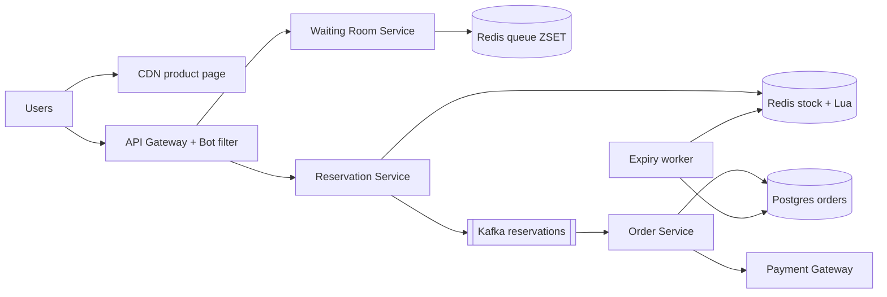
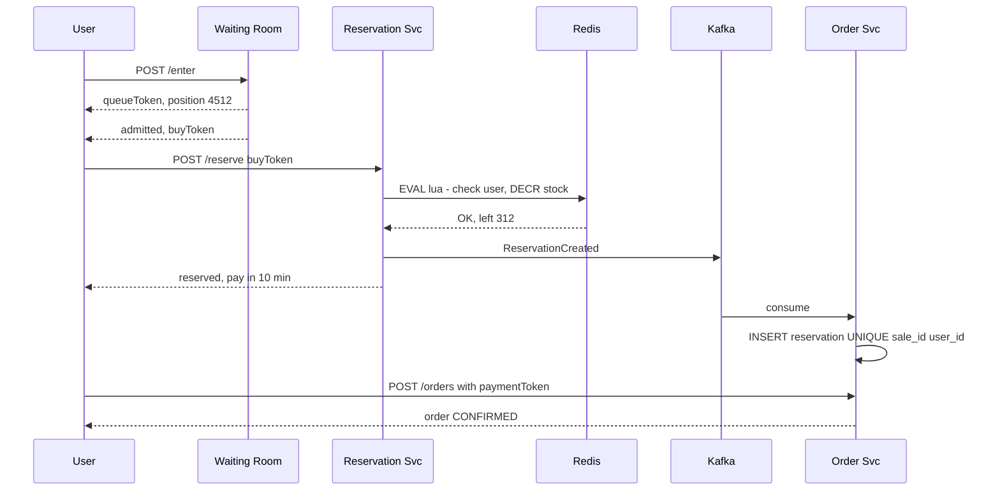

# Design Flash Sale (Big Billion Day / Lightning Deal)

**Ek line me:** 12 baje 1,000 iPhones ₹49,999 me, aur 10 lakh log ek saath "Buy" dabate hain. System ko **ek bhi extra unit nahi bechni (no oversell)**, crash nahi hona, aur bots ko rokna hai.

**Is question me interviewer kya check karta hai:** extreme contention ek hi row/key pe, atomic inventory decrement, load ko shape karna (waiting room, queue), payment timeout pe stock wapas, aur bot protection.

---

## Step 1: Interviewer se ye confirm karo (3–5 min)

| Tum poochho | Typical jawab | Design pe asar |
|---|---|---|
| "Stock kitna aur kitne log?" | 1,000 units, 10 lakh users ek minute me | 1000x more demand than supply. Zyada requests ko jaldi reject karna hai |
| "Oversell bilkul allowed nahi?" | Haan, zero oversell | Atomic decrement + DB constraint |
| "Per user limit?" | 1 unit per user | User-level dedup key |
| "Payment kitni der me karna hai?" | 10 min | Reservation TTL, timeout pe stock release |
| "Undersell chalega? Thodi units last me bach jaayein?" | Thoda chalega, baad me release ho jaayengi | Fairness thodi loose rakh sakte hain |
| "Normal catalog, search, recommendations?" | Out of scope | Sirf sale path design karna hai |

> **Bolo:** "Yahan problem throughput nahi, contention hai. 10 lakh log 1,000 units ke liye. Main design aisa karunga ki 99.9% requests DB tak pahunche hi nahi, aur jo 1,000 jeetein unhe hi order path me jaane doon."

## Step 2: Requirements

**Functional**
1. Sale start se pehle product page dikhe, countdown ke saath
2. Sale start pe user "Buy" kare, agar stock hai to unit reserve ho
3. Reserved user 10 min me pay kare, warna unit wapas pool me
4. Per user 1 unit, sold out hone pe turant "Sold out" dikhe

**Non-functional**
- **Correctness:** zero oversell (sabse important)
- **Availability:** site down nahi honi chahiye, chahe sale ka path throttle ho
- **Fairness:** roughly first-come-first-served, bots ko advantage nahi
- **Latency:** user ko 1–2 sec me jawab (mila / waiting / sold out)

## Step 3: Estimation (sirf jo design badle)

- 10 lakh users × kai refresh → page pe **~5 lakh QPS** sale start pe. Ye sirf CDN sambhal sakta hai.
- "Buy" clicks: ~2 lakh QPS pehle 10 sec me. Ek Redis key ~1 lakh ops/sec. Isliye pehle waiting room / rate limit se filter.
- Actual orders: sirf **1,000**. DB ke liye ye kuch bhi nahi.

> **Bolo:** "Funnel aisa hoga: 5 lakh QPS CDN pe, 2 lakh buy clicks gateway pe, waiting room se kuch hazaar Redis tak, aur sirf 1,000 DB tak. Har layer pe load 10–100x kam."

## Step 4: Core entities

- **Sale**: id, product_id, start_at, end_at, total_stock, per_user_limit
- **Inventory** (Redis): `stock:{saleId}` counter
- **Reservation**: id, sale_id, user_id, status (`RESERVED`, `PAID`, `EXPIRED`), expires_at
- **Order**: id, user_id, sale_id, reservation_id, payment_id, status

## Step 5: APIs

```http
GET  /sales/{saleId}                     → product + countdown (CDN cached)
POST /sales/{saleId}/enter               → {queueToken, position}
GET  /sales/{saleId}/queue/{token}       → {position} ya {admitted, buyToken}
POST /sales/{saleId}/reserve {buyToken}  → {reservationId, expiresAt} ya SOLD_OUT
POST /orders {reservationId, paymentToken}
     Header: Idempotency-Key: <uuid>     → {orderId, status}
```

## Step 6: High-level design



**Har component kyun:**
- **CDN:** product page, images, countdown static. Sale start pe 5 lakh QPS origin tak na aaye.
- **API Gateway + Bot filter:** per-user / per-IP rate limit, CAPTCHA, device fingerprint.
- **Waiting Room:** sab ko token, Redis sorted set me line, ek rate pe admit.
- **Reservation Service + Redis Lua:** atomic "stock check + decrement + user dedup".
- **Kafka → Order Service:** jeete hue users ko async DB me likho, DB ko spike se bachao.
- **Expiry worker:** 10 min me payment nahi hua to reservation expire, stock wapas.

## Step 7: Main flow: buy click se order tak



## Step 8: Data model & DB choice

```sql
sales(id PK, product_id, start_at, end_at, total_stock, sold INT,
      CHECK (sold <= total_stock))
reservations(id PK, sale_id, user_id, status, expires_at,
             UNIQUE(sale_id, user_id))
orders(id PK, reservation_id UNIQUE, payment_id UNIQUE, status)
```

- **Redis** = fast gatekeeper. **Postgres** = final truth.
- `CHECK (sold <= total_stock)` aur `UNIQUE(sale_id, user_id)` DB level pe oversell aur double purchase rokte hain, chahe Redis me kuch gadbad ho.

## Step 9: Deep dives (interviewer yahin pressure dalega)

### 9.1 Inventory atomic kaise ghatayenge?
DB row `UPDATE ... SET stock = stock - 1` pe 2 lakh QPS = row lock contention, DB mar jaayega. Isliye Redis me ek **Lua script** (single-threaded, atomic):
```lua
if redis.call('SISMEMBER', KEYS[2], ARGV[1]) == 1 then return -2 end  -- already bought
local s = tonumber(redis.call('GET', KEYS[1]))
if s <= 0 then return -1 end                                           -- sold out
redis.call('DECR', KEYS[1]); redis.call('SADD', KEYS[2], ARGV[1])
return s - 1
```
- Sirf `DECR` bhi chalta hai (negative aaye to `INCR` wapas), par Lua me user dedup bhi saath ho jaata hai.
- Stock 0 hote hi ek flag `soldout:{saleId}` set karo. Gateway/CDN wo flag padh ke turant "Sold out" dikhaye, Redis tak bhi na aaye.
- Ek key bahut hot ho to **stock split**: 1,000 units ko 10 keys me 100-100 baanto, user hash se key chuno. Ek key khatam to dusri try.

### 9.2 Virtual waiting room aur queue admission
- `/enter` pe user ko token do, `ZADD queue:{saleId} <timestamp> <userId>`.
- Admission worker har second N users (jaise 2,000) ko `buyToken` (signed, 2 min valid) deta hai.
- Client position poll kare (ya SSE). Stock 0 ho gaya to queue me sabko turant "Sold out".
- Fayda: Reservation service pe load fixed rate pe aata hai, spike nahi.

### 9.3 Payment timeout aur stock release
- Reservation 10 min TTL. Expiry worker har 30 sec: `status=RESERVED AND expires_at < now()` → `EXPIRED`, aur Redis me `INCR stock`, user ko set se hatao.
- Release wali units queue me waiting users ko mil jaati hain.
- Race: payment aur expiry ek saath? `UPDATE reservations SET status='PAID' WHERE id=? AND status='RESERVED'`. Jo pehle jeete wahi. Expiry jeeti aur payment late aaya to **auto refund**.

### 9.4 Bot protection
- Sale se pehle login + verified phone zaroori. Naye accounts ko block ya low priority.
- Gateway pe per-user, per-IP, per-device rate limit. CAPTCHA `/enter` pe.
- `buyToken` signed aur user-bound, share ya replay nahi ho sakta.
- Same address / payment card pe multiple accounts → post-sale fraud check, order cancel.

## Step 10: Decision table (kya chuna, kyun, kya nahi)

| Decision | Kyun chuna | Kya nahi chuna, kyun |
|---|---|---|
| **Redis Lua** for stock decrement | Atomic, ~1 lakh ops/sec, user dedup bhi saath | **DB row update:** ek row pe lakhs lock waits, DB crash. **Optimistic locking:** almost har request conflict karegi, retry storm |
| **DB CHECK + UNIQUE constraint** | Final safety net, Redis fail ho tab bhi oversell nahi | **Sirf Redis pe bharosa:** failover me last writes kho sakte hain, oversell ho jaayega |
| **Virtual waiting room** | Load fixed rate, fair FIFO, UX me position dikhta hai | **Sirf autoscaling:** 30 sec me 100x scale nahi hota, aur bottleneck single key hai |
| **Kafka** between reserve aur order | Spike ko DB se door rakhta hai, retry safe | **Sync DB insert:** spike seedha DB pe |
| **CDN** for product page | 5 lakh QPS edge pe, origin safe | **App servers se serve:** bekaar compute, origin down |
| **TTL reservation + expiry worker** | Unpaid units wapas, undersell kam | **Payment ke baad hi decrement:** 1,000 se zyada log pay kar denge, refunds ka dher |

## Step 11: Failures & bottlenecks

| Kya fail hua | Kya hoga | Handle kaise |
|---|---|---|
| Redis primary crash | Kuch decrements kho sakte hain | DB constraint oversell rokega. AOF `everysec` + replica. Sale ke liye dedicated Redis |
| Kafka consumer lag | Reservation DB me late | User ko Redis result se response already mil gaya. Consumer scale karo |
| Payment gateway slow | Reservations expire ho rahi | Sale ke liye TTL thoda badhao, gateway se dedicated capacity lo |
| Hot key | Ek Redis shard 100% CPU | Stock split across keys, sold-out flag edge pe |
| Bots | Asli users ko kuch nahi milta | CAPTCHA, signed tokens, rate limit, fraud check |

## Step 12: "Isko aur better kaise karein" (end me khud bolo)

> "Agar aur time ho to main ye improve karunga:"
- **Pre-registration / lottery:** sale se pehle register, random winners. Contention hi khatam
- **Load test + game day:** sale se pehle 2x expected traffic se rehearsal
- **Graceful degradation:** sale ke time recommendations, reviews jaise non-critical features off
- **Multi-region:** product page har region CDN se, par inventory ek primary Redis cluster me
- Post-sale **analytics stream**: kitne bots block hue, kitna undersell, conversion

## Step 13: Interviewer ke likely follow-up sawal

- "Redis aur DB me count alag ho gaya to?" → DB truth hai. Sale ke baad reconciliation job Redis ko DB se sync kare
- "User ne do tab se buy dabaya?" → Lua me `SISMEMBER` + DB `UNIQUE(sale_id, user_id)`
- "Payment success par reservation expire ho chuka tha?" → conditional update fail, auto refund
- "1 crore users aa gaye?" → waiting room ka Redis ZSET shard karo, ya pre-registration lottery
- "Fairness kaise prove karoge?" → queue timestamp FIFO, aur admission logs audit ke liye

## 2-minute recap (interview se pehle ye padho)

> Flash sale me problem contention hai, throughput nahi. Funnel banao: CDN product page serve karta hai, gateway bots aur rate limit filter karta hai, waiting room (Redis ZSET) users ko fixed rate pe admit karta hai, aur Reservation service Redis Lua script se atomically user dedup + stock decrement karti hai. Sold out hote hi flag set, baaki requests edge pe hi reject. Jeete hue users Kafka se Order service tak, jo Postgres me `CHECK(sold <= total)` aur `UNIQUE(sale_id, user_id)` ke saath likhti hai, taaki Redis fail ho tab bhi oversell na ho. Reservation 10 min TTL, expiry worker stock wapas karta hai, aur late payment pe auto refund. Bots ke liye CAPTCHA, signed buy tokens, per-device limits.

## Checklist

- [ ] Funnel (CDN → gateway → waiting room → Redis → DB) ke numbers bata sakta hoon
- [ ] Redis Lua script se atomic stock decrement likh sakta hoon
- [ ] DB constraint se oversell kaise rukta hai samjha sakta hoon
- [ ] Waiting room aur admission rate explain kar sakta hoon
- [ ] Payment timeout aur stock release ka race handle kar sakta hoon
- [ ] Bot protection ke 3 tareeke bata sakta hoon
- [ ] Decision table ke 3 trade-offs bina dekhe bol sakta hoon
