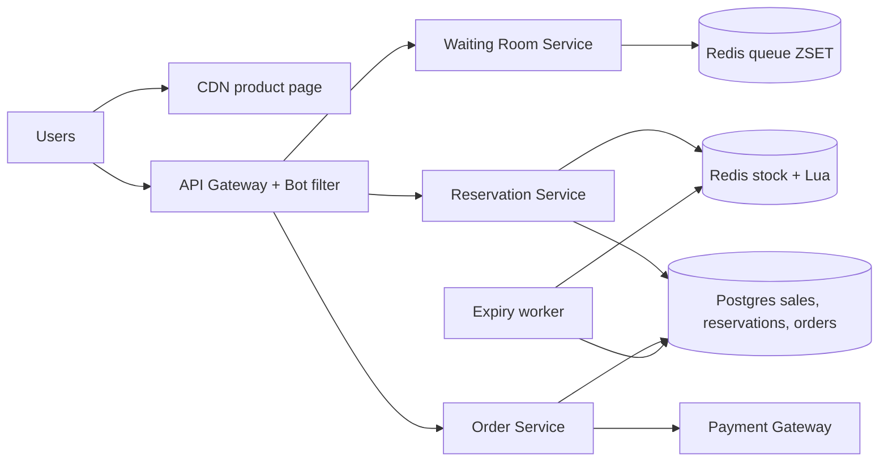
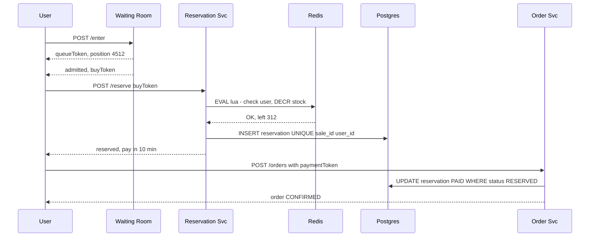

# Design Flash Sale (Big Billion Day / Lightning Deal)

**Ek line me:** 12 baje 1,000 iPhones ₹49,999 me, 10 lakh log ek saath "Buy". **Zero oversell**, no crash, bots bahar.

**Interviewer kya check karta hai:** hot key contention, atomic decrement, load shaping (waiting room), timeout pe stock wapas, bots.

---

## Step 1: Interviewer se ye confirm karo (3–5 min)

| Tum poochho | Typical jawab | Design pe asar |
|---|---|---|
| "Stock aur users?" | 1,000 units, 10 lakh users 1 min me | 1000x demand → zyada requests jaldi reject |
| "Oversell allowed?" | Zero | Atomic decrement + DB constraint |
| "Per user limit?" | 1 unit | User-level dedup key |
| "Payment window?" | 10 min | Reservation TTL, timeout pe release |
| "Thoda undersell chalega?" | Haan, baad me release | Fairness thodi loose |

> **Bolo:** "Problem throughput nahi, contention hai. 99.9% requests DB tak pahunchein hi nahi; sirf 1,000 winners order path me."

## Step 2: Requirements

**Functional**
1. Users should be able to sale se pehle countdown ke saath product page dekhein
2. Users should be able to sale start pe "Buy" karke unit reserve karein (max 1)
3. Users should be able to 10 min me pay karke confirm karein, warna unit pool me wapas
4. Users should be able to sold out hote hi "Sold out" dekhein

**Out of scope:** catalog, search, recommendations, multi-item cart, returns.

**Non-functional (priority order me)**
1. **Correctness:** zero oversell, 1 unit per user
2. **Availability:** 99.99%; sale path throttle ho sakta hai, crash nahi
3. **Latency:** p99 < 2 sec (mila / waiting / sold out)
4. **Fairness:** roughly FIFO, bots ko advantage nahi
5. **Scale:** Step 3 ka funnel

**CAP choice:** inventory → consistency (stock Redis primary down = sale pause, oversell risk nahi). Page aur queue position → availability (stale chalega).

## Step 3: Estimation (sirf jo design badle)

- Refreshes → page pe **~5 lakh QPS** → sirf CDN sambhalega.
- Buy: ~2 lakh QPS pehle 10 sec me; ek Redis key ~1 lakh ops/sec → pehle waiting room / rate limit.
- Reservations sirf **1,000** → winners ka **sync insert**, queue nahi chahiye.

> **Bolo:** "Funnel: 5 lakh QPS CDN, 2 lakh gateway, kuch hazaar Redis, 1,000 DB. Har layer 10–100x kam."

## Step 4: Core entities

- **Sale**: id, product_id, start_at, end_at, total_stock, per_user_limit
- **Inventory** (Redis): `stock:{saleId}` counter
- **Reservation**: id, sale_id, user_id, status (`RESERVED`, `PAID`, `EXPIRED`), expires_at
- **Order**: id, user_id, sale_id, reservation_id, payment_id, status

## Step 5: APIs

```http
GET  /sales/{saleId}                     → product + countdown (CDN cached)
POST /sales/{saleId}/enter               → {queueToken, position}
GET  /sales/{saleId}/queue/{token}       → {position} ya {admitted, buyToken}
POST /sales/{saleId}/reserve {buyToken}  → {reservationId, expiresAt} ya SOLD_OUT
POST /orders {reservationId, paymentToken}
     Header: Idempotency-Key: <uuid>     → {orderId, status}
```

## Step 6: High-level design

**Simple v1:** Postgres `UPDATE sales SET sold = sold + 1 WHERE id=? AND sold < total_stock` + reservation insert. Normal sale ok; winners ka DB write aaj bhi yahi.



**Har component kyun:** (FR1 → CDN, FR2 → Waiting Room + Reservation + Redis Lua, FR3 → Order + Payment + Expiry worker, FR4 → sold-out flag at gateway/CDN)
- **CDN:** 5 lakh QPS origin tak na aaye; app servers 30 sec me 100x scale nahi hote.
- **Waiting Room (ZSET):** 2 lakh QPS > ek key ka ~1 lakh, aur FIFO. Sirf rate limit = random, fair nahi.
- **Redis Lua:** atomic stock check + decrement + user dedup; DB row pe lock contention hota.
- **Postgres sync insert:** ~1,000 rows → **Kafka nahi**, spike DB tak aata hi nahi.
- **Expiry worker (har 30 sec):** unpaid expire, stock wapas; 1,000 rows ka DB scan kaafi.

## Step 7: Main flow: buy click se order tak



## Step 8: Data model & DB choice

```sql
sales(id PK, product_id, start_at, end_at, total_stock, sold INT,
      CHECK (sold <= total_stock))
reservations(id PK, sale_id, user_id, status, expires_at,
             UNIQUE(sale_id, user_id))
orders(id PK, reservation_id UNIQUE, payment_id UNIQUE, status)
```

- **Redis** = fast gatekeeper, **Postgres** = final truth. Reservation insert + `sold = sold + 1` ek transaction; fail → Redis `INCR` se unit wapas.
- `CHECK` + `UNIQUE` → Redis gadbad kare tab bhi oversell / double purchase nahi.

## Step 9: Deep dives (interviewer yahin pressure dalega)

### 9.1 Inventory atomic kaise ghatayenge?
**NFR:** zero oversell, 2 lakh buy QPS pe bhi.
DB row update pe 2 lakh QPS = lock contention. Isliye Redis **Lua script** (single-threaded, atomic):
```lua
if redis.call('SISMEMBER', KEYS[2], ARGV[1]) == 1 then return -2 end  -- already bought
local s = tonumber(redis.call('GET', KEYS[1]))
if s <= 0 then return -1 end                                           -- sold out
redis.call('DECR', KEYS[1]); redis.call('SADD', KEYS[2], ARGV[1])
return s - 1
```
- Sirf `DECR` bhi chalta (negative → `INCR` wapas), par Lua me dedup saath.
- Stock 0 → `soldout:{saleId}` flag; gateway/CDN turant "Sold out", Redis tak nahi.
- Hot key → **stock split**: 10 keys × 100, user hash se key; khatam to dusri.
- **Trade-off:** failover pe last writes kho sakte hain → DB constraint safety net, thoda undersell accept.

### 9.2 Virtual waiting room aur queue admission
**NFR:** fairness + fixed load, crash nahi.
- `/enter` → token, `ZADD queue:{saleId} <timestamp> <userId>`.
- Admission worker har second N users (~2,000) ko signed `buyToken` (2 min valid).
- Client poll/SSE; stock 0 → sabko "Sold out".
- **Trade-off:** thoda wait + extra service vs predictable load + fairness.

### 9.3 Payment timeout aur stock release
**NFR:** paid unit double na bike + undersell kam.
- 10 min TTL. Worker har 30 sec: `status=RESERVED AND expires_at < now()` → `EXPIRED`, Redis `INCR stock`, user set se hatao. Units queue walon ko.
- Race: `UPDATE reservations SET status='PAID' WHERE id=? AND status='RESERVED'`; pehla jeetega. Expiry jeeti → late payment **auto refund**.
- **Trade-off:** chhota TTL = kam undersell, par slow payers fail.

### 9.4 Bot protection
**NFR:** asli users ko maal mile.
- Login + verified phone; naye accounts block / low priority.
- Gateway pe per-user/IP/device rate limit, device fingerprint, CAPTCHA `/enter` pe.
- `buyToken` signed + user-bound → share/replay nahi.
- Same address/card pe multiple accounts → post-sale fraud check, cancel.
- **Trade-off:** har check friction, kuch genuine users bhi rukte hain.

## Step 10: Decision table (kya chuna, kyun, kya nahi)

| Decision | Kyun chuna | Kya nahi chuna, kyun |
|---|---|---|
| **Redis Lua** decrement | Atomic, ~1 lakh ops/sec, dedup saath | **DB row update:** lakhs lock waits. **Optimistic locking:** retry storm. Sacrifice: failover pe writes loss |
| **DB CHECK + UNIQUE** | Redis fail pe bhi no oversell | **Sirf Redis:** failover oversell. Sacrifice: Redis "haan", DB "na" = user error |
| **Virtual waiting room** | Fixed-rate load, FIFO | **Rate limit + autoscale:** unfair, hot key. Sacrifice: extra service, wait |
| **Sync DB insert** | ~1,000 inserts, turant truth | **Kafka/SQS:** spike DB tak nahi aata, bekaar lag. Sacrifice: DB down = sale pause |
| **CDN** product page | 5 lakh QPS edge pe | **App servers:** origin down. Sacrifice: countdown thoda stale |
| **TTL + cron expiry** | Unpaid units wapas | **Pay ke baad decrement:** 1,000+ pay, refunds. **Delay queue:** overkill. Sacrifice: ~30 sec delay |

## Step 11: Failures & bottlenecks

| Kya fail hua | Kya hoga | Handle kaise |
|---|---|---|
| Redis primary crash | Decrements gaye | DB constraint; AOF `everysec` + replica; dedicated Redis |
| Postgres slow/down | Lua jeeta, insert fail | `INCR` wapas, user "retry"; DB down → sale pause |
| Payment gateway slow | Reservations expire | TTL badhao, dedicated gateway capacity |
| Hot key | Ek shard 100% CPU | Stock split, edge sold-out flag |
| Bots | Asli users khali haath | CAPTCHA, signed tokens, rate limit, fraud check |

## Step 12: "Isko aur better kaise karein" (end me khud bolo)

- **Pre-registration lottery:** random winners → contention khatam
- **Game day:** 2x traffic pe rehearsal
- **Graceful degradation:** recos, reviews off during sale
- **Multi-region:** page har region CDN se, inventory ek primary Redis cluster

## Step 13: Interviewer ke likely follow-up sawal

- "Redis aur DB count alag?" → DB truth; sale ke baad reconciliation
- "Do tabs se buy?" → Lua `SISMEMBER` + DB `UNIQUE(sale_id, user_id)`
- "Payment success, reservation expired?" → conditional update fail, auto refund
- "1 crore users?" → waiting room ZSET shard, ya lottery
- "Fairness prove?" → timestamp FIFO + admission logs
- "Kafka kyun nahi?" → DB tak sirf ~1,000 writes
- **Senior signal:** asli single point stock Redis key hai. Failover (last writes loss) aur hot-shard CPU pehle plan karo: dedicated Redis, stock split, edge flag, DB constraint backstop.

## 2-minute recap (interview se pehle ye padho)

> Contention, throughput nahi. Funnel: CDN page → gateway (bots, rate limit) → waiting room ZSET (fixed rate) → Redis Lua (dedup + decrement). Sold out → edge flag. ~1,000 winners sync Postgres me, `CHECK(sold <= total)` + `UNIQUE(sale_id, user_id)` backstop. 10 min TTL, expiry worker stock wapas, late payment auto refund. Bots: CAPTCHA, signed tokens, per-device limits.

## Checklist

- [ ] Funnel (CDN → gateway → waiting room → Redis → DB) ke numbers bata sakta hoon
- [ ] Redis Lua script se atomic stock decrement likh sakta hoon
- [ ] DB constraint se oversell kaise rukta hai samjha sakta hoon
- [ ] Waiting room aur admission rate explain kar sakta hoon
- [ ] Payment timeout aur stock release ka race handle kar sakta hoon
- [ ] Bot protection ke 3 tareeke bata sakta hoon
- [ ] Decision table ke 3 trade-offs bina dekhe bol sakta hoon
