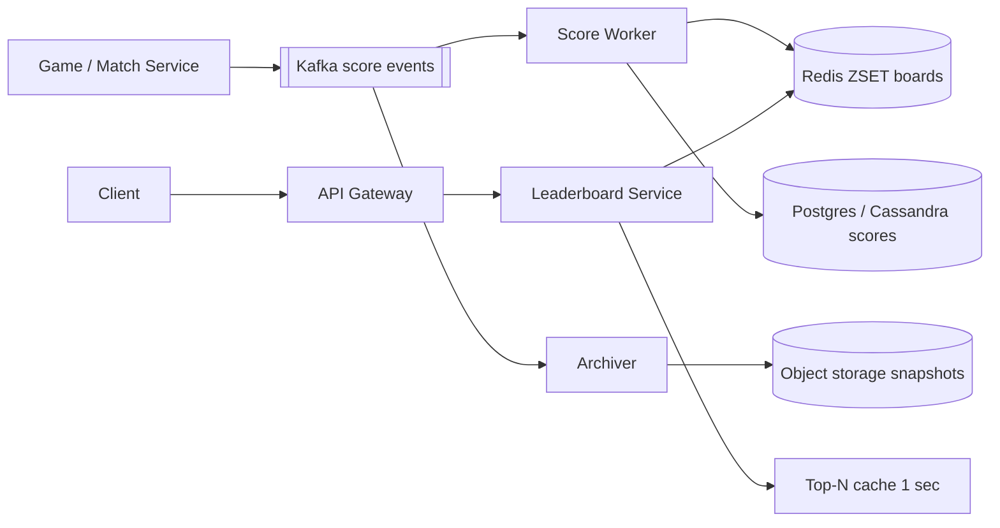
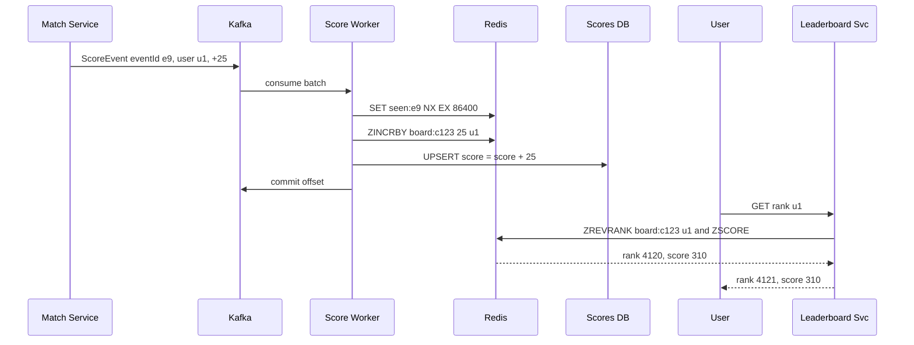

# Design Real-time Leaderboard (Gaming / Dream11)

**Ek line me:** lakhs players ke scores real-time update hote hain, aur har player ko **top 100** aur **apna rank** turant dikhna chahiye, daily/weekly/contest-wise.

**Is question me interviewer kya check karta hai:** Redis sorted set ka sahi use, SQL `ORDER BY` kyun scale nahi karta, crores users pe sharding, ties, aur score updates ka pipeline (Kafka, idempotency).

---

## Step 1: Interviewer se ye confirm karo (3–5 min)

| Tum poochho | Typical jawab | Design pe asar |
|---|---|---|
| "Ek global board ya per contest / per game?" | Per contest + global daily/weekly | Har board ek alag sorted set key |
| "Kitne users ek board pe?" | Bada contest ~2 crore users | Ek ZSET ~2 GB, ek node pe fit, par hot. Sharding discuss karna padega |
| "Score kaise badhta hai? Increment ya overwrite?" | Har event pe points add (Dream11: player ne run banaya) | `ZINCRBY`, events Kafka se |
| "Kitna real-time?" | 1–5 sec delay chalega | Async pipeline OK |
| "Ties kaise tod'ne hain?" | Pehle jo pahuncha wo upar, ya same rank | Composite score |
| "Rank ke alawa kya dikhana hai?" | Top 100 + mera rank + mere aas paas ke 10 | `ZREVRANK`, `ZREVRANGE` |

> **Bolo:** "Main ek board ko Redis sorted set maanunga, score updates Kafka se aayenge, aur DB sirf durability aur history ke liye hoga. Read path pura Redis se."

## Step 2: Requirements

**Functional**
1. Score update (increment) kisi user ka kisi board pe
2. Top N (jaise top 100) dikhana
3. "Mera rank" aur mere aas paas ke users
4. Daily, weekly, per-contest boards. Purane boards archive

**Non-functional**
- **Low latency:** top N aur my rank < 50ms
- **Freshness:** score update ke 1–5 sec me board pe dikhe
- **Scale:** ~2 crore users ek contest pe, peak 5 lakh score updates/sec (match ke wicket pe)
- **Durability:** Redis crash pe board rebuild ho sake

## Step 3: Estimation (sirf jo design badle)

- ZSET entry ~100 bytes → 2 crore users ≈ **2 GB**. Memory me fit hai.
- Dream11 me ek real-world event (wicket) pe ek match ke saare contests ke lakhs teams ka score badalta hai → **5 lakh updates/sec** burst. Ek Redis node ~1 lakh ops/sec. Isliye batching/sharding.
- Reads: crores users har kuch sec "my rank" refresh → ~2 lakh QPS. Top 100 cache karo (sab ke liye same).

> **Bolo:** "Memory problem nahi hai, 2 GB. Problem hai ek key pe write burst aur read QPS. Top N sab ke liye same hai to use cache karunga, aur writes ko batch ya shard karunga."

## Step 4: Core entities

- **Board**: id (`contest:123`, `global:daily:2026-10-03`), type, start_at, end_at
- **ScoreEvent**: event_id, user_id, board_id, delta, ts
- **UserScore**: board_id, user_id, score, updated_at (DB me durable copy)

## Step 5: APIs

```http
POST /boards/{boardId}/scores {userId, delta, eventId}   → 202 (internal, game service se)
GET  /boards/{boardId}/top?n=100                         → [{rank, userId, score}]
GET  /boards/{boardId}/rank/{userId}                     → {rank, score}
GET  /boards/{boardId}/around/{userId}?k=5               → 5 upar + 5 neeche
```

## Step 6: High-level design



**Har component kyun:**
- **Kafka:** score events durable, burst absorb, `user_id` se partition taaki ek user ke updates order me.
- **Score Worker:** event dedup, `ZINCRBY`, DB me upsert. Batch me pipeline karta hai.
- **Redis ZSET:** `O(log N)` insert/rank, top N range query.
- **Leaderboard Service:** read API, top N ko 1 sec local cache.
- **DB:** durable truth, Redis rebuild ke liye. **Archiver:** board khatam hone pe snapshot.

## Step 7: Main flow: score update aur rank read



## Step 8: Data model & DB choice

```text
Redis:  board:{boardId}         ZSET  member=userId  score=composite
        seen:{eventId}          STRING (dedup, TTL 1 day)
DB:     user_scores(board_id, user_id, score, updated_at, PK(board_id, user_id))
        score_events(event_id PK, board_id, user_id, delta, ts)   -- audit, replay
```

- **Redis** = serving layer. **Cassandra/Postgres** = durable. Write-heavy aur simple key access hai to Cassandra natural, chhote scale pe Postgres theek.
- Rank `ZREVRANK` 0-based hai, isliye API me +1.

## Step 9: Deep dives (interviewer yahin pressure dalega)

### 9.1 SQL kyun nahi, sorted set kyun?
- `SELECT COUNT(*) FROM scores WHERE score > my_score` → crores rows pe har request full index range scan. 2 lakh QPS pe DB khatam.
- Redis ZSET = skip list + hash. `ZINCRBY` O(log N), `ZREVRANK` O(log N), `ZREVRANGE 0 99` O(log N + 100).
- Top 100: `ZREVRANGE board:c123 0 99 WITHSCORES`. My neighbours: rank nikalo, phir `ZREVRANGE board r-5 r+5`.

### 9.2 Ties kaise handle karoge?
- **Same score = same rank** chahiye: `ZCOUNT board (score +inf` + 1 = rank (jitne strictly upar hain + 1).
- **Pehle pahuncha wo upar:** composite score = `score * 10^10 + (MAX_TS - ts)`. Double precision 2^53 tak exact hai, isliye score aur ts range ka dhyaan rakho (ya seconds use karo).
- Interviewer ko batao ki business se poochna padega kaunsa chahiye.

### 9.3 Crores users: sharding
- **Hash by user_id** across N shards: writes spread ho jaate hain, par global rank ke liye har shard se count chahiye (scatter-gather). Top N: har shard ka top N, merge karo.
- **Score buckets (range sharding):** shard 1 = score 0–100, shard 2 = 100–500, ... User ka rank = uske shard me rank + upar wale shards ke total counts (ye counts cache me). Top N sirf top shard se.
- Drawback: score badhne pe user shard change karta hai (remove + add), aur buckets skewed ho sakte hain. Buckets ko distribution dekh ke set karo.
- **Approximate rank** bhi chalega bahut neeche walon ke liye: "aap top 35% me ho". Exact rank sirf top 10K ke liye.

### 9.4 Updates ka pipeline, durability aur boards
- Har event ka `eventId`. Worker `SET seen:{eventId} NX` se dedup, taaki Kafka redelivery pe double score na ho.
- Burst me worker events ko 200ms batch karke ek user ke deltas jod ke ek `ZINCRBY` bheje (Redis pipeline).
- Redis crash: DB se rebuild (`user_scores` scan karke `ZADD` batch) ya Kafka offset se replay.
- **Daily/weekly:** alag keys `global:daily:2026-10-03`, `global:weekly:2026-W40`. Ek event dono me `ZINCRBY`. Key pe `EXPIRE` board khatam hone ke baad 7 din. Khatam board ka snapshot S3/DB me.

## Step 10: Decision table (kya chuna, kyun, kya nahi)

| Decision | Kyun chuna | Kya nahi chuna, kyun |
|---|---|---|
| **Redis sorted set** for ranking | O(log N) update aur rank, top N range query built-in | **SQL ORDER BY / COUNT:** har rank query crores rows scan. **Elasticsearch:** near-real-time refresh, rank query natural nahi |
| **Kafka** for score events | Burst absorb, replay se rebuild, ordering per user | **Direct Redis write from game service:** burst pe Redis overload, durability nahi |
| **DB as durable copy** | Redis crash pe rebuild, audit, prizes ke liye truth | **Sirf Redis + AOF:** prize payout ke liye ek hi in-memory store pe bharosa risky |
| **Event dedup with eventId** | At-least-once Kafka pe bhi exactly-once score | **Bina dedup:** redelivery pe double points, prize galat |
| **Score-bucket sharding** at huge scale | Top N ek shard se, rank = local rank + upar ke counts | **Hash sharding:** har rank query scatter-gather, latency badhti hai |
| **Top N cache 1 sec** | Sab users ke liye same data, Redis read load 100x kam | **Har request Redis se:** bekaar load, freshness ka faayda nahi |

## Step 11: Failures & bottlenecks

| Kya fail hua | Kya hoga | Handle kaise |
|---|---|---|
| Redis node crash | Board gayab | Replica failover. Worst case DB se rebuild ya Kafka replay |
| Worker crash beech me | Event aadha process | Offset commit baad me, dedup key se retry safe |
| Hot board (IPL final) | Ek key pe write burst | Worker side batching, read replicas, top N cache |
| Kafka lag | Board 30 sec purana | Consumer scale karo, partitions badhao, lag alert |
| Cheating / fake scores | Galat winner | Score sirf server-side Match Service se, client se kabhi nahi |

## Step 12: "Isko aur better kaise karein" (end me khud bolo)

> "Agar aur time ho to main ye improve karunga:"
- **WebSocket push** top 10 changes ka, polling ki jagah
- **Friends leaderboard:** friends list ke scores `ZMSCORE` se laake sort, ya per-user small ZSET
- Neeche ke users ke liye **percentile rank** (approx), exact sirf top 10K
- Contest khatam hone pe **final freeze**: board read-only, snapshot se prize distribution
- Region-wise boards (India, city) alag keys, same pipeline

## Step 13: Interviewer ke likely follow-up sawal

- "Redis memory se bada ho gaya to?" → score-bucket sharding ya Redis Cluster pe multiple boards spread
- "Ek user ka score ghatana ho (penalty)?" → `ZINCRBY` negative delta, same pipeline
- "Exactly-once scoring?" → eventId dedup + DB upsert idempotent
- "Rank 1-based dense ya competition ranking?" → `ZCOUNT` se competition rank, business se poochho
- "Historical: last week ka rank 1 kaun tha?" → snapshot table / S3, Redis se nahi

## 2-minute recap (interview se pehle ye padho)

> Leaderboard = Redis sorted set per board. Score events game service se Kafka me, Score Worker `eventId` se dedup karke `ZINCRBY` karta hai aur DB me upsert, taaki Redis crash pe rebuild ho sake. Top N `ZREVRANGE 0 99`, my rank `ZREVRANK`, neighbours rank ke aas paas ka range. Top N ko 1 sec cache karo. Ties ke liye composite score (score + reverse timestamp) ya `ZCOUNT` se same rank. 2 crore users ≈ 2 GB, memory fit hai, par write burst ke liye batching, aur bahut bade scale pe score-bucket sharding: rank = shard ka local rank + upar ke shards ka count. Daily/weekly alag keys, TTL ke saath, aur khatam board ka snapshot.

## Checklist

- [ ] SQL `COUNT/ORDER BY` kyun fail hota hai bata sakta hoon
- [ ] ZINCRBY, ZREVRANK, ZREVRANGE se top N aur my rank bata sakta hoon
- [ ] Ties ke dono approaches samjha sakta hoon
- [ ] Score-bucket vs hash sharding ka trade-off bata sakta hoon
- [ ] Kafka + dedup se exactly-once scoring explain kar sakta hoon
- [ ] Redis crash pe rebuild aur daily/weekly boards ka design bata sakta hoon
- [ ] Decision table ke 3 trade-offs bina dekhe bol sakta hoon
