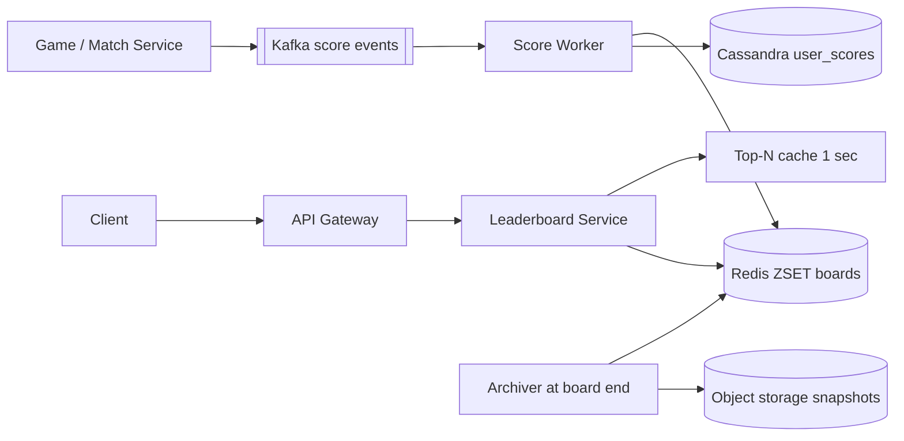

# Design Real-time Leaderboard (Gaming / Dream11)

**Ek line me:** lakhs players ke scores real-time update; har player ko **top 100** aur **apna rank** turant, daily/weekly/contest-wise.

**Interviewer kya check karta hai:** sorted set vs SQL `ORDER BY`, sharding, ties, score pipeline (Kafka, idempotency).

---

## Step 1: Interviewer se ye confirm karo (3–5 min)

| Tum poochho | Typical jawab | Design pe asar |
|---|---|---|
| "Global board ya per contest?" | Per contest + global daily/weekly | Har board alag ZSET key |
| "Ek board pe kitne users?" | Bada contest ~2 crore | ~2 GB, ek node me fit par hot; sharding discuss |
| "Score increment ya overwrite?" | Har event pe points add (run bana) | `ZINCRBY`, events Kafka se |
| "Ties?" | Pehle pahuncha upar, ya same rank | Composite score |
| "Rank ke alawa?" | Top 100 + mera rank + aas paas ke 10 | `ZREVRANK`, `ZREVRANGE` |

> **Bolo:** "Har board ek Redis sorted set, updates Kafka se, DB sirf durability aur history. Read path pura Redis."

## Step 2: Requirements

**Functional**
1. Users should be able to game event pe apna score badhta dekhein (system increment kare)
2. Users should be able to board ka top N (jaise 100) dekhein
3. Users should be able to apna rank aur aas paas ke users dekhein
4. Users should be able to daily, weekly, per-contest boards dekhein (purane archive)

**Out of scope:** scoring rules, friends leaderboard, prize payout, anti-cheat ML.

**Non-functional (priority order me)**
1. **Correctness:** har event exactly-once (prize isi pe)
2. **Latency:** top N aur my rank p99 < 50 ms
3. **Freshness:** update 1–5 sec me board pe (async pipeline OK)
4. **Scale:** 2 crore users/contest, 5 lakh updates/sec, 2 lakh reads/sec (Step 3)
5. **Durability:** Redis crash pe rebuild

**CAP choice:** live board → availability + eventual (1–5 sec purana rank chalega). Contest end pe **final freeze** strongly consistent snapshot, prize usi se.

## Step 3: Estimation (sirf jo design badle)

- ~100 bytes/entry × 2 crore ≈ **2 GB** → memory me fit.
- Wicket pe match ke saare contests ki lakhs teams update → **5 lakh updates/sec** burst; ek Redis node ~1 lakh ops/sec → batching/sharding.
- ~2 lakh QPS "my rank" reads; top 100 sab ke liye same → cache.

> **Bolo:** "Memory problem nahi, 2 GB. Problem ek key pe write burst aur read QPS: top N cache, writes batch/shard."

## Step 4: Core entities

- **Board**: id (`contest:123`, `global:daily:2026-10-03`), type, start_at, end_at
- **ScoreEvent**: event_id, user_id, board_id, delta, ts
- **UserScore**: board_id, user_id, score, updated_at (DB me durable copy)

## Step 5: APIs

```http
POST /boards/{boardId}/scores {userId, delta, eventId}   → 202 (internal, game service se)
GET  /boards/{boardId}/top?n=100                         → [{rank, userId, score}]
GET  /boards/{boardId}/rank/{userId}                     → {rank, score}
GET  /boards/{boardId}/around/{userId}?k=5               → 5 upar + 5 neeche
```

## Step 6: High-level design

**Simple v1:** sync `ZINCRBY` per board + Postgres `user_scores`; hazaaron updates/sec tak kaafi. 5 lakh/sec burst → Kafka + batching worker + Cassandra.



**Har component kyun:** (FR1 → Kafka + Score Worker + Redis, FR2/FR3 → Leaderboard Service + Redis + Top-N cache, FR4 → per-period keys + Archiver)
- **Kafka:** burst absorb, `user_id` partition = per-user order, **replay** se rebuild.
- **Score Worker:** `eventId` dedup, 200 ms batch me deltas jod ke `ZINCRBY` pipeline (5–10x kam ops).
- **Top-N cache:** 1 sec in-process → Redis reads 100x kam.
- **Cassandra:** batching ke baad bhi lakhs writes/sec, sirf key access.
- **Archiver:** cron, board end pe snapshot S3 (history, prizes).

## Step 7: Main flow: score update aur rank read


## Step 8: Data model & DB choice

```text
Redis:  board:{boardId}         ZSET  member=userId  score=composite
        seen:{eventId}          STRING (dedup, TTL 1 day)
Cassandra: user_scores(board_id, user_id, score, updated_at, PK((board_id), user_id))
S3:        final board snapshots + archived score events (audit)
```

- **Redis** = serving, **Cassandra** = durable copy. Worker `ZINCRBY` ka return (naya total) likhta hai → idempotent (counter nahi). < 10K writes/sec pe Postgres hi theek.
- `ZREVRANK` 0-based → API me +1.

## Step 9: Deep dives (interviewer yahin pressure dalega)

### 9.1 SQL kyun nahi, sorted set kyun?
**NFR:** my rank p99 < 50 ms at ~2 lakh QPS.
- `SELECT COUNT(*) FROM scores WHERE score > my_score` → har request crores rows scan; 2 lakh QPS pe DB khatam.
- ZSET = skip list + hash: `ZINCRBY`, `ZREVRANK` O(log N), `ZREVRANGE 0 99` O(log N + 100).
- Top 100: `ZREVRANGE board:c123 0 99 WITHSCORES`. Neighbours: rank r, phir `ZREVRANGE board r-5 r+5`.
- **Trade-off:** board RAM me (2 GB/contest); SQL ki flexible queries gayi.

### 9.2 Ties kaise handle karoge?
**NFR:** prize ke liye rank deterministic.
- **Same score = same rank:** `ZCOUNT board (score +inf` + 1.
- **Pehle pahuncha upar:** composite = `score * 10^10 + (MAX_TS - ts)`. Double 2^53 tak exact → score/ts range dekho (ya seconds).
- Kaunsa chahiye, business se poochho.
- **Trade-off:** composite me precision limit; `ZCOUNT` ek extra call.

### 9.3 Crores users: sharding
**NFR:** write burst + memory scale, rank latency bina tode.
- **Hash by user_id:** writes spread, par global rank = har shard se count (scatter-gather); top N = har shard ka top N merge.
- **Score buckets (range):** shard 1 = 0–100, shard 2 = 100–500… Rank = local rank + upar ke shards ke cached counts. Top N sirf top shard se.
- Drawback: score badhe → shard change (remove + add); skew → buckets distribution se set karo.
- Neeche walon ko **approximate rank** ("top 35%"); exact sirf top 10K.
- **Trade-off:** shard tabhi jab ek node kam pade (2 GB pe nahi); har scheme me rank query complex.

### 9.4 Updates ka pipeline, durability aur boards
**NFR:** exactly-once + Redis crash pe rebuild.
- `SET seen:{eventId} NX` dedup → Kafka redelivery pe double score nahi.
- Burst me 200ms batch, user ke deltas jod ke ek `ZINCRBY` (pipeline).
- Redis crash: `user_scores` scan + `ZADD` batch, ya Kafka offset se replay.
- **Daily/weekly:** `global:daily:2026-10-03`, `global:weekly:2026-W40`; ek event dono pe `ZINCRBY`. Board end ke 7 din baad `EXPIRE`, snapshot S3 me.
- **Trade-off:** 200 ms freshness gayi, Redis ops 5–10x kam.

## Step 10: Decision table (kya chuna, kyun, kya nahi)

| Decision | Kyun chuna | Kya nahi chuna, kyun |
|---|---|---|
| **Redis sorted set** | O(log N) update/rank, top N built-in | **SQL ORDER BY / COUNT:** crores rows scan. **Elasticsearch:** rank natural nahi. Sacrifice: RAM, durability alag |
| **Kafka** for events | 5 lakh/sec burst, replay, per-user order | **Direct Redis:** burst overload. **SQS:** no replay/order. Sacrifice: Kafka ops, 1–5 sec lag |
| **Cassandra durable copy** | Lakhs writes/sec, key access, prize audit | **Postgres:** heavy sharding. **Sirf Redis + AOF:** prize ke liye risky. Sacrifice: ek aur DB |
| **eventId dedup** | At-least-once pe exactly-once score | **No dedup:** double points. Sacrifice: extra Redis write/event |
| **Score-bucket sharding** (huge scale) | Top N ek shard, rank = local + upar ke counts | **Hash sharding:** scatter-gather. Sacrifice: shard change, skew |
| **Top N cache 1 sec** | Sab ke liye same, reads 100x kam | **Har request Redis:** bekaar load. Sacrifice: 1 sec purana |

## Step 11: Failures & bottlenecks

| Kya fail hua | Kya hoga | Handle kaise |
|---|---|---|
| Redis node crash | Board gayab | Replica failover; worst case Cassandra rebuild / Kafka replay |
| Worker crash | Event aadha | Offset commit baad me, dedup se retry safe |
| Hot board (IPL final) | Ek key pe burst | Worker batching, read replicas, top N cache |
| Kafka lag | Board 30 sec purana | Consumers/partitions badhao, lag alert |
| Fake scores | Galat winner | Score sirf server-side Match Service se |

## Step 12: "Isko aur better kaise karein" (end me khud bolo)

- **WebSocket push** top 10 changes, polling ki jagah
- **Friends leaderboard:** `ZMSCORE` se laake sort, ya per-user small ZSET
- **Percentile rank** neeche walon ke liye, exact sirf top 10K
- **Final freeze:** board read-only, snapshot se prizes

## Step 13: Interviewer ke likely follow-up sawal

- "Redis memory se bada?" → score-bucket sharding, ya boards Redis Cluster pe spread
- "Penalty?" → negative `ZINCRBY`, same pipeline
- "Exactly-once?" → eventId dedup + idempotent upsert
- "Dense ya competition rank?" → `ZCOUNT` se competition; business se poochho
- "Last week ka rank 1?" → S3 snapshot, Redis nahi
- **Senior signal:** asli bottleneck ek hot board key (IPL final). Redis shard single-threaded → worker aggregation, read replicas, top-N cache, Kafka lag pe freshness SLO alert.

## 2-minute recap (interview se pehle ye padho)

> Har board ek Redis ZSET. Events Kafka se (5 lakh/sec burst + replay). Worker: `eventId` dedup, 200 ms batch, `ZINCRBY`, naya total Cassandra me (rebuild ke liye). Top N `ZREVRANGE 0 99` (1 sec cache), my rank `ZREVRANK`, neighbours range. Ties: composite score ya `ZCOUNT`. 2 crore ≈ 2 GB fit; bahut bade scale pe score-bucket sharding. Daily/weekly alag keys + TTL, end pe snapshot.

## Checklist

- [ ] SQL `COUNT/ORDER BY` kyun fail hota hai bata sakta hoon
- [ ] ZINCRBY, ZREVRANK, ZREVRANGE se top N aur my rank bata sakta hoon
- [ ] Ties ke dono approaches samjha sakta hoon
- [ ] Score-bucket vs hash sharding ka trade-off bata sakta hoon
- [ ] Kafka + dedup se exactly-once scoring explain kar sakta hoon
- [ ] Redis crash pe rebuild aur daily/weekly boards ka design bata sakta hoon
- [ ] Decision table ke 3 trade-offs bina dekhe bol sakta hoon
